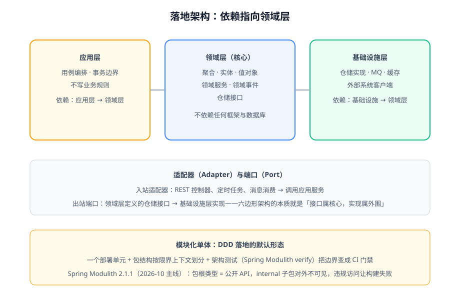

# 落地架构

DDD 的方法论要落到**代码结构和依赖方向**上才算数。本页给出三种可选架构的演进关系，并给出 2026 年的推荐默认形态：**模块化单体 + Spring Modulith**。



## 三种架构：一条演进线

| 架构 | 核心规则 | 适用 |
| --- | --- | --- |
| 传统分层（Layered） | Controller → Service → Repository，按技术分层 | 简单 CRUD；业务复杂后 Service 层变成大泥球 |
| 六边形架构（Hexagonal / Ports & Adapters） | 领域在核心，外部世界通过**端口（接口）+ 适配器（实现）**接入 | DDD 的经典配套 |
| 整洁架构 / 洋葱架构 | 依赖永远指向内层（领域），跨层只用接口 | 与六边形同源，强调依赖规则的普适表述 |

三者的共同内核是**依赖倒置**：领域层定义接口（仓储接口、外部服务接口），基础设施层实现它们。做到这一点，数据库、Web 框架、消息中间件都变成可替换的外围。

## 六边形架构的目录结构

```text
src/main/java/com/example/blog/
├─ domain/                     # 领域层：纯业务，不依赖框架
│  ├─ article/                 #   article 上下文
│  │  ├─ Post.java             #   聚合根
│  │  ├─ Slug.java             #   值对象
│  │  ├─ PostRepository.java   #   仓储接口（端口）
│  │  └─ ArticlePublished.java #   领域事件
│  ├─ reader/                  #   reader 上下文（User、Comment 聚合）
│  └─ shared/                  #   跨上下文共享的基础类型（ID 类、事件基类）
├─ application/                # 应用层：用例编排、事务边界
│  ├─ article/ArticleApplicationService.java
│  └─ reader/ReaderApplicationService.java
├─ adapter/                    # 适配器层
│  ├─ in/web/                  #   入站：REST 控制器
│  ├─ in/consumer/             #   入站：消息消费、定时任务
│  └─ out/persistence/         #   出站：仓储实现（JPA/MyBatis）
│  └─ out/mailer/              #   出站：邮件网关实现
└─ BlogApplication.java
```

::: warning 目录结构没有标准答案
上面的结构偏「分层 + 六边形」。另一种主流做法是**上下文优先**（`article/` 里再分 domain/application/infrastructure）。两种都成立，判据是：**同一个上下文的领域代码是否能被整体移动而不牵连其他上下文**。选定一种后全仓库统一，不要混用。
:::

## 推荐默认形态：模块化单体

微服务不是 DDD 的必选项。**一个部署单元 + 包结构按限界上下文划分 + 架构测试强制边界**，这就是模块化单体（Modular Monolith）——它保留了单体的部署简单，同时获得上下文边界的工程保障。

Spring Modulith（2026-10 主线 **2.1.1**）把「边界纪律」变成可执行测试：

```java [src/main/java/com/example/blog/article/internal/MarkdownRenderer.java]
// internal 子包内的实现细节，其他上下文不允许 import
package com.example.blog.article.internal;
```

```java [src/test/java/com/example/blog/ModularityTests.java]
class ModularityTests {

    static ApplicationModules modules = ApplicationModules.of(BlogApplication.class);

    @Test
    void verifiesModuleBoundaries() {
        modules.verify();   // 跨上下文 import 内部类 → 测试失败 → 构建失败
    }

    @Test
    void writesModuleDocumentation() {
        new Documenter(modules).writeModulesAsPlantUml();  // 自动生成模块结构图
    }
}
```

Modulith 的边界规则非常朴素：

| 规则 | 效果 |
| --- | --- |
| 主应用包的直接子包 = 一个应用模块 | `article/`、`reader/`、`search/` 三个上下文 |
| 模块**根包**里的类型 = 公开 API | 其他模块只能用根包类型（如领域事件） |
| 模块 **internal 子包** = 内部实现 | 被外部 import 时 `verify()` 直接失败 |
| 事件发布注册表落库 | 跨模块事件具备崩溃恢复（见[领域事件](../DomainEvent/index.md)） |

::: tip 为什么默认推荐模块化单体
微服务的全部成本（网络故障、分布式事务、运维复杂度）换来的是**独立部署与独立伸缩**；而绝大多数系统的真实瓶颈是**模型边界不清**，不是部署粒度。模块化单体把「拆分」变成一个**随时可做的后续选项**——包边界已经是接缝（事件协作已就位），拆的时候是搬运，不是重写。判据详见[微服务专题](../../Microservices/index.md)的拆分时机章节。
:::

## 领域层纯洁性的四条守则

1. 领域层**不 import** Web 注解（`@RestController`）、持久化注解（`@Entity` 除外——JPA 务实妥协，或改用 MapStruct 式映射保持纯 POJO）之外的基础设施类型。
2. 领域层**不做 IO**：不发 HTTP、不查缓存、不调外部系统——这些是端口后面的事。
3. 跨上下文**只共享事件与 ID 类型**，不共享实体——共享实体等于把两个上下文焊死。
4. 一切边界规则**写进测试**：`verify()` 通过的仓库，边界才真实存在；没有架构测试的「分层」只是文件夹命名。

## 验证方式

```shell
# 在仓库根执行（以 Maven 项目为例）
./mvnw test -Dtest=ModularityTests
```

预期：`verifiesModuleBoundaries` 通过；故意在 `reader` 上下文 import `article.internal.MarkdownRenderer` 后复跑，构建失败。这一步就是把「架构约定」变成「CI 门禁」的完整闭环。

## 参考资料

- Spring Modulith 官方文档：https://docs.spring.io/spring-modulith/reference/
- Alistair Cockburn, Hexagonal Architecture（Ports and Adapters）：https://alistair.cockburn.us/hexagonal-architecture/
- Simon Brown, Modular Monoliths：https://simonbrown.je/modular-monoliths/
- Sam Newman, Monolith to Microservices
