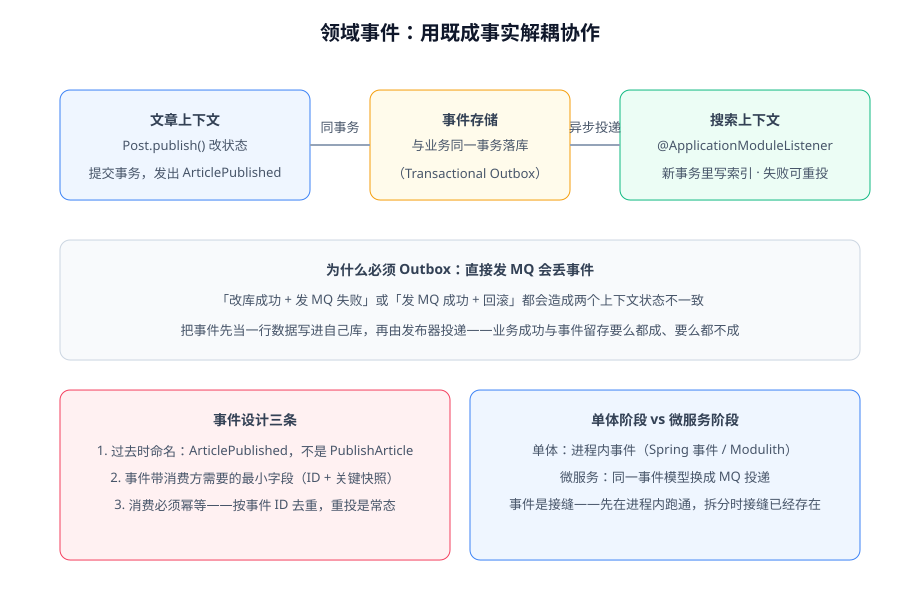

# 领域事件

领域事件（Domain Event）表示领域内**已经发生**的、业务人员关心的事实：`ArticlePublished`（文章已发布）、`CommentDeleted`（评论已删除）。它同时扮演两个角色：**模型的一部分**（记录聚合发生过的关键变化）与**上下文之间的协作方式**（解耦的通信机制）。本页讲后者的工程化。



## 事件建模三条

| 条目 | 要求 | 反例 → 正例 |
| --- | --- | --- |
| 命名 | **过去时**，事实而非指令 | `PublishArticle` → `ArticlePublished` |
| 内容 | 消费方需要的最小字段：聚合 ID + 关键快照 | 只带 id（消费方被迫反查）→ id + slug + title + authorId |
| 载体 | 不可变对象（record / final 字段） | 可变事件对象被监听方改字段 → 不可变 |

```java [src/main/java/com/example/blog/domain/article/ArticlePublished.java]
public record ArticlePublished(
        UUID postId,
        String slug,
        String title,
        UUID authorId,
        Instant occurredAt
) {
    public static ArticlePublished of(Post post) {
        return new ArticlePublished(post.idValue(), post.slugValue(),
                post.titleValue(), post.authorIdValue(), Instant.now());
    }
}
```

::: tip 事件字段给多少
给「**够消费方做决定 + 少量反查兜底**」的字段。全量快照会让事件与聚合内部结构强耦合（聚合改一次，所有消费方编译失败）；只给 id 则让每次消费都多一次查询。经验值：3~6 个字段。
:::

## 为什么必须有 Outbox：直接发 MQ 会丢事件

业务写库和消息投递是两个系统，没法用同一个事务包住。两个经典事故：

1. **库改了，MQ 没发出去**（发送失败/进程崩溃）——搜索上下文永远不知道文章发布过；
2. **MQ 先发出去了，库回滚了**——搜索里出现一篇「不存在的已发布文章」。

事务性发件箱（Transactional Outbox）的解法：**把事件当一行数据，与业务修改写在同一个数据库事务里**；再由独立的发布器把未投递的行发出去，发成功后标记。

```text
事务 T1：UPDATE posts ... + INSERT INTO event_publication ...
        （要么都成功，要么都回滚——事件不丢也不多）

事务 T2（异步）：SELECT 未投递事件 → 投递 → 标记已投递（失败则下次重投）
```

消费方按事件 ID 去重——**重投是常态不是异常，消费必须幂等**。

## 单体阶段的落地：Spring Modulith

模块化单体里不需要 MQ。Spring Modulith（2026-10 主线 **2.1.1**）提供事件发布注册表（Event Publication Registry），本质就是内置的 Outbox 实现：

```java [src/main/java/com/example/blog/application/article/ArticleApplicationService.java]
// 发：应用服务在领域对象登记事件后统一发布
applicationEventPublisher.publishEvent(ArticlePublished.of(post));
```

```java [src/main/java/com/example/blog/search/SearchIndexer.java]
// 收：搜索上下文在自己模块里异步消费，跑在独立事务中
public class SearchIndexer {

    @ApplicationModuleListener
    void on(ArticlePublished event) {
        searchIndexer.index(event.postId(), event.title(), event.slug());
    }
}
```

三个工程要点：

1. **必须配置事件发布注册表的存储**（JDBC/JPA 表结构）——不落库就没有崩溃恢复，Outbox 的保证失效。
2. `@ApplicationModuleListener` 是**异步 + 新事务**——调用方事务回滚不影响已提交事件的消费，但消费方失败要靠重投，别在监听器里偷懒吞异常。
3. 发布模块的公共 API 用 `@NamedInterface` 或包根约定暴露，消费方只 import 事件类型，不 import 实现。

## 什么时候不发事件

::: danger 不要用事件「直播」一切
1. **进程内的普通方法协作不需要事件**——同一上下文里 `orderService.pay()` 直接调下一个用例即可，事件是为**解耦**付的税（多一跳、最终一致、要幂等），没有解耦需求就别付。
2. **同一聚合内部的连锁变化不靠事件**——聚合自己保证，事务内直接改。
3. **需要强一致回滚的不用事件**——事件发出后无法「撤回」，需要「校验失败则整体放弃」的流程留在同一事务里。
:::

## 事件是拆分的接缝

单体阶段用进程内事件跑通的协作，拆微服务时把投递通道从「进程内监听」换成「MQ 投递」，事件本身、幂等消费、Outbox 保证**全部原样复用**。这就是「先模块化单体、后按需拆分」路径上，事件作为接缝的意义。跨服务时的一致性方案（SAGA、对账）见[微服务专题](../../Microservices/index.md)与[支付与幂等](../../Ecommerce/Payment/index.md)。

## 验证方式

1. 事件注册表落库验证：业务操作后查 `event_publication` 表，确认事件行与业务行在同一事务内出现。
2. 幂等验证：手工把某条已投递事件的状态改回未投递，确认消费方重复执行后数据状态不变。
3. 失败重投验证：让消费方抛异常，确认进程重启/定时触发后事件被重新投递。

## 参考资料

- Spring Modulith 官方文档（事件发布注册表）：https://docs.spring.io/spring-modulith/reference/events.html
- Vaughn Vernon,《Implementing Domain-Driven Design》第 8 章
- Microservices.io, Transactional Outbox：https://microservices.io/patterns/data/transactional-outbox.html
