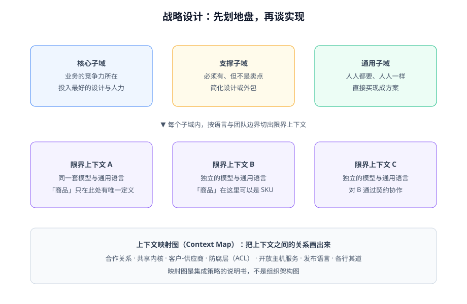

# DDD 概述

DDD（Domain-Driven Design，领域驱动设计）是一种**软件设计方法论**：让代码结构围绕业务模型组织，而不是围绕技术分层或数据表组织。它由 Eric Evans 在 2003 年的同名著作中提出，解决的核心问题只有一个——**业务越复杂，代码和业务语言脱节得越厉害**。

## DDD 解决什么问题

先看一个没有模型的典型写法（事务脚本风格）：

```java [src/main/java/com/example/blog/service/ArticleService.java]
// 业务规则散落在 Service 方法里，对象只是数据袋子
public class ArticleService {

    public void publish(Long articleId) {
        Article article = articleMapper.selectById(articleId);
        if (article == null) {
            throw new BizException("文章不存在");
        }
        if (!"DRAFT".equals(article.getStatus()) && !"OFFLINE".equals(article.getStatus())) {
            throw new BizException("当前状态不能发布");
        }
        if (article.getContentHtml() == null || article.getContentHtml().isBlank()) {
            throw new BizException("正文不能为空");
        }
        // slug 唯一性校验……状态更新……缓存失效……每条业务规则都要重复检查
        article.setStatus("PUBLISHED");
        articleMapper.updateById(article);
    }
}
```

这段代码能用，问题在于：**「文章什么时候能发布」这条业务规则只存在于这个 Service 方法里**。下一个写「定时发布」的人不会知道要检查这些，规则开始复制粘贴、逐渐漂移——这就是复杂业务系统腐烂的方式。

DDD 的做法是把规则放回对象：

```java [src/main/java/com/example/blog/domain/article/Post.java]
// 状态转移规则只在一个地方存在：聚合内部
public class Post {

    public void publish(SlugGenerator slugGenerator) {
        if (status.canTransitionTo(PostStatus.PUBLISHED)) {
            throw new IllegalStateException(status.label() + "状态不能发布");
        }
        if (contentHtml == null || contentHtml.isBlank()) {
            throw new IllegalStateException("正文不能为空");
        }
        this.slug = slugGenerator.ensureUnique(this.title);
        this.status = PostStatus.PUBLISHED;
        this.publishedAt = Instant.now();
        this.registerEvent(new ArticlePublished(this.id, this.slug));
    }
}
```

无论从接口、定时任务还是消息消费触发，发布规则都**只有这一份**。这就是「模型驱动设计」的含义：**业务规则沉淀在模型里，Service 退化为编排者**。

## 三块核心主张

| 主张 | 一句话 | 对应章节 |
| --- | --- | --- |
| 通用语言 | 业务和开发用同一套词说话，词要落到代码的类名、方法名上 | [战略设计](../StrategicDesign/index.md) |
| 模型驱动设计 | 先有模型再有表结构，规则内聚在模型对象里 | [战术设计](../TacticalDesign/index.md)、[聚合](../Aggregate/index.md) |
| 有界协作 | 大系统切成多个模型边界（限界上下文），边界之间用契约协作 | [战略设计](../StrategicDesign/index.md)、[落地架构](../Architecture/index.md) |



## 什么时候不该用 DDD

DDD 有实打实的成本：建模讨论、对象转换、更高的设计门槛。以下场景**不建议**引入：

| 场景 | 建议 |
| --- | --- |
| 以 CRUD 为主的系统（后台管理、表单录入） | 事务脚本 + 富模型约束就够，DDD 是负资产 |
| 业务规则少且稳定 | 用例少到一张纸写得下时，抽象是浪费 |
| 数据分析/报表型系统 | 建模重心在数据本身，维度建模比 DDD 更合适 |
| 团队没人愿意参与模型讨论 | DDD 的第一步是沟通，没有业务参与就是自嗨 |

::: tip 判据
问自己一个问题：**「这个系统里有没有一条业务规则，复杂到需要三句话以上才能向新人说清楚？」** 有，且这类规则不止一条——DDD 开始划算；没有——别用。
:::

## 四个常见误解

::: danger 逐条纠正
1. **「DDD 就是微服务」**——错。DDD 是设计方法，微服务是部署形态。模块化单体同样能落地 DDD，而且是 2026 年更推荐的默认形态。
2. **「用了 DDD 就要事件溯源和 CQRS」**——错。事件溯源、CQRS 是独立的高级架构模式，绝大多数系统用不上。
3. **「DDD 要先买一套框架」**——错。DDD 的载体是普通面向对象代码 + 包结构纪律，Spring Modulith 只是把纪律变成可执行的测试。
4. **「领域模型就是数据库表的镜像」**——错。模型按**不变量与行为**组织，可以和表结构不一样（一个聚合存三张表、一张表藏两个值对象都正常）。
:::

## 验证方式

读完本页，用这三个问题自检是否理解 DDD 的定位：

1. 你的项目里，同一条业务规则在几个地方被检查过？
2. 新人加入时，靠读代码能学会业务术语，还是要靠口口相传？
3. 如果明天把 MySQL 换成 PostgreSQL，业务代码里有几处需要改动？

三个答案分别是「多于一处」「要靠口传」「多于零」时，值得继续读 [战略设计](../StrategicDesign/index.md)。
