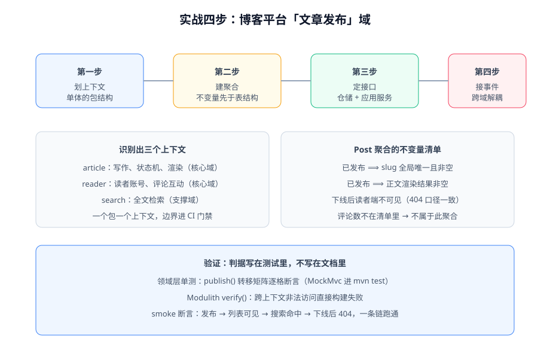

# 实战：博客平台文章发布域

本页用本库项目实战中的博客平台，把前面所有章节**串成一次完整落地**：从划上下文到接事件，四步走完。项目侧的对应记录在 [CoreFlow · 领域建模](/project/Complete/BlogPlatform/CoreFlow/DomainModeling/index.md)——本页讲方法论视角，项目页讲执行记录视角，两处判据一致。



## 第一步：划上下文（战略设计落地）

博客平台的业务描述：「作者写文章并发布；读者注册后阅读、评论；平台提供搜索」。按[战略设计](../StrategicDesign/index.md)的判据划出三个限界上下文：

| 上下文 | 子域类型 | 模型与职责 | 协作关系 |
| --- | --- | --- | --- |
| `article` | 核心 | Post 聚合（写作、状态机、渲染） | 发布 `ArticlePublished` / `ArticleOffline` 事件 |
| `reader` | 核心 | User 聚合（账号）、Comment 聚合（楼层互动） | 消费文章事件做数据校验；发布评论事件 |
| `search` | 支撑 | 检索文档模型（只关心 id/标题/正文/状态） | 只消费 `ArticlePublished`，写索引 |

单体内物理形态：`com.example.blog` 下 `article/`、`reader/`、`search/` 三个模块包（见[落地架构](../Architecture/index.md)），`search` 对 `article` 的依赖只有**事件类型**——防腐层在这里是零成本自带的。

## 第二步：建聚合（不变量先于表结构）

对 `article` 上下文先写不变量清单，再定聚合，最后才设计表：

| 不变量 | 归属 | 落点 |
| --- | --- | --- |
| 已发布文章 ⟹ slug 全局唯一且非空 | Post 聚合 | `publish()` 内 `Slug.of(title, checker)` |
| 已发布文章 ⟹ 渲染结果非空 | Post 聚合 | `publish()` 前置校验 |
| 状态只能沿合法路径转移（草稿→已发布→下线） | Post 聚合 | 状态字段无 setter，转移走 `publish()/unpublish()` |
| 下线后读者端不可见（404 口径一致） | 读侧口径 | 查询层按状态过滤 + smoke 断言 |
| 楼层号分配后永不回收 | Comment 聚合 | `reply()` 写时分配 + 唯一索引 |
| 已删楼层不可回复 | Comment 聚合 | `reply()` 校验父楼层 |

注意两条**故意不在清单里**的：「评论数」和「分类文章数」——它们是查询产物，不是任何聚合的强一致性要求，走读侧单一口径（项目页 [Consolidation](/project/Complete/BlogPlatform/Consolidation/index.md) 有完整决策记录）。**写不出不变量的数据，就不该进聚合**——这是本实战里最常被复用的一条判据。

```java [src/main/java/com/example/blog/domain/article/Post.java]
public class Post {

    public void publish(SlugUniquenessChecker checker, ContentRenderer renderer) {
        requireTransitionAllowed(PostStatus.PUBLISHED);
        requireContentPresent();
        this.slug = Slug.of(this.title, checker);          // 不变量 1
        this.contentHtml = renderer.render(this.contentMarkdown);  // 不变量 2
        this.status = PostStatus.PUBLISHED;
        this.publishedAt = Instant.now();
        registerEvent(new ArticlePublished(id.value(), slug.value(), title));
    }
}
```

## 第三步：定接口（仓储与应用服务）

```java [src/main/java/com/example/blog/application/article/ArticleApplicationService.java]
@Service
public class ArticleApplicationService {

    @Transactional
    public void publish(UUID postId) {
        Post post = postRepository.findById(new PostId(postId))
                .orElseThrow(PostNotFoundException::new);
        post.publish(slugChecker, renderer);
        postRepository.save(post);
        eventPublisher.publishEvents(post.pullDomainEvents());
    }
}
```

配套的持久化映射：一个 Post 聚合存 `posts` 一张表（标签存 JSON 列、slug 唯一索引）；Comment 聚合存 `comments` 表（`floor` 唯一索引 + `root_id` 自引用）。**表结构从模型推导**，与「先画 ER 图再写代码」的顺序相反。

## 第四步：接事件（跨上下文解耦）

`search` 上下文的接法（进程内事件 + Modulith 注册表）：

```java [src/main/java/com/example/blog/search/SearchIndexer.java]
public class SearchIndexer {

    @ApplicationModuleListener
    void on(ArticlePublished event) {
        // 独立事务：写索引失败不影响发文，靠注册表重投兜底
        searchClient.upsert(event.postId(), event.title(), event.slug());
    }
}
```

三个刻意的设计决策（与项目侧[状态机](/project/Complete/BlogPlatform/CoreFlow/StateMachine/index.md)一致）：

1. **发布转移不发「写搜索索引」命令**，只发事实 `ArticlePublished`——要不要索引是 search 上下文的事；
2. `unpublish` 也不通知 search——FULLTEXT 索引建在 posts 表上的阶段，下线可见性由读侧状态过滤保证；升 ES 时这里是检查单入口；
3. 事件按事件 ID 幂等消费——重投是常态。

## 验证方式

```shell
./mvnw test                        # 领域层单测 + Modulith 架构测试
./mvnw spring-boot:run             # 启动后跑一遍发布链路
```

| 验证点 | 命令/操作 | 预期 |
| --- | --- | --- |
| 状态机不变量 | `mvnw test`（MockMvc 用例） | 非法转移 409、发布成功 200 |
| 模块边界 | `ModularityTests` | 跨上下文 import internal → 构建失败 |
| Outbox 落库 | 发布文章后查 `event_publication` 表 | 事件行与 posts 更新同事务出现 |
| 一条链 | 发布 → 读者列表可见 → 搜索命中 → 下线 → 双端 404 | 全链通过（项目侧 `coreflow_smoke` CF1~CF14 的口径） |

## 参考资料

- 项目实战记录：[CoreFlow 章节入口](/project/Complete/BlogPlatform/CoreFlow/index.md)
- 本专题各章：[战略设计](../StrategicDesign/index.md) · [聚合设计](../Aggregate/index.md) · [仓储](../Repository/index.md) · [领域事件](../DomainEvent/index.md) · [落地架构](../Architecture/index.md)
