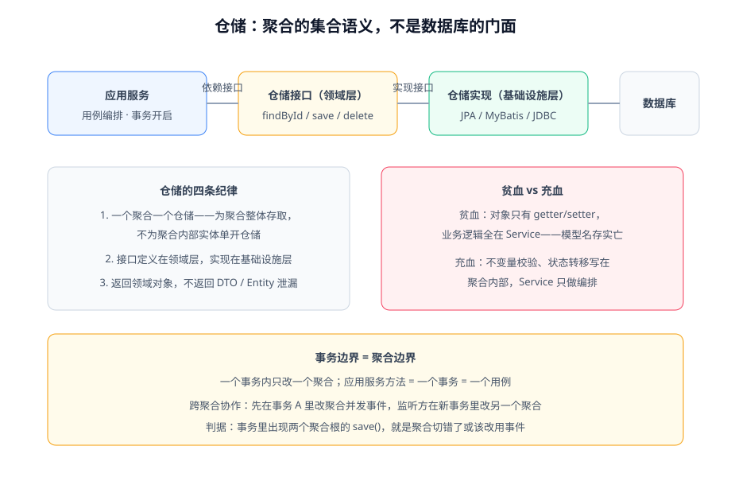

# 仓储与持久化

仓储（Repository）在领域模型与数据库之间提供**「聚合的集合」语义**：表现得像内存里的集合，`findById` 取出来的是完整且满足不变量的聚合，`save` 存回去的是一次一致的修改。它的设计目标只有一个——**领域层不知道数据存在哪、怎么存**。



## 仓储的职责与纪律

```java [src/main/java/com/example/blog/domain/article/PostRepository.java]
// 接口定义在领域层——只说领域语言
public interface PostRepository {

    Optional<Post> findById(PostId id);

    PostId save(Post post);                       // 保存整个聚合

    boolean existsBySlug(Slug slug);              // slug 唯一性检查（不变量支撑）

    List<Post> findPublishedByAuthor(AuthorId authorId);  // 特定领域查询
}
```

```java [src/main/java/com/example/blog/infrastructure/persistence/JpaPostRepository.java]
// 实现放在基础设施层——怎么存是这里的事
@Repository
public class JpaPostRepository implements PostRepository {
    // 内部可以随便用 JPA EntityManager / MyBatis Mapper / JdbcTemplate
}
```

| 纪律 | 说明 |
| --- | --- |
| 一个聚合一个仓储 | 仓储为**聚合整体**服务；聚合内部实体不单独开仓储 |
| 接口在领域层，实现在基础设施层 | 依赖方向：基础设施 → 领域，领域层不依赖任何 ORM 类型 |
| 返回领域对象 | 不返回 DTO、不返回 ORM 实体给领域层之外的代码 |
| 保存语义是「整体一致」 | `save(post)` 保证聚合内全部修改在**同一事务**里落库 |

::: warning 仓储 ≠ DAO
DAO 面向**表**：`ArticleDao.updateStatus(id, status)`，操作的是行。仓储面向**聚合**：`post.publish()` 之后 `save(post)`，操作的是一致性边界。如果你发现自己在仓储接口上定义「更新某几个字段」的方法，说明模型退化了——要么把这些操作收回聚合的领域方法，要么承认这不是领域模型代码。
:::

## 事务边界 = 聚合边界

应用服务方法是一个用例、一个事务；**一个事务里只应该出现一个聚合的写操作**：

```java [src/main/java/com/example/blog/application/article/ArticleApplicationService.java]
@Service
public class ArticleApplicationService {

    @Transactional
    public void publish(UUID articleId) {
        Post post = postRepository.findById(new PostId(articleId))
                .orElseThrow(PostNotFoundException::new);
        post.publish(slugUniquenessChecker);        // 领域逻辑在聚合内
        postRepository.save(post);                  // 单聚合写
        // ArticlePublished 事件由应用服务在事务提交路径上发布（见领域事件一章）
    }
}
```

判据：审查所有 `@Transactional` 方法——**出现两个聚合根的写操作**只有两种可能：聚合切错了（合并它们），或者协作不该在事务里（改用领域事件）。没有第三种。

## 贫血与充血：仓储落地时最容易退化的地方

| | 贫血模型 | 充血模型 |
| --- | --- | --- |
| 领域对象 | 只有字段 + getter/setter | 字段私有 + 业务方法 |
| 业务规则 | 散落在 Service | 内聚在聚合 |
| 仓储返回 | 半成品数据袋 | 满足不变量的完整聚合 |
| 复用性 | 每个调用点自己拼规则 | 规则只有一份 |

充血模型在持久化上有个现实问题：**ORM 需要绕过构造函数重建对象**。JPA 的做法是给框架留一条受控通道，同时保证业务代码走领域方法：

```java [src/main/java/com/example/blog/domain/article/Post.java]
// JPA 需要 no-arg 构造；private 可见性可防止业务代码调用
protected Post() {
}

// 静态工厂负责「新建」路径，规则在工厂里
public static Post draft(AuthorId authorId, String title, String markdown) {
    if (markdown == null || markdown.isBlank()) {
        throw new IllegalArgumentException("草稿正文不能为空");
    }
    Post post = new Post();
    post.id = PostId.newId();
    post.status = PostStatus.DRAFT;
    post.authorId = authorId;
    post.title = title;
    post.contentMarkdown = markdown;
    return post;
}
```

::: tip 务实口径
「充血」不等于把所有方法都塞进聚合。**不变的规则进聚合，跨聚合流程进领域服务，用例编排进应用服务**——三层各司其职，任何一层变胖都说明有东西放错了位置。
:::

## 查询怎么办：读侧不走聚合

聚合为**一致性写**服务；列表页、搜索、报表是**读**，走独立查询路径，直接 SQL/视图/搜索引擎，返回 DTO。这不是违背 DDD，而是 CQRS 最朴素的应用——读写模型分开后，两边各自简单：

- 写侧：聚合 + 仓储，保证不变量（见[聚合设计](../Aggregate/index.md)）；
- 读侧：`PostQueryService` 直查，一条 SQL 返回列表所需字段，不做聚合重建。

项目实战里「评论数、分类计数服务端单一口径」的落点（`countPublishedByCategory`）就是典型的读侧查询，见 [Consolidation](/project/Complete/BlogPlatform/Consolidation/index.md)。

## 验证方式

1. 领域层模块 `import` 检查：领域包里不得出现 `javax.persistence.*`、`org.springframework.data.*`、MyBatis 注解（用 Modulith `verify()` 固化，见[落地架构](../Architecture/index.md)）。
2. 每个仓储接口方法用领域语言念一遍——出现 `updateXxxField` 就是 DAO 化的退化信号。
3. 事务审查：所有 `@Transactional` 方法只写一个聚合根。

## 参考资料

- Vaughn Vernon,《Implementing Domain-Driven Design》第 12 章（仓储）
- Eric Evans,《Domain-Driven Design》第 6 章
- Spring Data JPA 官方文档：https://docs.spring.io/spring-data/jpa/reference/
