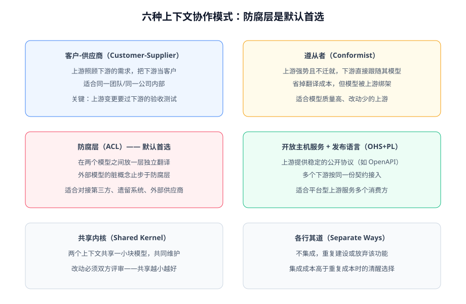

# 战略设计

战略设计回答的问题是：**这个系统由哪几块模型组成，每块管什么、边界在哪、彼此怎么协作**。它发生在写任何代码之前，也发生在系统演化的每个节点上——战略设计的产出（限界上下文）决定了后面所有代码的形状。

## 子域划分：先分清主次

子域（Subdomain）是**业务问题空间**的划分，回答「业务由哪几部分组成」：

| 类型 | 定义 | 投入策略 | 博客平台例子 |
| --- | --- | --- | --- |
| 核心子域 | 业务竞争力的来源，做不好就输 | 投入最好的设计与人力，模型精雕 | 文章创作与发布、读者互动 |
| 支撑子域 | 必须有，但不是卖点 | 简化建模，够用就好 | 全文检索、邮件通知 |
| 通用子域 | 人人都要、人人一样 | 直接用现成方案（购买/开源） | 用户认证、对象存储 |

::: tip 判据
「这块业务要是砍掉，产品还成立吗？」——成立的是支撑/通用子域，不成立的是核心子域。**核心子域才值得做精细的领域建模**，对通用子域做 DDD 是典型的资源错配。
:::

## 通用语言（Ubiquitous Language）

通用语言是业务专家与开发团队**共同使用、共同维护**的一套词汇表，并且要求这些词**直接出现在代码里**（类名、方法名、事件名）。

| 业务说法 | 反例（技术腔） | 正例（通用语言落地） |
| --- | --- | --- |
| 文章发布 | `updateStatus(2)` | `Post.publish()` |
| 文章下线 | `updateStatus(3)` | `Post.unpublish()` |
| 楼层 | `comment.parentId = 自身id` | `Comment.assignFloor()` |
| 审核通过 | `auditFlag=1` | `Review.approve()` |

通用语言有三个硬要求：

1. **一个词在同一个上下文里只有一个含义**——出现歧义就是切分上下文的信号。
2. **代码即文档**——改了业务术语，代码里的命名必须跟着改，否则语言立刻失效。
3. **词典要有人维护**——像维护表结构一样维护术语表（参考项目实战中的[通用语言表](/project/Complete/BlogPlatform/CoreFlow/DomainModel/index.md)）。

## 限界上下文（Bounded Context）

限界上下文是**模型适用范围的边界**：边界之内，一个概念只有一个模型定义；边界之外，同一个词可以是完全不同的东西。

- 「文章」在**写作上下文**里有草稿状态、渲染缓存、版本历史；
- 「文章」在**搜索上下文**里只是 id + 标题 + 正文快照 + 权重；
- 「文章」在**推荐上下文**里可能是特征向量。

三个上下文各自建自己的「文章」模型，**通过契约协作而不是共享数据库表**。把它们合并成一个「文章大模型」是复杂系统最常见的设计错误。

限界上下文和子域的关系：子域是**问题空间**的划分，限界上下文是**解空间**的划分。理想情况下一个子域对应一个上下文；多个上下文挤在一个子域里（或反过来）都是设计信号，值得停下来重新审视。

## 上下文映射图（Context Map）

把上下文两两之间的关系显式画出来，可选的模式有六种：

| 模式 | 一句话 | 什么时候用 |
| --- | --- | --- |
| 客户-供应商 | 上游迁就下游的需求，下游的验收测试约束上游变更 | 同公司内部、上下游有协作意愿 |
| 遵从者（Conformist） | 下游直接跟随上游的模型，不做翻译 | 上游模型质量高且稳定，翻译不划算 |
| 防腐层（ACL） | 两个模型之间放一层独立翻译 | **默认首选**：对接第三方、遗留系统、不可控上游 |
| 开放主机服务 + 发布语言 | 上游提供稳定公开协议，多个下游按契约接入 | 平台型上游服务多个消费方 |
| 共享内核 | 两上下文共享一小块模型，改动需双方评审 | 同团队、高信任，共享范围要尽量小 |
| 各行其道 | 不集成，接受重复建设 | 集成成本高于重复成本时的清醒选择 |

::: danger 防腐层不是可选项，是默认项
对接**不可控**的外部模型（第三方 API、遗留库表）时，不用防腐层的系统会在半年后发现自己核心代码里到处是外部模型的概念（第三方字段名、第三方状态码）。防腐层的成本是每次对接多写一个翻译类，收益是外部变化的冲击面被限制在一层里。
:::

## 实操：博客平台的划法

以本库项目实战的博客平台为例，战略设计的产出物是：

| 限界上下文 | 子域类型 | 包含的模型 | 与其他上下文的关系 |
| --- | --- | --- | --- |
| article（文章） | 核心 | Post 聚合、渲染、状态机 | 向 search/reader 发布事件 |
| reader（读者） | 核心 | User、Comment 聚合、账号生命周期 | 消费 article 事件做反查 |
| search（检索） | 支撑 | 文档索引模型 | 只消费 ArticlePublished 事件 |

完整的落地记录见[项目实战 · 核心业务流](/project/Complete/BlogPlatform/CoreFlow/DomainModel/index.md)。

## 验证方式

战略设计做得对不对，用两个信号验证：

1. **术语无歧义**：拿团队最近一周的聊天记录，找出所有「文章」「订单」「用户」的出现位置——同一上下文内含义是否唯一？
2. **边界可执行**：用 Spring Modulith 的 `verify()` 测试（见[落地架构](../Architecture/index.md)）把包边界变成构建门禁——跨上下文直接 import 内部类时构建失败。

## 参考资料

- Vaughn Vernon,《Implementing Domain-Driven Design》第 2 章（子域）与附录 A（上下文映射）
- Martin Fowler, Bounded Context：https://martinfowler.com/bliki/BoundedContext.html
