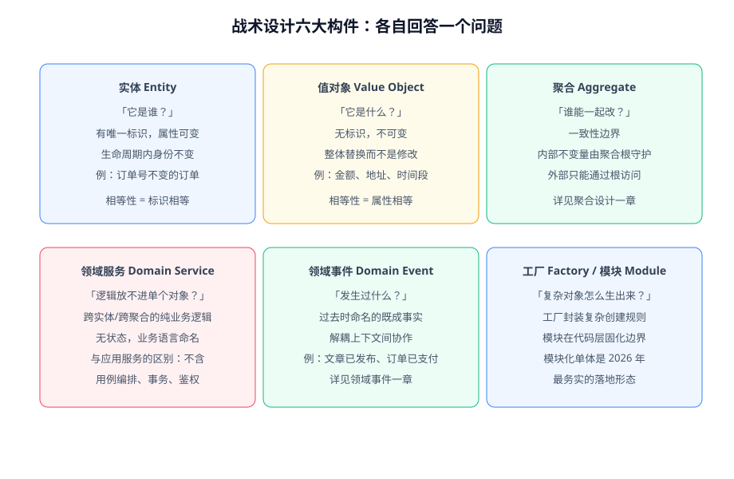

# 战术设计

战术设计把战略设计划出来的上下文**翻译成代码**。它提供了一组固定的建模构件：实体、值对象、聚合、领域服务、领域事件、工厂与模块。每个构件都在回答一个具体的设计问题——**用错构件是大多数「DDD 落地失败」的直接原因**。



## 实体（Entity）

**有唯一标识、属性可以变化、生命周期内身份不变**的对象。相等性由标识决定，而不是属性。

```java [src/main/java/com/example/blog/domain/reader/Reader.java]
public class Reader {

    private final ReaderId id;      // 标识：创建后不变
    private Nickname nickname;      // 属性：可以变化
    private Email email;

    // 两个 Reader 对象只要 id 相同就是同一个读者，哪怕昵称邮箱全改了
    @Override
    public boolean equals(Object o) {
        return o instanceof Reader other && id.equals(other.id);
    }
}
```

判断是不是实体：**「改了所有属性之后，它还是不是原来的那个东西？」** 是——实体；不是——值对象。

## 值对象（Value Object）

**没有标识、不可变、整体替换**的对象，用属性值判定相等。值对象是 DDD 里性价比最高的构件——它把散落的原始类型收拢成有行为、有校验的概念。

```java [src/main/java/com/example/blog/domain/article/Slug.java]
public record Slug(String value) {

    public Slug {
        // 构造即校验：非法 slug 根本无法存在
        if (value == null || !value.matches("[a-z0-9-]{3,64}")) {
            throw new IllegalArgumentException("非法 slug: " + value);
        }
    }

    public static Slug of(String title, SlugUniquenessChecker checker) {
        String base = slugify(title);
        return new Slug(checker.ensureUnique(base));
    }
}
```

```java [src/main/java/com/example/blog/domain/article/Post.java]
// 使用：整体替换，而不是 set 进去
post.changeSlug(new Slug("new-title"));
```

| 对比项 | 实体 | 值对象 |
| --- | --- | --- |
| 标识 | 有（id） | 无 |
| 可变性 | 属性可变 | 完全不可变 |
| 相等性 | 标识相等 | 属性相等 |
| 典型例子 | 订单、用户、文章 | 金额、地址、时间段、slug |
| 持久化 | 独立行/独立表 | 可内嵌（JSON 列、组件映射） |

::: tip 判据
**优先做值对象**。实践中「该是值对象的东西被做成了实体」远比反向错误常见——一旦一个概念被建模成实体，你就会为它建表、给它生命周期管理，复杂度立刻翻倍。
:::

## 领域服务（Domain Service）

**放在单个实体/值对象里不合适**的纯业务逻辑（跨多个实体、或依赖外部信息），用无状态的领域服务承载，并用业务语言命名。

```java [src/main/java/com/example/blog/domain/article/ArticleTransferService.java]
// 「转载判定」涉及源文章与目标文章两个聚合，放谁里面都不对
public class ArticleTransferService {

    public boolean canRepost(Post source, Post target, RepostPolicy policy) {
        return policy.allows(source.license()) && !target.authorId().equals(source.authorId());
    }
}
```

::: danger 领域服务 ≠ 应用服务
| | 领域服务 | 应用服务 |
| --- | --- | --- |
| 内容 | 纯业务规则 | 用例编排：取参、调仓储、开事务、发事件 |
| 依赖 | 只依赖领域对象与领域接口 | 依赖仓储、消息、外部服务 |
| 命名 | 业务语言（`RepostPolicy`） | 用例语言（`ArticleApplicationService`） |

判据：把这段逻辑念给业务人员听——**听得懂的是领域层，听不懂（涉及流程与设施）的是应用层**。
:::

## 领域事件（Domain Event）

领域内**已经发生**的事实用过去时命名：`ArticlePublished`、`CommentDeleted`。它既是模型的一部分（聚合内 `registerEvent` 记录），也是上下文之间的协作方式。完整讨论见[领域事件](../DomainEvent/index.md)。

## 工厂（Factory）与模块（Module）

- **工厂**封装「复杂对象的创建规则」：重建聚合（从数据库还原完整状态）与新建聚合（发起一个新业务对象）规则不同时，用工厂分别封装，避免创建逻辑散落。
- **模块**是代码里的物理边界：一个包一个限界上下文（或聚合），公开 API 放包根，实现细节放 `internal` 子包。模块化单体的工程细节见[落地架构](../Architecture/index.md)。

## 一个聚合内部的完整样子

```java [src/main/java/com/example/blog/domain/article/Post.java]
// 实体做聚合根，值对象做属性，规则全部内聚
public class Post {

    private final PostId id;                    // 实体标识
    private Slug slug;                          // 值对象
    private PostStatus status;                  // 值对象（枚举）
    private String contentHtml;                 // 渲染结果
    private final List<PostTag> tags = new ArrayList<>();   // 值对象集合
    private final List<DomainEvent> events = new ArrayList<>(); // 待发布事件

    // 唯一的状态转移入口：外部不能 setStatus() 绕过规则
    public void publish(SlugUniquenessChecker checker) {
        requireTransitionAllowed(PostStatus.PUBLISHED);
        requireContentPresent();
        this.slug = Slug.of(this.title, checker);
        this.status = PostStatus.PUBLISHED;
        this.publishedAt = Instant.now();
        registerEvent(new ArticlePublished(id.value(), slug.value()));
    }

    private void requireTransitionAllowed(PostStatus target) {
        if (!status.canTransitionTo(target)) {
            throw new IllegalStateException(status.label() + "不能转移到" + target.label());
        }
    }
}
```

这段代码体现的纪律：**状态字段没有 setter；转移方法自校验；事件在聚合内登记，由应用服务在事务提交时发布**。

## 验证方式

用三个可执行检查验证战术设计是否到位：

1. `grep -rn "setStatus\|set 状态字段" src/`——状态字段应当没有公开 setter（转移只走方法）。
2. 任何一个构造函数里如果出现「根据三个参数推断第四个」的逻辑，考虑收进值对象。
3. 模块边界测试（Modulith `verify()`）通过——领域层不 import 框架的 Web/持久化注解之外的东西。

## 参考资料

- Eric Evans,《Domain-Driven Design》第 5~6 章（模型驱动设计、值对象与服务的划分）
- Vaughn Vernon,《Implementing Domain-Driven Design》第 5~6 章
