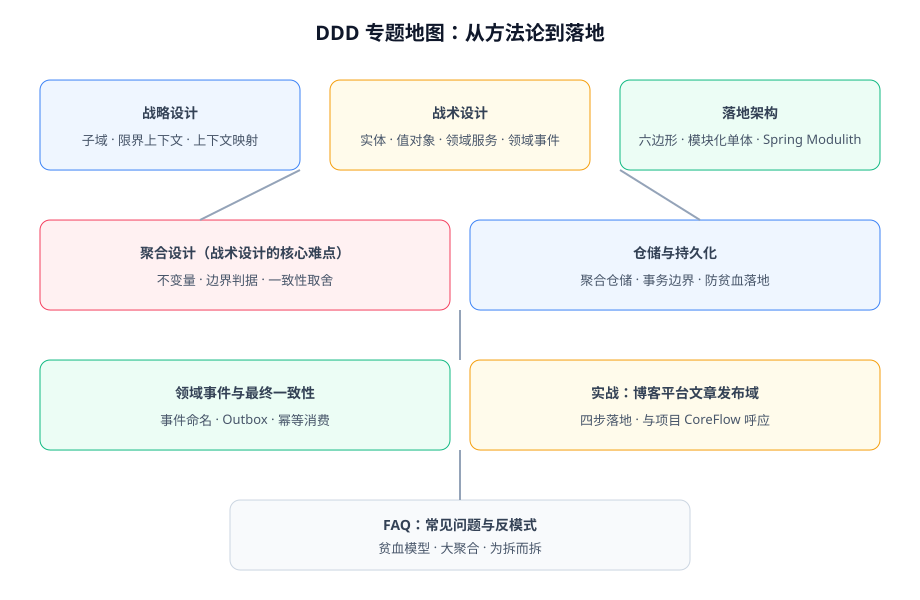

# 领域驱动设计（DDD）

领域驱动设计（Domain-Driven Design，DDD）是一套**以业务模型为核心来组织软件设计**的方法论：先和业务专家建立一套通用语言，把业务概念沉淀成模型，再让代码结构直接反映这个模型。本专题讲 DDD 的完整方法论体系——战略设计怎么划边界、战术设计怎么建模型、落地架构怎么组织代码，并用博客平台的文章发布域做一次完整实战。

::: tip 一句话理解
事务脚本把系统写成「一堆 Service 方法 + 一堆数据表」，业务逻辑散落在代码各处；DDD 把系统写成「一组反映业务的模型对象」，业务规则集中在模型内部——**当业务复杂到语言都对不齐时，DDD 才开始产生回报**。
:::

## 与相邻专题的分工

| 专题 | 讲什么 | 与本专题的关系 |
| --- | --- | --- |
| 本专题 | DDD **方法论体系**：战略设计、战术设计、聚合、仓储、落地架构 | —— |
| [电商系统设计 · 领域建模](../Ecommerce/DomainModeling/index.md) | 以电商业务为对象的**建模实战记录** | 方法论在那里的一次具体应用，先读方法论再看实战 |
| [微服务](../Microservices/index.md) | 服务拆分、注册发现、熔断限流等**运行时治理** | 限界上下文是微服务拆分的**主要输入**，拆分动作本身在微服务专题 |
| [设计模式](../DesignPatterns/index.md) | 代码级复用模式（创建、结构、行为） | 战术设计构件会用到其中一部分（工厂、策略、规格），但不重复讲 |
| [Spring Boot](../Java/Frame/SpringBoot/index.md) | 框架能力与工程配置 | DDD 落地时的载体，本专题不展开框架细节 |
| [项目实战 · 核心业务流](/project/Complete/BlogPlatform/CoreFlow/index.md) | 博客平台领域建模的**项目落地记录** | 本专题实战一章与之呼应：方法论 ↔ 项目记录 |

## 专题地图

| 页面 | 内容 | 适合谁读 |
| --- | --- | --- |
| [DDD 概述](./Overview/index.md) | DDD 是什么、解决什么问题、什么时候不该用 | 所有人，先读 |
| [战略设计](./StrategicDesign/index.md) | 子域划分、通用语言、限界上下文、上下文映射 | 做系统拆分决策的人 |
| [战术设计](./TacticalDesign/index.md) | 实体、值对象、领域服务、领域事件、工厂、模块 | 写代码的人 |
| [聚合设计](./Aggregate/index.md) | 一致性边界、不变量、三条铁律、拆分判据 | 写代码的人，**重点读** |
| [仓储与持久化](./Repository/index.md) | 仓储模式、事务边界、贫血与充血 | 写代码的人 |
| [领域事件](./DomainEvent/index.md) | 事件建模、Outbox、进程内与跨服务事件 | 写代码的人 |
| [落地架构](./Architecture/index.md) | 分层、六边形、模块化单体、Spring Modulith | 定代码结构的人 |
| [实战](./Practice/index.md) | 博客平台文章发布域四步落地 | 想看完整过程的人 |
| [常见问题](./FAQ/index.md) | 高频疑问、反模式清单、自查表 | 所有人 |

## 版本状态速览

DDD 本身是方法论（Evans 2003 年著作《Domain-Driven Design》奠基，无版本号），落地工具链按 **2026-10** 核对：

| 工具 | 当前版本 | 说明 |
| --- | --- | --- |
| Spring Modulith | **2.1.1**（2026-08-26 补丁，2.1.0 GA 2026-06-11） | 模块化单体的主流实现；2.2 M1（2026-08-26）已对齐 Spring Boot 4.2 M1 |
| Spring Boot | 4.x 主线 | Modulith 2.1.x 适配 Boot 4.x |
| Axon Framework | 4.x 主线 | 事件溯源 + CQRS 全家桶，重量级，本专题只提不做默认推荐 |
| EventStoreDB | 24.x 主线 | 专用事件存储数据库，事件溯源场景使用，普通项目不需要 |

::: info 版本核对说明
以上版本按 Spring Modulith 官方发布公告与 Maven Central 核对（2026-10 口径）。Modulith 1.4.x 仍在维护（1.4.13，适配 Boot 3.x），存量项目无需强行升级。
:::

## 学习路径

1. **先读 [概述](./Overview/index.md)**：判断你的项目是否需要 DDD——很多项目不需要，这比学会更重要。
2. **读 [战略设计](./StrategicDesign/index.md)**：学会划限界上下文，这一步决定后面所有工作的形状。
3. **精读 [聚合设计](./Aggregate/index.md)**：聚合是战术设计里最难也最有价值的部分。
4. **按需读 [落地架构](./Architecture/index.md)**：推荐直接从模块化单体的默认形态开始。
5. **走一遍 [实战](./Practice/index.md)**，再对照项目实战记录 [CoreFlow](/project/Complete/BlogPlatform/CoreFlow/index.md) 看方法论落到真实项目里的样子。

## 参考资料

- Eric Evans,《Domain-Driven Design: Tackling Complexity in the Heart of Software》（2003，"蓝皮书"）
- Vaughn Vernon,《Implementing Domain-Driven Design》（2013，"红皮书"）
- Scott Millett & Nick Tune,《Patterns, Principles, and Practices of DDD》
- Spring Modulith 官方文档：https://docs.spring.io/spring-modulith/reference/
- Martin Fowler, DDD Aggregate：https://martinfowler.com/bliki/DDD_Aggregate.html
