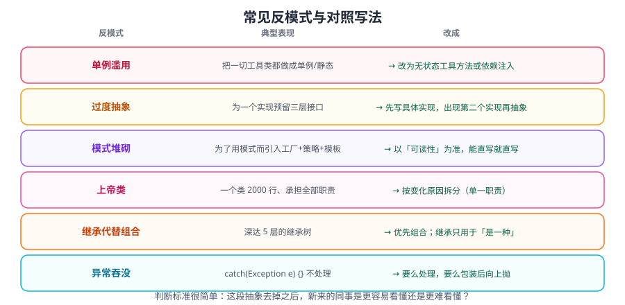

# 反模式与过度设计

学设计模式最大的风险不是「不会用」，而是**「到处都用」**。本篇系统梳理常见反模式（Anti-Pattern）、过度设计的识别信号，以及「什么时候不该用模式」的判断方法。



::: tip 一句话理解
**模式用来解决已经出现的问题，不是用来预防想象中的问题。**
先用最简单的写法跑通，等变化真正发生时再重构——这是最省钱的做法。
:::

## 一、什么是反模式

反模式是**「看起来像解决方案，实际会让事情变糟」的常见做法**。它有两种来源：

| 来源 | 表现 | 例子 |
| --- | --- | --- |
| **无知的反模式** | 不知道有更好的做法 | 在循环里拼 SQL 字符串 |
| **滥用的模式** | 知道模式，用错了地方 | 一个 CRUD 都上抽象工厂 |

::: warning 第二类更危险
「不知道」可以通过学习解决；**「知道还滥用」往往伴随着自信**，review 时更难被发现，团队里更容易扩散。
:::

## 二、代码级反模式

### 2.1 上帝类（God Class）

```java
// 反例：一个类 3000 行，什么都会
public class OrderManager {
    public void createOrder() {}
    public void pay() {}
    public void sendSms() {}
    public void exportExcel() {}
    public void syncToWarehouse() {}
    public void calcTax() {}
    // ... 还有 60 个方法
}
```

**识别信号**：类名以 `Manager` / `Util` / `Handler` / `Processor` 结尾，且方法数 > 20。

**危害**：无法测试、频繁冲突、改一处影响全局。

**解法**：按**职责**拆分（订单创建、支付、通知、导出），用依赖组合而非继承。

### 2.2 过长参数列表（Long Parameter List）

```java
// 反例
public void createUser(String name, String email, String phone, String city,
                       String province, String country, int age, boolean vip) { }

// 改法一：参数对象（record）
public record UserCreateCmd(String name, String email, String phone,
                            Address address, int age, boolean vip) {}
public void createUser(UserCreateCmd cmd) { }
```

::: danger 引入参数对象的常见错误
用 **可变 JavaBean** 做参数对象（带 setter），会引入「部分构造」的不一致状态。
**优先用 `record`**（不可变）或建造者。
:::

### 2.3 依恋情结（Feature Envy）

一个方法**频繁访问别的对象的数据**，说明逻辑放错了位置。

```java
// 反例：calculateTotal 大量读取 order 的字段
public class ReportService {
    public BigDecimal calculateTotal(Order order) {
        BigDecimal sum = BigDecimal.ZERO;
        for (Item i : order.getItems()) {          // 一直在动 order 的数据
            sum = sum.add(i.getPrice().multiply(BigDecimal.valueOf(i.getQty())));
        }
        return sum;
    }
}
// 改法：把计算逻辑搬到 Order 内部
// order.total()
```

### 2.4 重复代码（Copy-Paste Programming）

**识别**：两段代码除了少量参数，其余完全相同。

**处理顺序**（不要一上来就抽接口）：

```text
① 完全相同 → 抽公共方法
② 仅参数不同 → 抽方法 + 参数
③ 三步中一步不同 → 抽模板方法 / 传函数
④ 只有结构相似、细节全不同 → 不要硬抽（会变成"万能抽象"）
```

::: warning 「三则重构」原则
同一段逻辑出现**第三次**时才考虑抽象。
出现第二次就抽象，常常得到一个错误的抽象——因为你还不清楚变化的真实维度。
:::

### 2.5 魔法值（Magic Number / String）

```java
// 反例
if (user.getStatus() == 3) { }
if ("CNY".equals(currency)) { }

// 改法
private static final int STATUS_DISABLED = 3;
if (user.getStatus() == STATUS_DISABLED) { }
// 更好的改法：枚举
public enum OrderStatus { CREATED, PAID, SHIPPED, CLOSED }
```

## 三、过度设计的七种表现

这是本篇的核心——**模式滥用**的具体形态。

| 表现 | 症状 | 后果 |
| --- | --- | --- |
| **抽象工厂满地** | 每个实体都建 Factory + FactoryImpl | 类爆炸，读代码要跳 5 层 |
| **接口无第二实现** | `UserService` + `UserServiceImpl`，且永不会有第二个实现 | 无意义间接层 |
| **策略只为一处** | 为 1 个 if-else 建 5 个策略类 | 复杂度远超收益 |
| **设计模式套娃** | 工厂里建策略，策略里调装饰器，装饰器再代理 | 调试地狱 |
| **提前泛型化** | 为「将来可能支持多种数据库」建三层抽象 | 过度预测需求 |
| **配置驱动一切** | 所有逻辑都塞进 XML/YAML/注解 | 逻辑不可调试、IDE 无提示 |
| **DTO/VO/BO/PO 五连** | 同一个数据 5 个类互相转换 | 大量模板代码与漏改风险 |

::: danger 「接口 + 实现」的判据
**只有当你需要「第二个实现」或「用于 mock」时，接口才有价值。**
现在 Spring Boot 测试已经能 mock 具体类，Spring 也支持直接注入具体类——
「每个 Service 都写接口」在多数业务项目里是**纯负担**。
例外：作为对外发布的 SDK / 跨模块解耦边界时，接口仍然必要。
:::

### 3.1 一个真实的过度设计案例

需求：根据用户类型计算折扣（只有 3 种类型，且一年内不会变）。

**过度设计版（12 个文件）**：

```text
DiscountStrategy.java（接口）
AbstractDiscountStrategy.java（抽象基类）
VipDiscountStrategy.java
NormalDiscountStrategy.java
NewUserDiscountStrategy.java
DiscountStrategyFactory.java（接口）
DiscountStrategyFactoryImpl.java
DiscountStrategyRegistry.java
DiscountContext.java
DiscountConfigLoader.java
DiscountConstants.java
DiscountStrategyException.java
```

**合理版（1 个文件）**：

```java
public enum UserType {
    VIP(p -> p.multiply(new BigDecimal("0.8"))),
    NORMAL(p -> p),
    NEW_USER(p -> p.subtract(new BigDecimal("10")));

    private final UnaryOperator<BigDecimal> rule;
    UserType(UnaryOperator<BigDecimal> rule) { this.rule = rule; }
    public BigDecimal apply(BigDecimal price) { return rule.apply(price); }
}

// 调用
BigDecimal finalPrice = UserType.valueOf(type).apply(price);
```

| 维度 | 过度设计版 | 合理版 |
| --- | --- | --- |
| 文件数 | 12 | 1 |
| 新增类型成本 | 新建类 + 改工厂 + 改注册表 | 加一个枚举值 |
| 可读性 | 差（要跳转多次） | 好（一眼看全） |

::: tip 判断标准：**「变化点」的数量与频率**
- 变化点 1 个、极少变 → 直接写，不要抽象。
- 变化点多个、经常变 → 抽象（接口或枚举或 Map）。
- 变化点未知 → 先写简单版，等第二次变化再重构。
:::

## 四、架构级反模式

| 反模式 | 症状 | 后果 |
| --- | --- | --- |
| **分布式单体** | 拆了服务，但每次发布要一起发 | 复杂度上升、收益为零 |
| **共享数据库** | 多个服务直连同一个库 | 强耦合，无法独立演进 |
| **同步调用链** | A→B→C→D 全同步，任一处慢全链慢 | 雪崩 |
| **贫血模型 + 事务脚本** | 所有逻辑堆在 Service，实体只有 getter/setter | 逻辑分散，难复用 |
| **隐形契约** | 服务间靠「约定」而非 schema 交互 | 一方改动导致线上故障 |
| **日志当数据库** | 用日志查询支撑业务读 | 性能差、不可维护 |

::: warning 微服务不是银弹
拆服务解决的是**「团队协作与独立部署」**问题，不是「性能」或「代码质量」问题。
**在单体里都治不好的耦合，拆成服务只会变成分布式耦合**——见 [微服务专题](../../Microservices/index.md)。
:::

## 五、识别过度设计：五个提问

改造任何代码前，先问这五个问题：

```text
① 现在有几个实现 / 会有几个实现？
   → 只有 1 个，且没有明确计划：不要抽接口

② 变化的维度和频率是什么？
   → 不知道：先不抽象

③ 去掉这层抽象，代码会变差吗？
   → 不会：这层就是多余的

④ 新人能读懂吗？
   → 需要讲 10 分钟才能看懂 50 行代码：过度了

⑤ 调试时能顺着调用栈走吗？
   → 到处是反射/动态代理：要慎重
```

::: tip YAGNI 原则
**You Aren't Gonna Need It**——不要为「将来可能需要」的功能增加复杂度。
大多数「将来」不会到来；即使到来，那时你拥有更多信息，改造也更精准。
:::

## 六、代码坏味道速查表

| 坏味道 | 典型信号 | 重构手法 |
| --- | --- | --- |
| 过长方法 | 超过 50 行 / 需要滚动 | 提炼方法 |
| 过长类 | 超过 500 行 | 提炼类 |
| 重复代码 | 复制粘贴痕迹 | 提炼方法 / 模板 |
| 过长参数 | > 4 个参数 | 参数对象 |
| 发散式变化 | 一个类因多种原因被改 | 拆分职责 |
| 霰弹式修改 | 一个改动要改 10 个类 | 合并职责 |
| 依恋情结 | 频繁访问别的对象 | 搬移方法 |
| 数据泥团 | 多个参数总是一起出现 | 抽成长对象 |
| Switch 语句 | 到处是同结构的 switch | 多态 / 枚举 / 模式匹配 |
| 注释解释坏代码 | 需要大段注释才能懂 | 改名 + 重构代码 |
| 死代码 | 永不执行的代码 | 删除（用版本控制保留历史） |

## 七、最佳实践

1. **先写最简单的能跑的版本**，让变化发生后再重构。
2. **「三则重构」**：同一逻辑出现第三次再抽象。
3. **抽象要服务于「已知的变化」**，不是「想象的变化」。
4. **删代码是重构的一部分**——只增不减的重构是失败的。
5. **命名优于注释**：好名字能省掉一半注释。
6. **警惕「看起来高级」的方案**：反射、动态代理、注解驱动都有调试成本。
7. **代码评审时问「能不能更简单」**，而不只是「有没有用模式」。

::: tip 一句总结
**好的设计不是「用满了模式」，而是「改动时只需要改一处」。**
如果一次需求变更要改 10 个文件，无论用了多少模式，设计都是坏的。
:::

## 相关专题

- 模式总览：[设计原则](../Principles/index.md) · [创建型](../Creational/index.md) · [结构型](../Structural/index.md) · [行为型](../Behavioral/index.md)
- 现代 Java 的简化写法：[现代 Java 与设计模式](../ModernJava/index.md)
- 重构实战：[重构实战](../RefactorPractice/index.md)
- 框架中的应用：[框架中的应用](../FrameworkUsage/index.md)

## 参考资料

- Martin Fowler《重构》第 2 版（坏味道清单）：https://refactoring.com/catalog/
- Refactoring.Guru 反模式目录：https://refactoring.guru/refactoring/smells
- 《Clean Code》（Robert C. Martin）
- ThoughtWorks 技术雷达（架构反模式讨论）：https://www.thoughtworks.com/radar
- 本专题其余章节：[设计模式目录](../index.md)
