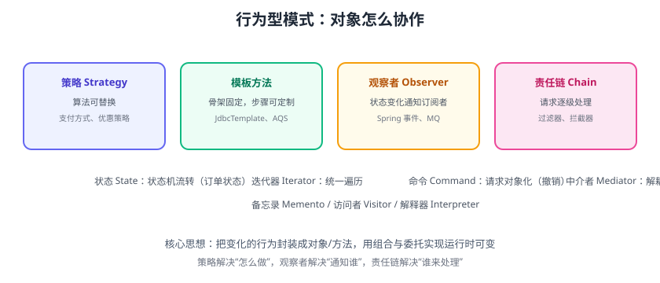

# 行为型模式

行为型模式关注**对象之间的职责分配与协作**，共 11 种：策略、模板方法、观察者、责任链、状态、迭代器、命令、中介者、备忘录、访问者、解释器。本页详解开发中最常用的六种。



## 策略模式（Strategy）

定义一族算法，封装各自实现，运行时选择替换。

```java
interface DiscountStrategy {
    double calc(double amount);
}
class NoDiscount implements DiscountStrategy {
    public double calc(double a) { return a; }
}
class VipDiscount implements DiscountStrategy {
    public double calc(double a) { return a * 0.8; }
}

// 上下文持有策略
class Checkout {
    private DiscountStrategy strategy;
    Checkout(DiscountStrategy s) { this.strategy = s; }
    double price(double amount) { return strategy.calc(amount); }
}
```

::: tip 应用
支付方式、优惠策略、压缩算法、限流算法；替代大段 `if/else`。
:::

## 模板方法模式（Template Method）

父类定义算法**骨架**，子类实现可变步骤。

```java
abstract class PaymentFlow {
    public final void process(Order order) {   // 骨架固定
        validate(order);
        deduct(order);
        notify(order);
    }
    abstract void validate(Order order);
    abstract void deduct(Order order);
    void notify(Order order) { /* 默认实现，可覆盖 */ }
}
```

::: tip 应用
`JdbcTemplate`（连接→执行→关闭）、`AbstractQueuedSynchronizer`、Spring `RestTemplate`、框架回调。
:::

## 观察者模式（Observer）

一个对象状态变化，自动通知所有依赖它的对象。

```java
// 订单事件
class OrderEvent {
    private final List<OrderListener> listeners = new ArrayList<>();
    void addListener(OrderListener l) { listeners.add(l); }
    void publish(Order order) {
        listeners.forEach(l -> l.onOrderCreated(order));
    }
}

interface OrderListener { void onOrderCreated(Order order); }
```

::: tip 应用
Spring `ApplicationEvent` + `@EventListener`、消息队列的发布订阅、GUI 事件监听。
:::

## 责任链模式（Chain of Responsibility）

请求沿链传递，每个处理器决定处理或交给下一个。

```java
abstract class Handler {
    private Handler next;
    Handler setNext(Handler next) { this.next = next; return next; }
    public void handle(Request req) {
        if (canHandle(req)) doHandle(req);
        else if (next != null) next.handle(req);
        else throw new UnsupportedOperationException();
    }
    abstract boolean canHandle(Request req);
    abstract void doHandle(Request req);
}
```

::: tip 应用
Servlet Filter、Spring MVC Interceptor、网关过滤器、审批流、校验链。
:::

## 状态模式（State）

对象行为随**内部状态**变化而改变，把状态行为封装成类。

```java
interface OrderState {
    OrderState pay();
    OrderState ship();
    OrderState cancel();
}
class CreatedState implements OrderState {
    public OrderState pay() { return new PaidState(); }
    public OrderState ship() { throw new IllegalStateException("未支付"); }
    public OrderState cancel() { return new CancelledState(); }
}
```

::: tip 应用
订单状态机、审批状态、连接状态；避免“状态 × 动作”的 if/else 矩阵。
:::

## 其他行为型模式

| 模式 | 用途 | 例子 |
| --- | --- | --- |
| 迭代器 Iterator | 统一遍历集合 | Java `Iterator` |
| 命令 Command | 请求对象化、支持撤销 | 编辑器的撤销/重做 |
| 中介者 Mediator | 对象间解耦 | 聊天室、组件协调 |
| 备忘录 Memento | 保存/恢复状态 | 游戏存档 |
| 访问者 Visitor | 不修改类扩展操作 | 编译器 AST |
| 解释器 Interpreter | 定义语法规则 | 规则引擎 |

## 易错点与最佳实践

::: danger 常见错误
1. **策略模式过度**：两三行 if 也套策略，增加类数量；分支稳定且少时保持简单。
2. **模板方法滥用继承**：步骤变化频繁时用策略/组合更好。
3. **观察者内存泄漏**：忘记移除监听器（尤其注册到长生命周期对象）。
4. **责任链顺序混乱**：链的顺序影响语义（鉴权必须在前），显式定义并测试。
5. **状态模式类爆炸**：状态多、动作多时类数量爆炸；考虑状态表/规则引擎。
6. **观察者同步阻塞**：同步通知慢，观察者多时用异步（MQ/线程池）。
:::

::: tip 最佳实践
1. 用策略替换“按类型分支”的算法选择。
2. 用模板方法提取“不变骨架”，用策略注入“变化点”。
3. 观察者注意生命周期管理，优先用框架事件（Spring Event）。
4. 责任链适合横切处理（鉴权、限流、日志），注意顺序与短路。
5. 状态机复杂时先画状态图再编码。
:::

## 验证方式

1. 用策略模式重构一段支付 if/else，验证新增支付类型零修改。
2. 用状态模式实现订单状态机，验证非法流转抛异常。
3. 用观察者实现下单通知，验证多个监听器都能收到事件。

## 参考资料

- GoF 行为型模式：https://refactoring.guru/design-patterns/behavioral-patterns
- Java 观察者与事件：https://docs.oracle.com/javase/tutorial/uiswing/events/
- Spring 事件机制：https://docs.spring.io/spring-framework/reference/core/beans/context-introduction.html#context-functionality-events
