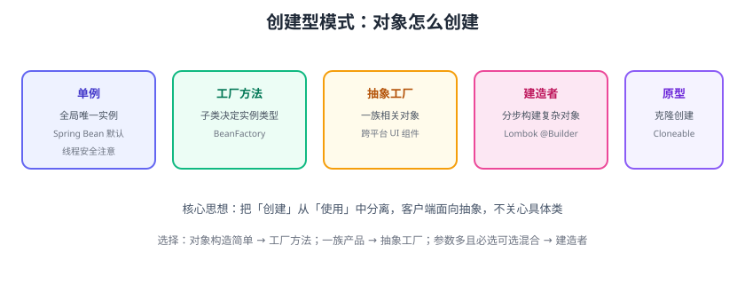

# 创建型模式

创建型模式解决“对象怎么创建”：把创建逻辑从使用逻辑中分离，客户端面向抽象，不关心具体类。共 5 种：**单例、工厂方法、抽象工厂、建造者、原型**。



## 单例模式（Singleton）

保证一个类只有一个实例，并提供全局访问点。

### 饿汉式（简单安全）

```java
public class Config {
    private static final Config INSTANCE = new Config();
    private Config() {}
    public static Config getInstance() { return INSTANCE; }
}
```

### 双重检查锁（懒加载）

```java
public class Config {
    private static volatile Config instance;
    private Config() {}
    public static Config getInstance() {
        if (instance == null) {
            synchronized (Config.class) {
                if (instance == null) instance = new Config();
            }
        }
        return instance;
    }
}
```

### 枚举单例（推荐）

```java
public enum Config {
    INSTANCE;
    // 天然线程安全、防反射与序列化破坏
}
```

::: danger 单例的坑
1. 全局状态难测试：能不用就不用，优先依赖注入（Spring Bean 默认单例，由容器管理）。
2. 懒加载 + 反射/序列化可破坏单例：枚举最稳。
3. 单例里放可变状态 → 并发问题。
:::

## 工厂方法（Factory Method）

定义一个创建对象的接口，由子类决定实例化哪个类。

```java
interface Payment {
    void pay(Order order);
}
class Alipay implements Payment { ... }
class WechatPay implements Payment { ... }

abstract class PaymentFactory {
    public final void execute(Order order) {
        createPayment().pay(order);   // 模板方法 + 工厂方法
    }
    abstract Payment createPayment();
}
class AlipayFactory extends PaymentFactory {
    @Override Payment createPayment() { return new Alipay(); }
}
```

## 抽象工厂（Abstract Factory）

创建**一族相关对象**，保证对象之间的兼容性。

```java
interface UIFactory {
    Button createButton();
    Dialog createDialog();
}
class DarkUIFactory implements UIFactory {
    public Button createButton() { return new DarkButton(); }
    public Dialog createDialog() { return new DarkDialog(); }
}
```

## 建造者模式（Builder）

分步构建复杂对象，解决“构造函数参数爆炸”。

```java
public class Order {
    private final Long userId;      // 必选
    private final String address;   // 可选
    private final String coupon;    // 可选
    private final boolean gift;     // 可选

    private Order(Builder b) {
        this.userId = b.userId;
        this.address = b.address;
        this.coupon = b.coupon;
        this.gift = b.gift;
    }

    public static class Builder {
        private final Long userId;            // 必选通过构造
        private String address = "";
        private String coupon;
        private boolean gift;
        public Builder(Long userId) { this.userId = userId; }
        public Builder address(String v) { this.address = v; return this; }
        public Builder coupon(String v) { this.coupon = v; return this; }
        public Builder gift(boolean v) { this.gift = v; return this; }
        public Order build() { return new Order(this); }
    }
}

// 使用
Order order = new Order.Builder(1001L)
        .address("北京")
        .gift(true)
        .build();
```

::: tip Lombok
`@Builder` 注解可自动生成建造者，但必须字段语义清晰；`@Data` + `@Builder` 是常见组合。
:::

## 原型模式（Prototype）

通过克隆创建对象，避免重复初始化。

```java
class Report implements Cloneable {
    private List<String> rows;
    @Override protected Report clone() {
        Report r = (Report) super.clone();
        r.rows = new ArrayList<>(this.rows);   // 深拷贝引用对象
        return r;
    }
}
```

::: warning 深浅拷贝
`Object.clone()` 是浅拷贝：引用类型字段要手动深拷贝，否则克隆对象共享内部状态。
:::

## 模式选择

| 场景 | 选型 |
| --- | --- |
| 全局唯一实例 | 单例（或 IoC 容器管理） |
| 创建逻辑变化，客户端不想知道具体类 | 工厂方法 |
| 需要创建一族配套对象 | 抽象工厂 |
| 对象参数多、必选可选混合 | 建造者 |
| 创建成本高、需要复制 | 原型 |

## 易错点与最佳实践

::: danger 常见错误
1. **单例滥用**：把可变全局状态塞单例，并发与测试困难。
2. **工厂过度抽象**：只有一个实现也要工厂，反而增加复杂度（YAGNI）。
3. **建造者用错场景**：2 个参数的对象用 Builder，过度设计。
4. **抽象工厂膨胀**：每个新对象类型都要改所有工厂实现。
5. **原型浅拷贝**：共享引用状态导致数据串改。
:::

::: tip 最佳实践
1. 优先让 IoC 容器（Spring）管理单例与创建，代码里少手写工厂。
2. 工厂/抽象工厂用于“有多个实现且创建有逻辑”的场景。
3. 参数 ≥ 4 个且可选项多时用 Builder。
4. 原型注意深拷贝与 `CloneNotSupportedException` 处理。
:::

## 验证方式

1. 写一个双检锁单例，用多线程并发获取实例，断言 `==` 相同。
2. 用工厂方法重构一段 `switch` 创建代码，验证新增类型只需加实现。
3. 用 Builder 重构一个长构造函数的类，确认调用清晰、不可变。

## 参考资料

- GoF 创建型模式：https://refactoring.guru/design-patterns/creational-patterns
- Java 单例（Baeldung）：https://www.baeldung.com/java-singleton
- Lombok @Builder：https://projectlombok.org/features/Builder
