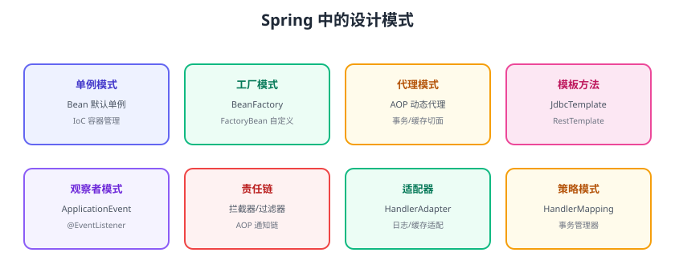

# 框架中的应用

设计模式不是纸上的理论——主流框架内部大量使用模式。看懂 Spring、MyBatis 等框架中的模式，等于拿到源码的“地图”。本页梳理常用框架中的模式映射。



## Spring Framework

| 模式 | 框架中的体现 |
| --- | --- |
| 单例 | Bean 默认单例，IoC 容器管理生命周期 |
| 工厂 | `BeanFactory`、`FactoryBean`、`@Bean` 方法 |
| 模板方法 | `JdbcTemplate`、`RestTemplate`、`JmsTemplate` |
| 代理 | AOP 动态代理（JDK Proxy / CGLIB） |
| 观察者 | `ApplicationEvent` + `@EventListener` |
| 责任链 | 拦截器链、AOP 通知链 |
| 适配器 | `HandlerAdapter` 适配各种 Controller |
| 策略 | `HandlerMapping`、事务管理器抽象 |
| 装饰器 | `HttpServletRequestWrapper` |

## Spring AOP 与代理模式

```java
// 声明式事务：本质是代理在方法前后织入事务逻辑
@Transactional
public void createOrder(Order order) { ... }
```

```text
调用方 → 事务代理（开启事务/提交/回滚）→ 真实 Bean
```

- 接口存在 → JDK 动态代理。
- 无接口 → CGLIB 代理（Spring Boot 默认 `proxyTargetClass=true`）。

::: danger AOP 的坑
1. **自调用失效**：同类内 `this.method()` 不走代理；注入自身或拆类。
2. **私有/静态方法不能代理**。
3. **final 类不能 CGLIB 代理**。
4. 代理模式要求方法走代理调用，事务/缓存/异步注解都依赖它。
:::

## MyBatis 与代理模式

```java
public interface OrderMapper {
    Order findById(Long id);
}

// 使用：Mapper 是接口，运行时由 JDK 动态代理生成实现
OrderMapper mapper = sqlSession.getMapper(OrderMapper.class);
```

代理把接口方法调用转换为 SQL 执行，绑定 Mapper XML 或注解。

## Spring Boot 自动配置与工厂/模板

```text
@EnableAutoConfiguration
  → 按条件装配（@ConditionalOnXxx）选择合适的 Bean
  → 相当于“按环境选择实现的工厂”
```

```java
@Configuration
@ConditionalOnClass(RedisTemplate.class)
public class RedisAutoConfiguration {
    @Bean
    @ConditionalOnMissingBean
    public RedisTemplate<Object, Object> redisTemplate(...) { ... }
}
```

## 并发包中的模板方法与状态

| 组件 | 模式 |
| --- | --- |
| `AbstractQueuedSynchronizer` | 模板方法（获取/释放锁的骨架，子类实现） |
| `ThreadPoolExecutor` | 模板方法 + 策略（拒绝策略） |
| `CopyOnWriteArrayList` | 快照思想（类似备忘录） |

## JDK 中的模式

| 模式 | JDK 例子 |
| --- | --- |
| 迭代器 | `Iterator`、`for-each` |
| 适配器 | `Arrays.asList`、`InputStreamReader` |
| 装饰器 | `BufferedInputStream`、`Collections.synchronizedList` |
| 观察者 | `Observer/Observable`（旧）、Swing 事件 |
| 工厂 | `Integer.valueOf`（缓存）、`ExecutorService` |
| 享元 | 字符串常量池、包装类缓存 |

## 如何用“模式视角”读源码

```text
1. 先看类结构：接口/抽象类/实现类分布 → 策略/工厂
2. 看创建位置：谁 new 谁 → 工厂/单例
3. 看方法骨架：final 方法 + 抽象步骤 → 模板方法
4. 看回调：传接口进去 → 策略/模板
5. 看事件：addListener/publish → 观察者
```

## 易错点与最佳实践

::: danger 常见错误
1. **误以为 Spring Bean 一定是单例**：`@Scope("prototype")`、`@RequestScope` 可改变；了解作用域。
2. **忽略代理机制**：事务/缓存注解失效多半是代理问题（自调用、非 public）。
3. **手写框架已有能力**：Spring 已提供事件、AOP、模板，不要重复造轮子。
4. **只背模式名不读源码**：模式的价值在应用，看框架源码才是真懂。
:::

::: tip 最佳实践
1. 排障先从“框架模式视角”思考：代理是否生效、事件是否发布、链是否短路。
2. 学习路径：先学模式 → 再读 Spring 核心源码 → 最后看自己的业务代码。
3. 业务代码里优先用框架现成能力（@EventListener、@Transactional）。
:::

## 验证方式

1. 在 Spring Boot 中写 `@Transactional` 自调用，观察事务失效，再用注入方式修复。
2. 查看 MyBatis Mapper 的代理类（debug 时看实现类），确认是动态代理。
3. 发布一个 ApplicationEvent，确认多个 @EventListener 被调用。

## 参考资料

- Spring 核心文档：https://docs.spring.io/spring-framework/reference/core.html
- Spring AOP：https://docs.spring.io/spring-framework/reference/core/aop.html
- MyBatis 文档：https://mybatis.org/mybatis-3/zh_CN/
- 设计模式与框架源码（《Spring 源码深度解析》，书籍）
