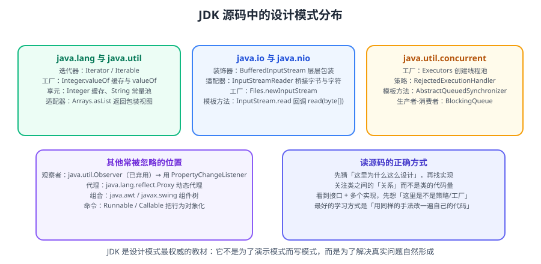

# JDK 源码中的设计模式

设计模式最容易「学了不会用」。**读 JDK 源码是最高效的落地方式**——你每天都在用的 API，背后就是标准实现。本篇挑选 JDK 中 12 处典型用法，逐一对上模式，并给出源码片段的解读方式。



::: tip 一句话理解
不要把设计模式当「需要背诵的 23 个名词」，而要当**「读源码时的识别器」**。
看到 JDK 里这么写，你就知道「原来这个场景该这么组织」。
:::

## 一、为什么先读 JDK

| 读 JDK 的优势 | 说明 |
| --- | --- |
| **零成本运行** | 你每天都在调，不用额外环境 |
| **实现标准** | 官方写法，没有个人风格噪音 |
| **场景真实** | 不是为了演示模式而写的模式 |
| **版本清晰** | 能看到同一模式在新版本中被如何简化 |

::: warning 别把「用到模式」当目的
JDK 里大量代码**并没有用任何模式**，就是直接的类与接口。
模式是**结果**（因为解决了某类问题），不是**目标**（不是每段代码都要套一个）。
:::

## 二、创建型模式在 JDK 中的体现

### 2.1 单例（Singleton）：`Runtime` 与枚举单例

`java.lang.Runtime` 是标准单例：

```java
public class Runtime {
    private static final Runtime currentRuntime = new Runtime();

    public static Runtime getRuntime() {
        return currentRuntime;
    }

    private Runtime() {}   // 私有构造，禁止外部 new
}
```

::: danger 「饿汉式」与「双重检查」的常见错误
- **双重检查锁（DCL）必须给字段加 `volatile`**，否则有指令重排导致的半初始化对象风险。
- 现代 Java 更推荐**枚举单例**（`Effective Java` 推荐），天然防反射与反序列化破坏：

```java
public enum ConfigHolder {
    INSTANCE;
    private final Config config = load();
    public Config get() { return config; }
}
```

在 Spring 里则直接用容器的单例 Bean，**不需要自己实现单例**——这是很多初学者的多余设计。
:::

### 2.2 建造者（Builder）：`StringBuilder` 与 `HttpRequest.Builder`

```java
// StringBuilder：分离"构建过程"与"最终表示"
String sql = new StringBuilder()
    .append("SELECT * FROM user")
    .append(" WHERE status = ").append(status)
    .toString();
```

链式 Builder 在现代 JDK 中大量出现，如 `HttpRequest.newBuilder().uri(uri).GET().build()`。
它的核心价值：**参数多、可选参数多、需要不可变结果**。

### 2.3 工厂方法（Factory Method）：`Calendar`、`List.of()`、日志工厂

```java
// 静态工厂：隐藏实现类，返回接口
List<String> list = List.of("a", "b");   // 返回不可变实现，调用方不需要知道具体类
Calendar cal = Calendar.getInstance();   // 按时区/区域返回不同实现
```

::: info 静态工厂 vs 构造器
`Effective Java` 总结的优势：**有名字**（`List.of` 比 `new ArrayList` 表意清楚）、**可缓存**、**可返回子类型**。
JDK 与主流库（Guava、Spring）都大量使用。缺点：无法被继承（若类只有私有构造）。
:::

## 三、结构型模式在 JDK 中的体现

### 3.1 适配器（Adapter）：`InputStreamReader`

```java
// 把字节流"适配"成字符流：接口不同，用适配器转换
Reader reader = new InputStreamReader(new FileInputStream("a.txt"), StandardCharsets.UTF_8);
```

这是最直观的适配器：`InputStream`（字节）→ `Reader`（字符），不修改任何一方。

### 3.2 装饰器（Decorator）：`BufferedInputStream` 体系

```java
InputStream in = new BufferedInputStream(          // 加缓冲
                    new GZIPInputStream(           // 加解压
                        new FileInputStream("a.gz")));  // 基础流
```

| 特征 | 说明 |
| --- | --- |
| 与被装饰者同接口 | 都是 `InputStream` |
| 持有被装饰对象 | 构造传入，可层层叠加 |
| 职责单一可组合 | 缓冲、解压、加密各一层 |

::: tip 装饰器 vs 继承
需要「加密 + 缓冲 + 解压」的任意组合时，继承会爆炸成 2ⁿ 个子类；
装饰器只需 n 个类自由叠加。**这就是「组合优于继承」的标准案例。**
:::

### 3.3 代理（Proxy）：`Collections.unmodifiableList` 与动态代理

```java
List<String> safe = Collections.unmodifiableList(raw);  // 静态代理：包装并拦截写操作
```

动态代理在 JDK 中由 `java.lang.reflect.Proxy` 提供，是 **Spring AOP、MyBatis Mapper 接口**的基础：

```java
Object proxy = Proxy.newProxyInstance(
    target.getClass().getClassLoader(),
    target.getClass().getInterfaces(),
    (p, method, args) -> {
        log.info("调用 {}", method.getName());
        return method.invoke(target, args);
    });
```

::: warning 动态代理只能代理接口（JDK 原生）
JDK 原生动态代理要求目标实现接口。**没有接口时**需要 CGLIB/ByteBuddy 生成子类代理——这正是 Spring 里「JDK 代理 vs CGLIB 代理」的由来。
:::

## 四、行为型模式在 JDK 中的体现

### 4.1 策略（Strategy）：`Comparator`

```java
// 把"比较逻辑"抽成可替换的策略
list.sort(Comparator.comparing(User::age).thenComparing(User::name));
```

`Comparator` 是策略模式的教科书实现：同一排序流程（`sort`），不同比较策略（`Comparator` 实例）。

### 4.2 模板方法（Template Method）：`AbstractList`、`InputStream`

```java
public abstract class InputStream {
    public abstract int read() throws IOException;   // 子类实现"钩子"

    public int read(byte[] b) throws IOException {   // 固定骨架，调用钩子
        // ... 循环调用 read()，子类只需实现单字节读取
    }
}
```

| 角色 | 对应 |
| --- | --- |
| 抽象模板 | `InputStream` |
| 钩子方法 | `read()` |
| 具体实现 | `FileInputStream`、`ByteArrayInputStream` |

### 4.3 迭代器（Iterator）：集合体系

```java
Iterator<String> it = list.iterator();
while (it.hasNext()) {
    String s = it.next();
}
```

迭代器把「遍历方式」与「集合内部结构」解耦。**增强 for 循环就是它的语法糖**。

::: danger `ConcurrentModificationException` 的根因
增强 for / 迭代器遍历时**调用集合自身的 `remove`** 会抛 `ConcurrentModificationException`，
因为迭代器内部维护了 `modCount` 校验。
正确做法：用 `iterator.remove()`，或改用具并发安全的集合。
:::

### 4.4 观察者（Observer）：`java.util.Observer` 与事件监听

JDK 早期的 `Observer`/`Observable` 已废弃，但**思想仍在**：
`PropertyChangeListener`、`CompletableFuture` 的回调链、Servlet 的 `Listener` 都是观察者变体。

```java
// 现代写法：函数式回调（比接口更轻）
future.thenAccept(result -> log.info("完成：{}", result))
      .exceptionally(ex -> { log.error("失败", ex); return null; });
```

## 五、归纳对照表

| 模式 | JDK 实例 | 识别特征 |
| --- | --- | --- |
| 单例 | `Runtime`、枚举 | 私有构造 + 静态获取 |
| 建造者 | `StringBuilder`、`HttpRequest.Builder` | 链式 `build()` |
| 工厂方法 | `List.of`、`Calendar.getInstance` | 静态方法返回接口 |
| 适配器 | `InputStreamReader` | 构造传入异接口对象 |
| 装饰器 | `BufferedInputStream` | 同接口 + 持有被装饰者 |
| 代理 | `Collections.unmodifiableList`、`Proxy` | 包装 + 拦截 |
| 策略 | `Comparator` | 行为作为参数传入 |
| 模板方法 | `InputStream` | 抽象钩子 + 固定骨架 |
| 迭代器 | 集合体系 | `hasNext/next` |
| 观察者 | `PropertyChangeListener` | 注册 + 回调 |

## 六、怎么读源码更有效

```text
① 选一个你天天用的 API（如 List.sort）
② 顺着调用链往下看两层，不要试图读完整个 JDK
③ 问三个问题：
   - 它解决了什么问题？
   - 如果不用这个模式，代码会变成什么样？
   - 现在的 Java 版本有没有更简单的写法？
④ 在自己的项目里找同类场景，试着改一处
```

::: tip 读源码的「两层原则」
读到两层就停，**目的是识别模式，不是掌握全部实现**。
想深入某个具体机制（如 `HashMap` 扩容）时再单独深挖。
:::

## 相关专题

- 模式总览：[设计原则](../Principles/index.md) · [创建型](../Creational/index.md) · [结构型](../Structural/index.md) · [行为型](../Behavioral/index.md)
- 现代 Java 如何替代经典模式：[现代 Java 与设计模式](../ModernJava/index.md)
- 避免套模式：[反模式与过度设计](../AntiPatterns/index.md)
- 框架中的落地：[框架中的应用](../FrameworkUsage/index.md)

## 参考资料

- `java.base` 源码（OpenJDK）：https://github.com/openjdk/jdk/tree/master/src/java.base/share/classes/java
- 《Effective Java》第 3 版（静态工厂、建造者、枚举单例）
- Refactoring.Guru 模式目录：https://refactoring.guru/design-patterns
- 本专题其余章节：[设计模式目录](../index.md)
