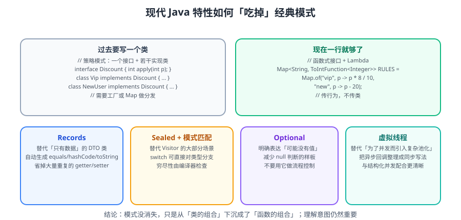

# 现代 Java 与设计模式

很多经典设计模式是**为了绕开 Java 的语言限制**而生的：没有 lambda 所以用策略类，没有 sealed 所以用访问者模式，没有 record 所以手写 Builder。**现代 Java（17 → 25）把这些限制一个个解除了**，本篇讲清楚「哪些模式可以简化、哪些仍然必要」。



::: info 版本说明（2026-09 核对）
- **JDK 25**：当前最新 **LTS**（2025-09-16 发布，Premier Support 至 2030-09）。
- **JDK 26**：最新非 LTS 版本（2026-03-17 发布）。
- **JDK 27**：计划 2026-09-14 发布。
- **JDK 21**：上一代 LTS（2023-09 发布）。

本篇示例统一按 **JDK 21+** 编写；标注「预览」的特性在正式项目中需显式开启 `--enable-preview`，不建议在生产依赖。
:::

::: tip 一句话理解
**语言特性升级的方向，是把「用模式绕开限制」变成「用语言直接表达意图」。**
判断一个模式是否还需要，问一句：*这个限制现在还存在吗？*
:::

## 一、被语言特性「退役」的模式

### 1.1 值对象 + 建造者：record 取代大半

传统写法（Java 8 时代）：

```java
public final class Point {
    private final int x;
    private final int y;
    public Point(int x, int y) { this.x = x; this.y = y; }
    public int x() { return x; }
    public int y() { return y; }
    @Override public boolean equals(Object o) { /* 手写 10 行 */ }
    @Override public int hashCode() { /* 手写 3 行 */ }
    @Override public String toString() { /* 手写 3 行 */ }
}
```

现代写法（Java 16+）：

```java
public record Point(int x, int y) {}
```

::: warning record 不是万能的
record 适合**不可变、字段少（≤4 个）、无复杂校验**的数据载体。
以下场景仍需手写类或建造者：
- 字段多且可选参数多（如 10 个可选配置）→ 用 Builder；
- 需要延迟校验、可变状态；
- 需要继承。
:::

### 1.2 策略模式：lambda 取代接口实现类

```java
// 传统：每个策略一个类
public interface DiscountStrategy { BigDecimal apply(BigDecimal price); }
class VipDiscount implements DiscountStrategy { ... }
class NewUserDiscount implements DiscountStrategy { ... }
// 调用：map.get(type).apply(price)

// 现代：策略即函数
Map<String, UnaryOperator<BigDecimal>> discounts = Map.of(
    "vip",      p -> p.multiply(new BigDecimal("0.8")),
    "newUser",  p -> p.subtract(new BigDecimal("10"))
);
BigDecimal finalPrice = discounts.get(type).apply(price);
```

::: danger 但「策略」不等于「一切用 Map + lambda」
当策略有**多个方法、需要依赖注入、需要独立测试与命名**时，仍然应该写成类。
用 lambda 硬塞进 Map，会让代码失去可读性与可测试性——**这是现代 Java 最常见的新式过度设计**。
:::

### 1.3 访问者模式：sealed + 模式匹配取代大半

经典访问者（Visitor）用于「给一组稳定类型新增操作」。它笨重的原因是：**加新类型要改所有 Visitor**。

```java
// 传统 Visitor：两层接口 + 每个类型一个 accept 方法
interface ShapeVisitor { void visit(Circle c); void visit(Rect c); }
interface Shape { void accept(ShapeVisitor v); }
```

现代写法（Java 21 模式匹配 + sealed 16+）：

```java
public sealed interface Shape permits Circle, Rect, Triangle {}

record Circle(double r) implements Shape {}
record Rect(double w, double h) implements Shape {}
record Triangle(double base, double height) implements Shape {}

// 一个方法处理所有类型，添加新操作 = 加一个方法，不用碰原有类
public static double area(Shape s) {
    return switch (s) {
        case Circle c            -> Math.PI * c.r() * c.r();
        case Rect r              -> r.w() * r.h();
        case Triangle t          -> 0.5 * t.base() * t.height();
    };
}
```

| 维度 | 经典 Visitor | sealed + switch |
| --- | --- | --- |
| 加新类型 | 改所有 Visitor（痛） | 编译器报错提示补分支（可控） |
| 加新操作 | 加一个 Visitor | 加一个方法 |
| 代码量 | 高 | 低 |
| 需 sealed | 不需要 | 需要 |

::: tip 什么时候仍用 Visitor
类型集合**稳定**、操作**频繁增加**、且需要**双重分派**语义（如 AST 编译器、复杂树遍历）时，Visitor 仍不可替代。
:::

### 1.4 单例：枚举 + 依赖注入

```java
// 枚举单例：天然防反射、防反序列化
public enum ConfigHolder { INSTANCE; public final Config config = load(); }
```

但在 Spring 项目里，**正确做法是用容器管理的单例 Bean**，而不是自己写单例——自己写会破坏可测试性（无法替换 mock）。

### 1.5 模板方法：函数参数取代继承

```java
// 传统：继承 + 重写钩子
abstract class Task { void run() { setUp(); doWork(); tearDown(); } abstract void doWork(); }

// 现代：把可变部分作为参数
public static void runWithLifecycle(Runnable setUp, Runnable work, Runnable tearDown) {
    setUp.run();
    try { work.run(); } finally { tearDown.run(); }
}
```

::: info 「组合优于继承」被语言强化了
函数式接口 + lambda 让「传行为」比「继承实现」更轻。
判断标准：**有多个变化点时仍用类（或抽象类），只有一个行为变化点时用函数参数。**
:::

## 二、现代并发特性对模式的影响

### 2.1 虚拟线程（Java 21 正式）：改变「线程池」的用法

```java
// 传统：为每个请求分配平台线程，受线程数限制，需要精细的池化
// 现代：虚拟线程极轻量，可以"一请求一线程"
try (var executor = Executors.newVirtualThreadPerTaskExecutor()) {
    IntStream.range(0, 10_000).forEach(i ->
        executor.submit(() -> {
            Thread.sleep(Duration.ofSeconds(1));   // 阻塞不再昂贵
            return i;
        }));
}
```

| 影响 | 说明 |
| --- | --- |
| **阻塞型 IO 变简单** | 不必再为「异步回调」写复杂代码 |
| **Reactor 模型的使用场景收窄** | 阻塞式代码 + 虚拟线程可能已足够 |
| **池化要注意** | **不要池化虚拟线程**（它们的设计就是「用完即弃」） |
| **synchronized 陷阱** | 虚拟线程在 `synchronized` 块内阻塞会 pin 载体线程，建议改用 `ReentrantLock` |

::: danger 虚拟线程最常踩的两个坑
1. **把虚拟线程放进 `synchronized` 里做阻塞 IO** → 发生 pinning，吞吐反而下降。用 `ReentrantLock` 替代。
2. **用 `ThreadLocal` 缓存重对象** → 虚拟线程数量巨大，会把内存打爆。改用 **Scoped Values**（Java 25 正式）。
:::

### 2.2 作用域值（Scoped Values，Java 25 正式）：取代 ThreadLocal

```java
public static final ScopedValue<User> CURRENT_USER = ScopedValue.newInstance();

// 在作用域内绑定，退出即自动失效（不可变、天然支持虚拟线程）
ScopedValue.where(CURRENT_USER, user).run(() -> handleRequest());
```

| 对比 | ThreadLocal | ScopedValue |
| --- | --- | --- |
| 生命周期 | 手动 remove，易泄漏 | 作用域结束自动失效 |
| 可变性 | 可变 | 不可变 |
| 虚拟线程 | 数量爆炸时内存风险 | 设计友好 |
| 子线程继承 | 需 `InheritableThreadLocal` | 结构化并发内自动可见 |

### 2.3 结构化并发（预览中）：取代裸线程池编排

```java
// 结构化并发（预览）：子任务的生命周期被父作用域约束
try (var scope = new StructuredTaskScope.ShutdownOnFailure()) {
    Subtask<User>  user  = scope.fork(() -> fetchUser(id));
    Subtask<Order> order = scope.fork(() -> fetchOrder(id));
    scope.join().throwIfFailed();
    return new Result(user.get(), order.get());
}
```

::: warning 预览特性不要上生产
结构化并发在 JDK 25/26 仍是 **预览（Preview）**，API 可能变化。
生产可用替代：`CompletableFuture` 组合，或虚拟线程 + 显式超时控制。
:::

## 三、现代 Java 写法速查表

| 场景 | 旧写法 | 现代写法（Java 21+） |
| --- | --- | --- |
| 数据载体 | 手写 getter/equals/hashCode | `record` |
| 参数对象 | 可变 setter | `record` + Builder |
| 策略 | 接口 + 多个实现类 | `Map<String, Function>` |
| 多分支处理 | Visitor 模式 | `sealed` + `switch` 模式匹配 |
| 空值处理 | 层层 `if (x != null)` | `Optional` / `Objects.requireNonNull` |
| 集合创建 | `new ArrayList<>()` + add | `List.of` / `Stream.toList()` |
| 遍历转换 | for + 临时集合 | Stream API |
| 字符串拼接 | `+` 或 StringBuilder | 文本块 `"""` / `String.join` |
| 线程 | 线程池 + 回调 | 虚拟线程（21+） |
| 上下文传递 | ThreadLocal | ScopedValue（25+） |
| 文件读写 | 手动流关闭 | `Files.readString` / try-with-resources |

## 四、不能丢的：这些模式仍然是必需品

语言演进并没有让设计模式失效，只是**缩小了它的适用面**：

| 模式 | 为什么仍需要 |
| --- | --- |
| **工厂 / 抽象工厂** | 复杂对象创建、依赖族切换，语言层无法替代 |
| **装饰器** | 需要运行时动态组合能力（如 `InputStream` 体系） |
| **代理** | AOP、远程调用、懒加载的通用机制 |
| **观察者** | 解耦的事件通知，虽可用函数替代，但多订阅者管理仍需结构 |
| **责任链** | 过滤、审批、中间件（Servlet Filter、Netty Pipeline） |
| **状态机** | 复杂状态迁移，模式匹配不能替代状态建模 |
| **Builder** | 字段多、可选参数多的对象构建 |

::: tip 判断「这个模式还需要吗」的三步法
```text
① 它是不是为了绕开某个语言限制？（继承层级、无 lambda、无 sealed）
   → 是：检查现代语言特性是否能直接表达
② 它是不是在组织「多变的算法/流程」？
   → 是：优先考虑函数式接口 + 组合
③ 它是不是在组织「复杂的对象关系与生命周期」？
   → 是：模式仍然必要
```
:::

## 五、实战：把一段旧代码现代化

原始代码（Java 8 风格，用 3 个策略类 + 1 个工厂）：

```java
interface Exporter { String export(List<Row> rows); }
class CsvExporter implements Exporter { public String export(List<Row> r) { /* ... */ } }
class JsonExporter implements Exporter { public String export(List<Row> r) { /* ... */ } }
class ExporterFactory { static Exporter get(String type) { /* if-else 五连 */ } }
```

现代化改造（保持可测试性，不硬塞 lambda）：

```java
public sealed interface ExportFormat permits Csv, Json, Excel {}

public record Csv(char delimiter) implements ExportFormat {}
public record Json(boolean pretty) implements ExportFormat {}
public record Excel(String sheetName) implements ExportFormat {}

public final class Exporter {
    // 用模式匹配 + record 解构替代工厂 if-else
    public static String export(ExportFormat format, List<Row> rows) {
        return switch (format) {
            case Csv c   -> toCsv(rows, c.delimiter());
            case Json j  -> j.pretty() ? toJsonPretty(rows) : toJson(rows);
            case Excel e -> toExcel(rows, e.sheetName());
        };
    }
    private static String toCsv(List<Row> rows, char d) { /* ... */ }
    // ...
}
```

改造收益：

| 维度 | 改造前 | 改造后 |
| --- | --- | --- |
| 新增格式 | 新建类 + 改工厂 | 加 record + 编译器提示补分支 |
| 非法组合 | 运行期才报错 | 编译期穷尽性检查 |
| 代码行数 | ~120 | ~70 |
| 可测试性 | 需为每个类建测试 | 直接测 `export` |

## 六、易错点与最佳实践

::: danger 六个常见的新式过度设计
1. **record 滥用**：字段 8 个还用 record，构造调用变成灾难 → 改用 Builder。
2. **全用 lambda 消灭所有类**：策略有状态、多方法时仍应用类。
3. **`Optional` 当参数或字段**：`Optional` 设计用于**返回值**，不要用于方法参数和字段。
4. **虚拟线程 + 池化**：虚拟线程不需要池化，池化反而降低吞吐。
5. **无脑上预览特性**：预览 API 会变，生产环境谨慎。
6. **`switch` 模式匹配忽略 null**：`case null` 需显式处理，否则抛 NPE。
:::

1. **优先用语言表达意图**，而不是用模式绕开限制。
2. **record 用于不可变数据，sealed 用于封闭类型集合**，二者配合模式匹配威力最大。
3. **函数式只用于「单一行为」**；多行为仍用类。
4. **虚拟线程解决的是「阻塞成本」，不是「并发正确性」**，数据竞争仍需锁与并发容器。
5. **升级 JDK 前先看依赖兼容性**：主流框架（Spring Boot 3.x、Netty 4.x）对 JDK 21/25 的支持较好；老版本框架可能不支持。

## 相关专题

- 模式总览：[设计原则](Principles/index.md) · [创建型](Creational/index.md) · [结构型](Structural/index.md) · [行为型](Behavioral/index.md)
- JDK 源码中的模式：[JDK 源码中的设计模式](JdkPatterns/index.md)
- 反模式与过度设计：[反模式与过度设计](AntiPatterns/index.md)
- 虚拟线程与并发编程：[Socket 与 IO 模型](../../NetworkProgramming/SocketIO/index.md)

## 参考资料

- Oracle JDK 下载与版本说明：https://www.oracle.com/java/technologies/downloads/
- JDK 版本与支持周期（endoflife.date）：https://endoflife.date/oracle-jdk
- JEP 索引（按版本查看正式/预览特性）：https://openjdk.org/jeps/
- 《Effective Java》第 3 版（静态工厂、record、Optional 用法）
- 本专题其余章节：[设计模式目录](../index.md)
