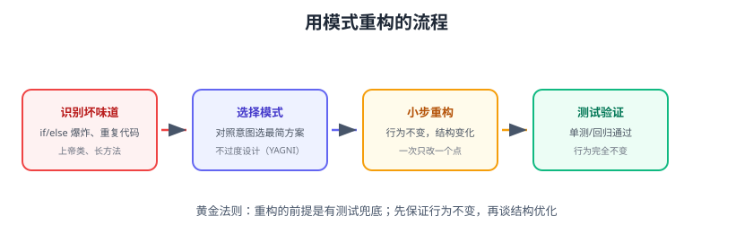

# 实战案例

本页用一个真实场景串联多个模式：**电商下单系统**。从“坏味道代码”开始，用策略、模板方法、观察者、代理等模式逐步重构，并给出重构前后的对比与验证方法。



## 场景：下单接口

需求：

1. 支持多种支付方式（支付宝、微信、银行卡）。
2. 不同会员等级不同折扣。
3. 下单后要发短信、写日志、推送消息。
4. 库存不足要回滚。

## 第一步：坏味道代码

```java
@Service
public class OrderService {
    public void createOrder(Order order, String payType, int memberLevel) {
        // 折扣计算：if/else 爆炸
        double discount;
        if (memberLevel == 1) {
            discount = 0.95;
        } else if (memberLevel == 2) {
            discount = 0.85;
        } else {
            discount = 1.0;
        }
        order.setAmount(order.getAmount() * discount);

        // 支付：又一个 if/else
        if ("alipay".equals(payType)) {
            alipayClient.pay(order);
        } else if ("wechat".equals(payType)) {
            wechatClient.pay(order);
        } else {
            bankClient.pay(order);
        }

        // 通知：直接调用，且顺序写死
        smsService.send(order);
        logService.write(order);
        pushService.push(order);
    }
}
```

问题：

- 新增支付方式/会员等级要改 `createOrder`（违反开闭原则）。
- 一个类承担折扣、支付、通知多个职责（违反单一职责）。
- 通知逻辑与主流程耦合，无法复用。

## 第二步：策略模式重构折扣

```java
public interface DiscountStrategy {
    boolean support(int memberLevel);
    double calc(double amount);
}

@Component
public class Vip2Discount implements DiscountStrategy {
    public boolean support(int level) { return level == 2; }
    public double calc(double a) { return a * 0.85; }
}
```

```java
// 注入策略列表，按 support 匹配；新增等级只加实现类
private final List<DiscountStrategy> strategies;

double amount = order.getAmount();
strategies.stream()
    .filter(s -> s.support(memberLevel))
    .findFirst()
    .ifPresent(s -> order.setAmount(s.calc(amount)));
```

## 第三步：模板方法统一支付流程

```java
public abstract class AbstractPayment {
    public final void pay(Order order) {     // 骨架固定
        validate(order);
        deduct(order);
        notifyExternal(order);
    }
    protected abstract void validate(Order order);
    protected abstract void deduct(Order order);
    protected void notifyExternal(Order order) { /* 默认空实现 */ }
}

@Component
public class AlipayPayment extends AbstractPayment {
    protected void validate(Order o) { /* 支付宝校验 */ }
    protected void deduct(Order o) { /* 支付宝扣款 */ }
}
```

```java
// 工厂 + 策略选择支付实现
private final List<AbstractPayment> payments;
AbstractPayment payment = payments.stream()
    .filter(p -> p.support(payType))
    .findFirst()
    .orElseThrow(() -> new UnsupportedOperationException(payType));
payment.pay(order);
```

## 第四步：观察者模式解耦通知

```java
@Component
public class OrderEventPublisher {
    private final ApplicationEventPublisher publisher;
    public void created(Order order) {
        publisher.publishEvent(new OrderCreatedEvent(this, order));
    }
}

@Component
public class SmsListener {
    @EventListener
    public void onCreated(OrderCreatedEvent e) {
        smsService.send(e.getOrder());
    }
}

@Component
public class LogListener {
    @EventListener
    public void onCreated(OrderCreatedEvent e) {
        logService.write(e.getOrder());
    }
}
```

新增通知渠道 = 新增一个 `@EventListener` 类，**主流程零修改**。

## 第五步：代理模式 + 事务与监控

```java
@Transactional                    // 事务代理：失败自动回滚
public void createOrder(Order order) {
    // 业务代码
    payment.pay(order);
    eventPublisher.created(order);
}
```

```java
// 自定义切面：统计下单耗时与失败率
@Aspect
@Component
public class OrderMonitorAspect {
    @Around("@annotation(Monitor)")
    public Object log(ProceedingJoinPoint pjp) throws Throwable {
        long start = System.currentTimeMillis();
        try {
            return pjp.proceed();
        } finally {
            log.info("createOrder cost {}ms", System.currentTimeMillis() - start);
        }
    }
}
```

## 重构后结构

```text
OrderService（编排：创建订单）
  ├── DiscountStrategy 列表（策略：折扣）
  ├── AbstractPayment 子类（模板方法 + 工厂：支付）
  └── OrderEventPublisher（观察者：通知解耦）
  └── @Transactional + @Aspect（代理：事务与监控）
```

## 收益对比

| 维度 | 重构前 | 重构后 |
| --- | --- | --- |
| 新增支付方式 | 改 if/else | 新增实现类 |
| 新增会员等级 | 改 if/else | 新增策略类 |
| 新增通知渠道 | 改主流程 | 新增监听器 |
| 职责划分 | 上帝类 | 单一职责 |
| 可测试性 | 全链路耦合 | 各模式独立单测 |

## 易错点与最佳实践

::: danger 实战教训
1. **不要一上来就套模式**：先用最简单方式实现，出现真实扩展需求再重构。
2. **策略注册顺序**：`support` 判断有重叠时按优先级排序（`@Order`）。
3. **观察者事件里的异常**：同步监听器抛异常会影响发布者，业务上用 try-catch 或异步。
4. **事务边界**：`@Transactional` 放在入口方法，通知（观察者）在事务内/外要明确。
5. **模式组合不是越多越好**：这个场景三种模式足够，避免过度设计。
:::

::: tip 最佳实践
1. 重构三件套：测试兜底 → 小步修改 → 每次跑测试。
2. 先识别“变化点”（支付、折扣、通知），再选模式。
3. 用框架能力（Spring 事件/切面）代替手写轮子。
4. 每个模式写清楚“解决什么问题”，团队评审时对齐。
:::

## 验证方式

1. 分别用三种支付方式、三个会员等级调用接口，确认行为正确。
2. 新增一个通知渠道（如邮件监听器），验证主流程代码零修改。
3. 人为让支付抛异常，确认 `@Transactional` 回滚订单与库存。
4. 跑单元测试验证每个模式独立行为。

## 参考资料

- 重构（Martin Fowler）：https://refactoring.com/
- 设计模式目录（Refactoring Guru）：https://refactoring.guru/design-patterns
- Spring 事件与 AOP 文档：https://docs.spring.io/spring-framework/reference/
