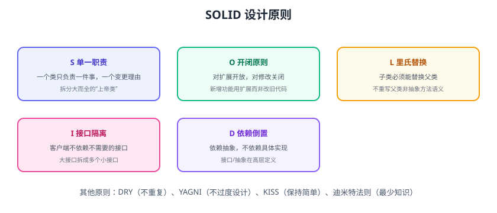

# 设计原则

设计原则是设计模式之上的“宪法”：模式是解决特定问题的具体方案，原则是判断方案好坏的标准。掌握原则比背模式更重要——原则对了，即使不套用任何模式，代码也不会太差。



## SOLID 五大原则

| 原则 | 英文 | 一句话理解 |
| --- | --- | --- |
| S 单一职责 | Single Responsibility | 一个类只负责一件事，只有一个变更理由 |
| O 开闭原则 | Open/Closed | 对扩展开放、对修改关闭 |
| L 里氏替换 | Liskov Substitution | 子类必须能替换父类且行为正确 |
| I 接口隔离 | Interface Segregation | 客户端不依赖用不到的接口 |
| D 依赖倒置 | Dependency Inversion | 依赖抽象，不依赖具体实现 |

## S 单一职责

```java
// 坏味道：一个类既管订单数据又管邮件又管日志
class OrderService {
    void createOrder() { /* 校验 */ }
    void saveToDb() { /* 数据访问 */ }
    void sendEmail() { /* 邮件 */ }
}

// 好：拆分为职责单一的类
class OrderService {
    private final OrderRepository repo;
    private final OrderNotifier notifier;
    void createOrder(Order order) {
        repo.save(order);
        notifier.notifyCreated(order);
    }
}
```

判断标准：**能说清“这个类的变更理由”吗？** 多个变更理由 = 多个职责。

## O 开闭原则

```java
// 坏味道：新增支付方式要改 switch
double pay(PaymentType type) {
    switch (type) {
        case ALIPAY: return alipay();
        case WECHAT: return wechat();
        default: throw new UnsupportedOperationException();
    }
}

// 好：策略 + 扩展新实现即可
interface PaymentStrategy {
    boolean support(PaymentType type);
    void pay(Order order);
}
```

新增微信支付时，只需新增一个 `WeChatPayStrategy` 实现，**不修改**已有代码。

## L 里氏替换

```java
class Rectangle {
    void setWidth(int w) { this.width = w; }
    void setHeight(int h) { this.height = h; }
}
class Square extends Rectangle {   // 违反 LSP：正方形重写后破坏矩形语义
    @Override void setWidth(int w) { width = height = w; }
}
```

正方形“是”矩形，但行为不兼容：用 `Rectangle` 变量的代码在 Square 上行为错误。**继承要保证行为语义一致**，否则用组合。

## I 接口隔离

```java
// 坏味道：大而全的接口
interface Worker {
    void work();
    void eat();
    void sleep();
}

// 好：按角色拆小接口
interface Workable { void work(); }
interface Eatable { void eat(); }
```

## D 依赖倒置

```java
// 坏味道：高层依赖具体实现，换实现要改代码
class OrderService {
    private final MySqlOrderRepo repo = new MySqlOrderRepo();
}

// 好：依赖抽象接口
interface OrderRepository { Order findById(Long id); }
class OrderService {
    private final OrderRepository repo;   // 由外部注入
    OrderService(OrderRepository repo) { this.repo = repo; }
}
```

这正是 **依赖注入（DI）** 的理论基础。

## 其他重要原则

| 原则 | 含义 | 反面 |
| --- | --- | --- |
| DRY | 不重复自己（Don't Repeat Yourself） | 复制粘贴代码 |
| YAGNI | 你不需要它（You Aren't Gonna Need It） | 过度设计 |
| KISS | 保持简单（Keep It Simple） | 炫技复杂化 |
| 迪米特法则 | 最少知识：只和朋友说话 | 方法里到处调用深层对象 |
| 组合优于继承 | 用组合扩展，少用继承 | 多层继承树 |

## 原则 vs 模式

```text
原则：为什么这样设计（道）
模式：怎么实现这个设计（术）
反模式：不该怎么做（如 God Class、Singleton 滥用）
```

::: tip 学习路径
先理解 SOLID → 再学模式时问“这个模式满足哪条原则” → 写代码时用原则自检，模式自然浮现。
:::

## 易错点与最佳实践

::: danger 常见错误
1. **为原则而原则**：过度拆分导致类爆炸，代码比原来更难懂。
2. **开闭原则被误解**：不是“不改任何代码”，而是“不改已有稳定逻辑”；需求变化时正常修改。
3. **里氏替换被忽略**：继承一个类却不兼容其行为，到处出 bug。
4. **依赖倒置做成接口泛滥**：每个类都抽接口，没有收益；为真正的变化点抽接口。
5. **YAGNI 与设计平衡**：不为“可能的需求”预埋抽象，但为“已知变化点”留扩展。
:::

::: tip 最佳实践
1. 用原则评审代码：变更理由、扩展方式、依赖方向。
2. 原则之间冲突时（如 DRY 与 YAGNI），以当前需求为准。
3. 重构时先有测试，再应用原则。
4. 团队 Code Review 时用原则提问，而不是直接给结论。
:::

## 验证方式

1. 找一段业务代码，用 SOLID 逐条自检，列出违反项。
2. 对“新增一个类型就要改 switch”的场景，用策略模式重构并验证行为不变。
3. 检查项目里是否存在继承但行为不兼容的类（LSP 违规）。

## 参考资料

- SOLID 原则（Robert C. Martin）：https://blog.cleancoder.com/uncle-bob/2020/10/18/Solid-Relevance.html
- 重构与模式（Martin Fowler）
- 《设计模式：可复用面向对象软件的基础》（GoF，书籍）
