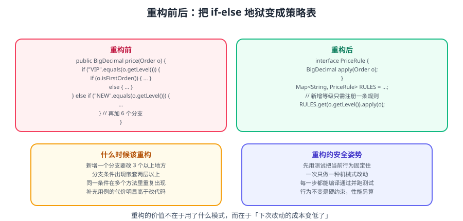

# 重构实战：安全地改代码

上一页 [实战案例](Practice/index.md) 讲的是「用模式重构一个下单接口」；本篇讲的是**更底层的问题：怎么改才不出事**。重构不是重写，它必须在**随时可运行、可回滚**的前提下小步推进。



::: tip 一句话理解
重构 = **在不改变外部行为的前提下，改善内部结构**。
关键词是「不改变外部行为」——所以**没测试不要重构**，先补测试网。
:::

## 一、重构前必须有的安全网

重构失败最常见的原因不是「技术不行」，而是**改错了却不知道**。安全网三层：

| 层级 | 手段 | 覆盖 |
| --- | --- | --- |
| **单元测试** | 为待重构方法/类补测试 | 逻辑正确性 |
| **集成测试 / 接口测试** | 针对对外 API 的行为断言 | 契约不变 |
| **版本控制 + 小步提交** | 每步一个 commit | 可随时回滚 |

::: danger 没测试就重构 = 赌博
**如果这块代码没有测试，第一件事是补测试，不是改代码。**
补充测试的方法（针对遗留代码）：
1. 找「接缝」（Seam）：能被替换依赖的地方（构造注入、静态包装）。
2. 用**特征测试（Characterization Test）**：先跑一遍，把**当前输出**（哪怕看起来是 bug）固化成断言。
3. 有了基线，再改代码，测试会告诉你行为是否变了。
:::

### 1.1 特征测试怎么写

```java
// 遗留代码：逻辑复杂、无人敢动
public class LegacyPriceCalculator {
    public BigDecimal calc(Order o) { /* 200 行嵌套 if */ }
}

// 特征测试：先记录"当前行为"，不做价值判断
@Test
void characterization() {
    LegacyPriceCalculator c = new LegacyPriceCalculator();

    // 用几个有代表性的输入，把当前输出写成断言
    assertEquals(new BigDecimal("95.00"), c.calc(order(100, "VIP", "CN")));
    assertEquals(new BigDecimal("110.00"), c.calc(order(100, "NORMAL", "US")));
    // 哪怕你觉得 110 是 bug，也先照着写——它记录了"现状"
}
```

::: tip 特征测试的铁律
**以实际运行结果为准，不要以「应该是什么」为准。**
目的是建立「行为基线」，后续重构只要测试仍通过，就说明行为没变。
:::

## 二、重构的黄金四步

```text
① 固定输入输出（补测试，跑通基线）
② 小步改造（一步一个动作，每步跑测试）
③ 每步提交（一个动作一个 commit，可单独回滚）
④ 最后清理（删除死代码、统一命名、更新文档）
```

### 2.1 常见重构动作清单

每个动作都**只做一件事**，做完立刻跑测试：

| 动作 | 说明 | 风险 |
| --- | --- | --- |
| 重命名 | 变量/方法/类改名 | 低（IDE 自动化） |
| 提炼方法 | 长方法拆短 | 低 |
| 内联 | 去掉多余中间变量/方法 | 低 |
| 搬移方法 | 把方法移到正确的类 | 中 |
| 提炼类 | 从大类拆出小类 | 中 |
| 引入参数对象 | 多参数合并成对象 | 中 |
| 以多态替换条件 | switch/if 改多态 | 高 |
| 拆分阶段 | 长流程拆成多个步骤 | 高 |

::: warning 高风险动作必须单独提交
「以多态替换条件」「拆分阶段」这类改动**一定要单独一个 commit**，
不要和「重命名」混在一起——否则出问题时无法判断是哪个动作导致的。
:::

## 三、案例：把一个 200 行方法拆开

### 3.1 改造前

```java
public BigDecimal processOrder(Order order) {
    // ① 校验参数（30 行）
    // ② 计算折扣（60 行，5 层 if-else）
    // ③ 计算税费（40 行，按地区分支）
    // ④ 计算运费（40 行，按重量与地区）
    // ⑤ 汇总 + 写日志（30 行）
}
```

### 3.2 第一步：提炼方法（不改逻辑）

```java
public BigDecimal processOrder(Order order) {
    validate(order);
    BigDecimal discounted = applyDiscount(order);
    BigDecimal taxed      = applyTax(discounted, order.region());
    BigDecimal shipping   = calcShipping(order);
    BigDecimal total      = taxed.add(shipping);
    log.info("订单 {} 总价 {}", order.id(), total);
    return total;
}

// 5 个私有方法，逻辑原样搬移，一行不改
private void validate(Order order) { /* 原 ① 的逻辑 */ }
private BigDecimal applyDiscount(Order order) { /* 原 ② 的逻辑 */ }
private BigDecimal applyTax(BigDecimal amount, String region) { /* 原 ③ 的逻辑 */ }
private BigDecimal calcShipping(Order order) { /* 原 ④ 的逻辑 */ }
```

**验证**：跑特征测试，**必须全绿**。如果变红，说明搬移时改了逻辑——回滚重来。

### 3.3 第二步：消除条件分支（高风险，单独提交）

```java
// 改造前：5 层 if-else
private BigDecimal applyDiscount(Order order) {
    if ("VIP".equals(order.userType())) return base.multiply(new BigDecimal("0.8"));
    if ("GOLD".equals(order.userType())) return base.multiply(new BigDecimal("0.9"));
    // ...
}

// 改造后：枚举策略（现代 Java 写法）
public enum UserType {
    VIP(p -> p.multiply(new BigDecimal("0.8"))),
    GOLD(p -> p.multiply(new BigDecimal("0.9"))),
    NORMAL(p -> p);

    private final UnaryOperator<BigDecimal> rule;
    UserType(UnaryOperator<BigDecimal> rule) { this.rule = rule; }
    public BigDecimal apply(BigDecimal price) { return rule.apply(price); }
}

private BigDecimal applyDiscount(Order order) {
    return UserType.valueOf(order.userType()).apply(order.baseAmount());
}
```

**验证**：特征测试仍全绿 + 新增枚举的单元测试。

::: danger 消除条件分支时的三个坑
1. **`valueOf` 遇到未知类型抛 `IllegalArgumentException`** → 需处理默认分支（用 `Optional` 或自定义 `fromCode`）。
2. **大小写/空格不一致** → 先统一归一化（`trim().toUpperCase()`）。
3. **原逻辑有「顺序依赖」**（前面的条件命中就不看后面）→ 枚举是「精确匹配」，语义不同，需逐条核对。
:::

### 3.4 第三步：清理

```java
// 删除已无引用的旧方法、常量、导入
// 用 IDE 的"优化导入"与"查找未使用"功能
```

::: tip 死代码用版本控制保留
删掉代码不丢历史——`git log -S"方法名"` 随时能找回来。
**注释掉的代码要删掉**（它没有上下文、没有编译检查、会腐化）。
:::

## 四、重构手法对照表

把常见「坏味道 → 手法」整理成一张可查表：

| 坏味道 | 重构手法 | 风险 |
| --- | --- | --- |
| 长方法 | 提炼方法、拆分阶段 | 低 |
| 大类 | 提炼类、提炼超类 | 中 |
| 重复代码 | 提炼方法、模板方法 | 低 |
| 长参数列表 | 引入参数对象、Builder | 中 |
| 发散式变化 | 拆分职责（按变化原因） | 中 |
| 霰弹式修改 | 合并职责（搬移方法） | 中 |
| 依恋情结 | 搬移方法到数据所在类 | 低 |
| 数据泥团 | 抽成长对象 | 低 |
| 条件表达式 | 多态 / 枚举 / 模式匹配 | 高 |
| 继承滥用 | 以组合替换继承 | 高 |
| 临时字段 | 提炼类 / 引入空对象 | 中 |
| 消息链 | 隐藏委托 | 低 |

## 五、重构的执行节奏

### 5.1 不要开「重构专项分支」

**反模式**：停下手上的功能，花两周「大重构」，最后合并冲突到崩溃。

**正确做法**：**穿插式重构（Preparatory Refactoring）**——

```text
做需求时，发现某处结构阻碍本需求
  → 先花 20 分钟做一小步重构（让需求变容易）
  → 小步提交
  → 继续做需求
```

::: tip 「让改动变容易，再改动」
Martin Fowler 的说法：**先重构，让下一个功能更容易加。**
这样重构永远有明确目标，不会变成漫无目的的「美化」。
:::

### 5.2 提交信息要写清「只重构」

```bash
git commit -m "refactor(order): 提炼 processOrder 中的税费计算，不改行为"
git commit -m "refactor(order): 用 UserType 枚举替换折扣的 if-else"
git commit -m "feat(order): 支持企业客户折扣"
```

前两个 commit **不含功能变更**，review 时可以快速确认「逻辑等价」，第三个才是有行为的改动。

::: warning 一个 commit 不要混「重构 + 功能」
混在一起会**让 review 无法判断哪些是等价变换、哪些是新逻辑**，
出问题时也无法只回滚功能而保留重构。
:::

## 六、验证与验收

### 6.1 每次提交前的检查清单

```text
□ 测试全绿（单元 + 集成）
□ 编译无警告（尤其是未使用的导入与变量）
□ 没有注释掉的代码残留
□ 没有遗留 TODO（若必须有，写清原因与期限）
□ 对外接口签名未变（或已同步更新调用方与文档）
□ 提交信息说明了「改了什么、为什么」
```

### 6.2 用工具自动检查

```bash
# 编译 + 测试（Maven 示例）
mvn -q clean verify

# 只看某个测试类，快速反馈
mvn -q test -Dtest=OrderServiceTest

# 静态检查（示例：编译告警 + Checkstyle）
mvn -q checkstyle:check
```

::: info 重构的完成标准
**不是「代码变漂亮了」，而是**：
1. 下一个需求改起来更快了；
2. 新增一个变体不需要改多处；
3. 测试覆盖了关键路径。
**没有这三点，重构只是审美活动。**
:::

## 七、易错点总结

::: danger 重构七个高频坑
1. **没有测试就动手** → 改了不知对错，只能靠人肉回归。
2. **一步做太多** → 出问题无法定位，回滚代价大。**一步一个动作**。
3. **重构与改功能混合提交** → review 与回滚都变困难。
4. **追求「完美设计」** → 无限重构，需求永远做不完。**重构要有明确终点（让当前需求变容易）**。
5. **用注释保留旧代码** → 死代码腐化。用 git 保留历史。
6. **忽略并发与事务语义** → 搬移方法时改变了锁范围或事务边界，功能悄悄出错。
7. **只在本地 IDE 重构，不跑测试** → IDE 的重命名/搬移并非完全可靠（反射、字符串引用、配置文件），**必须跑测试 + 全局搜索**。
:::

::: tip 一条经验
**能安全回滚的重构，就是好重构。**
每次提交前问自己：如果这次改动上线出问题，我能在 5 分钟内回滚吗？
:::

## 相关专题

- 模式化的重构案例：[实战案例](Practice/index.md)
- 坏味道与过度设计：[反模式与过度设计](AntiPatterns/index.md)
- 现代 Java 写法：[现代 Java 与设计模式](ModernJava/index.md)
- 设计原则（重构的judgment依据）：[设计原则](Principles/index.md)

## 参考资料

- Martin Fowler《重构》第 2 版（重构目录）：https://refactoring.com/catalog/
- Refactoring.Guru 重构手法：https://refactoring.guru/refactoring/techniques
- Michael Feathers《修改代码的艺术》（遗留代码与接缝）
- 本专题其余章节：[设计模式目录](../index.md)
