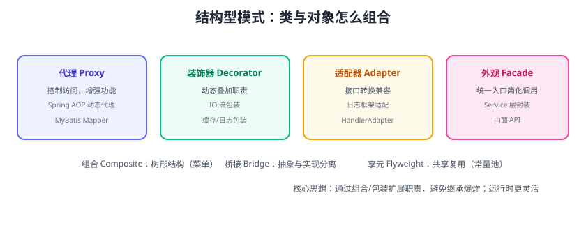

# 结构型模式

结构型模式关注**类与对象的组合方式**：用继承或组合把类组织成更大的结构，同时保持结构灵活。共 7 种：**适配器、装饰器、代理、外观、组合、桥接、享元**。本页重点讲开发中最常用的四种。



## 代理模式（Proxy）

为对象提供代理以控制访问、增加功能，客户端无感知。

```java
interface UserService {
    User findById(Long id);
}

// 真实对象
class UserServiceImpl implements UserService {
    public User findById(Long id) { return queryDb(id); }
}

// 代理：加缓存
class CachedUserProxy implements UserService {
    private final UserService target = new UserServiceImpl();
    private final Map<Long, User> cache = new ConcurrentHashMap<>();

    public User findById(Long id) {
        return cache.computeIfAbsent(id, target::findById);
    }
}
```

::: tip 应用
- Spring AOP 动态代理（JDK 动态代理 / CGLIB）。
- MyBatis Mapper 接口代理。
- 远程代理（RPC）、虚拟代理（懒加载）。
:::

## 装饰器模式（Decorator）

动态地给对象**叠加职责**，比继承更灵活。

```java
interface Notifier {
    void send(String msg);
}

class BaseNotifier implements Notifier {
    public void send(String msg) { sendSms(msg); }
}

class LogNotifier implements Notifier {          // 包装增强
    private final Notifier wrapped;
    LogNotifier(Notifier wrapped) { this.wrapped = wrapped; }
    public void send(String msg) {
        log("发送通知: " + msg);
        wrapped.send(msg);
    }
}

Notifier n = new LogNotifier(new BaseNotifier());  // 任意叠加
```

::: tip 应用
Java IO 流（`BufferedInputStream` 包装 `FileInputStream`）、缓存/日志/重试包装器。
:::

## 适配器模式（Adapter）

把不兼容的接口转换成客户端期望的接口。

```java
// 目标接口：统一的发送渠道
interface MessageSender { void send(String to, String text); }

// 第三方短信 SDK（不兼容）
class SmsSdk {
    void sendSms(String phone, String content) { ... }
}

// 适配器：把 SmsSdk 适配成 MessageSender
class SmsAdapter implements MessageSender {
    private final SmsSdk sdk = new SmsSdk();
    public void send(String to, String text) { sdk.sendSms(to, text); }
}
```

::: tip 应用
日志门面（slf4j 适配 logback/log4j）、Spring MVC 的 `HandlerAdapter`、第三方支付 SDK 适配。
:::

## 外观模式（Facade）

为复杂子系统提供**统一入口**，客户端只依赖一个门面。

```java
// 下单要调多个子系统
class OrderFacade {
    private final InventoryService inventory;
    private final PaymentService payment;
    private final NotifyService notify;

    public void placeOrder(Order order) {
        inventory.deduct(order);
        payment.pay(order);
        notify.send(order);
    }
}
```

::: tip 应用
Service 层封装多个 DAO/外部依赖、开放平台的统一 API 网关。
:::

## 其他结构型模式

| 模式 | 用途 | 例子 |
| --- | --- | --- |
| 组合 Composite | 树形结构统一处理 | 菜单树、文件目录 |
| 桥接 Bridge | 抽象与实现分离 | 图形 + 颜色两个维度 |
| 享元 Flyweight | 共享细粒度对象 | 字符串常量池、连接池 |

## 模式对比

| 对比 | 代理 | 装饰器 | 适配器 |
| --- | --- | --- | --- |
| 目的 | 控制访问/增强 | 动态叠加职责 | 接口转换 |
| 是否改变接口 | 否（同接口） | 否（同接口） | 是（转换） |
| 典型场景 | AOP、RPC | IO 流、包装器 | 第三方 SDK |

## 易错点与最佳实践

::: danger 常见错误
1. **代理与装饰器混淆**：代理控制访问（可能不转发），装饰器一定转发并增强。
2. **适配器塞业务逻辑**：适配器只做接口转换，不放业务规则。
3. **外观变成“上帝门面”**：一个门面把所有子系统都暴露，退化为中心化。
4. **组合模式滥用**：只有树形结构才用 Composite。
5. **装饰器链路太深**：包装层级过多，调试困难；控制在合理层数。
:::

::: tip 最佳实践
1. 需要给现有对象加横切能力（缓存/日志/鉴权）→ 代理或装饰器。
2. 接第三方不兼容接口 → 适配器，隔离 SDK 变化。
3. 复杂子系统对外只暴露简单接口 → 外观。
4. 优先组合（装饰器/代理）而不是多层继承。
:::

## 验证方式

1. 用装饰器实现“日志 + 重试”包装器，验证职责叠加且不改变原接口。
2. 用适配器接入一个模拟第三方 SDK，验证客户端只依赖统一接口。
3. 用动态代理（JDK Proxy）给接口加耗时统计，验证代理拦截生效。

## 参考资料

- GoF 结构型模式：https://refactoring.guru/design-patterns/structural-patterns
- JDK 动态代理：https://docs.oracle.com/javase/8/docs/technotes/guides/reflection/proxy.html
- Spring AOP 代理：https://docs.spring.io/spring-framework/reference/core/aop.html
