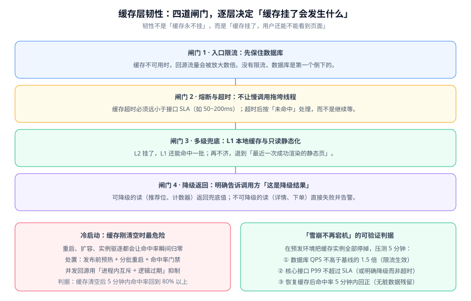

# 缓存层韧性

缓存是「让系统更快」的组件，但它的另一个身份是**新的故障源**。这一页回答一个问题：**缓存整体不可用时，业务还能不能活，判据是什么**。

::: tip 一句话理解
韧性不是「缓存永不挂」，而是「**缓存挂了，用户还能看到页面**」。把这句话翻译成可验证的判据，就是本页的全部内容。
:::

## 缓存不可用时的四种死法

缓存故障之所以危险，是因为**它的故障会放大成数据库的故障**：

| 死法 | 触发条件 | 放大机制 | 症状 |
| --- | --- | --- | --- |
| 穿透 | 大量请求查询不存在的 key | 每次请求都打到数据库 | 数据库 QPS 骤升，缓存命中率反而「看起来很干净」 |
| 击穿 | 单个热点 key 过期 | 并发请求同时重建同一个 key | 数据库出现瞬时连接数尖峰 |
| 雪崩 | 大批 key 同时过期，或缓存实例整体不可用 | 全部流量同时回源 | 数据库被打满，接口全面超时 |
| 冷启动 | 重启、扩容、实例驱逐 | 命中率归零，持续回源 | 新实例上线后一段时间内整体变慢 |

::: warning 说明
穿透、击穿、雪崩的**成因与单点防护手段**（空值缓存、布隆过滤器、互斥锁、逻辑过期、TTL 抖动）已在 [Redis 进阶：缓存防护](../../../DB/NoRelational/Redis/Advanced/CacheProtection/index.md) 讲透，本页不重复，只讲**分布式场景下的兜底与降级**。
:::

## 四道闸门



### 闸门一：入口限流 —— 先保住数据库

缓存不可用时，回源流量会被放大数倍。**第一道动作不是「修缓存」，而是「限制进入系统的请求量」**。

```yaml
# 以网关限流为例（配置写在你的网关里，不是本仓文件）
# 关键点：限流阈值必须按「数据库能承受的量」倒推，而不是按「平时流量」设
spec:
  rateLimit:
    - name: article-detail
      match: "/api/v1/articles/**"
      # 数据库实测能承受 2000 QPS，缓存挂掉时全部回源，
      # 所以这里必须把入口压到 2000 以下，让超出部分排队或降级
      limit: 1500
      window: 1s
      # 超限时返回降级内容而非直接 5xx，避免用户看到错误页
      fallback: degraded-response
```

::: danger 限流阈值的两个常见错误
1. **阈值按平时流量设**。平时 500 QPS，就把限流设成 1000——但缓存挂掉时流量可能冲到 5000，限流形同虚设。**阈值必须从「数据库能承受多少」反向推导**，而不是从「现在有多少」正推。
2. **限流后返回 5xx**。这会让用户看到错误页，并且触发上游重试（进一步放大流量）。正确做法是返回**降级内容**（如缓存的历史快照、精简版页面）。
:::

### 闸门二：熔断与超时 —— 不让慢调用拖垮线程

缓存一旦变慢（而不是直接报错），危害比完全不可用更大：**每个请求都在等待，线程池被慢慢吃满**。

要点：

1. **缓存超时必须远小于接口 SLA**。接口承诺 200ms，缓存超时设 1 秒毫无意义——等到超时时，这个请求早就该失败了。经验值是接口 SLA 的 1/4 到 1/2（例如 50~100ms）。
2. **超时后按「未命中」处理，而不是继续等**。也就是「降级为直连数据库」，而不是「重试缓存」。
3. **熔断要有明确的恢复条件**。连续失败 N 次后打开熔断，半开状态放少量请求探活，成功率达到阈值后闭合。

### 闸门三：多级兜底 —— L1 与只读快照

L2 挂了，L1 还能命中一批；L1 也没有时，可以退到「最近一次成功渲染的静态快照」。

快照兜底的做法：把渲染结果定期写一份到本地文件或对象存储，主链路失败时直接返回。**它的价值在于「有东西可返回」，而不在于内容多新**——用户看到 5 分钟前的首页，远好过看到错误页。

### 闸门四：降级返回 —— 明确标记这是降级结果

降级的核心纪律是**可区分**：

| 内容类型 | 可降级？ | 降级返回什么 |
| --- | --- | --- |
| 首页推荐位 | 可以 | 上一次成功的快照，或「实时推荐暂不可用」的占位 |
| 文章详情 | **不可降级**（必须准确） | 直接失败并告警，不返回可能过期的内容 |
| 阅读计数、点赞数 | 可以 | 保留缓存中的近似值，或直接隐藏该数字 |
| 库存、余额 | **不可降级** | 直连数据库，不使用任何缓存值 |
| 分类树、站点配置 | 可以 | 返回内置的默认值 |

::: tip 判断可否降级的一句话
**问一句「这个数据错了会不会造成资金或权益损失」**。会——不可降级；不会——可以降级。这条判据比任何技术指标都好用。
:::

## 冷启动：最容易被忽略的故障

缓存刚清空时命中率为零，**所有请求同时回源**。触发条件有三种，而且都很日常：

1. **发布重启**：实例逐个重启，新实例的 L1 是空的；
2. **扩容**：新增实例的 L1 同样为空；
3. **缓存实例被驱逐或重启**：L2 整体丢失，全部实例一起回源。

三条处置措施：

1. **发布前预热**。把 Top N 的热 key 主动写入缓存；

```shell
# 预热脚本：从数据库或列表页导出热点 ID，再主动请求一次触发回填
# 完整脚本约 40 行，本节给出结构与关键片段
while read -r id; do
  # 用 curl 打一次读接口，让应用走完整的「查库 → 回填缓存」链路
  # 不要直接往 Redis 写值 —— 这样做会绕过应用的序列化逻辑，格式可能与线上不一致
  curl -s -o /dev/null "http://localhost:8080/api/v1/articles/${id}"
done < hot_ids.txt
echo "预热完成，共 $(wc -l < hot_ids.txt) 个 key"
```

::: danger 预热不要直接 `SET` 进 Redis
直接往 Redis 写值会绕过应用层的序列化与 key 规则，造成「预热后反而查不到」——因为应用读的 key 与预热的 key 不一致，或反序列化失败。
正确做法是**通过应用的读接口预热**，让应用自己走完整链路。
:::

2. **分批重启**。一次只重启一部分实例，保证其余实例仍在服务，避免全员同时冷启动。
3. **命中率门禁**。把「缓存清空后 N 分钟内命中率恢复到 X%」写成一条发布后的观察判据，而不是靠感觉。

## 「雪崩不再宕机」的可验证判据

韧性必须能证伪。下面这套实验在预发环境可完整执行（约 15 分钟）：

```shell
# 前置：预发环境，压测工具已就绪，数据库与缓存的监控面板已打开
# 实验步骤：
# 1) 打基线：缓存正常时压测 5 分钟，记录数据库 QPS 与接口 P99
# 2) 注入故障：停掉全部缓存实例（或把应用指向一个不可达的缓存地址）
# 3) 继续压测 5 分钟，观察三个指标
# 4) 恢复缓存，观察收敛时间

# 用 k6 固定并发跑（固定 arrival rate，避免闭模型掩盖问题）
k6 run --vus 200 --duration 5m load-test.js
```

三条判据，全部满足才算通过：

| 编号 | 判据 | 期望 | 不满足说明什么 |
| --- | --- | --- | --- |
| R1 | 数据库 QPS | 不高于基线的 **1.5 倍** | 限流没生效，或阈值设得过高 |
| R2 | 核心接口 P99 | 不超过 SLA，**或明确降级**（返回降级内容而非超时） | 超时/熔断配置缺失，线程池正在被耗尽 |
| R3 | 故障期间错误率 | 上升但**不出现 5xx 雪崩**（错误集中在可降级内容上） | 不可降级内容被错误地降级，或降级路径本身有问题 |

恢复后的观察项：**命中率应在 5 分钟内回到 80% 以上**，并且抽查数据没有残留脏值。若命中率长时间回不来，说明预热或并发重建抑制有问题。

## 发布后的观察窗口

韧性建设的最后一环是「怎么知道它是好的」。给出一个 15 分钟的观察窗口清单：

| 时间点 | 看什么 | 判据 |
| --- | --- | --- |
| T+0 | 应用启动日志 | 缓存客户端连接成功，无重连风暴 |
| T+1min | 缓存命中率 | 呈上升趋势，不是平的 |
| T+5min | 数据库 QPS | 较发布前下降或持平，不上升 |
| T+10min | 接口 P99 | 回到发布前水平 |
| T+15min | 脏数据抽查 | 抽查 10 条最近更新的数据，与数据库一致 |

## 验证方式

上面三条判据（R1~R3）可以在本地用一个简化版本先验证配置是否生效——**不需要真实压测工具，只需要观察限流是否拦截**：

```shell
# 前置：把缓存地址改成一个不可达的端口，模拟缓存完全不可用
# 期望：请求不应长时间挂起，而应在超时后走降级路径

# 连续打 20 次，记录每次的耗时与返回码
for i in $(seq 1 20); do
  curl -s -o /dev/null -w "第 %{http_code} 次, 耗时 %{time_total}s\n" \
    http://localhost:8080/api/v1/articles/1001
done
```

判读标准：

| 现象 | 结论 | 处置 |
| --- | --- | --- |
| 每次耗时 < 300ms 且返回 200 或明确的降级内容 | 超时与降级配置生效 | 可以进入压测阶段 |
| 前几次快、后面越来越慢 | 线程池正在被耗尽 | 检查超时配置是否缺失 |
| 每次耗时都接近 1 秒以上 | 用了默认超时（通常很长） | 显式设置缓存超时 |
| 直接返回 5xx | 降级路径未实现 | 补降级返回，避免用户看到错误页 |

## 参考资料

- Amazon Builders' Library · 超时、重试与退避：https://aws.amazon.com/builders-library/timeouts-retries-and-backoff-with-jitter/
- Microsoft Azure Architecture Center · Circuit Breaker 模式：https://learn.microsoft.com/azure/architecture/patterns/circuit-breaker
- Redis 官方文档 · 高可用（Sentinel / Cluster 故障转移）：https://redis.io/docs/latest/operate/oss_and_stack/management/sentinel/
- 微服务 · 熔断限流（手段详解）：../../Microservices/CircuitBreaker/index.md
