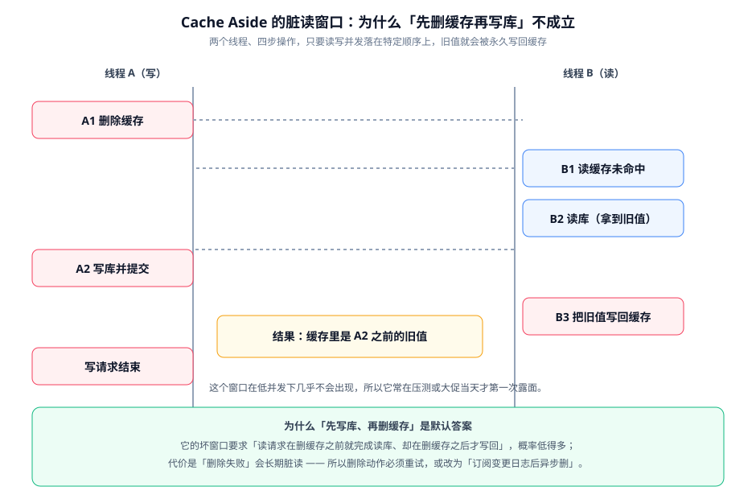

# 一致性方案深入

这一页回答最难的一个问题：**缓存与数据库之间必然有窗口，怎么把窗口压到业务可接受的范围**。结论先行——**没有「强一致」的缓存方案，只有「可证伪的收敛时间」**。你要做的不是消除窗口，而是把窗口长度和触发条件写清楚。

::: tip 一句话理解
缓存的本质是「数据库的一份副本」。副本与源之间的一致性靠两个东西维持：**变更时的失效动作**，以及**失效失败时的兜底 TTL**。前者决定正常情况下多快收敛，后者决定异常情况下最多脏多久。
:::

## 三个必须分清的概念

| 概念 | 含义 | 你能给出的承诺 |
| --- | --- | --- |
| 强一致 | 任何时刻读到的都是最新提交值 | **缓存做不到**。只要存在「写库」与「删缓存」两个动作，就有窗口 |
| 最终一致 | 一段时间后收敛到最新值 | 可以做到。必须写明「收敛时间的上界」（例如 ≤ 5 秒） |
| 单调读 | 同一个会话不会读到「旧 → 新 → 旧」 | 部分可以。需要版本号配合，见下文「读己之写」 |

::: warning 说明
业务方问「缓存的强一致怎么做」，正确的回答不是给一个方案，而是**反问一句「你最多能接受多久的旧值」**。这个问题没有精确答案，就说明需求还没定；此时任何方案都是猜的。
:::

## Cache Aside 的竞态窗口

Cache Aside 是事实上的默认方案：**读时先查缓存、未命中查库并回填；写时先写库、再删缓存**。

它的经典问题在于读写并发时的顺序。下面这张图展示了「先删缓存再写库」为什么不可靠：



### 为什么不是「更新缓存」而是「删除缓存」

一个常见疑问：为什么写完库不直接把新值写进缓存，而是删除？两个原因：

1. **并发写会互相覆盖**。两个写请求分别写库得到新值 v1、v2，如果都去更新缓存，最终缓存里可能是 v1（旧的），而库里是 v2。
2. **更新缓存可能是一次无用功**。刚更新完就被读请求覆盖、或者该 key 此后无人访问，写入成本白花。删除是惰性的，只有在真正被读时才重建。

结论：**默认删除，不要更新**。只有在「更新后必然被高频读取」且「能保证顺序」时（例如用版本号做 CAS），才考虑直接更新。

## 从弱到强的四档方案

### 第一档：先写库、再删缓存

最常见也最便宜。它的坏窗口要求「读请求在删缓存之前完成读库、却在删缓存之后写回缓存」，概率低但非零。

要点：

1. **删除必须重试**。删除失败（网络抖动、超时）会让旧值**长期**存在，直到 TTL 到期。至少要「失败后重试 + 记录」，不能只打一行日志。
2. **必须配 TTL**。TTL 是这一档唯一的一致性上界来源。
3. **写库与删缓存不能放在同一个本地事务里**。缓存删除是外部操作，放进事务会导致「事务回滚但缓存已删」或「事务提交但缓存没删」两种不确定状态。

### 第二档：延迟双删

在「写库」前后各删一次缓存，第二次延迟一段时间（例如 500ms~1s）后再删，用来清掉「在第一次删除之后、由并发读请求写回的旧值」。

```java
// 完整实现约 40 行，本节给出结构与关键片段
public void updateArticle(Long id, ArticleForm form) {
    // 第一次删除：让后续读请求尽量不去读旧的 L2 值
    cache.delete(key(id));

    // 事务内写库
    transactionTemplate.executeWithoutResult(status -> articleRepository.update(id, form));

    // 第二次删除必须延迟，且绝不能同步阻塞在请求线程里
    // 若同步睡 500ms，接口 P99 会直接抬高 500ms —— 这是延迟双删最常见的错误用法
    scheduler.schedule(() -> {
        try {
            cache.delete(key(id));
            // 延迟双删同样需要处理 L1：删完 L2 再发一次广播
            invalidator.broadcast(key(id));
        } catch (Exception e) {
            // 失败要留痕，否则这条链路会静默失效
            log.warn("延迟双删失败，等待 TTL 兜底, key={}", key(id), e);
        }
    }, 500, TimeUnit.MILLISECONDS);
}
```

::: danger 延迟双删的三个坑
1. **同步 `Thread.sleep`**。它会把延迟时间直接加到接口耗时上。「延迟」指的是**删除动作延迟执行**，不是让请求线程等待。
2. **延迟时间拍脑袋定**。这个值应当 ≥「读请求查库 + 回填缓存」的最长耗时。定小了等于没做，定大了只是延长不一致窗口。可靠做法是先用 `写请求占比 / 读请求 TP99` 估算，再用压测复核。
3. **只删了 L2 忘了 L1**。多级缓存下，第二次删除同样要广播，否则 L1 里的旧值继续存活。
:::

### 第三档：订阅变更日志（推荐）

前两档的根因都是「应用要同时负责写库和失效，而这两件事无法原子提交」。第三档的思路是**解耦**：应用只负责写库，缓存失效由「订阅数据库变更日志」的独立消费者完成。

```text
应用            数据库         变更日志(CDC)      失效消费者           缓存
 │                │                │                │                │
 ├─ 写库 ────────>│                │                │                │
 │                ├─ 产生变更 ────>│                │                │
 │<─ 提交成功 ─────┤                ├─ 投递事件 ────>│                │
 │                │                │                ├─ 删 L2 ───────>│
 │                │                │                ├─ 广播失效 ─────>│ (各实例删 L1)
```

- **优点**：失效不再依赖应用代码正确；即使某次发布漏写了失效逻辑，变更日志依然会产出事件；事件是「已提交的事实」，不存在「事务回滚但已删除」的问题。
- **代价**：引入一条新的异步链路，需要观测它的**消费延迟**（这是第三档的核心指标）。消费延迟 30 秒，就意味着收敛时间上界是 30 秒 + TTL。
- **判据**：如果你的项目已经有 CDC 链路（见 [数据同步与 CDC](../../../DB/CDC/index.md)），这档几乎是免费的；没有的话，要看「一致性需求是否值一条新链路」。

::: warning 第三档不代表可以省掉 TTL
变更日志链路本身会积压、会失败、会被运维误停。**TTL 依然是最后一道保险**。把 TTL 设成「业务能接受的最大脏读时间」，这样即使整条链路挂掉，最坏情况也是可预期的。
:::

### 第四档：版本号与 CAS

在缓存值里存一个单调递增的版本号，写回时校验版本——只有「当前版本」比缓存里的版本新时才允许覆盖。

```java
// 仅在「必须保证不会写入过期值」的场景使用
// 完整实现约 50 行，本节给出结构与关键片段
public void writeBack(String key, Article value, long version) {
    // Lua 脚本保证「比较 + 写入」是原子的，避免 GET 之后 SET 之间的竞态
    String lua = """
            local cur = redis.call('HGET', KEYS[1], 'version')
            if cur and tonumber(cur) >= tonumber(ARGV[1]) then
                return 0
            end
            redis.call('HSET', KEYS[1], 'version', ARGV[1])
            redis.call('HSET', KEYS[1], 'payload', ARGV[2])
            return 1
            """;
    Long result = redis.execute(new DefaultRedisScript<>(lua, Long.class),
            List.of(key), String.valueOf(version), serialize(value));
    if (result == null || result == 0L) {
        // 版本更旧，说明有人已经写了更新的值 —— 直接放弃这次写入
        log.debug("放弃过期写回, key={}, version={}", key, version);
    }
}
```

**这一档解决的是「旧值覆盖新值」**，但不解决「旧值被读到」。它能保证缓存不会被写旧，但读到的仍可能是写入前的值。**把它当成防倒退的保险，不要当成强一致的实现。**

## 四档方案对照

| 维度 | 一：先写后删 | 二：延迟双删 | 三：订阅日志 | 四：版本号 CAS |
| --- | --- | --- | --- | --- |
| 实现复杂度 | 最低 | 低 | 高（需新链路） | 中 |
| 收敛时间上界 | TTL | TTL（更短）+ 延迟窗口 | 消费延迟 + TTL | TTL |
| 依赖应用代码正确 | **强依赖** | 强依赖 | 弱依赖 | 强依赖 |
| 抗「漏写失效代码」 | 否 | 否 | **是** | 否 |
| 额外延迟 | 无 | 无（异步时） | 无 | 一次 Lua 脚本 |
| 适合场景 | 一般业务 | 读并发高的热点 | 已有 CDC 链路 | 有版本概念的业务 |

## 「读己之写」怎么保证

一个高频需求：**用户改完自己的资料，刷新页面必须看到新值**。缓存的最终一致天然不保证这一点。

务实的做法不是提高缓存一致性，而是**在读路径上区分「谁在看」**：

1. **写成功后在客户端记一个标记**（例如 cookie 或本地存储里记录「我在 T-1 秒改过资料」）；
2. **带标记的请求走强一致读**——直接读库，或读库后回填缓存；
3. 标记过期（例如 10 秒）后回到普通读路径。

这样只对「刚改过的人」付出直连代价，对其他所有人保持缓存收益。**它比提升整个缓存的一致性便宜得多**，也是「读己之写」在缓存场景下最常用的落地形态。

## 验证方式

一致性方案不能靠「看代码觉得没问题」验证，必须构造并发。下面是一个可执行的最小验证脚本思路：

```shell
# 前置：写接口 PUT /api/v1/admin/articles/{id}，读接口 GET /api/v1/articles/{id}
# 目的：在持续写的同时高频读，检查是否出现「旧值持续存在」

# 1) 起一个持续写循环（每 200ms 更新一次标题，标题里带递增序号）
for i in $(seq 1 100); do
  curl -s -X PUT "http://localhost:8080/api/v1/admin/articles/1001" \
    -H 'Content-Type: application/json' -d "{\"title\":\"v$i\"}" > /dev/null
  sleep 0.2
done &
WRITER=$!

# 2) 同时高频读，把每次读到的序号记下来
: > /tmp/read_seq.txt
for j in $(seq 1 500); do
  curl -s http://localhost:8080/api/v1/articles/1001 \
    | grep -o '"title":"v[0-9]*"' | grep -o '[0-9]*' >> /tmp/read_seq.txt
done
wait $WRITER

# 3) 检查单调性：读到的序号不应「先增大后显著回退」（允许小幅回退，不允许回退到很久以前）
sort -n /tmp/read_seq.txt | uniq -c | tail -5
```

判读标准：

| 观察到的现象 | 说明 | 处置 |
| --- | --- | --- |
| 序号单调上升，小幅回退 ≤ 1 | 正常的并发窗口 | 可接受 |
| 出现回退到 10 秒前的值 | 失效链路失效，靠 TTL 兜底 | 检查广播与删除重试 |
| 反复出现大量重复旧值 | 有读请求持续把旧值写回 | 检查是否用了「更新缓存」而非「删除缓存」 |

## 参考资料

- Microsoft Azure Architecture Center · Cache-Aside（含一致性与竞争条件说明）：https://learn.microsoft.com/azure/architecture/patterns/cache-aside
- Amazon Builders' Library · Caching challenges and strategies：https://aws.amazon.com/builders-library/caching-challenges-and-strategies/
- Redis 官方文档 · Transactions 与 Lua 脚本（原子性边界）：https://redis.io/docs/latest/develop/interact/transactions/
- [数据同步与 CDC](../../../DB/CDC/index.md)（变更日志链路怎么搭）
