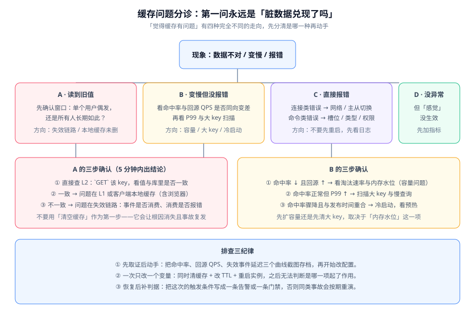

# 常见问题与最佳实践

这一页把前面各页的判断收拢成可检索的形态：**排障分诊、高频问题、上线自查、纪律清单**。

::: tip 一句话理解
「觉得缓存有问题」有四种完全不同的走向：读到旧值、变慢、报错、没异常但感觉没生效。**先分清是哪一种再动手**，是这一页最想传达的一句话。
:::

## 排障分诊表

第一问永远是「**脏数据兑现了吗**」——如果只是「变慢」，处置方向与「读到旧值」完全不同。

| 现象 | 第一步确认 | 常见根因 | 处置 |
| --- | --- | --- | --- |
| 单个用户偶发读到旧值 | 直接 `GET` 该 key，看与库是否一致 | 失效广播丢失，靠 TTL 兜底 | 检查广播链路；缩短 TTL |
| **所有用户**长期读到旧值 | 该 key 在 L2 里是不是旧值 | 失效动作根本没执行（漏写代码 / 消费者挂了） | 查变更日志消费延迟与错误数 |
| L2 是新值但页面仍是旧的 | 复现请求是否命中了 L1 | L1 未删（只删了 L2） | 让失效链路同时广播；或缩短 L1 TTL |
| 变慢但没报错，命中率下降 | 看 `evicted_keys` 增量 | 容量不足导致淘汰 | 扩容或调整淘汰策略，**不要先清缓存** |
| 变慢但命中率正常 | 扫描大 key 与 `SLOWLOG` | 大 key 或慢命令 | 拆分大 key；查是否有 `KEYS`/`SMEMBERS` 全量调用 |
| 变慢且与发布时间重合 | 对比发布时间与耗时曲线 | 冷启动，L1/L2 均为空 | 补预热、改分批重启 |
| 直接报连接类错误 | 看客户端重连日志 | 主从切换、网络抖动、连接数打满 | 不要先重启；先看切换日志与 `connected_clients` |
| 直接报命令类错误 | 看错误原文 | 槽位未分配、类型不匹配、权限不足 | 按错误原文定位，不要猜 |
| 没异常但「感觉没生效」 | 检查埋点是否存在 | 指标缺失或 `recordStats()` 未开 | 先补指标，再判断 |

::: danger 三条排查纪律
1. **先取证后动手**。把命中率、回源 QPS、失效事件延迟三条曲线截图存档，再开始改配置。事后无法复盘的原因通常是「改完之后原始现场没了」。
2. **一次只改一个变量**。同时清缓存 + 改 TTL + 重启实例，之后无法判断是哪一项起了作用。
3. **恢复后补判据**。把这次的触发条件写成一条告警或一条门禁，否则同类事故会按期重演。
:::

## 高频十二问

### 1. 缓存与数据库的一致性，到底能不能做到强一致？

不能。只要存在「写库」和「失效缓存」两个动作，就存在窗口。你能承诺的是「**收敛时间的上界**」，例如「最迟 5 秒」。业务方说不出能接受多久的旧值，就说明需求还没定。

### 2. 应该更新缓存还是删除缓存？

默认**删除**。更新缓存会遇到两个问题：并发写互相覆盖、以及写入可能是无用功（刚更新就被读请求覆盖）。只有在有版本号做 CAS 时才考虑直接更新。

### 3. 「先删缓存再写库」和「先写库再删缓存」差在哪里？

后者的坏窗口要求「读请求在删缓存前读完库、却在删缓存后写回」，概率低得多。前者在低并发下看似没问题，高并发时会稳定复现。**默认选后者。**

### 4. 延迟双删的延迟时间怎么定？

应 ≥「读请求查库 + 回填缓存」的最长耗时。定小了等于没做，定大了只是延长不一致窗口。可靠做法是先用 `写请求占比 / 读请求 TP99` 估算，再用压测复核。**绝不能同步 `Thread.sleep`**，那会把延迟直接加到接口耗时上。

### 5. 多级缓存的 L1 一定要做吗？

不一定。L1 用一致性换延迟。只有当「热点 key 的延迟确实是瓶颈」且「业务能容忍秒级旧值」时，它才划算。多数项目在 L2 一层就能达标。

### 6. L1 的失效为什么这么麻烦？

因为**删除动作无法在进程外部执行**。你只能通知它自己去删，而通知（Pub/Sub、消息队列）会丢。所以广播必须与 TTL 同时存在：广播决定正常情况下多快收敛，TTL 决定异常情况下最多脏多久。

### 7. 命中率多少算正常？

没有通用答案。**判据是「与自己的基线比」**：连续观测 7 天同一时段取 P95，低于该值的 90% 才告警。另外必须区分「Redis 命中率」与「应用侧命中率」——有 L1 时前者会偏低且属于正常。

### 8. 缓存挂了怎么办？

四道闸门依次生效：入口限流保住数据库 → 超时熔断避免线程耗尽 → 多级兜底（L1、静态快照）→ 降级返回并标记。判据是「缓存全停时，数据库 QPS 不超过基线 1.5 倍」。

### 9. 热 key 和大 key 是一回事吗？

不是。热 key 是流量问题（要分散），大 key 是结构问题（要拆分）。它们经常同时出现，但**处置手段不通用**——给大 key 加打散逻辑问题依旧。

### 10. key 打散之后，怎么保证失效删干净？

打散最容易犯的错就是「只删了一个副本」。两种正确做法：用 `scan` 前缀批量删全部副本，或者**用版本号寻址取代删除**（把版本编进 key，更新时只改一次「当前版本」指针）。后者把 O(N) 次删除降为 1 次写入，更稳。

### 11. 本地缓存的 `refreshAfterWrite` 和 `expireAfterWrite` 有什么区别？

`expireAfterWrite` 到点后**下一次读会阻塞重建**；`refreshAfterWrite` 到点后**先返回旧值、后台异步刷新**。延迟敏感的场景用后者。但要注意前者才能保证「到点必新」，后者存在「刷新期间仍返回旧值」的窗口。

### 12. 为什么我配了缓存，性能反而变差了？

三种常见原因：① 命中率太低（长尾访问），缓存只增加了序列化与网络开销；② 反序列化成本高于直查（例如缓存了一个需要复杂解析的大对象）；③ 失效链路引入了额外延迟（同步广播、同步双删）。正确做法是先做**耗时分解**，确认瓶颈真的在数据库再上缓存。

## 上线自查清单

上线前逐条确认，**每一条都应当是「已经做过并留下证据」，而不是「应该没问题」**：

1. 应用侧命中率指标已接入，且 `cache.hit` 带 `layer` 标签区分 L1/L2。
2. 回源 QPS 指标已接入——它是成本指标，也是判断缓存是否有效的关键。
3. `evicted_keys` 与内存水位已接入告警。
4. 每条缓存 key 都有明确 TTL，且已统计「无 TTL key」的比例为 0。
5. L1 设置了容量上限（`maximumSize` 或 `maximumWeight`），且开启了 `recordStats()`。
6. 失效链路已实测：**发一条失效消息，确认对方实例真的删掉了**。
7. 删除失败有重试与记录，不是只有一行日志。
8. 缓存客户端超时已显式设置，且远小于接口 SLA。
9. 降级路径已实测：把缓存指向不可达地址，接口**不挂起**、不返回 5xx 雪崩。
10. 不可降级的内容（金额、库存、权限）**没有**参与任何缓存降级。
11. 发布流程包含预热步骤，且预热通过**应用读接口**而不是直接 `SET`。
12. 大 key 扫描已执行，单个 value 不超过 10KB；`DEL` 大 key 已改为 `UNLINK` 或分批删。

## 最佳实践十二条

1. **先补观测，再动结构**。没有基线的优化无法证明有效。
2. **默认删除，不更新缓存**。除有版本号 CAS 的场景。
3. **先写库，再删缓存**；删除必须可重试。
4. **TTL 是一切方案的最后一道保险**，任何方案都不能省。
5. **L1 只放近乎不可变的内容**，或配合 3~10 秒的短 TTL。
6. **广播失效与短 TTL 同时存在**——广播丢了，TTL 兜底。
7. **热点优先用本地缓存兜住**，打散是次选（打散不降低总请求量）。
8. **打散后的失效必须覆盖全部副本**，或改用版本号寻址。
9. **大 key 用 `UNLINK` 删**，不要在生产直接用 `DEL`。
10. **降级结果必须与真值可区分**，否则排查时无法判断。
11. **限流阈值从「数据库能承受多少」反向推导**，不从当前流量正推。
12. **把这次事故的触发条件写成一条门禁**，否则它会按期重演。

## 术语表

| 术语 | 英文 | 含义 |
| --- | --- | --- |
| 缓存穿透 | Cache Penetration | 查询不存在的数据，缓存与数据库都没有，每次都回源 |
| 缓存击穿 | Cache Breakdown | 单个热点 key 过期的瞬间，并发请求同时重建 |
| 缓存雪崩 | Cache Avalanche | 大批 key 同时过期或缓存整体不可用，流量全量回源 |
| 冷启动 | Cold Start | 缓存刚清空（重启、扩容、驱逐）导致命中率归零 |
| 大 key | Big Key | 单个 value 过大（经验阈值 10KB）或集合元素过多（5000+） |
| 热 key | Hot Key | 单个 key 承载了远超平均的访问量 |
| 逻辑过期 | Logical Expiration | 缓存值不设物理 TTL，值内带过期时间戳，由应用判断是否过期 |
| 延迟双删 | Delayed Double Delete | 写库前后各删一次缓存，第二次延迟执行以清除并发写回的旧值 |
| 读己之写 | Read-Your-Writes | 同一用户写完后立即能读到自己写的结果 |
| 一致性哈希 | Consistent Hashing | 节点与 key 映射到环上以减少扩容时的迁移量 |
| 虚拟节点 | Virtual Node | 一个物理节点在哈希环上的多个映射，用于缓解数据倾斜 |
| 客户端缓存 | Client-Side Caching | 服务端记录客户端读过哪些 key，变更时主动推送失效通知 |
| 写放大 | Write Amplification | 一次数据变更引发的缓存操作次数（多级缓存下尤其明显） |

## 参考资料

- [总览：缓存的四条边界](../Overview/index.md)
- [拓扑与路由](../Topology/index.md)
- [多级缓存深入](../MultiLevel/index.md)
- [一致性方案深入](../Consistency/index.md)
- [热点与倾斜治理](../HotKey/index.md)
- [缓存层韧性](../Availability/index.md)
- [可观测与容量治理](../Observability/index.md)
- Microsoft Azure Architecture Center · Cache-Aside：https://learn.microsoft.com/azure/architecture/patterns/cache-aside
- Amazon Builders' Library · Caching challenges and strategies：https://aws.amazon.com/builders-library/caching-challenges-and-strategies/
