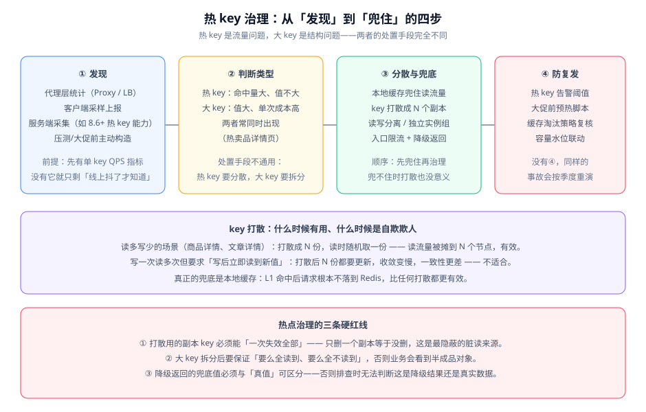

# 热点与倾斜治理

热 key 与数据倾斜是同一个现象的两面：**流量或数据集中到了少数节点上**。这一页讲三件事——怎么发现、怎么分散、怎么兜住。

::: tip 一句话理解
热 key 是**流量问题**（少数 key 承担了大部分请求），大 key 是**结构问题**（单个值太大导致单次操作成本高）。两者的处置手段不通用：热 key 要分散，大 key 要拆分。把它们混为一谈，就会出现「给大 key 加了打散逻辑，问题依旧」这种情况。
:::

## 热 key、大 key 与数据倾斜的区别

| 概念 | 判据 | 典型表现 | 处置方向 |
| --- | --- | --- | --- |
| 热 key | 单 key QPS 远超平均（如超过 1 万/秒） | 某个节点 CPU 飙高、其他节点空闲 | 打散、本地兜底、读写分离 |
| 大 key | 单 value 超过 10KB，或集合元素超过 5000 | 集群迁移卡顿、`DEL` 阻塞、网络拥塞 | 拆分结构、改用 hash 分片、异步删 |
| 数据倾斜 | 某节点内存或 QPS 超均值 1.5 倍 | 集群扩容后依然不均衡 | 修正哈希/虚拟节点、手动迁移槽位 |

三者经常同时出现。例如一个热卖商品的详情页：**key 是热的**（百万级 QPS）、**value 是大的**（含 SKU 列表与图片地址）、**并且集中在少数几个槽位上**（同一哈希段）。

## 第一步：怎么发现热 key

::: warning 说明
**没有「单 key QPS」这个指标，热 key 治理就无从谈起**。很多团队上线了很久才发现热点问题，根本原因是采集的指标里只有「集群整体 QPS」，看不出「某个 key 单独多热」。所以这一步常常不是「加个工具」，而是**先把指标补上**。
:::

四种探测手段，按改造量从低到高：

| 手段 | 怎么用 | 优点 | 局限 |
| --- | --- | --- | --- |
| 代理层统计 | 在 Redis Proxy / LB 上按 key 采样计数 | 对应用零侵入，能覆盖所有客户端 | 需要代理支持；只统计经过代理的流量 |
| 客户端采样上报 | 应用侧对 key 做哈希采样（如 1/1000），计数后上报 | 实现简单，可带业务标签 | 采样偏差；要控制上报本身的成本 |
| 服务端采集 | 使用 Redis 8.6+ 的热 key 相关能力或 `MONITOR` 类工具 | 数据最准 | 对服务端有额外开销；`MONITOR` 类工具**不能在生产长时间开启** |
| 主动构造 | 大促前按运营名单构造热点 key 列表 | 可提前准备 | 只能覆盖「已知」的热点，覆盖不了突发 |

::: danger 用 `MONITOR` 排查热 key 的三个注意点
1. **`MONITOR` 会把每条命令回传，吞吐越高它越慢**，并且本身会显著拖慢服务端。生产环境只能短时（秒级）使用，且必须在低峰期。
2. **它输出的内容包含 key 与可能的敏感值**，日志落地前要做脱敏，否则等于把业务数据抄进了日志系统。
3. **只看一秒的 `MONITOR` 输出无法判断热度**，需要按 key 聚合计数。正确做法是导出到临时文件后用 `awk` 聚合，而不是人眼翻阅。
:::

## 第二步：四种分散手段



### 本地缓存兜底（首选）

热点 key 的读流量被 L1 吸收后，**请求根本不落到 Redis**，这是性价比最高的一招。代价是一致性，见 [多级缓存深入](../MultiLevel/index.md)。

适用范围：读多写少、能容忍秒级旧值的热点（商品详情、文章详情、配置）。

### key 打散（副本）

把一个逻辑 key 变成 N 个物理 key：`hot:item:1001:0` 到 `hot:item:1001:3`。读时随机取一个，从而把读流量摊到 N 个节点上。

```java
// 完整实现约 30 行，本节给出结构与关键片段
public class ShardedHotKeyReader {

    private static final int COPIES = 8;
    private final StringRedisTemplate redis;
    private final ThreadLocalRandom random = ThreadLocalRandom.current();

    public String read(String logicKey) {
        // 关键点：副本序号必须参与 key 的哈希，否则 8 个副本可能落在同一个槽上
        // 这里用下标前缀而不是后缀，是为了让哈希分布更均匀
        int idx = random.nextInt(COPIES);
        String physicalKey = "shard:" + idx + ":" + logicKey;
        String value = redis.opsForValue().get(physicalKey);
        if (value == null) {
            // 副本未命中时回源，并写回「本次随机选中的那一个副本」
            value = loadFromDb(logicKey);
            redis.opsForValue().set(physicalKey, value, Duration.ofMinutes(10));
        }
        return value;
    }
}
```

::: danger 打散最常见的错误：失效只删了一个副本
打散后 key 变成了 N 个，**删除时必须删全部 N 个**。只删「随机那一个」的写法会让另外 N-1 个副本继续存活，读者看到旧值——而日志里删除动作显示成功。

正确写法是用 `scan` 前缀匹配后批量删，或者**用版本号寻址取代删除**：

```text
# 反例：只删一个副本，其余 N-1 个继续脏
DEL shard:3:item:1001

# 正解：把版本号编进 key，更新时只需改一次「当前版本」指针
shard:0..7:item:1001:v7   ← 更新后指针指向 v8，旧副本自然过期
```

后者把 O(N) 次删除降为 1 次写入，是打散场景下更稳的做法。
:::

### 读写分离 / 独立实例组

把热点数据放到独立的 Redis 实例组，与普通业务隔离。这样热点打满的只是那一组，不会波及全站。

- **优点**：隔离性好，故障爆炸半径小。
- **代价**：多一套运维对象；数据归属要划清楚，避免「热点数据里又混进普通数据」。

### 入口限流与降级

前三种都是「提高供给」，这一种是「限制需求」。当热点超出承载能力时，**主动限流并返回降级结果**，好过让整个缓存集群雪崩。

判据：降级返回的内容必须与真值**可区分**（例如带 `degraded: true` 字段或走不同的数据源标记），否则排查时无法判断这是降级结果还是真实数据。

## 第三步：大 key 的识别与拆分

大 key 的危害与热 key 不同：**它拖慢的是整个集群而不是单个 key**。一次 `DEL` 一个大 hash 会阻塞主线程；集群迁移一个大 key 会导致槽位迁移长时间卡住。

识别方式：

```shell
# 1) 找出最大的 key（生产慎用 --bytes：会遍历全部 key，在大实例上耗时很长）
redis-cli -h 10.0.0.11 -p 6379 --bigkeys

# 2) 只看指定前缀下的 key 大小（分批抽样，避免全量扫描）
redis-cli -h 10.0.0.11 -p 6379 --scan --pattern 'article:*' --count 1000 > /tmp/keys.txt
while read -r k; do
  printf "%s %s\n" "$(redis-cli -h 10.0.0.11 -p 6379 memory usage "$k")" "$k"
done < /tmp/keys.txt | sort -rn | head -20
```

拆分策略：

| 大 key 类型 | 拆分方式 | 注意点 |
| --- | --- | --- |
| 大 hash（如 `article:1001:comments`） | 按时间或 ID 段拆成多个 hash | 查询时要注意「跨段聚合」的顺序 |
| 大 list（如消息队列） | 改用 Stream 并设置 `MAXLEN` 截断 | 截断策略要写清「保留多久」 |
| 大 string（如 JSON 大对象） | 拆成多个字段，或用 hash 存字段 | 取整个对象变成多次请求，需要权衡 |
| 大 set/zset（如排行榜） | 按业务维度拆（周榜/月榜） | 跨维度查询会变复杂 |

::: danger 删除大 key 必须用异步方式
`DEL` 一个大 key 会**同步释放全部内存**，在几百万元素的集合上可能阻塞主线程数百毫秒。正确做法是用 `UNLINK`（异步删除），或在低峰期分批删除：

```shell
# 反例：一次删掉所有元素，主线程被阻塞
DEL big:set

# 正解之一：异步删除，内存由后台回收
UNLINK big:set

# 正解之二：分批删除，每批之间留出空隙（适合超大集合）
# 用 SCAN + HDEL 每次删 500 个字段，循环直到删完
```
:::

## 第四步：防复发

前三步解决当下，这一步解决未来。三条最小措施：

1. **单 key QPS 告警**。没有这条告警，热 key 只能靠用户体验变差来发现。阈值取「历史峰值的 2 倍」起步。
2. **大促前预热**。把已知热点提前写入缓存，避免开盘瞬间的冷启动回源。
3. **容量水位联动**。内存水位与淘汰速率要接入告警——**淘汰速率持续大于 0，说明容量规划已经失效**，此时命中率下降只是结果。

::: info 治理与压测的关系
热点治理的效果只能用压测验证。「先打散再压测」和「先压测再打散」得到的是两组不同数据，且后者无法证明打散有效。正确的顺序是：**建立基线 → 单变量改造 → 复压对比**。这一纪律与本仓第 119 天压测章节的四条纪律一致。
:::

## 验证方式

打散方案上线前，先确认「分布真的均匀了」——**打散最典型的失败是「8 个副本里有 6 个落在同一个节点上」**。

```shell
# 前置：把 8 个副本 key 全部写入（值随意），确认它们落在几个节点上
for i in $(seq 0 7); do
  redis-cli -h 10.0.0.11 -p 6379 set "shard:${i}:item:1001" "v" > /dev/null
done

# 用 CLUSTER KEYSLOT 查每个副本属于哪个槽位
for i in $(seq 0 7); do
  slot=$(redis-cli -h 10.0.0.11 -p 6379 cluster keyslot "shard:${i}:item:1001")
  printf "副本 %s -> 槽位 %s\n" "$i" "$slot"
done
```

预期结果：8 个副本应分布在**至少 4 个不同的节点**上。如果全部落在同一个节点（槽位区间相同），说明副本序号没有参与哈希——把序号放在 key 的**前缀**位置，或改用 `{tag}` 之外的哈希标签方式重新设计 key。

补充验证：**失效必须覆盖全部副本**。

```shell
# 更新一次数据，然后逐个检查副本是否都已失效
for i in $(seq 0 7); do
  v=$(redis-cli -h 10.0.0.11 -p 6379 get "shard:${i}:item:1001")
  printf "副本 %s 的值: %s\n" "$i" "${v:-<已失效>}"
done
```

预期结果：8 个副本**全部**显示 `<已失效>`。只要有一个还留着旧值，就说明失效逻辑只覆盖了部分副本。

## 参考资料

- Redis 官方文档 · 内存优化与大 key 排查（`--bigkeys`、`UNLINK`）：https://redis.io/docs/latest/develop/reference/optimization/memory-optimization/
- Redis 官方文档 · `MEMORY USAGE` 命令：https://redis.io/docs/latest/commands/memory-usage/
- Redis 8.6 / 8.10 发布说明（热 key 相关能力与新增命令）：https://github.com/redis/redis/releases
- Amazon Builders' Library · 缓存热点与驱逐策略：https://aws.amazon.com/builders-library/caching-challenges-and-strategies/
