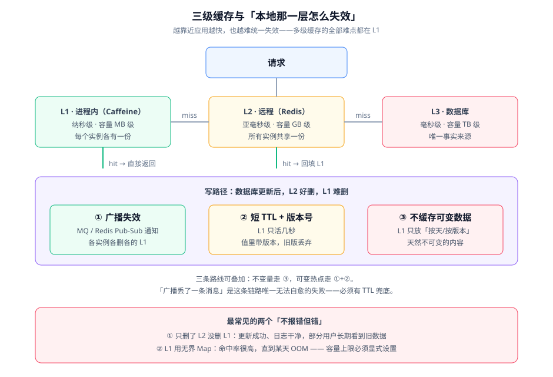

# 多级缓存深入

多级缓存不是「多加一层更快」，而是**用一致性成本换延迟**。本页讲清 L1 / L2 / L3 各自该放什么、本地缓存怎么失效、以及什么时候这套投入根本不划算。

::: tip 一句话理解
L2 的问题是「慢一点」，L1 的问题是「**别的进程改了数据，我这一份没人通知**」。所以做多级缓存的全部工作量，都花在「怎么让 L1 尽快知道该失效」上。
:::

## 三层的职责划分

| 层 | 实现 | 典型延迟 | 容量量级 | 放什么 | 绝不放什么 |
| --- | --- | --- | --- | --- | --- |
| L1 | Caffeine / Guava Cache | 纳秒~微秒 | MB 级（每实例） | 近乎不可变的高频读：渲染后的片段、配置、字典、分类树 | 用户个人化数据、余额、库存 |
| L2 | Redis | 亚毫秒~毫秒 | GB~TB 级（共享） | 可枚举的业务实体、列表页、聚合结果、计数器 | 超长文本、二进制大对象、超高频变动的计数 |
| L3 | MySQL 等数据库 | 毫秒 | TB 级 | 唯一事实来源 | ——（这里才是真相） |

划线的依据是**变更频率**：变更越频繁，越应该靠近 L3，因为每一层都要承担一次失效动作。**把写多读少的数据放进 L1，等于给每次写都加一个广播成本**。

## 本地缓存失效的三条路线



### 路线一：广播失效

数据变更后，通过 Redis Pub/Sub 或消息队列向所有实例广播一条 `invalidate` 消息，各实例收到后删除自己 L1 中对应的 key。

```java
// 完整实现约 60 行，本节给出结构与关键片段
@Component
public class LocalCacheInvalidator {

    private final Cache<String, String> l1;
    private final StringRedisTemplate redis;

    public LocalCacheInvalidator(Cache<String, String> l1, StringRedisTemplate redis) {
        this.l1 = l1;
        this.redis = redis;
    }

    /** 本实例先删自己，再广播给其他实例 */
    public void invalidate(String key) {
        l1.invalidate(key);
        redis.convertAndSend("cache:invalidate", key);
    }

    @EventListener
    public void onMessage(CacheInvalidateMessage message) {
        // 关键点：收到广播要删的是「本地 key」，不是「去查库」
        // 而且这里绝不回写 L2——否则会把刚被删掉的 key 又填回去
        l1.invalidate(message.key());
    }
}
```

::: danger 广播失效的三个坑
1. **广播丢失没有重试**。Redis Pub/Sub 是「即发即弃」的：订阅端断线期间的消息不会补发。因此**广播必须与 TTL 同时存在**——TTL 是唯一的兜底。只靠广播，一次网络抖动就会留下长期脏数据。
2. **收到广播后又回填缓存**。监听器里如果顺手「查库并写入 L1」，会把广播前一刻的旧值重新写回去，使这次失效完全失效。
3. **把自己的广播又处理一遍**。发送方已经删过本地，如果监听器不做区分，会重复删除——多数情况下无害，但如果监听器带有统计数据（如命中率统计），会造成指标失真。
:::

### 路线二：短 TTL + 版本号

不追求「立即失效」，而是把 L1 的存活时间压到几秒（例如 3~10 秒），并在缓存值里带上版本号：读到版本号低于「当前已知版本」的数据就丢弃。

- **优点**：实现最简单，没有任何跨实例依赖；广播链路故障时自动退化为「最多脏几秒」。
- **代价**：TTL 内仍会读到旧值。对「发布后 3 秒内读者可能看到旧标题」的场景可以接受；对「下单后立刻看到库存变化」不可接受。
- **判据**：业务能否接受「最多 N 秒的旧值」。能，就用这条；不能，就必须用路线一或干脆不做 L1。

### 路线三：只缓存不可变内容

让 L1 里根本不存在「可变数据」，从而不需要失效。做法是给内容生成一个不可变标识（内容哈希或版本号），key 里带上它：

```text
# 可变：改一次就要删一次
article:1001:detail

# 不可变：内容变了就是「另一个 key」，旧 key 自然过期，不需要任何人通知
article:1001:v<contentHash>:detail
```

- **优点**：彻底消除失效动作，多实例天然一致。
- **代价**：需要有一个地方知道「当前版本是哪个」——通常就是 L2 里存一个很短的指针 key（如 `article:1001:current`），这个指针 key 变更时只需删一次 L2，不影响 L1。

::: tip 这一条是性价比最高的
「只缓存不可变内容」把一致性问题转换成了**寻址问题**：你不需要通知任何人删东西，只需要让所有人去找新地址。代价是缓存条目会暂时变多（旧版本要等 TTL 到期），这在内存充足的场景下完全划算。
:::

## 三条路线的选择表

| 内容类型 | 变更频率 | 推荐路线 | 理由 |
| --- | --- | --- | --- |
| 站点配置、字典、开关 | 天级 | 路线三（不可变）+ 长 TTL | 变更极少，改造一次收益长期 |
| 分类树、标签列表 | 小时级 | 路线三 + 短指针 key | 结构稳定，用版本号寻址 |
| 文章详情（读多写少） | 天级，偶发编辑 | 路线二（短 TTL 3~10s） | 编辑容忍几秒延迟，实现成本最低 |
| 文章列表、首页推荐 | 分钟级 | 路线一（广播）或直接在 L2 缓存 | 变化会影响所有人，广播收益明确 |
| 计数器、库存、个人数据 | 秒级/请求级 | **不做 L1** | 失效成本高于收益 |

## 多级缓存的三条硬红线

1. **L1 必须有容量上限**。Caffeine 用无界 `Map` 实现「本地缓存」是新手最常见的写法：命中率很高，直到某天实例 OOM。`maximumSize` 与 `maximumWeight` 至少要设一个。
2. **L1 的 TTL 必须显式设置**。哪怕用广播失效，也要配一个兜底 TTL。`expireAfterWrite` 与 `refreshAfterWrite` 的语义不同：前者到点后**下一次读会阻塞重建**，后者到点后**先返回旧值、后台刷新**——对延迟敏感的场景应当用后者。
3. **L1 绝不能缓存个人化数据**。即使 key 里带了 `userId`，也要警惕「同一实例上的不同用户其实共用连接池与线程」带来的串号风险。个人化数据的正确位置是 L2（带 `userId` 前缀）或直接不缓存。

::: danger L1 的三种「不报错但错」
1. **只删了 L2 没删 L1**。更新操作写完库、删完 Redis，日志干净、接口返回 200，但部分用户会**长期**看到旧数据（直到 L1 TTL 到期）。
2. **`refreshAfterWrite` 被当成 `expireAfterWrite` 用**。前者刷新期间读到的仍是旧值，如果业务要求「改完立刻可见」，用它会得到「有时立刻、有时不立刻」这种最难排查的现象。
3. **广播 channel 名写错**。订阅与发送的 channel 不一致时，广播完全不生效且**没有任何报错**——订阅端只是安静地收不到消息。上线前必须实打实地发一条、看到对方删掉才算验证。
:::

## 完整示例：Caffeine 作为 L1

```java
// 依赖：com.github.ben-manes.caffeine:caffeine:3.3.0（3.x 要求 Java 11+）
// 完整实现约 70 行，本节给出结构与关键片段
@Configuration
public class LocalCacheConfig {

    @Bean
    public Cache<String, String> articleLocalCache() {
        return Caffeine.newBuilder()
                // 红线一：容量上限必须设置
                .maximumSize(10_000)
                // 红线二：兜底 TTL。用 refreshAfterWrite 而非 expireAfterWrite，
                // 到点后先返回旧值并在后台异步刷新，不阻塞读请求
                .refreshAfterWrite(Duration.ofSeconds(30))
                .expireAfterWrite(Duration.ofMinutes(5))
                .recordStats()   // 不打开这一项，cache.stats() 永远是 0，指标等于没有
                .build();
    }
}
```

::: warning 说明
`recordStats()` 不打开时，`cache.stats()` 返回的每个计数器都是 0，而且**不会报错**。这会造成「面板上 L1 命中率恒为 0」的假象，排查时极易被误判为「L1 没生效」。
:::

## 验证方式

多级缓存上线前，按下面三步确认失效链路真的贯通——**三步缺一不可，只测第一步会得到错误结论**。

```shell
# 前置：两个应用实例（A、B）都已启动，本地缓存 TTL 设为 30 秒以便观察

# 第 1 步：确认两个实例都能命中 L1（连续请求两次，第二次应显著更快）
for i in 1 2; do
  curl -s -o /dev/null -w "A-instance 第 $i 次: %{time_total}s\n" http://localhost:8080/api/v1/articles/1001
done

# 第 2 步：通过实例 A 触发一次更新（只打 A，不打 B）
curl -s -X PUT http://localhost:8080/api/v1/admin/articles/1001 \
  -H 'Content-Type: application/json' -d '{"title":"新标题"}'

# 第 3 步：关键验证——请求实例 B，看它是否已经失效
# 期望：立刻读到「新标题」；如果仍读到旧标题，说明广播链路没通
curl -s http://localhost:8081/api/v1/articles/1001 | grep -o '"title":"[^"]*"'
```

预期结果与判读：

| 现象 | 含义 | 下一步 |
| --- | --- | --- |
| B 立刻返回新标题 | 广播链路正常 | 补 TTL 兜底即可上线 |
| B 在 30 秒后返回新标题 | 广播没生效，是 L1 TTL 兜的底 | 检查 channel 名、订阅是否正确注册 |
| B 一直返回旧标题 | 广播没生效**且** TTL 也没生效 | 检查 L1 是否真的配置了 `refreshAfterWrite` / `expireAfterWrite` |

## 参考资料

- Caffeine 官方 Wiki · Population、Eviction、Refresh：https://github.com/ben-manes/caffeine/wiki
- Caffeine 3.3.0 发布说明（Java 11 基线）：https://github.com/ben-manes/caffeine/releases
- Microsoft Azure Architecture Center · Cache-Aside 模式（含一致性限制说明）：https://learn.microsoft.com/azure/architecture/patterns/cache-aside
- Redis 官方文档 · Client-side caching（tracking 机制与失效通知）：https://redis.io/docs/latest/develop/use/client-side-caching/
