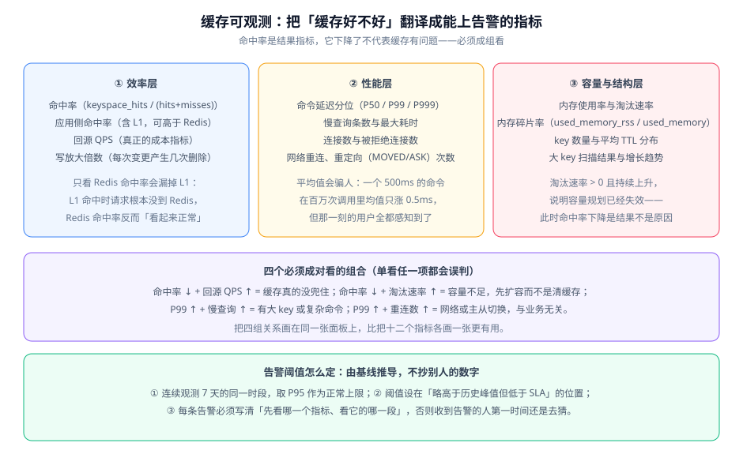

# 可观测与容量治理

缓存问题最麻烦的地方是：**它不报错**。数据库挂了会抛异常，缓存失效链路断了只会让一部分人看到旧数据。这一页讲怎么把「缓存好不好」翻译成能上告警、能互相印证的指标。

::: tip 一句话理解
命中率是**结果**，不是原因。它下降了，可能是流量涨了、可能是容量不足、可能是失效链路断了、也可能只是 L1 命中变多导致请求没到 Redis。**任何一种解释都比「命中率下降了」更接近真相**，所以指标必须成组看。
:::

## 三层指标



### 效率层：回答「缓存有没有起作用」

| 指标 | 计算方式 | 判读要点 |
| --- | --- | --- |
| Redis 命中率 | `keyspace_hits / (keyspace_hits + keyspace_misses)` | 只反映 L2。有 L1 时它**会偏低且属于正常** |
| 应用侧命中率 | `(L1 命中 + L2 命中) / 总读请求` | 真正的业务效果指标，必须由应用上报 |
| 回源 QPS | 落到数据库的读请求数 | **成本指标**。命中率不变而流量翻倍时，回源量也翻倍 |
| 写放大倍数 | 每次数据变更引发的删除/广播次数 | 多级缓存下，一次写可能触发 N 条广播 |

::: warning 有 L1 时不要只看 Redis 命中率
L1 命中时请求**根本不会到 Redis**，所以 Redis 侧的 `keyspace_misses` 统计不到这些请求。结论是：**引入 L1 之后，Redis 命中率通常会「看起来变好」（因为 miss 变少了），而它已经不能代表整体效果**。此时必须以应用侧命中率为准。
:::

### 性能层：回答「缓存快不快」

| 指标 | 采集方式 | 为什么不能用平均值 |
| --- | --- | --- |
| 命令延迟分位 | Redis `LATENCY` / 客户端埋点 | 平均值会被海量快请求稀释，掩盖长尾 |
| 慢查询条数 | `SLOWLOG GET` | 是「已经发生的卡顿」的直接证据 |
| 连接数 | `connected_clients` | 连接泄漏的早期信号 |
| 重连与重定向次数 | 客户端指标 | 重连激增通常与业务无关，而是主从切换或网络问题 |

::: danger 用平均值判断缓存性能会漏掉全部真实问题
假设 100 万次调用中有 10 次耗时 500ms，其余都是 0.5ms。平均值是 **0.505ms**，看起来完全正常——但那 10 次对应的 10 个用户全都感知到了卡顿。

正确做法是看 **P99 / P999**。经验判据：P99 超过平均值的 20 倍，就说明存在长尾，应当去查大 key 与慢查询。
:::

### 容量与结构层：回答「还能撑多久」

| 指标 | 命令/来源 | 警戒判据 |
| --- | --- | --- |
| 内存使用率 | `used_memory / maxmemory` | 超过 80% 且持续上升 |
| 淘汰速率 | `evicted_keys` 的增量 | **持续大于 0** 即容量规划已失效 |
| 内存碎片率 | `used_memory_rss / used_memory` | 超过 1.5，考虑重启或 `activedefrag` |
| key 数量与分布 | `DBSIZE`、按前缀统计 | 某个前缀增长异常快 |
| 大 key 数量 | `--bigkeys` 抽样 | 出现单个超过 10KB 的值 |

淘汰速率这一项最值得单独强调：**它是「命中率下降」的常见原因，而不是结果**。看到命中率下降时，先看淘汰速率，再决定是扩容还是改缓存策略。

## 成对判读：四组必须同时看的组合

单看任何一个指标都会误判。实践中最高频的四组组合如下：

| 组合 | 现象 | 结论 | 处置 |
| --- | --- | --- | --- |
| 命中率 ↓ + 回源 QPS ↑ | 缓存没兜住流量 | 缓存层真的失效了 | 查失效链路、查热点、查是否有大批 key 同时过期 |
| 命中率 ↓ + 淘汰速率 ↑ | 缓存装不下了 | 容量问题，不是逻辑问题 | 先扩容或调 `maxmemory-policy`，**不要先清缓存** |
| P99 ↑ + 慢查询 ↑ | 个别命令很慢 | 存在大 key 或复杂命令 | 扫描大 key、检查是否在生产跑了 `KEYS`/`SMEMBERS` 类命令 |
| P99 ↑ + 重连数 ↑ | 连接不稳 | 网络或主从切换，与业务逻辑无关 | 查切换日志与网络质量，不要改业务代码 |

::: tip 把四组关系画在同一张面板上
把十二个指标各画一张图，值班的人需要自己联想。把上述四组**两两画在同一张面板、共享时间轴**，结论会自己浮现出来。这比多加十个指标更有用。
:::

## 应用侧埋点：三行代码换来可定位

Redis 自带的指标只能看到 L2。要判断「到底是哪一层没命中」，必须在应用侧埋点：

```java
// 完整实现约 40 行，本节给出结构与关键片段
public Article getArticle(Long id) {
    String key = "article:" + id;

    // 第 1 层：本地缓存
    String cached = l1.getIfPresent(key);
    if (cached != null) {
        // 关键点：L1 命中与 L2 命中必须分开计数，
        // 否则无法回答「加 L1 到底有没有效果」
        metrics.counter("cache.hit", "layer", "l1").increment();
        return deserialize(cached);
    }

    // 第 2 层：Redis
    String remote = redis.opsForValue().get(key);
    if (remote != null) {
        metrics.counter("cache.hit", "layer", "l2").increment();
        l1.put(key, remote);
        return deserialize(remote);
    }

    // 回源：这个计数才是真正反映数据库压力的指标
    metrics.counter("cache.miss").increment();
    Article article = articleRepository.findById(id).orElse(null);
    if (article != null) {
        String value = serialize(article);
        redis.opsForValue().set(key, value, Duration.ofMinutes(30));
        l1.put(key, value);
    }
    return article;
}
```

::: danger 三个会让指标失真的埋点错误
1. **把 L1 与 L2 命中合并成一个计数**。这样算出的是「总命中率」，无法回答「L1 有没有起作用」。必须带 `layer` 标签分开计。
2. **回源计数写在缓存查询之外**。如果只在「缓存未命中」时计数，那么「未命中且数据库也没有」的情况会被漏掉——而这类请求正是**穿透**的原材料。
3. **给 `null` 结果不计数也不缓存**。反复查询不存在的 ID 会持续回源。至少要统计「空结果回源次数」这一项，才能发现穿透。
:::

## 告警阈值：由基线推导

::: danger 不要抄别人的阈值
「命中率低于 80% 告警」这条规则在某个系统里可能是对的，在另一个系统里可能天天误报（缓存本来就只有 60% 命中率的场景），或者从来不报（真实基线是 99%）。

正确做法：**连续观测 7 天的同一时段，取 P95 作为正常上限，把阈值设在「略高于历史峰值、低于 SLA」的位置。**
:::

```text
# 阈值推导步骤（写在你的监控系统里，不是本仓文件）
1. 取最近 7 天，逐小时统计「应用侧命中率」与「回源 QPS」
2. 排除发布窗口与大促日，得到「正常时段」样本
3. 取正常时段命中率的 P5 分位（下界）与回源 QPS 的 P95 分位（上界）
4. 阈值设在：命中率 < P5 × 0.9 时告警；回源 QPS > P95 × 1.5 时告警
5. 每条告警的说明里写清「先看哪一个指标、看它的哪一段」
```

第 5 点是常被忽略但最影响效率的一条：**告警文案里没有排查路径，收到告警的人第一件事还是去猜**。

## 容量治理：三个动作

1. **按预估峰值预留 30% 余量**。不是按当前数据量算，而是按「未来 3 个月的峰值」算。
2. **明确淘汰策略**。`maxmemory-policy` 必须显式设置，不要依赖默认值。业务数据与纯缓存数据的策略不同——如果同一个实例上混放了持久化数据，用 `allkeys-*` 系列会造成数据丢失。
3. **给每类 key 定 TTL 上限**。没有 TTL 的 key 是容量增长的唯一来源。至少每季度做一次「无 TTL key」统计。

## 验证方式

三块面板必须能**独立复现**。用下面命令把原始数据取出来，与面板对照：

```shell
# 1) 效率层：命中率与淘汰速率
redis-cli -h 10.0.0.11 -p 6379 info stats | \
  grep -E 'keyspace_hits|keyspace_misses|evicted_keys|expired_keys'

# 2) 容量层：内存水位与碎片率
redis-cli -h 10.0.0.11 -p 6379 info memory | \
  grep -E 'used_memory_human|used_memory_peak_human|maxmemory_human|mem_fragmentation_ratio'

# 3) 性能层：慢查询与延迟事件
redis-cli -h 10.0.0.11 -p 6379 slowlog len
redis-cli -h 10.0.0.11 -p 6379 latency latest
```

判读标准：

| 现象 | 结论 |
| --- | --- |
| `evicted_keys` 在两次采样之间增加 | 容量不足，命中率下降的原因就在这里 |
| `mem_fragmentation_ratio` > 1.5 | 内存碎片高，考虑低峰重启或开启碎片整理 |
| `slowlog len` 持续增长 | 存在慢命令，去查大 key 与 `KEYS` 类调用 |
| `latency latest` 有事件但 `slowlog` 为空 | 延迟可能来自网络或系统层，不在 Redis 内部 |

## 参考资料

- Redis 官方文档 · INFO 命令全部字段含义：https://redis.io/docs/latest/commands/info/
- Redis 官方文档 · 内存优化与 `maxmemory-policy`：https://redis.io/docs/latest/develop/reference/optimization/memory-optimization/
- Redis 官方文档 · LATENCY 与 SLOWLOG 诊断工具：https://redis.io/docs/latest/operate/oss_and_stack/management/optimization/latency-monitor/
- [微服务 · 链路追踪](../../Microservices/index.md)（跨服务排查时的 TraceId 串联）
