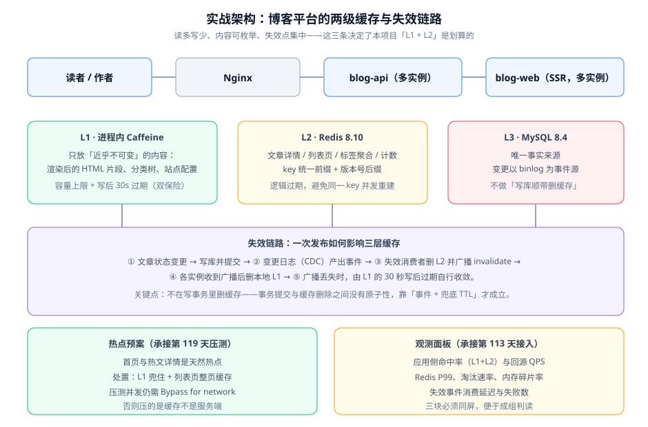

# 实战：博客平台内容缓存体系

前面 7 页讲的是各自的判据与手段。这一页把它们串成一次完整的设计与验收：**一个「读多写少、内容可枚举、失效点集中」的内容站，缓存体系该怎么搭，验收看哪几条断言**。

::: tip 本页的定位
本页是**技术实战**：讲清一套两级缓存方案的设计依据、失效链路如何落地、以及用哪些断言验证它成立。
工程侧的排期与交付判据在 [项目实战 · 全栈博客平台](/project/Complete/BlogPlatform/index.md) 中单独维护——**判据只写一处**，本页给出的是可复用的设计与断言清单。
:::

## 需求与约束

先明确前置条件，因为**缓存方案的可行性完全由业务特征决定**：

| 约束 | 取值 | 对缓存设计的影响 |
| --- | --- | --- |
| 读写比 | 约 200:1（读为主） | 缓存收益明确，值得投入 |
| 内容可变性 | 文章发布后极少修改 | 适合较长的 TTL |
| 访问分布 | 首页与 Top 100 文章承载约 70% 阅读量 | 天然热点，L1 收益明显 |
| 一致性要求 | 读者可容忍秒级旧值 | 允许短 TTL + 广播失效 |
| 作者侧要求 | 发布后**自己**立刻可见 | 需要「读己之写」的针对性处理 |
| 部署形态 | 应用多实例（≥ 3），Redis 单主从 | 需要跨实例失效广播 |

::: warning 一条前置判断
如果读写比接近 1:1，或者内容每次访问都可能不同（如个人化信息流），**本页的方案不适用**。缓存不是「加上总没错」的东西，它是用一致性换性能的交易。
:::

## 三级缓存的落位



| 层 | 存什么 | 不存什么 | 依据 |
| --- | --- | --- | --- |
| L1（Caffeine） | 渲染后的首页片段、分类树、站点配置；**文章详情的短 TTL 副本（3 秒）** | 个人化数据、草稿、后台数据 | 这些内容近乎不可变，或可容忍 3 秒旧值 |
| L2（Redis） | 文章详情、列表页、标签聚合、阅读计数 | 超长正文全文的精简副本之外的大对象 | 可枚举、写少读多 |
| L3（MySQL） | 唯一事实来源 | —— | —— |

**为什么文章详情要放 L1**：热门文章的详情读会集中到极少数 key 上，这正是 L1 收益最高的场景。代价是最多 3 秒旧值——对博客而言完全可接受。

**为什么阅读计数不严控一致性**：它本身就是近似值。用 L2 的原子自增 + 定期落库即可，不需要失效广播。

## 失效链路：一次发布经过哪几步

这是本方案里唯一需要设计的部分。完整链路是：

```text
作者点击发布
   │
   ├─ 1) 写库并提交（状态置为 PUBLISHED）
   │
   ├─ 2) 变更日志产出事件 { table: article, id: 1001, op: UPDATE }
   │
   ├─ 3) 失效消费者收到事件：
   │       ├─ 删 L2：article:1001:detail、article:1001:meta
   │       ├─ 删 L2 列表页：list:latest、list:tag:spring（按分类索引反查）
   │       └─ 广播 invalidate 到所有实例
   │
   └─ 4) 各实例收到广播 → 删本地 L1 中受影响的 key
          （广播丢失时，由 L1 的 3 秒写后过期自行收敛）
```

### 关键设计点一：不在写事务里删缓存

写事务与缓存删除**没有原子性**。把删除放进事务会出现两种不一致：事务回滚了但缓存已删（无害，只是多一次回源），或者事务提交了但删除失败（有害，长期脏读）。

正确做法是**让缓存失效成为提交后的独立事实**，靠变更日志驱动。这也意味着：**即使某次发布漏写了失效逻辑，变更日志依然会产出事件**——这是本方案相比「应用内删缓存」最大的韧性来源。

### 关键设计点二：列表页的失效范围要能反查

单条文章更新会影响哪些列表页？这必须能「反查」出来，否则只能整体清空列表缓存。

```text
# 做法：为每个列表页维护一个「反向索引」，记录它包含哪些文章
list:index:latest   -> [1001, 1002, 1003, ...]        （最近发布）
list:index:tag:spring -> [1001, 1005, ...]            （按标签聚合）

# 文章 1001 更新时：
# 1) 读 list:index:* 找出包含 1001 的列表（可维护 article:1001:inlists 反向索引加速）
# 2) 只删这些列表，其余列表不动
```

::: danger 列表页失效的两个常见错误
1. **每次更新都清空全部列表缓存**。作者改一篇文章，全站列表页缓存全部失效——缓存等于没有，且数据库会看到一台阶的流量尖峰。正确做法是维护反向索引，只删受影响的列表。
2. **反向索引本身没被维护**。文章新增标签后忘记更新 `article:1001:inlists`，导致该标签的列表页永远不失效。反向索引必须与列表写入在同一处代码里生成，不能靠人工。
:::

### 关键设计点三：处理「作者要立刻看到」

读者能容忍 3 秒旧值，但**作者刚发布完，刷新看到旧标题会认为发布失败**。这属于 [一致性方案](../Consistency/index.md) 里的「读己之写」问题。

处置方式（只对作者侧路径生效）：

```java
// 完整实现约 30 行，本节给出结构与关键片段
public Article getForAuthor(Long id, String sessionId) {
    // 写操作成功后，在会话里记一个很短命的标记（例如 10 秒）
    // 只有带这个标记的请求才绕过缓存，其余请求走正常缓存路径
    if (recentWriteMarker.exists(sessionId)) {
        // 绕过 L1 与 L2，直接读库 —— 范围极小，代价可控
        metrics.counter("cache.bypass", "reason", "read-your-write").increment();
        return articleRepository.findById(id).orElse(null);
    }
    return getArticle(id);   // 正常两级缓存路径
}
```

**为什么不做全局强一致**：为了让「刚发布的人」立刻看到新值而放弃缓存，等于用全站性能换极少数请求的体验。针对性绕过只影响那些请求本身。

### 关键设计点四：热点预案

首页与 Top 100 文章是天然热点。三层处置：

1. **L1 兜住**：热点文章的详情读大部分在 L1 结束；
2. **列表页整页缓存**：首页不做「取 20 篇文章再逐篇查」，而是把渲染结果整体缓存；
3. **压测准备**：压测时必须勾选 DevTools 的 **Bypass for network**，否则压的是浏览器缓存而不是服务端。这一条与 [项目实战 · 联调与压测](/project/Complete/BlogPlatform/LoadTesting/index.md) 里登记的前置条件一致。

## 验收断言 C1~C12

每条断言都给出**可执行操作 + 明确期望**，避免「看起来正常」这类无法证伪的表述。

| 编号 | 断言 | 验证方式 | 期望 |
| --- | --- | --- | --- |
| C1 | 两级缓存都能命中 | 连续请求同一文章 3 次，看耗时与埋点 | 第 2、3 次耗时显著低于第 1 次，`cache.hit{layer=l1}` 或 `l2` 有增长 |
| C2 | L2 命中后回填 L1 | 清空 L1，请求一次，再请求一次 | 第一次 `layer=l2`，第二次 `layer=l1` |
| C3 | 发布后读者在 5 秒内看到新值 | 发布一篇文章，每 500ms 轮询读者接口 | 最迟 5 秒内标题变为新值 |
| C4 | 广播覆盖全部实例 | 打实例 A 触发更新，立刻请求实例 B | 实例 B 立刻返回新值（不是等 L1 TTL 到期） |
| C5 | 列表页只失效受影响的那些 | 改一篇文章，观察 `list:*` 的删除日志 | 只有「最近发布」与「该文章标签」的列表被删 |
| C6 | 作者侧读己之写 | 作者发布后立刻请求作者接口 | 立刻返回新值（绕过缓存） |
| C7 | 缓存不可用时接口不挂起 | 把 Redis 地址改为不可达，连续请求 20 次 | 每次耗时 < 300ms，返回 200 或明确降级内容，无 5xx 雪崩 |
| C8 | 回源被限流保护 | 缓存不可用 + 持续压测 5 分钟 | 数据库 QPS ≤ 基线 1.5 倍 |
| C9 | 冷启动收敛 | 清空全部缓存，记录命中率曲线 | 5 分钟内应用侧命中率回到 80% 以上 |
| C10 | 埋点区分层级 | 查监控，确认标签存在 | `cache.hit` 带 `layer=l1` 与 `layer=l2` 两个序列 |
| C11 | 大 key 在阈值内 | 扫描 `article:*` 前缀下最大的 20 个 key | 单个 value 不超过 10KB |
| C12 | 无 TTL 泄漏 | 统计所有 key 中无 TTL 的比例 | 业务缓存 key 中无 TTL 的比例为 0 |

::: warning 实测列纪律
上表中的操作与期望是**判据**，不是**实测记录**。在自己环境跑完之后，要在记录里回填真实输出；**不把期望值直接抄进实测列**——否则记录看起来完美，实际什么都没验证。这条纪律与本仓项目侧的「实测列」约定一致。
:::

## 本地验证的最短路径

按下面顺序执行，约 20 分钟可以覆盖 C1、C2、C3、C7 四条核心断言：

```shell
# 前置：应用（8080）、Redis（6379）已启动，已开启 recordStats() 与埋点

# C1 / C2：两级缓存命中
for i in 1 2 3; do
  curl -s -o /dev/null -w "第 $i 次耗时: %{time_total}s\n" \
    http://localhost:8080/api/v1/articles/1001
done
# 期望：第 1 次明显大于第 2、3 次

# 清空 L2，让下一次请求只能靠 L1
redis-cli -h 127.0.0.1 -p 6379 del article:1001:detail
curl -s -o /dev/null -w "L2 清空后第一次: %{time_total}s\n" \
  http://localhost:8080/api/v1/articles/1001

# C3：发布后收敛时间
redis-cli -h 127.0.0.1 -p 6379 del article:1001:detail
curl -s -X PUT http://localhost:8080/api/v1/admin/articles/1001 \
  -H 'Content-Type: application/json' -d '{"title":"新标题"}'
for i in $(seq 1 10); do
  sleep 0.5
  t=$(curl -s http://localhost:8080/api/v1/articles/1001 | grep -o '"title":"[^"]*"')
  echo "T+$((i*5))00ms: $t"
done

# C7：缓存不可用时是否挂起（把 Redis 指向不可达地址后重试上面的循环）
```

## 这套方案不做什么

明确列出「不做」的部分，比列出「做了什么」更能说明边界：

1. **不做缓存预热脚本的自动触发**。预热通过发布流程中的一次手动执行完成——自动触发需要一套调度与幂等设计，收益不匹配。
2. **不做多级缓存的强一致**。L1 只承诺「最多 3 秒旧值」，不承诺「更新后立刻全站一致」。
3. **不做跨数据中心的缓存同步**。单数据中心部署，跨中心一致性不在需求内。
4. **不给个人化接口加缓存**。阅读历史、草稿、后台列表一律直连数据库或按用户维度短 TTL 缓存，不做共享缓存。

## 参考资料

- [多级缓存深入](../MultiLevel/index.md)（三条失效路线的完整取舍）
- [一致性方案深入](../Consistency/index.md)（四档方案的对照与「读己之写」）
- [热点与倾斜治理](../HotKey/index.md)（打散与本地兜底的具体写法）
- [缓存层韧性](../Availability/index.md)（限流、熔断、降级与三条可验证判据）
- [项目实战 · 全栈博客平台](/project/Complete/BlogPlatform/index.md)（工程侧排期与交付判据）
