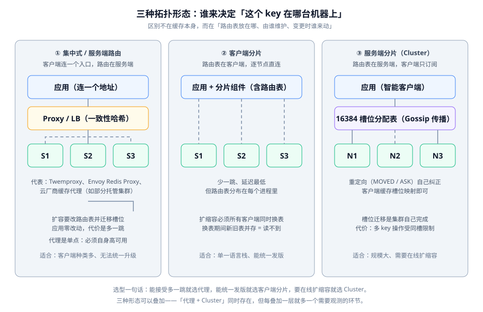

# 拓扑与路由

这一页回答一个容量问题：**key 应该落在哪台机器上，这张「路由表」由谁维护、变更时谁要跟着动**。它决定了你以后扩容要付出多大代价——很多时候不是性能决定了架构，而是「扩容一次要发几个版本的客户端」决定了架构。

::: tip 一句话理解
分布式缓存与单机缓存的差别只有一个：**多了一张路由表**。这张表放在客户端、放在代理、还是放在服务端，衍生出三种拓扑，也衍生出三种不同的扩容代价。
:::

## 一个 key 的完整旅程

无论哪种拓扑，一次访问都要回答三个问题：

1. **落到哪个节点**——由哈希算法与路由表决定；
2. **节点不在时怎么办**——由重试与重定向策略决定；
3. **节点变了之后怎么办**——由重平衡与迁移策略决定。

第二、三个问题才是分布式缓存真正的工作量所在。第一个问题反而是最简单的。

## 为什么不能直接用取模

最朴素的分片是 `hash(key) % N`。它在 N 不变时完全正确，但 **N 只要变一次，几乎全部 key 的归属都会改变**：

| 分片数 | `hash(key) % N` 的归属变化比例 | 后果 |
| --- | --- | --- |
| N=3 → N=4 | 约 **75%** 的 key 换节点 | 命中率瞬间塌陷，请求全部回源 |
| N=4 → N=5 | 约 **80%** 的 key 换节点 | 同上，且新节点上没有任何热点数据 |
| N=10 → N=11 | 约 **91%** 的 key 换节点 | 扩容即等于「全量缓存清空」 |

结论：**取模分片在大规模场景下等于「不能扩容」**。这就是一致性哈希被发明出来的原因。

## 一致性哈希与虚拟节点

一致性哈希把节点与 key 都映射到一个环形空间上，每个 key 归属于**顺时针方向遇到的第一个节点**。这样新增一个节点时，只有它「接管的那一段」上的 key 需要迁移，平均迁移比例是 `1/N`。

但它有一个著名的问题：**数据倾斜**。当节点数量少、哈希不均匀时，环上的节点可能挤在一起，导致某些节点承载远超平均值的数据量。

解决方式是**虚拟节点（virtual node）**：每个物理节点在环上映射成若干个虚拟节点（通常 100~300 个），key 先落到虚拟节点再折算回物理节点。虚拟节点越多，分布越均匀，代价是路由表变大、内存占用上升。

```java
// 一致性哈希环的最小实现（仅用于说明原理，生产请用成熟库）
// 完整实现约 80 行，本节给出结构与关键片段
public final class HashRing {

    private final TreeMap<Long, String> ring = new TreeMap<>();
    private static final int VIRTUAL_NODES = 160;

    /** 加节点：为每个物理节点生成 VIRTUAL_NODES 个虚拟节点 */
    public void addNode(String node) {
        for (int i = 0; i < VIRTUAL_NODES; i++) {
            ring.put(hash(node + "#" + i), node);
        }
    }

    /** 定位：顺时针找到第一个不小于 key 哈希值的虚拟节点 */
    public String locate(String key) {
        if (ring.isEmpty()) {
            throw new IllegalStateException("环为空：没有可用节点");
        }
        Map.Entry<Long, String> entry = ring.ceilingEntry(hash(key));
        // 关键点：超过环的最大值时回绕到第一个节点，否则尾部 key 永远落空
        return (entry != null ? entry : ring.firstEntry()).getValue();
    }

    private long hash(String value) {
        // 生产实现请用带种子的 MurmurHash 或 MD5 截断，
        // 不要用 String.hashCode()——它的分布质量不足，虚拟节点会被挤在一起
        return Hashing.murmur3_128().hashString(value, StandardCharsets.UTF_8).asLong();
    }
}
```

::: danger 一致性哈希的两个常见错误
1. **忘记回绕**。`ceilingEntry` 在 key 的哈希值大于环上最大值时返回 `null`，必须回绕到 `firstEntry()`。写成 `ring.ceilingEntry(hash).getValue()` 会让**一部分 key 直接抛空指针**，且比例随数据分布变化——测试环境可能永远碰不到。
2. **用 `String.hashCode()` 当哈希函数**。它的分布质量差、且是可预测的，虚拟节点会挤在一起，倾斜问题反而比不虚拟节点时更严重。正确做法是 MurmurHash / MD5 截断 / xxHash 这类分布均匀且带种子的算法。
:::

## 三种拓扑的取舍



### 代理路由

客户端只连代理，代理维护路由表并把请求转发给正确的节点。代表实现是 Twemproxy 与 Envoy 的 Redis Proxy，云厂商的托管集群也常采用这一形态。

- **优点**：应用零改动，语言栈无关；路由表只有一份，变更时不用发版。
- **代价**：多一跳网络；代理本身成为关键路径上的单点，必须自身高可用。
- **判据**：客户端种类多（Java / Go / Python 都在用）、且无法统一安排发版窗口时选它。

### 客户端分片

路由表在每个应用进程内，客户端直接连各个节点。

- **优点**：少一跳，延迟最低；可以针对业务定制哈希策略。
- **代价**：路由表分散在 n 个进程里，**扩容时必须让所有客户端同时换表**；换表期间新旧表并存，会出现一段「同一个 key 被两台机器各自缓存」的窗口。
- **判据**：单一语言栈、能统一发版、对延迟敏感时选它。

### 服务端分片（Cluster 形态）

以 Redis Cluster 为代表：路由信息（16384 个槽位的归属）由集群通过 Gossip 协议维护，客户端只需缓存一份槽位映射，遇到 `MOVED` / `ASK` 重定向时自行纠正。

- **优点**：槽位迁移由集群自己完成，扩容不需要应用配合；天然支持在线扩缩容。
- **代价**：多 key 操作受「同一槽位」限制（可用 hash tag `{...}` 把相关 key 绑定到同一槽）；客户端需要正确实现重定向逻辑。
- **判据**：规模大、必须在线扩缩容、能接受 Cluster 的语义限制时选它。

::: warning 三种形态可以叠加
「代理 + Cluster」是常见的组合：代理屏蔽了多语言客户端的差异，Cluster 负责在线扩缩容。但**每叠加一层就多一个需要观测的环节**——排查时你要依次确认「代理路由对不对、槽位映射对不对、节点本身健不健康」。层数越多，平均定位时间越长。
:::

## 扩容时的三个动作与代价

无论哪种拓扑，扩容都不是「加一台机器」这么简单。完整的动作序列是：

| 步骤 | 做什么 | 做错的后果 |
| --- | --- | --- |
| 1. 加节点 | 让新节点被路由表认识 | 忘记通知某一类客户端 → 那部分实例始终读不到新节点 |
| 2. 迁移数据 | 把该由新节点承载的 key 搬过去 | 迁移中不做双读 → 迁移窗口内这些 key 全部 miss，回源压力陡增 |
| 3. 切换路由 | 路由表指向新分布 | 新旧表并存期间写扩散 → 同一 key 在两处各有一份，一致性被破坏 |

针对第 2 步，务实的做法是**容忍一次 miss**：迁移期间允许这些 key 回源重建，而不是做复杂的一致性搬运（缓存本来就是可重建的，搬数据的收益往往不如直接重建）。除非是回源代价极高的场景（例如回源要调付费第三方接口），否则不建议为迁移做双读双写。

针对第 3 步，务实的做法是**让迁移与切换之间有明确的先后，而不是并行**：先把数据迁过去，再切路由。并行会同时引入「两个地方有同一份数据」和「两个地方都可能被写」两个问题。

## 客户端选择：读一读版本再决定

::: info 旧版兼容提示
**Jedis 的类族在 8.0.0 发生了不兼容变更**：`JedisPooled` 与 `JedisSentineled` 被**直接删除**，`JedisPool` / `JedisCluster` / `JedisSentinelPool` 自 7.2.0（2025-12-17）起被标记废弃。同时 8.0.0 默认协商 **RESP3** 并强制 TLS 主机名校验。存量项目升级时会遇到编译失败与连接行为变化两类问题，属于**必须预留验证时间**的升级。

迁移后的对应关系：

| 部署形态 | 旧类族（≤ 6.x） | 新类族（≥ 7.2，8.x 必须） |
| --- | --- | --- |
| 单机 | `Jedis` / `JedisPool` / `JedisPooled` | `RedisClient` |
| 集群 | `JedisCluster` | `RedisClusterClient` |
| 哨兵 | `JedisSentinelPool` | `RedisSentinelClient` |
| 多端点故障转移 | 无对应 | `MultiDbClient` |

Lettuce 则是另一条路线：它一直以线程安全与异步见长，7.8.0 已针对 Redis 8.10 的命令补齐支持。需要注意的一条变化是——**旧版客户端缓存（client-side caching）在 Lettuce 7.8.0 被标记废弃**。如果你的方案依赖它来降低延迟，应先确认替代路径（通常是应用自己的 L1，即 [多级缓存](../MultiLevel/index.md) 那一层）再加入。
:::

## 验证方式

分片方案上线前，用一条命令先验证分布是否均匀——**倾斜在低数据量下看不出来，等它显现时已经在生产上了**。

```shell
# 造 10 万个 key 灌入，再统计每个节点的 key 数量
# 期望：各节点数量差异在 ±20% 以内；若某节点超过均值 1.5 倍，说明哈希分布有问题
for i in $(seq 1 100000); do echo "set user:${i}:profile x"; done > keys.txt

# 用 redis-cli 的 --pipe 批量写入（比逐条快两个数量级）
redis-cli -h 10.0.0.11 -p 6379 --pipe < keys.txt

# 逐节点统计
for host in 10.0.0.11 10.0.0.12 10.0.0.13; do
  printf "%-14s %s\n" "$host" "$(redis-cli -h "$host" -p 6379 dbsize)"
done
```

预期结果：三个节点的 key 数量应在 33333 附近，最大偏差不超过 20%。如果出现「某节点是其他节点的两倍」，优先检查两点：虚拟节点数量是否太少、哈希函数分布是否均匀。

若使用的是 Cluster 形态，改用下面这条命令确认槽位覆盖完整：

```shell
# 期望：输出 3 个节点各占约 5461 个槽，且总数恰好 16384；出现 [0] 表示有槽位无人负责
redis-cli -h 10.0.0.11 -p 6379 cluster slots | \
  awk '/^[0-9]+$/{if($1>=0) print $1, $2}' | \
  awk '{cnt[$1]++; s+=($2-$1+1)} END {print "节点数:", length(cnt), "已分配槽位:", s}'
```

预期结果：`已分配槽位: 16384`。少于这个数字说明存在**未分配槽位**，落在这些槽上的请求会直接返回 `CLUSTERDOWN`——这是集群扩容后最容易遗漏的一步。

## 参考资料

- Redis Cluster 规范（槽位、重定向、Gossip）：https://redis.io/docs/latest/operate/oss_and_stack/reference/cluster-spec/
- Jedis 8.0.0 发布说明（类族迁移）：https://github.com/redis/jedis/releases
- Lettuce 7.8.0 发布说明（客户端缓存废弃提示）：https://github.com/redis/lettuce/releases
- Mumble · Consistent Hashing 与虚拟节点：https://en.wikipedia.org/wiki/Consistent_hashing
