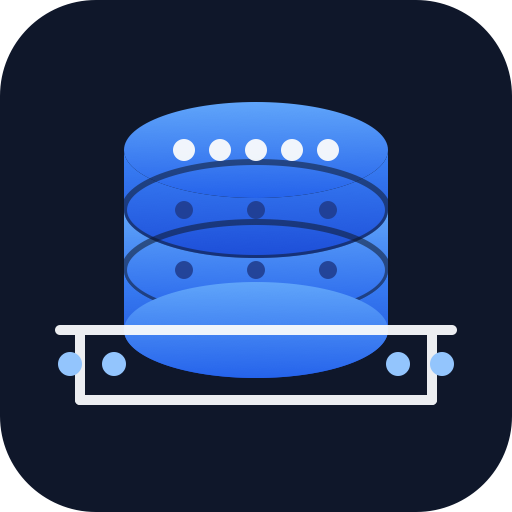
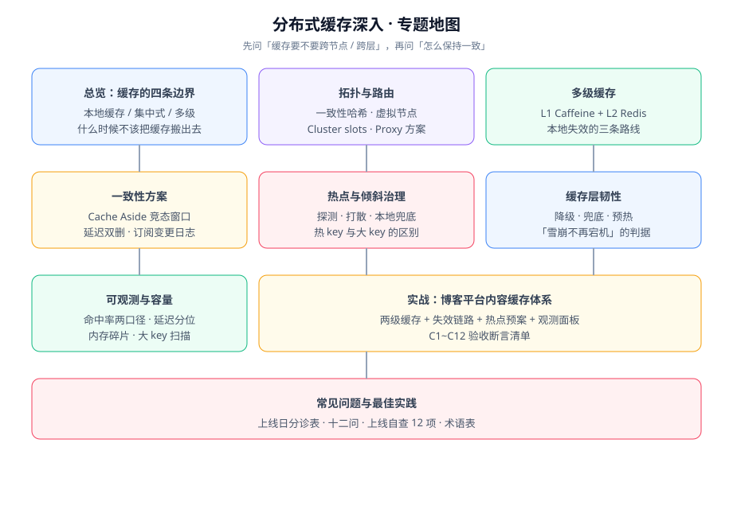

# 分布式缓存深入

分布式缓存解决的是「缓存不再只有一个进程、一份数据」之后出现的全部新问题：**多个实例各自的本地缓存怎么失效、缓存节点之间怎么路由、缓存与数据库之间怎么收敛、缓存整体挂掉时业务还能不能活**。本专题讲的是这四类问题的判据与做法，不讲 Redis 的命令（那是 [Redis 专题](../../DB/NoRelational/Redis/index.md) 的职责）。

::: tip 一句话理解
单机缓存的问题是「怎么少查一次库」，分布式缓存的问题是「**同一份数据存在好几处，你怎么知道每一处都是对的**」。前者的答案是一行代码，后者的答案是一套失效链路加一组观测指标。
:::

## 与相邻专题的分工

| 专题 | 讲什么 | 与本专题的关系 |
| --- | --- | --- |
| 本专题 | **跨节点、跨层**的缓存体系：拓扑与路由、多级失效、一致性方案、热点与韧性、观测 | —— |
| [Redis 基础](../../DB/NoRelational/Redis/index.md) | Redis 这个产品的数据结构、持久化、事务、发布订阅 | 本专题把它当成一个**共享存储**使用，不讲命令细节 |
| [Redis 进阶：缓存设计](../../DB/NoRelational/Redis/Advanced/CacheDesign/index.md) | 单应用视角的读写模式、key 设计、TTL、容量 | 本专题从「多实例、多层」的视角继续，不重复单机设计 |
| [Redis 进阶：缓存防护](../../DB/NoRelational/Redis/Advanced/CacheProtection/index.md) | 穿透、击穿、雪崩的**成因与单点防护手段** | 本专题讲这些故障在**分布式场景下的兜底与降级**，不重复成因 |
| [Redis 进阶：Cluster 分片集群](../../DB/NoRelational/Redis/Advanced/Cluster/index.md) | 槽位、重定向、迁移的**服务端实现** | 本专题讲「为什么要分片、路由表放在哪」这类选型与边界 |
| [高性能 Java](../HighPerformanceJava/index.md) | JVM 内存、GC、对象分配 | 本地缓存的内存占用与 GC 压力由该专题解释，本专题只讲缓存语义 |
| [Spring Boot 整合 Redis](../Java/Frame/SpringBoot/v3/Integration/Redis/index.md) | 客户端配置、序列化、连接池 | 本专题的代码示例建立在其配置之上，不重复依赖与配置细节 |
| [微服务 · 熔断限流](../Microservices/CircuitBreaker/index.md) | 超时、熔断、限流、降级的手段 | 本专题讲这些手段**用在缓存层**时的具体判据 |
| [项目实战 · 博客平台监控接入](/project/Complete/BlogPlatform/Monitoring/index.md) | 指标定义、标签纪律、面板 | 本专题实战章节的观测面板沿用其指标口径 |

## 专题地图

| 页面 | 内容 | 适合谁读 |
| --- | --- | --- |
| [总览：缓存的四条边界](./Overview/index.md) | 什么时候该把缓存搬出进程、什么时候不该；三类形态的取舍 | 所有人，先读 |
| [拓扑与路由](./Topology/index.md) | 一致性哈希与虚拟节点、三种拓扑对比、扩缩容与重平衡 | 做容量规划与选型的人 |
| [多级缓存深入](./MultiLevel/index.md) | L1/L2/L3 的职责划分、本地缓存失效的三条路线 | 写后端的人，**重点读** |
| [一致性方案深入](./Consistency/index.md) | Cache Aside 竞态、延迟双删、订阅变更日志、版本号与 CAS | 写后端的人，**重点读** |
| [热点与倾斜治理](./HotKey/index.md) | 热 key 探测、打散、本地兜底、大 key 拆分 | 做大促与高并发的人 |
| [缓存层韧性](./Availability/index.md) | 限流、熔断、多级兜底、冷启动预热与可验证判据 | 做稳定性的人 |
| [可观测与容量治理](./Observability/index.md) | 三层指标、成对判读的四组组合、由基线推导阈值 | 做运维与 SRE 的人 |
| [实战：博客平台内容缓存体系](./Practice/index.md) | 两级缓存 + 失效链路 + 热点预案，含 C1~C12 断言 | 想看完整过程的人 |
| [常见问题与最佳实践](./FAQ/index.md) | 分诊表、十二问、上线自查 12 项、术语表 | 所有人 |

## 版本状态速览

按 **2026-10** 口径联网核对，本专题涉及的工具与版本如下（**选型前请复核，客户端迭代很快**）：

| 组件 | 当前版本 | 关键约束 |
| --- | --- | --- |
| Redis | **8.10**（Q3 2026 GA）；8.8 / 8.6 / 8.4 / 8.0 为 Standard；8.2 为 Extended（**EOL 2030-09-01**） | 8.6 起新增热 key 相关能力；8.10 新增 `BACKUP` / `HIMPORT` / `LMOVEM` 等命令 |
| Caffeine（本地缓存） | **3.3.0**（2026-09-21） | 3.x 要求 **Java 11+**；Java 8 只能用 2.x 线 |
| Guava Cache | **33.7.2-jre**（2026-09-29） | 仍是 `jre`/`android` 双风味；新项目建议直接用 Caffeine |
| Lettuce | **7.8.0.RELEASE**（2026-09-24） | 要求 Java 8+，可与 Java 24 协作；已测试 Redis 8.10~7.2；**旧版客户端缓存（client-side caching）标记为废弃** |
| Jedis | **8.0.1**（2026-08-28） | **8.0.0 起删除 `JedisPooled` / `JedisSentineled`**，默认协商 RESP3 并强制 TLS 主机名校验；新类族是 `RedisClient` / `RedisClusterClient` / `RedisSentinelClient` |
| Redisson | **4.7.0**（2026-08-04） | Spring Boot 4.1 + Spring Data Redis 4.1 对应 `redisson-spring-data-41` |
| Spring Boot / Framework | **4.1.1** / **7.0.9** | Java 17 起；Boot 3.5 的 OSS 支持已于 **2026-06-30 结束** |

::: info 版本核对说明
以上版本按 Maven 中央仓库、官方发布公告与 GitHub Releases 核对（2026-10 口径）。**大版本差异写在各页的版本说明块里，不覆盖旧版本内容**：例如 Jedis 6.x/7.x 的 `JedisPool` 写法在各页以「旧版兼容提示」形式保留，便于存量项目对照。Redis 目前按单主题维护，尚未出现需要拆分的大型目录边界；若将来出现破坏性主版本，再按「官方名 + 大版本号」建目录并存。
:::

## 学习路径

1. **先读 [总览](./Overview/index.md)**：先判断你的项目**到底需不需要**把缓存搬出进程。多数项目不需要，这比学会多级缓存更重要。
2. **要做容量规划或选型的读 [拓扑与路由](./Topology/index.md)**：路由表放在哪，决定了你以后扩容的代价。
3. **已经有多实例的读 [多级缓存深入](./MultiLevel/index.md)**：本地那一层是全部难点的来源。
4. **动手写代码前必读 [一致性方案深入](./Consistency/index.md)**：脏读窗口不长，但一旦被写进缓存就长期存在。
5. **流量大的补充 [热点与倾斜治理](./HotKey/index.md)**，做稳定性的读 [缓存层韧性](./Availability/index.md)。
6. **上线前对照 [可观测与容量治理](./Observability/index.md)** 把指标补上，再走一遍 [实战](./Practice/index.md) 的 C1~C12 断言。

## 参考资料

- Redis 官方文档（含 Cluster 规范与客户端缓存）：https://redis.io/docs/latest/
- Caffeine 官方 Wiki（淘汰算法与 `refreshAfterWrite` 语义）：https://github.com/ben-manes/caffeine/wiki
- Lettuce 参考文档：https://lettuce.io/core/release/reference/
- Jedis 迁移说明（7.x → 8.x 的类族变更）：https://github.com/redis/jedis/releases
- Microsoft Azure Architecture Center · Cache-Aside 模式：https://learn.microsoft.com/azure/architecture/patterns/cache-aside
- Amazon Builders' Library · 缓存失效与一致性：https://aws.amazon.com/builders-library/caching-challenges-and-strategies/
