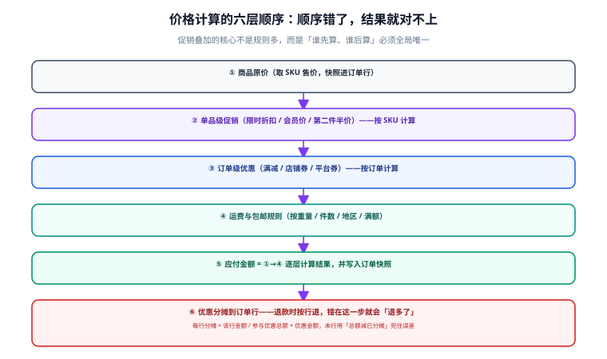

# 购物车与价格计算

购物车是电商里最「不起眼」却最容易埋雷的模块。它本身不涉及钱和货，但它决定了**用户看到的价格**，而「看到 99 元、下单变 109 元」是所有电商投诉里最常见的一类。本页讲清购物车该存什么、价格按什么顺序算、优惠怎么分摊到行。



## 一句话定位

**购物车只是「购买意向」的容器，不是价格的权威来源；价格的真值在「提交订单」那一刻重新计算并写入快照。** 认清这一点，很多纠结（要不要把优惠算进购物车、购物车价格多久刷新）就自然有答案了。

## 购物车的三种形态

| 形态 | 存储位置 | 何时使用 | 关键处理 |
| --- | --- | --- | --- |
| 游客购物车 | 浏览器本地（localStorage / Cookie） | 未登录 | 只存 `skuId` + 数量，**不存价格** |
| 会员购物车 | 服务端（Redis + MySQL） | 已登录 | 登录时把本地购物车**合并**进来 |
| 临时选中态 | 前端内存 | 勾选/取消 | 只影响结算范围，不落库 |

登录时的合并规则必须明确，否则会出现「登录后购物车数字变了」的投诉：

```text
合并口径（三选一，必须写进产品文档）：
① 数量相加（默认）：同 SKU 本地 2 件 + 服务端 3 件 = 5 件
② 取最大值：同 SKU 本地 2 件 + 服务端 3 件 = 3 件（避免用户被合并出预期外的量）
③ 服务端优先：忽略本地的同 SKU 条目

上限保护：合并后单 SKU 数量超过上限（如 200）则截断到上限并提示
```

::: tip 推荐的默认口径
**取最大值**通常比「数量相加」更好用：用户在多设备上各加了两件，相加变成四件会让他多付钱；取最大值符合「他想要的就是那么多」的直觉。但无论选哪个，**必须显式提示合并结果**。
:::

## 购物车存什么、不存什么

```sql [cart-schema.sql]
CREATE TABLE t_cart_item (
  id          BIGINT   NOT NULL AUTO_INCREMENT,
  user_id     BIGINT   NOT NULL,
  sku_id      BIGINT   NOT NULL,
  qty         INT      NOT NULL,
  checked     TINYINT  NOT NULL DEFAULT 1 COMMENT '是否勾选结算',
  create_time DATETIME NOT NULL DEFAULT CURRENT_TIMESTAMP,
  update_time DATETIME NOT NULL DEFAULT CURRENT_TIMESTAMP ON UPDATE CURRENT_TIMESTAMP,
  PRIMARY KEY (id),
  UNIQUE KEY uk_user_sku (user_id, sku_id),   -- 同一 SKU 在购物车里只能有一条
  KEY idx_user (user_id, update_time DESC),   -- 按最近操作排序
  CONSTRAINT ck_qty_positive CHECK (qty > 0)
) ENGINE = InnoDB DEFAULT CHARSET = utf8mb4 COMMENT = '购物车条目';
```

| 字段 | 存 | 原因 |
| --- | --- | --- |
| `sku_id` | ✅ | 购物车的核心，指向商品与库存 |
| `qty` | ✅ | 用户意图 |
| `checked` | ✅ | 结算范围 |
| 价格 | ❌ | 价格随时会变，存了就会过期；展示价在查询时实时带出 |
| 优惠明细 | ❌ | 优惠与「本次结算范围」强相关，下单时才算 |
| SPU 名称/主图 | ⚠️ 可冗余展示 | 只为列表渲染提速，**不作为权威数据** |

::: danger 三个常见设计错误
1. **把 `price` 存进购物车并在结算时直接用**。商品改价后，用户看到的还是旧价，下单时要么按旧价亏本、要么按新价被投诉。正确做法：**展示时实时查价，下单时校验并写入快照**。
2. **`uk_user_sku` 唯一约束缺失**。并发「加购」会在购物车里产生两条同 SKU 记录，结算时重复下单。
3. **购物车数量不设上限**。用户可以加到 999999，结算时把库存与价格计算全部拖垮。单 SKU 上限必须显式设定并在加购接口里拦截。
:::

## 价格计算的六层顺序

这是整个交易链路里最需要「全局唯一口径」的地方。**顺序一变，结果就变**，所以它必须是全公司统一的、写在代码里且被测试覆盖的。

| 层 | 内容 | 计算粒度 | 是否可叠加 |
| --- | --- | --- | --- |
| ① 商品原价 | SKU 售价 | 按 SKU | — |
| ② 单品级促销 | 限时折扣、会员价、第二件半价 | 按 SKU | 同一 SKU 通常**互斥**，取最优 |
| ③ 订单级优惠 | 满减、店铺券、平台券 | 按订单 | 视规则而定，需显式声明 |
| ④ 运费 | 按重量/件数/地区/满额包邮 | 按订单 | — |
| ⑤ 应付金额 | ①→④ 逐层结果 | 按订单 | — |
| ⑥ 优惠分摊 | 把 ③ 的优惠按行分摊 | 按订单行 | — |

```text
为什么顺序不能反？举一个反例：
  原价 100，有「满 100 减 20」和「9 折」两个活动。

  顺序 A（先折扣后满减）：100 × 0.9 = 90 → 不足 100，满减不生效 → 应付 90
  顺序 B（先满减后折扣）：100 - 20 = 80 → 再打 9 折 → 应付 72

同一个用户、同一套活动，结果差了 18 元。
所以「先算哪个」不是实现细节，而是必须由业务方拍板的规则。
```

::: warning 叠加规则必须用数据描述，不要写死在代码里
「哪些优惠能叠加」会随运营策略频繁变化。把它写成 `t_promotion` 表里的字段（`stackable`、`priority`、`mutex_group`），让运营可配置、让代码只管执行顺序。写死在 `if-else` 里的叠加规则，三个月后没人敢改。
:::

## 优惠分摊：退款按行退的基础

订单级优惠必须分摊到每一行，否则退掉其中一件商品时无法计算该退多少钱。

```text
分摊原则：
  行分摊额 = 该行参与金额 ÷ 参与优惠的行金额合计 × 优惠总额
  最后一行用「优惠总额 − 已分摊额」兜住，避免浮点与四舍五入误差

示例：满减 20 元，两行参与
  行 1：60 元 → 60/100 × 20 = 12.00
  行 2：40 元 → 40/100 × 20 =  8.00
  合计 20.00 ✓

边界：行 1：33.33、行 2：33.33、行 3：33.34，优惠 10 元
  行 1：3.333 → 3.33
  行 2：3.333 → 3.33
  行 3：10 − 3.33 − 3.33 = 3.34  ← 用减法兜住，保证合计精确等于 10.00
```

```java [PriceCalculator.java]
/** 计算订单行金额与优惠分摊（省略了促销引擎的细节，只保留金额计算骨架）。 */
public OrderAmount calc(List<OrderLine> lines, BigDecimal orderDiscount) {
    BigDecimal itemsTotal = lines.stream()
            .map(OrderLine::lineAmount)
            .reduce(BigDecimal.ZERO, BigDecimal::add);
    if (itemsTotal.signum() == 0) {
        throw new BizException(ErrorCode.EMPTY_ORDER);
    }

    BigDecimal allocated = BigDecimal.ZERO;
    for (int i = 0; i < lines.size(); i++) {
        OrderLine line = lines.get(i);
        BigDecimal share;
        if (i == lines.size() - 1) {
            // 最后一行用减法兜住误差，保证「分摊合计 == 优惠总额」
            share = orderDiscount.subtract(allocated);
        } else {
            share = orderDiscount
                    .multiply(line.lineAmount())
                    .divide(itemsTotal, 2, RoundingMode.DOWN);
            allocated = allocated.add(share);
        }
        if (share.signum() < 0) {
            throw new BizException(ErrorCode.PRICE_CALC_ERROR);
        }
        line.setDiscountShare(share);
        // 行实付不能为负：分档优惠叠加时可能出现
        if (line.lineAmount().subtract(share).signum() < 0) {
            throw new BizException(ErrorCode.PRICE_CALC_ERROR);
        }
    }
    return new OrderAmount(itemsTotal, orderDiscount);
}
```

::: danger 分摊里的三个坑
1. **浮点累加导致合计差 0.01**。一律用 `BigDecimal`，且**末行用减法兜住**。这个 0.01 在日订单量上万时会变成每天几十次对账差异。
2. **行实付为负**。多档优惠叠加（如「满 100 减 20」+「无条件减 50」）可能算出一行为负。必须显式校验并报错，而不是让它落库。
3. **退款时按比例重新算**。退款金额必须用**下单时存的分摊额**，不能用退款时的规则重算——规则可能已经变了（活动下线、SKU 改价）。
:::

## 完整示例：一次结算的价格快照

```sql [order-snapshot.sql]
-- 下单时写入的快照字段（订单行）
CREATE TABLE t_order_item (
  id              BIGINT        NOT NULL AUTO_INCREMENT,
  order_no        VARCHAR(32)   NOT NULL,
  sku_id          BIGINT        NOT NULL,
  sku_code        VARCHAR(64)   NOT NULL,
  sku_name_snap   VARCHAR(128)  NOT NULL COMMENT '商品名快照',
  spec_snap       VARCHAR(255)  NOT NULL COMMENT '规格快照，如「黑色 / 256G」',
  price_snap      DECIMAL(10,2) NOT NULL COMMENT '下单时单价快照',
  qty             INT           NOT NULL,
  line_amount     DECIMAL(10,2) NOT NULL COMMENT '行原价 = price_snap * qty',
  discount_share  DECIMAL(10,2) NOT NULL DEFAULT 0 COMMENT '该行分摊到的优惠',
  pay_amount      DECIMAL(10,2) NOT NULL COMMENT '行实付 = line_amount - discount_share',
  PRIMARY KEY (id),
  UNIQUE KEY uk_order_sku (order_no, sku_id),
  KEY idx_order (order_no)
) ENGINE = InnoDB DEFAULT CHARSET = utf8mb4 COMMENT = '订单行（含价格快照）';
```

```sql [verify.sql]
-- 验算：订单总额必须精确等于各行实付之和
SELECT o.order_no,
       o.pay_amount                        AS order_pay,
       SUM(i.pay_amount)                   AS items_pay,
       o.pay_amount - SUM(i.pay_amount)    AS diff
FROM t_order o
JOIN t_order_item i ON i.order_no = o.order_no
GROUP BY o.order_no
HAVING diff <> 0;
-- 预期：返回 0 行。任何一行都是分摊算错了
```

这个 `HAVING diff <> 0` 的查询可以直接做成**每日对账任务**，把分摊误差在用户投诉之前抓出来。

## 常用清单

| 场景 | 做法 |
| --- | --- |
| 购物车价格显示 | 实时查 SKU 售价 + 实时试算促销，**不落库** |
| 活动开始/结束瞬间 | 定时任务刷新活动状态，购物车**不做缓存**或缓存 TTL ≤ 10 秒 |
| 商品下架/删除 | 购物车条目标记为失效，结算时排除并提示 |
| 库存不足 | 购物车**不校验**（避免每次刷新都查库存），结算时统一校验 |
| 加购上限 | 单 SKU ≤ 200，单用户条目 ≤ 100，超限返回明确错误 |
| 下单价格变化 | 校验并**明确提示**「价格已从 99 变为 109，是否继续」，不静默成交 |

## 易错点与最佳实践

::: danger 六个高频错误
1. **把购物车做成「价格权威」**。购物车只是意向，价格必须在下单时重算并快照。
2. **促销叠加规则写死在代码里**。运营改一次就要发一次版，最终没人敢改。
3. **用 `double`/`float` 算金额**。`0.1 + 0.2 != 0.3`，退款金额对不上时排查成本极高。
4. **优惠分摊用「按行比例四舍五入」且不兜底**。合计会差几分钱，日积月累变成对账差异。
5. **退款时用当前规则重算**。活动已下线、商品已改价，重算结果必然对不上。
6. **购物车接口每次都查库存**。购物车是最热的页面之一，查库存会把交易库压力放大数倍。库存校验放在结算与下单。
:::

::: tip 一个便宜的加固手段
下单接口收到的价格明细（每行单价、优惠额）可以让客户端**一并回传**，服务端与自己的计算结果比对：不一致则拒绝。这能顺带拦住「客户端篡改价格」这类攻击，代价只是几个字段。
:::

## 验证方式

1. 执行 `verify.sql` 的对账查询，确认返回 0 行。
2. 构造「三行 33.33/33.33/33.34、优惠 10 元」的场景，确认分摊结果为 3.33 / 3.33 / 3.34，**合计精确等于 10.00**。
3. 构造「满 100 减 20 + 9 折」，确认结果与业务方确认的顺序一致（且写进测试用例，防止后续被改）。
4. 同一 `user_id` 并发调用两次加购接口，确认 `uk_user_sku` 生效、不产生两条记录。
5. 加购 999999 件，确认被上限拦截并返回明确错误码。

| 检查项 | 期望 | 实测 | 结论 |
| --- | --- | --- | --- |
| 订单总额 = 各行实付之和 | 差异行数为 0 | 待填写 | ⏳ |
| 三分摊边界（10 元） | 3.33 / 3.33 / 3.34 | 待填写 | ⏳ |
| 叠加顺序 | 与业务确认口径一致 | 待填写 | ⏳ |
| 并发加购 | 只一条记录 | 待填写 | ⏳ |
| 加购上限 | 被拦截并给出错误码 | 待填写 | ⏳ |
| 行实付为负 | 明确报错而非落库 | 待填写 | ⏳ |

## 相关页面

- 上一页：[商品与领域建模](../DomainModeling/index.md)
- 下一页：[订单状态机](../OrderStateMachine/index.md)
- 金额落地：[支付、幂等与对账](../Payment/index.md)

## 参考资料

- [Oracle Java 文档 · BigDecimal](https://docs.oracle.com/en/java/javase/25/docs/api/java.base/java/math/BigDecimal.html)：金额计算必须使用的类型
- [IEEE 754 浮点标准](https://ieeexplore.ieee.org/document/8766229)：为什么不能用 `double` 算钱
- [MySQL 8.4 · DECIMAL 类型](https://dev.mysql.com/doc/refman/8.4/en/fixed-point-types.html)
