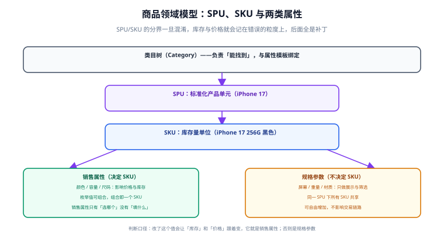

# 商品与领域建模

商品建模是电商系统的地基：**库存、价格、订单行、搜索筛选全都挂在商品模型上**。这一层分错了，后面每个功能都要打补丁。本页把「类目、SPU、SKU、属性」四个概念的关系讲清，并给出可直接执行的建表语句。



## 一句话定位

**类目负责「能不能被找到」，SPU 负责「是不是同一款商品」，SKU 负责「库存和价格记在谁头上」。** 三者的职责一旦混淆——比如把库存记在 SPU 上——就会出现「黑色卖光了但白色也下不了单」这类无法用代码修补的问题。

## 三个概念与一层附加

| 概念 | 英文 | 粒度示例 | 职责 | 关键点 |
| --- | --- | --- | --- | --- |
| 类目 | Category | 数码 > 手机 > 智能手机 | 搜索、筛选、绑定属性模板 | 呈树形，改动成本高 |
| SPU | Standard Product Unit | iPhone 17 | 聚合同款的不同规格 | 只放**共享信息**（名称、品牌、图文详情） |
| SKU | Stock Keeping Unit | iPhone 17 / 256G / 黑色 | **库存与价格的唯一载体** | 每个 SKU 独立管理库存与价格 |
| 属性 | Attribute | 颜色、容量、屏幕尺寸 | 描述与筛选 | 分销售属性与规格参数两类 |

::: tip 一句话判断口径
**改了这个值，会不会让「库存」和「价格」跟着变？会 → 它是销售属性（决定 SKU）；不会 → 它是规格参数（只做展示与筛选）。**
:::

## 两类属性：为什么必须分开

这是整个商品建模里最容易做错的地方。

| 维度 | 销售属性（Sale Attribute） | 规格参数（Spec Attribute） |
| --- | --- | --- |
| 作用 | 决定 SKU 的生成 | 只用于展示与筛选 |
| 取值方式 | 从预定义字典里**选**（枚举） | 可**填**（文本、数值、单位） |
| 示例 | 颜色、容量、尺码、口味 | 屏幕尺寸、重量、材质、产地 |
| 组合 | 各销售属性的取值**笛卡尔积** = SKU 候选集 | 不参与组合 |
| 影响交易 | 影响价格与库存 | 不影响 |
| 能否后续新增 | 可以，但会**新增 SKU**（需补库存与价格） | 可以，随时加，不影响交易链路 |

```text
iPhone 17（SPU）
├─ 销售属性：颜色 = {黑色, 白色}、容量 = {256G, 512G}
│   → 候选 SKU 4 个：黑/256、黑/512、白/256、白/512
│   → 每个 SKU 各自有自己的库存、价格、条码
└─ 规格参数：屏幕 6.3 英寸、重量 170g、材质 铝金属 + 玻璃
    → 四个 SKU 共享，只在详情页展示与筛选里用到
```

::: danger 把规格参数当销售属性的两个后果
1. **SKU 数量爆炸**：把「产地」也做成销售属性，SKU 从 4 个变成 12 个，运营需要给每个组合单独配库存和价格——而实际上各产地的库存是共用的。
2. **筛选口径混乱**：规格参数参与筛选时按「SPU 维度」聚合，销售属性按「SKU 维度」。混在一起后，「筛选屏幕尺寸 6.3 英寸」的结果里会混进不该出现的 SKU。
:::

## 类目树的设计取舍

类目是树，但**树的深度和稳定性**需要提前约定：

| 做法 | 优点 | 代价 | 什么时候选 |
| --- | --- | --- | --- |
| 固定三级 | 前端展示稳定、导航简单 | 新品类可能塞不进去 | 自营电商、品类可控 |
| 任意层级（`parent_id` + `path`） | 灵活 | 查询需要递归或路径匹配 | 平台型、多品类 |
| 类目与品牌并列 | 筛选维度更细 | 交叉筛选组合变多 | 3C、家电等强品牌品类 |

类目树的两条纪律：

1. **类目一旦被商品使用，就不允许改变层级关系**（只能改名、排序）。改变层级会让已有的筛选条件与属性模板失效。
2. **类目与属性模板绑定**：进入「手机」类目，发布商品时自动带出该类的销售属性与规格参数字典，运营不需要手填属性名。这能把「同一类商品属性名不一致」的问题从根上消掉。

## 表结构

```sql [product-schema.sql]
-- 类目（树形，用 path 避免递归查询）
CREATE TABLE t_category (
  category_id BIGINT       NOT NULL,
  parent_id   BIGINT       NOT NULL DEFAULT 0 COMMENT '0 表示根',
  name        VARCHAR(64)  NOT NULL,
  level       TINYINT      NOT NULL COMMENT '层级，从 1 开始',
  path        VARCHAR(255) NOT NULL COMMENT '祖先路径，如 /1/12/120/ ，便于查子树',
  sort        INT          NOT NULL DEFAULT 0,
  status      TINYINT      NOT NULL DEFAULT 1 COMMENT '1 启用 0 停用',
  PRIMARY KEY (category_id),
  KEY idx_parent (parent_id),
  KEY idx_path (path(64))
) ENGINE = InnoDB DEFAULT CHARSET = utf8mb4 COMMENT = '商品类目';

-- SPU：只放共享信息
CREATE TABLE t_spu (
  spu_id      BIGINT       NOT NULL,
  category_id BIGINT       NOT NULL,
  brand_id    BIGINT       NOT NULL DEFAULT 0,
  name        VARCHAR(128) NOT NULL,
  shop_id     BIGINT       NOT NULL DEFAULT 0 COMMENT '多商家时使用',
  detail_html MEDIUMTEXT   COMMENT '图文详情（生产环境常拆到对象存储，只存 URL）',
  status      TINYINT      NOT NULL DEFAULT 0 COMMENT '0 草稿 1 上架 2 下架',
  create_time DATETIME     NOT NULL DEFAULT CURRENT_TIMESTAMP,
  update_time DATETIME     NOT NULL DEFAULT CURRENT_TIMESTAMP ON UPDATE CURRENT_TIMESTAMP,
  PRIMARY KEY (spu_id),
  KEY idx_category_status (category_id, status)
) ENGINE = InnoDB DEFAULT CHARSET = utf8mb4 COMMENT = '标准化产品单元';

-- SKU：库存与价格的唯一载体
CREATE TABLE t_sku (
  sku_id      BIGINT        NOT NULL,
  spu_id      BIGINT        NOT NULL,
  sku_code    VARCHAR(64)   NOT NULL COMMENT '对外业务编码，不暴露自增主键',
  price       DECIMAL(10,2) NOT NULL COMMENT '售价（元）',
  market_price DECIMAL(10,2) NULL     COMMENT '划线价，仅展示',
  stock       INT           NOT NULL DEFAULT 0 COMMENT '可售库存',
  locked_stock INT          NOT NULL DEFAULT 0 COMMENT '预占库存',
  spec_json   JSON          NOT NULL COMMENT '销售属性组合，如 {"颜色":"黑","容量":"256G"}',
  status      TINYINT       NOT NULL DEFAULT 1,
  PRIMARY KEY (sku_id),
  UNIQUE KEY uk_sku_code (sku_code),
  KEY idx_spu_status (spu_id, status),
  CONSTRAINT ck_price_non_negative CHECK (price >= 0),
  CONSTRAINT ck_stock_non_negative CHECK (stock >= 0)
) ENGINE = InnoDB DEFAULT CHARSET = utf8mb4 COMMENT = '库存量单位';

-- 属性定义（按类目绑定）
CREATE TABLE t_attribute (
  attr_id     BIGINT      NOT NULL,
  category_id BIGINT      NOT NULL,
  name        VARCHAR(64) NOT NULL,
  attr_type   TINYINT     NOT NULL COMMENT '1 销售属性 2 规格参数',
  input_type  VARCHAR(16) NOT NULL COMMENT 'select / text / number',
  unit        VARCHAR(16) NULL,
  required    TINYINT     NOT NULL DEFAULT 0,
  PRIMARY KEY (attr_id),
  KEY idx_category (category_id, attr_type)
) ENGINE = InnoDB DEFAULT CHARSET = utf8mb4 COMMENT = '类目属性模板';

-- SPU 级规格参数值（销售属性值存在 t_sku.spec_json 里）
CREATE TABLE t_spu_attr_value (
  id        BIGINT       NOT NULL AUTO_INCREMENT,
  spu_id    BIGINT       NOT NULL,
  attr_id   BIGINT       NOT NULL,
  value     VARCHAR(255) NOT NULL,
  PRIMARY KEY (id),
  UNIQUE KEY uk_spu_attr (spu_id, attr_id)
) ENGINE = InnoDB DEFAULT CHARSET = utf8mb4 COMMENT = 'SPU 规格参数值';
```

::: warning `spec_json` 用 JSON 类型但不要拿它做筛选
`spec_json` 适合**存与展示**，不适合做「按颜色筛选」这类查询——JSON 上的条件匹配无法有效利用 B+ 树索引（MySQL 8 的生成列 + 索引可以缓解，但组合维度一多就会失控）。正确做法是把需要筛选的销售属性**冗余成列**（如 `color`、`capacity`），或在搜索侧（Elasticsearch）做筛选。
:::

## 完整示例：发布一个商品并验算 SKU

```sql [publish.sql]
-- 1) 类目：手机（挂在「数码 / 手机」下）
INSERT INTO t_category(category_id, parent_id, name, level, path, sort) VALUES
  (1,   0,  '数码',     1, '/1/',        1),
  (12,  1,  '手机',     2, '/1/12/',     1),
  (120, 12, '智能手机', 3, '/1/12/120/', 1);

-- 2) 属性模板：颜色与容量是销售属性，屏幕尺寸是规格参数
INSERT INTO t_attribute(attr_id, category_id, name, attr_type, input_type, required) VALUES
  (301, 120, '颜色',     1, 'select', 1),
  (302, 120, '容量',     1, 'select', 1),
  (401, 120, '屏幕尺寸', 2, 'text',   0);

-- 3) SPU
INSERT INTO t_spu(spu_id, category_id, brand_id, name, status) VALUES
  (2001, 120, 88, 'iPhone 17', 1);

-- 4) 四个 SKU（销售属性的笛卡尔积，各配价格与库存）
INSERT INTO t_sku(sku_id, spu_id, sku_code, price, stock, spec_json) VALUES
  (1001, 2001, 'IP17-BK-256', 5999.00, 10, '{"颜色":"黑色","容量":"256G"}'),
  (1002, 2001, 'IP17-BK-512', 6999.00,  5, '{"颜色":"黑色","容量":"512G"}'),
  (1003, 2001, 'IP17-WT-256', 5999.00,  8, '{"颜色":"白色","容量":"256G"}'),
  (1004, 2001, 'IP17-WT-512', 6999.00,  0, '{"颜色":"白色","容量":"512G"}');

-- 5) SPU 级规格参数
INSERT INTO t_spu_attr_value(spu_id, attr_id, value) VALUES
  (2001, 401, '6.3 英寸');

-- 6) 验算：查该 SPU 的可售 SKU，并检查 SKU 数是否等于销售属性取值的笛卡尔积
SELECT sku_id, sku_code, price, stock, spec_json
FROM t_sku
WHERE spu_id = 2001 AND status = 1 AND stock > 0
ORDER BY sku_id;
-- 预期：3 行（1001 / 1002 / 1003），1004 因库存为 0 被排除

SELECT COUNT(*) AS sku_total FROM t_sku WHERE spu_id = 2001;
-- 预期：4（= 颜色 2 种 × 容量 2 种），不等于 4 说明有组合漏配
```

第 6 步的第二个查询是一个**便宜且有效的完整性检查**：SKU 数必须等于销售属性取值个数的乘积。生产上可以把它做成定时校验，把「漏配组合」在运营发现之前找出来。

## 常用清单

| 场景 | 做法 | 注意 |
| --- | --- | --- |
| 新增销售属性值 | 补 SKU 记录（库存默认 0），商品页显示为「暂无库存」 | 不要静默复用其他 SKU 的库存 |
| 商品下架 | 改 `t_spu.status = 2`，**不动 SKU 库存** | 下架不退款、不清库存，恢复上架后库存仍在 |
| 单 SKU 停售 | 改 `t_sku.status = 0` | 已下单的订单不受影响（订单行是快照） |
| 改价 | 改 `t_sku.price` | **历史订单不受影响**——订单行存的是下单时的价格快照 |
| 类目改名 | 允许 | 类目**层级**不允许改 |
| 删除类目 | 只允许删除无商品、无子类的类目 | 生产环境更推荐「停用」而不是删除 |

## 易错点与最佳实践

::: danger 五个高频错误
1. **把库存记在 SPU 上**。iPhone 17 有 4 个 SKU，「黑色 256G 卖光」和「白色 512G 有货」无法同时表达。
2. **`sku_code` 用自增主键代替**。对外暴露自增 ID 会泄露业务量，且分库分表后无法平滑迁移。用有业务含义且不可推测的编码。
3. **销售属性用自由文本**。运营填「黑」「黑色」「BLACK」，筛选直接失效。销售属性值必须来自字典表。
4. **用 `spec_json` 做筛选查询**。JSON 条件匹配无法走普通索引，数据量一大就全表扫描。
5. **SPU 上放会随 SKU 变化的信息**。把「价格区间」写死在 SPU 上，SKU 改价后 SPU 的区间就错了——区间应由查询实时计算（`MIN(price)` / `MAX(price)`）。
:::

::: tip 图片放哪里
商品图分三类，存储位置不同：**主图/轮播图**（每 SKU 一组，放 `t_sku_image`）、**详情图**（SPU 共享，生产环境存对象存储只留 URL）、**规格图**（销售属性值级别，如「黑色」对应的色块图）。数据库里**只存 URL**，图片本体进对象存储 + CDN——把图片存进数据库，备份与迁移都会被拖垮。
:::

## 验证方式

1. 执行上面的 `publish.sql`，确认第 6 步两个查询的返回行数分别为 3 与 4。
2. 故意插入一个与已有 SKU 相同 `sku_code` 的记录，确认**唯一约束拒绝**——这是防止重复 SKU 的物理保证。
3. 故意把 `stock` 更新为负数，确认 `CHECK` 约束拒绝。
4. 查询「按颜色筛选黑色」的结果，确认走的是冗余列或搜索索引，`EXPLAIN` 中**不出现 `Using filesort` 与全表扫描**。

| 检查项 | 期望 | 实测 | 结论 |
| --- | --- | --- | --- |
| SPU 可售 SKU 查询 | 3 行（排除 0 库存） | 待填写 | ⏳ |
| SKU 数 = 笛卡尔积 | 4 = 2 × 2 | 待填写 | ⏳ |
| 重复 `sku_code` | 被唯一约束拒绝 | 待填写 | ⏳ |
| 负库存 | 被 CHECK 约束拒绝 | 待填写 | ⏳ |
| 改 SKU 价格后查历史订单 | 金额不变（走快照） | 待填写 | ⏳ |

## 参考资料

- [MySQL 8.4 · JSON 类型与生成列索引](https://dev.mysql.com/doc/refman/8.4/en/create-table-generated-columns.html)
- [MySQL 8.4 · CHECK 约束](https://dev.mysql.com/doc/refman/8.4/en/create-table-check-constraints.html)
- [Elasticsearch 官方文档](https://www.elastic.co/docs)：商品筛选与全文检索的落地位置
- [阿里巴巴 Java 开发手册 · 建表规约](https://github.com/alibaba/p3c)
