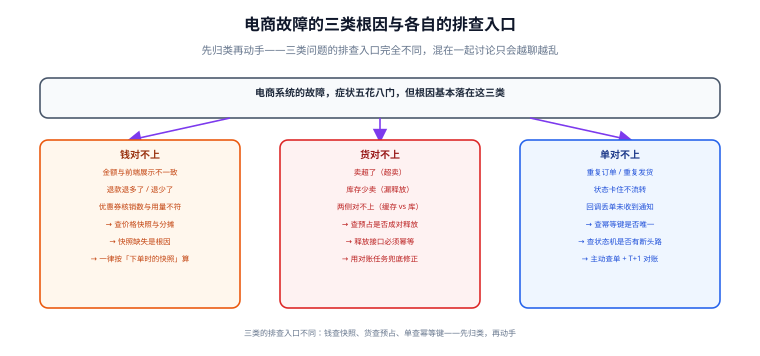

# 常见问题与排错

电商系统的故障有个特点：**症状千变万化，根因基本落在三类**——钱对不上、货对不上、单对不上。本页提供一套「先归类、再动手」的排查路径，以及可直接执行的诊断 SQL，避免在几十张表里盲搜。



## 一句话定位

**排查电商问题的效率，取决于「能不能在三十秒内把它归到钱、货、单三类中的一类」。** 归类之后，排查入口是确定的（钱查快照、货查预占、单查幂等键），剩下的只是耐心。

## 三句通用追问

不管问题表现成什么样，先问这三句，绝大多数情况能立刻定位方向：

1. **这个数字是什么时候算出来的？** —— 如果不是「下单那一刻」，就要怀疑快照缺失。
2. **这个操作重复执行一次会怎样？** —— 如果答不上来，就大概率是幂等问题。
3. **这条记录是怎么变成现在这个状态的？** —— 如果查不到流转记录，就是审计缺失，此时应该先补审计再排查。

## 第一类：钱对不上

| 症状 | 最可能的根因 | 排查入口 |
| --- | --- | --- |
| 前端显示 99，下单变 109 | 下单时按当前价重算而未校验提示 | 比对订单行 `price_snap` 与下单时的 SKU 售价 |
| 退款退多了 | 未按下单时的分摊额退，而是按当前规则重算 | 查 `t_order_item.discount_share` 与退款单金额 |
| 退款退少了 | 优惠分摊时末行未用减法兜底，累计误差 | 跑[分摊对账 SQL](#诊断-sql-速查) |
| 优惠券核销数与用量不符 | 核销与订单未成对，或取消订单未退券 | 查券的核销记录与订单状态 |
| 订单总额 ≠ 各行实付之和 | 分摊算法有误（浮点或漏算行） | `HAVING diff <> 0` 对账 |

```sql
-- 钱类问题的第一诊断：订单总额与各行实付之和是否一致
SELECT o.order_no, o.pay_amount, SUM(i.pay_amount) AS items_pay,
       o.pay_amount - SUM(i.pay_amount) AS diff
FROM t_order o JOIN t_order_item i ON i.order_no = o.order_no
GROUP BY o.order_no
HAVING diff <> 0;

-- 价格快照与当前售价的差异（用于判断「是否价格变了」而非「是否算错了」）
SELECT i.order_no, i.sku_id, i.price_snap, s.price AS current_price,
       i.price_snap - s.price AS diff
FROM t_order_item i JOIN t_sku s ON s.sku_id = i.sku_id
WHERE i.price_snap <> s.price
LIMIT 50;
```

::: tip 价格差异不一定是 bug
第二个查询返回大量行是**正常的**——商品本来就会改价。它的用途是：当用户投诉「价格不一致」时，快速确认「是下单后改价（正常）」还是「下单时就算错了（异常）。**关键是判断 `price_snap` 是否等于「下单那一刻」的售价，而不是等于当前售价。**
:::

## 第二类：货对不上

| 症状 | 最可能的根因 | 排查入口 |
| --- | --- | --- |
| 超卖 | 用「先查再改」代替条件更新；或有人绕过统一入口 | 查是否 `stock < 0`；查代码中所有 `UPDATE t_sku` |
| 少卖（库存越用越少） | 预占未释放，或释放时把「已释放」当失败吞掉 | 查 `locked_stock` 是否长期不降 |
| 缓存与库不一致 | 预扣后未回滚，或 Redis 键残留 | 比对 Redis 键与 `t_sku.stock` |
| 取消订单后库存没回来 | 取消只改状态、未做释放副作用 | 查订单是否有对应的 `RELEASE` 流水 |
| 库存为「0」但商品仍可下单 | 校验读的是缓存而非条件更新结果 | 检查下单路径是否真的走了条件更新 |

```sql
-- 货类问题的第一诊断：恒等式是否成立
SELECT sku_id, stock, locked_stock, shipped_qty, total_stock,
       stock + locked_stock + shipped_qty - total_stock AS diff
FROM t_sku
WHERE stock + locked_stock + shipped_qty <> total_stock;

-- 库存为负（超卖的确证）
SELECT sku_id, stock, locked_stock FROM t_sku WHERE stock < 0 OR locked_stock < 0;

-- 长期未释放的预占（locked_stock 不为 0，但没有对应的待支付订单）
SELECT s.sku_id, s.locked_stock
FROM t_sku s
WHERE s.locked_stock > 0
  AND NOT EXISTS (
    SELECT 1 FROM t_order o
    WHERE o.status = 'PENDING_PAY' AND o.order_no IN (
      SELECT l.biz_no FROM t_stock_log l
      WHERE l.sku_id = s.sku_id AND l.biz_type = 'ORDER_LOCK'
    )
  );

-- 有扣减无释放的订单（预占漏释放的确证）
SELECT l1.biz_no AS order_no, l1.sku_id, -l1.qty AS locked_qty
FROM t_stock_log l1
WHERE l1.biz_type = 'ORDER_LOCK'
  AND NOT EXISTS (
    SELECT 1 FROM t_stock_log l2
    WHERE l2.biz_no = l1.biz_no AND l2.biz_type IN ('RELEASE', 'ORDER_CONFIRM')
  )
  AND NOT EXISTS (
    SELECT 1 FROM t_order o
    WHERE o.order_no = l1.biz_no AND o.status = 'PENDING_PAY'
  );
```

## 第三类：单对不上

| 症状 | 最可能的根因 | 排查入口 |
| --- | --- | --- |
| 重复订单 | 幂等键缺失或未落唯一约束 | 查 `t_order` 是否有同幂等键的多条记录 |
| 重复发货 | 发货事件未幂等 | 查 `t_order_status_log` 是否有两次 `SHIP` |
| 状态卡住不流转 | 状态机缺边，或副作用失败导致事务回滚 | 查该单最后一条状态日志与事件 |
| 支付成功但订单未变已支付 | 回调丢单，或回调处理失败未重试 | 比对 `t_payment.status` 与 `t_order.status` |
| 已取消订单又变成已支付 | 终态未做校验，双向状态混流 | 查状态日志中的 `from_status` 序列 |

```sql
-- 单类问题的第一诊断：支付单成功但订单未推进
SELECT p.pay_no, p.order_no, p.status AS pay_status, o.status AS order_status, p.pay_time
FROM t_payment p JOIN t_order o ON o.order_no = p.order_no
WHERE p.status = 'SUCCESS' AND o.status = 'PENDING_PAY';

-- 重复订单（同一幂等键产生多个订单）
SELECT idem_key, COUNT(*) AS cnt FROM t_order
WHERE idem_key IS NOT NULL
GROUP BY idem_key HAVING cnt > 1;

-- 逆向流转（从终态又回到非终态，必然异常）
SELECT order_no, from_status, to_status, event, operator, create_time
FROM t_order_status_log
WHERE from_status IN ('COMPLETED', 'CANCELLED', 'REFUNDED')
ORDER BY order_no, id;

-- 同一订单同一事件重复成功（发货两次的确证）
SELECT order_no, event, COUNT(*) AS cnt
FROM t_order_status_log
GROUP BY order_no, event HAVING cnt > 1;
```

::: danger 排查时的三个反模式
1. **先改数据再查原因**。把 `stock` 手动调平，证据就消失了。**先查清、留证、再修正**，修正过程也要写进流水。
2. **只看当前状态、不看历史**。`t_order.status` 只告诉你「现在是什么」，`t_order_status_log` 才告诉你「怎么变的」。没有日志的表必须补上。
3. **在线上直接跑全表扫描的诊断 SQL**。上面的 SQL 在生产上都要加 `LIMIT` 或限定时间范围，否则诊断本身会把库拖垮。
:::

## 快速自查表

| 你看到的现象 | 先归到哪类 | 第一个要执行的动作 |
| --- | --- | --- |
| 金额不符 | 钱 | 跑「订单总额 = 各行实付之和」对账 |
| 退款金额不对 | 钱 | 查该行的 `discount_share` 快照 |
| 卖超了 | 货 | 查 `stock < 0`；查代码里所有裸 `UPDATE t_sku` |
| 库存少卖 | 货 | 查「有扣减无释放」的订单 |
| 重复订单 | 单 | 查幂等键是否唯一 |
| 状态卡住 | 单 | 查该单最后一条状态日志 |
| 付了钱订单没变 | 单 | 比对支付单与订单状态 |
| 用户说「我明明付款了」 | 单 | 用 `pay_no` 反查全链路 |

## 诊断 SQL 速查

```sql
-- ① 一次看全某订单的所有信息（把 order_no 换成排查对象）
SELECT o.order_no, o.status AS order_status, o.pay_amount,
       o.goods_amount, o.discount_amount, o.freight_amount, o.create_time
FROM t_order o WHERE o.order_no = 'SO20260919000001';

SELECT i.sku_id, i.sku_name_snap, i.price_snap, i.qty,
       i.line_amount, i.discount_share, i.pay_amount
FROM t_order_item i WHERE i.order_no = 'SO20260919000001';

SELECT p.pay_no, p.channel, p.channel_trade_no, p.amount, p.status, p.pay_time
FROM t_payment p WHERE p.order_no = 'SO20260919000001';

SELECT from_status, to_status, event, operator, remark, create_time
FROM t_order_status_log WHERE order_no = 'SO20260919000001' ORDER BY id;

SELECT biz_type, qty, create_time
FROM t_stock_log WHERE biz_no = 'SO20260919000001' ORDER BY id;

-- ② 全链路一致性体检（可直接做成每日报告）
-- 体检 1：订单总额与行合计
SELECT COUNT(*) AS bad_orders FROM (
  SELECT o.order_no FROM t_order o JOIN t_order_item i ON i.order_no = o.order_no
  GROUP BY o.order_no HAVING o.pay_amount <> SUM(i.pay_amount)
) t;

-- 体检 2：库存恒等式
SELECT COUNT(*) AS bad_skus FROM t_sku
WHERE stock + locked_stock + shipped_qty <> total_stock;

-- 体检 3：支付成功但订单未推进
SELECT COUNT(*) AS pending_after_pay
FROM t_payment p JOIN t_order o ON o.order_no = p.order_no
WHERE p.status = 'SUCCESS' AND o.status = 'PENDING_PAY';

-- 体检 4：预占有扣无放（排除仍在待支付的订单）
SELECT COUNT(*) AS unreleased FROM t_stock_log l1
WHERE l1.biz_type = 'ORDER_LOCK'
  AND NOT EXISTS (SELECT 1 FROM t_stock_log l2
                  WHERE l2.biz_no = l1.biz_no
                    AND l2.biz_type IN ('RELEASE', 'ORDER_CONFIRM'))
  AND NOT EXISTS (SELECT 1 FROM t_order o
                  WHERE o.order_no = l1.biz_no AND o.status = 'PENDING_PAY');
```

**把这四项体检做成每天定时执行的报告**，比任何监控面板都实用：它们的输出都是「应该为 0 的计数」，非 0 即告警，不需要解读阈值。

## 易错点与最佳实践

::: danger 六个让排查变难的自身习惯
1. **没有审计日志**。状态变了、库存动了，却查不到是谁改的。`t_order_status_log` 与 `t_stock_log` 不是可选项。
2. **状态用数字存且无文档**。排查时要在脑子里做一次映射，慢且容易错。
3. **日志里没有业务单号**。只有 `traceId` 而没有 `orderNo`，无法从日志反查业务对象。**关键操作的日志必须带业务单号。**
4. **错误信息太笼统**。「操作失败」这四个字对排查毫无帮助。要说清「哪个对象、什么原因、当前值是什么、期望是什么」。
5. **响应体回显原始报文**。既泄露敏感信息，又让日志淹在噪音里。
6. **排查完不写结论**。同一种故障三个月后会再排查一遍。**把结论补进文档或告警规则里，才算排查完成。**
:::

::: tip 一句话总结排查方法
**先归类（钱 / 货 / 单）→ 再找证据（流水与审计日志）→ 最后才改数据。** 跳过第一步会盲搜，跳过第二步会改错，跳过第三步的谨慎会丢证据。
:::

## 验证方式

1. 在测试库中人为制造四类故障（分摊误差、库存为负、支付成功订单未推进、预占漏释放），确认上面的诊断 SQL **各自能精确识别**。
2. 执行「全链路一致性体检」四项，确认在健康数据上全部返回 0。
3. 挑一笔正常订单，只用 `order_no` 跑一遍「一次看全某订单的所有信息」，确认能还原出完整的下单 → 支付 → 状态流转 → 库存变动链路。
4. 检查所有交易接口的错误响应：**不含堆栈、不含类名、不含 SQL、不含原始报文**，且 message 里包含可行动的信息。

| 检查项 | 期望 | 实测 | 结论 |
| --- | --- | --- | --- |
| 四项体检（健康数据） | 全部为 0 | 待填写 | ⏳ |
| 分摊误差 | 能识别 | 待填写 | ⏳ |
| 库存为负 | 能识别 | 待填写 | ⏳ |
| 支付成功订单未推进 | 能识别 | 待填写 | ⏳ |
| 预占漏释放 | 能识别 | 待填写 | ⏳ |
| 错误响应脱敏 | 无堆栈/类名/SQL/报文 | 待填写 | ⏳ |

## 相关页面

- 钱类问题的设计依据：[购物车与价格计算](../Cart/index.md)
- 货类问题的设计依据：[库存模型与超卖防护](../Inventory/index.md)
- 单类问题的设计依据：[订单状态机](../OrderStateMachine/index.md) ｜ [支付、幂等与对账](../Payment/index.md)
- 峰值场景的排错：[秒杀与流量治理](../FlashSale/index.md)
- 通用排错方法：[完整项目交付 · 常见问题与排错](../../../Others/ProjectDelivery/FAQ/index.md)

## 参考资料

- [Google SRE Book · Monitoring Distributed Systems](https://sre.google/sre-book/monitoring-distributed-systems/)
- [MySQL 8.4 · `EXPLAIN` 输出说明](https://dev.mysql.com/doc/refman/8.4/en/explain-output.html)
- [Alibaba Java 开发手册 · 日志规约](https://github.com/alibaba/p3c)
