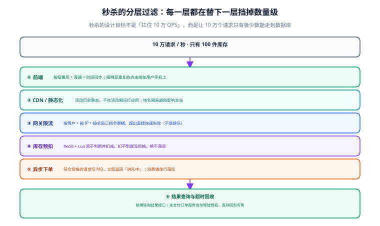

# 秒杀与流量治理

秒杀（Flash Sale）是电商里最极端的一类场景：**极少的库存 × 极短的窗口 × 极大的瞬时流量**。它的设计目标不是「扛住 10 万 QPS」，而是**让 10 万个请求里只有极少数能走到数据库**。本页按六层过滤拆解，每层都说清它在替下一层挡掉什么。



## 一句话定位

**秒杀的正确做法是把「抢购」这件事拆成「拿资格」和「下单」两段。** 拿资格在内存里快速判定（绝大多数人在这里被挡下），下单异步落库（少数人慢慢排队）。把两段合成一段同步下单，无论用什么技术都扛不住。

## 秒杀的本质与三个约束

| 约束 | 含义 | 设计后果 |
| --- | --- | --- |
| 资源极度稀缺 | 100 件 vs 10 万请求 | 99.9% 的请求注定失败，**快速失败比公平排队更重要** |
| 时间极度集中 | 集中在开盘后几秒 | 必须假设数据库只能承接「成功数」量级的写入，不是请求数量级 |
| 结果必须准确 | 不能超卖也不能少卖 | 内存判定之后**必须有对账兜底**，因为内存会漂 |

::: tip 「快速失败」是特性不是缺陷
秒杀场景下让用户等 30 秒然后告诉他没抢到，比立刻告诉他「已抢完」体验更差。所以超时时间要设得很短（几百毫秒），失败要立刻返回明确结果。**把资源让给还有机会的人。**
:::

## 六层过滤

### ① 前端：把必然失败的请求挡在用户手机上

- **按钮状态机**：点击后立即置为「抢购中」并禁用，防止重复提交（重复提交是流量放大最廉价的原因）。
- **时间同步**：用服务端时间校准倒计时，避免用户设备时间不准导致提前开抢。
- **本地去重**：同一用户在同一秒内的重复点击直接丢弃。

```javascript [flashsale.js]
// 前端闸门：一次点击只发一个请求，且带客户端生成的幂等键
let submitting = false;
async function grab(skuId) {
  if (submitting) return;              // 本地闸门，挡住连点
  submitting = true;
  btn.disabled = true;
  try {
    const res = await fetch('/api/flashsale/grab', {
      method: 'POST',
      headers: {
        'Content-Type': 'application/json',
        'X-Idempotency-Key': `${userId}-${skuId}-${activityId}`,  // 同活动同商品只允许一次
      },
      body: JSON.stringify({ skuId, activityId }),
    });
    const data = await res.json();
    if (data.code === 0) {
      pollResult(data.data.token);     // 拿到排队令牌，轮询结果
    } else {
      toast(data.message);             // 「已抢完」「您已参与过」
    }
  } finally {
    // 3 秒后可重试（若活动仍在进行），避免永久锁死按钮
    setTimeout(() => { submitting = false; btn.disabled = false; }, 3000);
  }
}
```

### ② CDN / 静态化：不要把活动页打到应用

- 活动页做成**全静态**（HTML + 静态资源），走 CDN。
- **域名隔离**：秒杀详情页用独立域名或独立二级域名，避免抢购流量把主站拖垮（同一域名下的连接数、Cookie 都会互相影响）。
- 商品信息（名称、图、价格）在活动开始前**预渲染进静态页**，开盘瞬间不查库。

### ③ 网关限流：三档令牌桶

| 维度 | 作用 | 典型阈值 |
| --- | --- | --- |
| 按用户 | 防单人刷 | 1 次 / 秒 / 用户 |
| 按 IP | 防脚本批量 | 20 次 / 秒 / IP |
| 按全局 | 保护后端 | 略高于后端设计能力（如 5000 QPS） |

```yaml [gateway-rate-limit.yaml]
# 三档限流，超出直接快速失败（返回 429），不进入排队
rateLimits:
  - name: per-user
    key: "userId"
    rate: 1
    burst: 1
    window: 1s
  - name: per-ip
    key: "clientIp"
    rate: 20
    burst: 40
    window: 1s
  - name: global
    key: "route:/api/flashsale/grab"
    rate: 5000
    burst: 8000
    window: 1s
```

::: warning 限流不要做成「排队」
把超出的请求放进队列「等一会儿再处理」会消耗连接与内存，且在秒杀场景下毫无意义——等到它被处理时，库存早就没了。**秒杀限流的目标是快速拒绝，不是公平调度。**
:::

### ④ Redis 预扣：把判断压在内存里

```lua [grab.lua]
-- KEYS[1] = 库存键  flash:stock:{activityId}:{skuId}
-- KEYS[2] = 用户去重键 flash:user:{activityId}:{skuId}:{userId}
-- ARGV[1] = 扣减数量
-- ARGV[2] = 用户去重键的过期秒数
-- 返回：>=0 扣减后剩余量；-1 库存不足；-2 该用户已参与；-3 活动未初始化

if redis.call('EXISTS', KEYS[1]) == 0 then
  return -3
end
if redis.call('SETNX', KEYS[2], '1') == 0 then
  return -2                                  -- 同一用户只允许一次
end
redis.call('EXPIRE', KEYS[2], tonumber(ARGV[2]))

local stock = tonumber(redis.call('GET', KEYS[1]))
local need  = tonumber(ARGV[1])
if stock < need then
  redis.call('DEL', KEYS[2])                 -- 库存不足要把用户键回滚，否则他被误判「已参与」
  return -1
end
redis.call('DECRBY', KEYS[1], need)
return stock - need
```

```java [FlashSaleService.java]
public GrabResult grab(Long userId, Long activityId, Long skuId, int qty) {
    String stockKey = "flash:stock:" + activityId + ':' + skuId;
    String userKey  = "flash:user:" + activityId + ':' + skuId + ':' + userId;

    Long r = redis.execute(GRAB_SCRIPT, List.of(stockKey, userKey),
                           String.valueOf(qty), "3600");
    if (r == null) {
        throw new BizException(ErrorCode.SERVICE_UNAVAILABLE);
    }
    if (r == -3L) {
        // 活动库存未预热：这是部署事故，要告警，不要静默失败
        throw new BizException(ErrorCode.ACTIVITY_NOT_READY, "活动库存未初始化");
    }
    if (r == -2L) {
        throw new BizException(ErrorCode.ALREADY_GRABBED, "您已参与过本次抢购");
    }
    if (r == -1L) {
        throw new BizException(ErrorCode.SOLD_OUT, "已抢完");
    }

    // 拿到资格：生成排队令牌，写 MQ 异步落库
    String token = idGen.nextToken(userId, skuId);
    mqProducer.send(FLASH_ORDER_TOPIC, new FlashOrderMsg(token, userId, activityId, skuId, qty));
    return GrabResult.queued(token);     // 立即返回「排队中」，不阻塞等落库
}
```

### ⑤ 异步下单：把峰值摊平

```java
/**
 * 消费者：串行处理同一 SKU 的下单，把并发写变成顺序写。
 * 注意分区键必须含 skuId，保证同一 SKU 的消息进入同一分区、被同一消费者按序处理。
 */
@KafkaListener(topics = FLASH_ORDER_TOPIC, concurrency = "4")
public void onFlashOrder(FlashOrderMsg msg) {
    try {
        // 真正落库：这里仍然走「条件更新 + 唯一约束」的严格路径（见库存页）
        orderService.createFromFlashSale(msg);
        resultCache.put(msg.token(), Result.success(orderNoOf(msg)));
    } catch (BizException e) {
        // 落库失败（如数据库库存与 Redis 不一致）：必须把 Redis 预扣还回去
        stockCompensator.compensate(msg);
        resultCache.put(msg.token(), Result.fail(e.getMessage()));
        log.warn("秒杀落库失败并回补，token={}, reason={}", msg.token(), e.getMessage());
    }
}
```

::: danger 异步下单必须配套的三件事
1. **结果查询接口**。用户拿到的是「排队中」，必须有接口让他查结果，否则前端只能瞎轮询。
2. **失败回补 Redis 预扣**。落库失败而 Redis 已经扣了，等于这部分库存凭空消失。必须成对回补。
3. **对账**。Redis 预扣成功数、MQ 消费数、数据库实际下单数三者必须一致，差异要能自动发现。
:::

### ⑥ 结果查询与超时回收

```java
/** 前端轮询的结果查询。轮询间隔建议 500ms 起、逐渐放大，最多 10 秒。 */
@GetMapping("/api/flashsale/result")
public Result<GrabResultVO> result(@RequestParam String token, Long userId) {
    GrabResultVO vo = resultCache.get(token);
    if (vo == null) {
        return Result.ok(GrabResultVO.processing());   // 还没落库，继续等
    }
    // 必须校验 token 归属，否则可以拿别人的 token 查到别人的订单号
    if (!Objects.equals(vo.getUserId(), userId)) {
        throw new BizException(ErrorCode.FORBIDDEN);
    }
    return Result.ok(vo);
}
```

超时未支付的处理沿用普通订单的逻辑：扫描 `PENDING_PAY AND expire_time < now()`，走 `TIMEOUT` 迁移并释放预占。**秒杀订单的支付窗口应该更短**（如 5 分钟而非 15 分钟），因为它的目的是把货快速流转出去。

## 防刷与风控

| 手段 | 挡住的 | 副作用 |
| --- | --- | --- |
| 账号维度限购 | 单账号刷单 | 需配合设备/支付账号维度，否则注册多个账号即可绕过 |
| 设备指纹 | 脚本、模拟器 | 需采集，有隐私合规成本 |
| 图形验证 / 答题 | 机器请求 | 增加正常用户操作成本 |
| 黑名单（IP / 设备 / 账号） | 已知恶意源 | 误伤可能（如企业出口 IP 被共享） |
| 行为序列检测 | 超人类速度的连续请求 | 需风控系统，成本最高 |

::: tip 分层的现实取舍
不需要第一版就上全套风控。**优先级排序**：① 服务端限购（必须有，成本最低）→ ② 网关限流 → ③ 图形验证 → ④ 设备指纹与风控。前两项能挡掉 90% 的伤害，后两项在真正被刷之后再上也不迟。
:::

## 实战：验证「不超卖也不多卖」

```shell
# 0) 准备：活动库存 100，预热到 Redis
redis-cli SET flash:stock:5001:1001 100
mysql -h127.0.0.1 -uroot -p shop -e \
  "UPDATE t_sku SET stock = 100, locked_stock = 0 WHERE sku_id = 1001;"

# 1) 用 1000 个不同用户并发抢（各 1 件）
seq 1 1000 | xargs -P 100 -I{} sh -c '
  curl -s -X POST http://localhost:8080/api/flashsale/grab \
    -H "Content-Type: application/json" \
    -H "X-User-Id: user{}" \
    -d "{\"skuId\":1001,\"activityId\":5001,\"qty\":1}"' \
  | grep -o '"code":[0-9]*' | sort | uniq -c
# 预期：code 0（拿到资格）恰好 100 个；其余为 SOLD_OUT

# 2) 等异步落库完成后核对三处数字
redis-cli GET flash:stock:5001:1001        # 预期：0
mysql -h127.0.0.1 -uroot -p shop -e \
  "SELECT COUNT(*) AS orders FROM t_order WHERE order_no LIKE 'FS%';"   # 预期：100
mysql -h127.0.0.1 -uroot -p shop -e \
  "SELECT stock, locked_stock FROM t_sku WHERE sku_id = 1001;"          # 预期：0, 100

# 3) 同一用户重复抢，必须被拒
for i in 1 2; do
  curl -s -X POST http://localhost:8080/api/flashsale/grab \
    -H "Content-Type: application/json" -H "X-User-Id: user1" \
    -d '{"skuId":1001,"activityId":5001,"qty":1}'; echo
done
# 预期：第二次返回「您已参与过本次抢购」

# 4) 超时未付：等 5 分钟，确认库存回到可售
mysql -h127.0.0.1 -uroot -p shop -e \
  "SELECT status, COUNT(*) FROM t_order WHERE order_no LIKE 'FS%' GROUP BY status;"
# 预期：出现 CANCELLED，且 t_stock_log 有对应 RELEASE 记录
```

::: warning 秒杀压测最容易忽略的一项
**别只看「有没有超卖」，还要看「有没有少卖」。** Redis 预扣了 100 件，最终只落了 80 单，说明有 20 件在异步链路里丢了（落库失败没回补、MQ 丢消息、消费者异常）。对三处数字（Redis 剩余、MQ 消费数、数据库下单数）做交叉核对，是发现少卖的唯一手段。
:::

## 常用清单

| 环节 | 关键配置 | 常见错误值 |
| --- | --- | --- |
| 前端超时 | 800ms ~ 2s | 设 30s，用户白等 |
| 网关限流粒度 | 用户 + IP + 全局三档 | 只做全局，挡不住单人刷 |
| Redis 库存预热 | 活动开始前 5~10 分钟 | 开盘瞬间才写，前几秒全失败 |
| 用户去重键 TTL | 略大于活动时长 | 设太短会被同一用户重复参与 |
| MQ 分区键 | 必须含 `skuId` | 用随机键 → 同一 SKU 并发写，失去串行优势 |
| 结果轮询 | 500ms 起、最多 10 秒 | 固定 100ms 狂轮询，自我放大流量 |
| 支付窗口 | 5 分钟 | 沿用普通订单的 15 分钟，货回流太慢 |

## 易错点与最佳实践

::: danger 八个把秒杀做成事故的写法
1. **开盘瞬间才把库存写进 Redis**。预热是必须的前置动作，且要有「未预热就拒绝服务并告警」的保护。
2. **限流做成排队**。等待毫无意义，只会占住连接。
3. **Redis 扣减失败不回补用户去重键**。用户被误判「已参与」，想再抢也抢不了。
4. **异步下单失败不回补库存**。库存凭空消失，导致少卖且查不出原因。
5. **MQ 分区键用随机值**。同一 SKU 的消息被并行消费，条件更新的锁竞争反而更严重。
6. **结果查询不校验 token 归属**。这是越权漏洞，能拿到别人的订单信息。
7. **秒杀与普通下单共用库存字段却不共用锁**。两条路径的并发控制必须一致，否则仍然超卖。
8. **活动结束不清理 Redis 键**。残留键会在下一次活动复用时造成「库存凭空多出」的诡异现象。
:::

::: tip 一个便宜的加固
给 Redis 库存键设一个**比活动时长略长的 TTL**（如活动 1 小时则设 2 小时）。这样即使清理任务失败，键也会自然过期，不会污染下一场活动——**它同时也消灭了「残留库存被复用」这类最难查的线上问题。**
:::

## 验证方式

1. 按「实战」一节跑 1000 并发抢 100 件，确认：拿到资格的恰好 100、Redis 剩余为 0、数据库成功下单 100、`stock = 0` 且 `locked_stock = 100`。
2. 同一用户重复抢两次，确认第二次被拒（`ALREADY_GRABBED`）。
3. 人为让消费者抛异常，确认 Redis 预扣被回补、用户去重键被回补、结果查询返回失败原因。
4. 等支付窗口过期，确认秒杀订单转 `CANCELLED` 且预占库存已释放。
5. 在未预热 Redis 的情况下调用抢购接口，确认返回 `ACTIVITY_NOT_READY` 并产生告警（**不能静默返回「已抢完」**）。
6. 用别人的 token 调结果查询，确认返回 403。

| 检查项 | 期望 | 实测 | 结论 |
| --- | --- | --- | --- |
| 1000 并发抢 100 件 | 资格恰好 100、不超卖不少卖 | 待填写 | ⏳ |
| 同用户重复抢 | 被拒 | 待填写 | ⏳ |
| 消费者异常 | Redis 与用户键均回补 | 待填写 | ⏳ |
| 支付超时 | 订单取消 + 库存释放 | 待填写 | ⏳ |
| 未预热 | `ACTIVITY_NOT_READY` + 告警 | 待填写 | ⏳ |
| 越权查 token | 403 | 待填写 | ⏳ |

## 相关页面

- 上一页：[支付、幂等与对账](../Payment/index.md)
- 下一页：[常见问题与排错](../FAQ/index.md)
- 底层机制：[库存模型与超卖防护](../Inventory/index.md)
- 削峰能力来源：[消息队列概述](../../MessageQueue/Overview/index.md)

## 参考资料

- [Redis · Lua 脚本编程](https://redis.io/docs/latest/develop/programmability/eval-intro/)
- [Redis · 键过期与内存淘汰](https://redis.io/docs/latest/commands/expire/)
- [Apache Kafka · 分区与顺序性](https://kafka.apache.org/documentation/#intro_concepts_and_terms)
- [Google SRE Book · Handling Overload](https://sre.google/sre-book/handling-overload/)：限流与快速失败的设计依据
