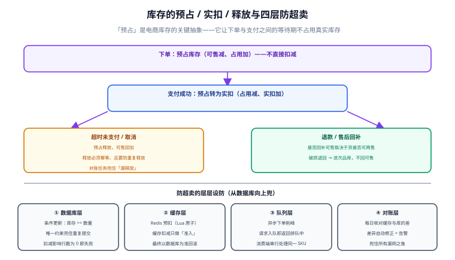

# 库存模型与超卖防护

库存是电商里唯一「少一件就真的少一件」的资源。卖超了，要么赔付、要么道歉；少卖了，则是真金白银的损失。本页讲清库存该用几个数字表达、为什么需要「预占」、以及从数据库到对账的四层防超卖。



## 一句话定位

**库存的核心抽象是「预占」：下单不等于卖出。** 用户从下单到付款之间有一段等待期，如果这段时间直接用真实库存，那么「拍下不付」的人会把货锁死；如果完全不动库存，又会超卖。预占就是为这段等待期准备的中间状态。

## 库存的四个数字

| 数字 | 含义 | 谁能改 | 展示给谁 |
| --- | --- | --- | --- |
| 总库存 `total_stock` | 仓库里实际有多少（含已预占） | 入库/出库单、盘点 | 内部 |
| 可售库存 `stock` | 还能卖多少 = 总库存 − 预占 − 已实扣未发 | 下单预占、释放、实扣 | 用户（缓存后的值） |
| 预占库存 `locked_stock` | 已下单未支付占用的量 | 下单预占、支付实扣、超时释放 | 内部 |
| 实扣库存 | 已支付待发货/已发货的量 | 支付成功时由预占转入 | 内部 |

::: tip 关键恒等式
**`stock + locked_stock + shipped_qty = total_stock`**

任何时刻这个等式都必须成立。把它写成每日对账任务，是发现库存问题最快的手段——比等用户投诉快得多。
:::

## 为什么不能「下单直接扣减」

```text
场景：某 SKU 只剩 1 件。

方案 A：下单直接扣减真实库存
  ┌─ 用户甲下单 → stock 1 → 0，甲去支付（AI 支付花了 3 分钟）
  ├─ 用户乙下单 → 库存不足，失败。乙流失。
  └─ 甲最终放弃支付 → 需要把库存还回来 → 这 3 分钟里货被白锁

方案 B：下单预占，支付实扣
  ┌─ 用户甲下单 → stock 1 → 0，locked 0 → 1（甲有 15 分钟付款）
  ├─ 用户乙下单 → 库存不足，失败。乙流失。  ← 这一点两者相同
  └─ 甲超时未付 → locked 1 → 0，stock 0 → 1，货重新可售

差别在哪？差别在「货被锁住的时长是否可控」：
方案 A 锁住的时长 = 用户决定付款的时间（不可控）
方案 B 锁住的时长 = 订单的 expire_time（可控，例如 15 分钟）

更重要的一点：方案 B 让「预占」成为显式的数据，
使得「超时释放」「重复释放」「漏释放」都能被查询与对账发现；
方案 A 的「扣了再还」没有任何中间记录，出问题只能猜。
```

## 四层防超卖

单靠一层都挡不住，因为每层都有它覆盖不到的场景。

| 层 | 手段 | 挡住什么 | 覆盖不到 |
| --- | --- | --- | --- |
| ① 数据库层 | 条件更新 + 唯一约束 + CHECK | 并发的最后一公里 | 高并发下大量请求打到库，锁竞争严重 |
| ② 缓存层 | Redis + Lua 原子预扣 | 把绝大多数请求挡在数据库之前 | 缓存与库可能不一致，需要回滚 |
| ③ 队列层 | 异步下单、串行消费 | 峰值流量削峰 | 下单结果变异步，需要结果查询接口 |
| ④ 对账层 | 定时核对与自动修正 | 前三层所有漏网之鱼 | 只能事后发现，不能防损 |

```sql [stock-deduct.sql]
-- ① 条件更新：把「判断是否够」和「扣减」合并成一条原子语句
UPDATE t_sku
   SET stock        = stock - #{qty},
       locked_stock = locked_stock + #{qty},
       version      = version + 1
 WHERE sku_id = #{skuId}
   AND status = 1
   AND stock >= #{qty};          -- 关键：条件里带上数量校验

-- 影响行数为 0 有两种可能：
--   a) SKU 不存在或已停售   b) 可售库存不足
-- 必须再查一次以区分，并给出可行动的报错（「当前可售 8，请求 9」）
```

```java [StockService.java]
@Transactional(rollbackFor = Exception.class)
public void lock(Long skuId, int qty, String orderNo) {
    if (qty <= 0) {
        throw new BizException(ErrorCode.PARAM_INVALID, "数量必须大于 0");
    }
    int affected = skuMapper.lockStock(skuId, qty);
    if (affected == 0) {
        Sku sku = skuMapper.selectById(skuId);
        if (sku == null || sku.getStatus() != 1) {
            throw new BizException(ErrorCode.SKU_OFF_SHELF);
        }
        // 报错要说清「要多少、还有多少」，前端才能给出可行动提示
        throw new BizException(ErrorCode.STOCK_NOT_ENOUGH,
                "库存不足：SKU " + skuId + " 当前可售 " + sku.getStock() + "，请求 " + qty);
    }
    // 流水与扣减同事务，保证「有变动必有记录」
    stockLogMapper.insert(StockLog.of(skuId, orderNo, StockBizType.ORDER_LOCK, -qty));
}
```

```lua [stock_prelock.lua]
-- ② Redis 预扣：用 Lua 保证「判断 + 扣减」原子执行
-- KEYS[1] = 库存键  ARGV[1] = 需要数量
local stock = tonumber(redis.call('GET', KEYS[1]) or '-1')
if stock < 0 then
  return -2                       -- 缓存未初始化，交给上层回源
end
local need = tonumber(ARGV[1])
if stock < need then
  return -1                       -- 库存不足
end
redis.call('DECRBY', KEYS[1], need)
return stock - need               -- 返回剩余量，便于后续判断
```

::: danger 缓存预扣的三个必须配套项
1. **缓存扣减只做「准入」，不做最终判定**。Redis 扣成功不代表一定能下单成功（后续落库仍可能失败），所以**必须有回滚释放**。
2. **回滚必须幂等**。同一个订单号重复释放，只能生效一次。用 `INCRBY` 前先判断「该订单是否已释放过」（如用 `SETNX lock_released:{orderNo}`）。
3. **缓存与数据库不一致要有对账**。每天（或每 10 分钟）核对一次，差异自动修正并告警。没有这一步，缓存迟早漂移到一个没人敢改的状态。
:::

## 释放：比扣减更容易出错

扣减只有一条路径，释放却有三条（超时、用户取消、退款），并且**都要求幂等**。

```sql [stock-release.sql]
-- 释放预占：把 locked 还回 stock
UPDATE t_sku
   SET stock        = stock + #{qty},
       locked_stock = locked_stock - #{qty},
       version      = version + 1
 WHERE sku_id = #{skuId}
   AND locked_stock >= #{qty};     -- 防止多释放

-- 流水表的唯一约束是幂等的物理保证：
-- UNIQUE KEY uk_biz (biz_no, biz_type)
-- 重复释放会在 INSERT 时被拒绝，与上面的条件更新组成双保险
```

```java [StockService.java]
/** 释放预占。orderNo + RELEASE 唯一，天然幂等。 */
@Transactional(rollbackFor = Exception.class)
public void release(Long skuId, int qty, String orderNo) {
    int affected = skuMapper.releaseStock(skuId, qty);
    if (affected == 0) {
        // 可能已经释放过。要在「重复释放」与「真的没预占」之间区分开：
        // 查流水，存在则说明是重复释放，视为成功；不存在才报错。
        if (stockLogMapper.exists(orderNo, StockBizType.RELEASE)) {
            log.info("重复释放，忽略。skuId={}, orderNo={}", skuId, orderNo);
            return;
        }
        throw new BizException(ErrorCode.STOCK_RELEASE_FAILED);
    }
    stockLogMapper.insert(StockLog.of(skuId, orderNo, StockBizType.RELEASE, qty));
}
```

::: warning 为什么释放不能只看影响行数
`affected == 0` 时，「已经释放过」和「从未预占」这两种情况的正确处理完全不同：前者应视为成功，后者应报错告警。**只看影响行数会把真故障当成功吞掉**，这是库存少卖（`stock` 越变越少）的典型根因。
:::

## 对账：最后的兜底

```sql [stock-reconcile.sql]
-- ① 核对恒等式：可售 + 预占 + 已发货 = 总库存
SELECT sku_id, stock, locked_stock, shipped_qty, total_stock,
       (stock + locked_stock + shipped_qty - total_stock) AS diff
FROM t_sku
WHERE stock + locked_stock + shipped_qty <> total_stock;
-- 预期 0 行

-- ② 核对流水与余额：按流水汇总应等于当前值
SELECT s.sku_id,
       s.stock                                              AS current_stock,
       s.total_stock - SUM(-l.qty)                          AS expected_stock,
       s.stock - (s.total_stock - SUM(-l.qty))               AS diff
FROM t_sku s
JOIN t_stock_log l ON l.sku_id = s.sku_id
GROUP BY s.sku_id
HAVING diff <> 0;
-- 预期 0 行。任何一行都说明有「改了库存但没写流水」或反之

-- ③ 核对缓存与数据库
-- 在应用侧比对 Redis 的库存键与 t_sku.stock，
-- 差异超过阈值（如 > 0）即告警，并可自动以数据库为准修正缓存
```

## 多仓库存

单仓的模型在多仓场景下需要扩展，但**不要让复杂度扩散到交易链路**：

| 做法 | 说明 | 代价 |
| --- | --- | --- |
| 库存表加 `warehouse_id` | 交易链路感知多仓 | 下单需选仓，模型复杂 |
| 单仓汇总 + 出库时分配 | 交易只关心「总量」，履约时选仓 | 需处理「总够但单仓不够」的分单 |
| 分层库存（区域仓 + 中心仓） | 就近发货，用户体验最好 | 分配算法复杂，需处理跨区调拨 |

::: tip 强烈建议的起步方式
**交易只看「可售总量」，选仓放在履约侧。** 下单扣的是汇总库存，出库时再按规则（就近、库存充足、成本最低）分配仓库。这样交易链路的模型保持简单，选仓策略可以独立演进。等到「总够但单仓不够」频繁发生时，再考虑引入分层库存。
:::

## 实战：并发验证不超卖

```shell
# 0) 准备：库存 100，用 300 个并发请求各买 1 件
mysql -h127.0.0.1 -uroot -p shop -e \
  "UPDATE t_sku SET stock = 100, locked_stock = 0 WHERE sku_id = 1001;"

# 1) 并发下单（用 xargs 起 300 个并发 curl）
seq 1 300 | xargs -P 50 -I{} sh -c '
  curl -s -o /dev/null -w "%{http_code}\n" -X POST http://localhost:8080/api/orders \
    -H "Content-Type: application/json" \
    -H "X-Idempotency-Key: concurrent-{}" \
    -d "{\"skuId\":1001,\"qty\":1,\"addressId\":9001}"' | sort | uniq -c

# 2) 关键断言：成功数必须 ≤ 100，且库存必须精确为 0
mysql -h127.0.0.1 -uroot -p shop -e \
  "SELECT stock, locked_stock FROM t_sku WHERE sku_id = 1001;"
# 预期：stock = 0 且 locked_stock = 成功订单数（≤ 100）
# 若 stock < 0 或 stock + locked_stock <> 100，说明超卖或漏扣

# 3) 流水条数必须与成功订单数一致
mysql -h127.0.0.1 -uroot -p shop -e \
  "SELECT biz_type, COUNT(*), SUM(-qty) FROM t_stock_log
   WHERE sku_id = 1001 GROUP BY biz_type;"
# 预期：ORDER_LOCK 的 COUNT = 成功订单数，SUM(-qty) = 100
```

::: danger 压测的三个必查项
1. **`stock` 绝不为负**。为负说明条件更新写漏了 `AND stock >= #{qty}`，或者有人绕过了统一入口直接 `UPDATE`。
2. **成功数 × 数量 + 剩余可售 = 初始库存**。对不上说明有请求「扣了但没下单」或反之。
3. **流水条数 = 成功订单数**。少一条就是「改了库存没写流水」，这条数据将来无法追溯。
:::

## 常用清单

| 场景 | 做法 |
| --- | --- |
| 商品详情页显示库存 | 读缓存，可不准；`stock < 阈值` 才显示「仅剩 N 件」 |
| 结算与下单 | 必须走条件更新，不允许用缓存值判断 |
| 支付成功 | 预占转实扣，不增加 `stock` |
| 超时/取消 | 释放预占，`stock` 回加 |
| 退款 | 是否回补 `stock` **取决于货能否再售**（未发货可，已发货破损不可） |
| 盘点 | 直接改 `total_stock`，并在流水表记 `INVENTORY` 类型 |
| 秒杀 | 前置 Redis 预扣 + 异步下单（见[秒杀与流量治理](../FlashSale/index.md)） |

## 易错点与最佳实践

::: danger 七个会导致真实损失的错误
1. **用「先查再改」代替条件更新**。并发下必然超卖。必须把判断放进 `WHERE`。
2. **释放时只看影响行数**。把「重复释放」当失败、或把「从未预占」当成功，都会毁掉库存账。
3. **退款一律回补库存**。已发货且商品破损的情况回补会造成虚库存，最终发货时才发现无货。
4. **库存为负不告警**。`CHECK (stock >= 0)` 只是拒绝写入，不能告诉你业务出了什么问题——应用侧仍要监控并告警。
5. **没有 `t_stock_log`**。库存对不上时无据可查，只能拍脑袋调平。
6. **缓存预扣后不回滚**。用户下单失败但 Redis 已经减了，缓存库存会持续偏少。必须成对处理。
7. **多实例定时任务无互斥**。同一批次订单被释放两次，`stock` 直接翻倍。
:::

::: tip 一条实用纪律
**任何一次库存变动都必须同时写流水，且两者在同一事务里。** 把「写流水」做成仓储层的强制行为（而不是每个调用方记得写），是这个纪律能长期成立的关键。做法：库存变动的 Mapper 方法内部同时插入流水，对外只暴露一个方法。
:::

## 验证方式

1. 执行「实战」一节的 300 并发压测，确认 `stock = 0`、`stock + locked_stock = 100`、流水 `SUM(-qty) = 100`。
2. 执行 `stock-reconcile.sql` 的三个查询，确认全部返回 0 行。
3. 对同一订单连续调用两次释放接口，确认第二次被幂等吞掉、`stock` 不翻倍。
4. 把 Redis 库存键手动改成错误值，跑对账任务，确认能发现差异并修正。
5. 检查下单接口在「SKU 停售」与「库存不足」两种情况下返回的**错误码不同**且信息可行动。

| 检查项 | 期望 | 实测 | 结论 |
| --- | --- | --- | --- |
| 300 并发下单 | 成功 ≤ 100，`stock = 0` | 待填写 | ⏳ |
| 恒等式核对 | 差异 0 行 | 待填写 | ⏳ |
| 流水与余额核对 | 差异 0 行 | 待填写 | ⏳ |
| 重复释放 | 幂等，库存不翻倍 | 待填写 | ⏳ |
| 缓存漂移 | 对账能发现并修正 | 待填写 | ⏳ |

## 相关页面

- 上一页：[订单状态机](../OrderStateMachine/index.md)
- 下一页：[支付、幂等与对账](../Payment/index.md)
- 峰值场景：[秒杀与流量治理](../FlashSale/index.md)
- 通用机制：[Redis 分布式锁](../../../DB/NoRelational/Redis/Advanced/DistributedLock/index.md)

## 参考资料

- [MySQL 8.4 · `UPDATE` 与行锁](https://dev.mysql.com/doc/refman/8.4/en/innodb-locking.html)
- [Redis · Lua 脚本编程](https://redis.io/docs/latest/develop/programmability/eval-intro/)
- [MySQL 8.4 · `CHECK` 约束](https://dev.mysql.com/doc/refman/8.4/en/create-table-check-constraints.html)
- [阿里巴巴 Java 开发手册 · 数据库规约](https://github.com/alibaba/p3c)
