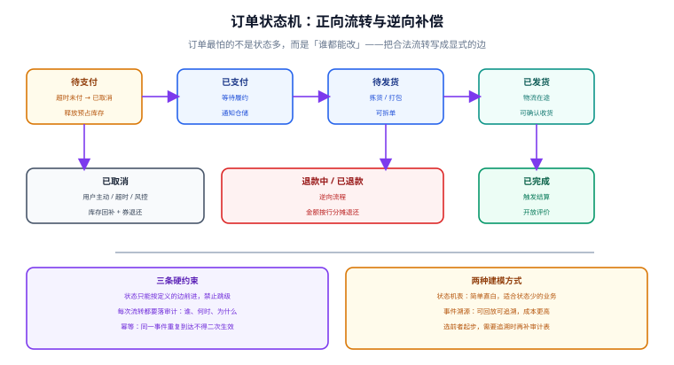

# 订单状态机

订单是电商的交易主键，而订单状态是所有下游动作（发货、结算、开票、退款）的触发依据。**订单最怕的不是状态多，而是「谁都能改」**——一个没有约束的 `status` 字段，会在半年内长满各种绕过流程的快捷更新。本页把订单的合法流转写成显式的边，并给出可直接落地的实现。



## 一句话定位

**状态机的作用不是记录状态，而是拒绝非法的状态变更。** 它的价值体现在「不能做什么」上：不能跳过支付直接发货、不能对已完成订单再退款、不能用两个并发请求把订单推进两步。

## 状态定义

订单状态分**正向**与**逆向**两组，两者不要混在一个枚举里当作「并列状态」。

| 分组 | 状态 | 含义 | 终态 |
| --- | --- | --- | --- |
| 正向 | `PENDING_PAY` | 待支付（库存已预占） | 否 |
| 正向 | `PAID` | 已支付，等待履约 | 否 |
| 正向 | `TO_SHIP` | 待发货（拣货中） | 否 |
| 正向 | `SHIPPED` | 已发货（在途） | 否 |
| 正向 | `COMPLETED` | 已完成（确认收货） | ✅ 是 |
| 逆向 | `CANCELLED` | 已取消（未支付取消或风控取消） | ✅ 是 |
| 逆向 | `REFUNDING` | 退款中 | 否 |
| 逆向 | `REFUNDED` | 已退款 | ✅ 是 |

::: tip 为什么正向与逆向要分开看
正向流转是「推进交易」，逆向流转是「撤销交易」，两者触发的下游动作完全不同（正向发消息给仓储、逆向发消息给财务与库存）。把它们并列成一个平铺的状态列表，等于把两套流程混在一起写 `if`。
:::

## 合法迁移：把边写出来

这张表就是状态机的定义，**代码只是它的执行者**。建议把它同时存成「文档 + 代码常量 + 测试用例」三份（第三份是前两份不会漂移的保证）。

| 当前状态 | 事件 | 目标状态 | 触发方 | 副作用 |
| --- | --- | --- | --- | --- |
| `PENDING_PAY` | 支付成功 | `PAID` | 支付回调 | 库存预占转实扣、发履约消息 |
| `PENDING_PAY` | 超时未付 | `CANCELLED` | 定时任务 | 释放预占库存、退还优惠券 |
| `PENDING_PAY` | 用户取消 | `CANCELLED` | 用户 | 同上 |
| `PAID` | 开始拣货 | `TO_SHIP` | 仓储系统 | 生成出库单 |
| `PAID` / `TO_SHIP` | 用户申请退款 | `REFUNDING` | 用户 | 冻结后续履约 |
| `TO_SHIP` | 出库发货 | `SHIPPED` | 仓储系统 | 写物流单号、通知用户 |
| `SHIPPED` | 确认收货 | `COMPLETED` | 用户 / 定时任务 | 触发结算与评价 |
| `SHIPPED` | 拒收/退货 | `REFUNDING` | 用户 | 库存回补待定 |
| `REFUNDING` | 退款成功 | `REFUNDED` | 财务 | 库存按可再售性回补 |

::: danger 未定义的迁移必须报错，不能默认放过
最常见的坏味道是 `update t_order set status = ? where order_no = ?` 这样的裸更新。它绕过了所有约束，让「已完成订单被改成已发货」这类事故成为可能。**所有状态变更必须走同一个入口**，由它校验 `(当前状态, 事件) → 目标状态` 是否在表内。
:::

## 表结构

```sql [order-schema.sql]
CREATE TABLE t_order (
  order_no     VARCHAR(32)   NOT NULL COMMENT '对外业务单号',
  user_id      BIGINT        NOT NULL,
  status       VARCHAR(20)   NOT NULL COMMENT '订单状态，存字符串便于排查',
  goods_amount DECIMAL(10,2) NOT NULL COMMENT '商品总额',
  discount_amount DECIMAL(10,2) NOT NULL DEFAULT 0 COMMENT '优惠总额',
  freight_amount  DECIMAL(10,2) NOT NULL DEFAULT 0 COMMENT '运费',
  pay_amount   DECIMAL(10,2) NOT NULL COMMENT '应付金额',
  address_snap JSON          NOT NULL COMMENT '收货地址快照',
  version      INT           NOT NULL DEFAULT 0 COMMENT '乐观锁版本',
  expire_time  DATETIME      NOT NULL COMMENT '支付截止时间',
  create_time  DATETIME      NOT NULL DEFAULT CURRENT_TIMESTAMP,
  update_time  DATETIME      NOT NULL DEFAULT CURRENT_TIMESTAMP ON UPDATE CURRENT_TIMESTAMP,
  PRIMARY KEY (order_no),
  KEY idx_user_status (user_id, status, create_time DESC),
  KEY idx_pending_expire (status, expire_time)   -- 支撑「扫描超时未支付」的定时任务
) ENGINE = InnoDB DEFAULT CHARSET = utf8mb4 COMMENT = '订单主表';

-- 状态流转审计：谁、何时、为什么
CREATE TABLE t_order_status_log (
  id          BIGINT      NOT NULL AUTO_INCREMENT,
  order_no    VARCHAR(32) NOT NULL,
  from_status VARCHAR(20) NULL COMMENT '首次流转为 NULL',
  to_status   VARCHAR(20) NOT NULL,
  event       VARCHAR(32) NOT NULL COMMENT '触发事件',
  operator    VARCHAR(64) NOT NULL COMMENT 'user:1001 / system:expire-job / channel:alipay',
  remark      VARCHAR(255) NULL,
  create_time DATETIME    NOT NULL DEFAULT CURRENT_TIMESTAMP,
  PRIMARY KEY (id),
  KEY idx_order (order_no, id)
) ENGINE = InnoDB DEFAULT CHARSET = utf8mb4 COMMENT = '订单状态流转日志';
```

::: warning `idx_pending_expire` 不是可选的
「扫描超时未支付订单并取消」的定时任务会高频执行（例如每分钟一次），没有这个索引就会全表扫描。数据量到百万级时，它会把数据库 CPU 直接吃掉。
:::

## 实现：一张迁移表 + 一个入口

```java [OrderStateMachine.java]
@Getter
@RequiredArgsConstructor
public enum OrderStatus {
    PENDING_PAY("待支付"),
    PAID("已支付"),
    TO_SHIP("待发货"),
    SHIPPED("已发货"),
    COMPLETED("已完成"),
    CANCELLED("已取消"),
    REFUNDING("退款中"),
    REFUNDED("已退款");

    private final String label;
}

/** 合法迁移表：(from, event) -> to。它是状态机的唯一真值来源。 */
public final class OrderTransitions {

    private static final Map<String, OrderStatus> EDGES = Map.ofEntries(
        Map.entry(key(OrderStatus.PENDING_PAY, Event.PAY_SUCCESS), OrderStatus.PAID),
        Map.entry(key(OrderStatus.PENDING_PAY, Event.TIMEOUT),     OrderStatus.CANCELLED),
        Map.entry(key(OrderStatus.PENDING_PAY, Event.USER_CANCEL), OrderStatus.CANCELLED),
        Map.entry(key(OrderStatus.PAID,        Event.START_PICK),  OrderStatus.TO_SHIP),
        Map.entry(key(OrderStatus.PAID,        Event.APPLY_REFUND), OrderStatus.REFUNDING),
        Map.entry(key(OrderStatus.TO_SHIP,     Event.SHIP),        OrderStatus.SHIPPED),
        Map.entry(key(OrderStatus.TO_SHIP,     Event.APPLY_REFUND), OrderStatus.REFUNDING),
        Map.entry(key(OrderStatus.SHIPPED,     Event.CONFIRM),     OrderStatus.COMPLETED),
        Map.entry(key(OrderStatus.SHIPPED,     Event.REJECT),      OrderStatus.REFUNDING),
        Map.entry(key(OrderStatus.REFUNDING,   Event.REFUND_OK),   OrderStatus.REFUNDED)
    );

    private static String key(OrderStatus from, Event event) {
        return from.name() + ':' + event.name();
    }

    public static OrderStatus next(OrderStatus from, Event event) {
        OrderStatus to = EDGES.get(key(from, event));
        if (to == null) {
            // 未定义的迁移一律拒绝：这是状态机的核心价值
            throw new BizException(ErrorCode.ORDER_STATUS_ILLEGAL,
                    "订单状态不允许该操作：" + from.getLabel() + " + " + event.name());
        }
        return to;
    }
}
```

```java [OrderStatusService.java]
/**
 * 唯一的订单状态变更入口。
 * 并发安全靠「带当前状态的条件更新」保证：影响行数为 0 说明状态已被别人改过。
 */
@Transactional(rollbackFor = Exception.class)
public void transit(String orderNo, Event event, String operator, String remark) {
    Order order = orderMapper.selectById(orderNo);
    if (order == null) {
        throw new BizException(ErrorCode.ORDER_NOT_FOUND);
    }
    OrderStatus from = order.getStatus();
    OrderStatus to = OrderTransitions.next(from, event);

    int affected = orderMapper.compareAndSetStatus(orderNo, from, to, order.getVersion());
    if (affected == 0) {
        // 乐观锁冲突或状态已变：让调用方重试，绝不静默成功
        throw new BizException(ErrorCode.CONCURRENT_MODIFY);
    }

    // 审计留痕：与状态变更同事务，保证「状态与日志」不会脱节
    statusLogMapper.insert(OrderStatusLog.of(orderNo, from, to, event, operator, remark));

    // 事务提交后再做外部副作用（发消息、调渠道）
    afterCommitPublisher.publish(new OrderStatusChangedEvent(orderNo, from, to, event));
}
```

```xml [OrderMapper.xml]
<!-- 带当前状态的条件更新：把状态校验交给数据库原子完成 -->
<update id="compareAndSetStatus">
  UPDATE t_order
     SET status = #{to}, version = version + 1
   WHERE order_no = #{orderNo}
     AND status = #{from}
     AND version = #{version}
</update>

<!-- 宽容版本号的做法：只校验状态，靠行锁串行化 -->
<update id="compareAndSetStatusLoose">
  UPDATE t_order
     SET status = #{to}, version = version + 1
   WHERE order_no = #{orderNo}
     AND status = #{from}
</update>
```

::: tip 两种条件更新怎么选
- **带 `version`**：更严格，但要求调用方先读到正确版本号。适合「读—判断—写」之间有业务逻辑的场景。
- **只校验 `status`**：更简单，`UPDATE` 自身的行锁保证同一订单串行。适合纯状态推进（如回调改状态）。

两者都优于「先 `SELECT` 判断再无条件 `UPDATE`」——后者在并发下必然出现两次都成功的错觉。
:::

## 幂等：同一事件到达两次

支付回调、MQ 消息、定时任务都可能重复触发同一事件。三种加固手段按成本递增：

| 手段 | 做法 | 适用 |
| --- | --- | --- |
| 条件更新 | `WHERE status = 期望的前置状态` | 状态推进类，天然幂等 |
| 唯一键 | 如 `t_order_status_log` 上 `(order_no, to_status, event)` 唯一 | 只允许发生一次的业务事件 |
| 事件表 | 单独的水平去重表，记录已处理的事件 ID | 事件带唯一 ID（如渠道流水号） |

```sql [idempotent.sql]
-- 给「同一订单同一事件只能成功一次」加物理保证
ALTER TABLE t_order_status_log
  ADD UNIQUE KEY uk_order_event (order_no, event, to_status);
-- 注意：如果同一事件在同一订单上合法地会发生多次（如多次部分退款），
-- 就不能这样加，而应改用「事件 ID 去重表」。约束要按业务语义定，不要照抄。
```

## 定时任务：两个必须有的兜底

| 任务 | 频率 | 做什么 | 幂等保证 |
| --- | --- | --- | --- |
| 超时未支付取消 | 每 1 分钟 | 扫描 `status = PENDING_PAY AND expire_time < now()` 的订单，逐个走 `TIMEOUT` 迁移 | 条件更新 + MQ 消费幂等 |
| 自动确认收货 | 每小时 | 扫描 `status = SHIPPED AND ship_time < now() - 15 天` | 条件更新 |

```sql [expire-job.sql]
-- 分批扫描，避免一次拉出几十万行
SELECT order_no
FROM t_order
WHERE status = 'PENDING_PAY'
  AND expire_time < NOW()
ORDER BY expire_time
LIMIT 200;
-- 取出后逐单调用 OrderStatusService.transit(orderNo, TIMEOUT, "system:expire-job", null)
-- 不要用「一条 UPDATE 批量改状态」：那样会绕过状态机与审计日志
```

::: danger 定时任务的三个陷阱
1. **批量 `UPDATE` 绕过状态机**。省了循环，但丢掉了审计日志与库存释放。库存不会自己回来。
2. **多实例重复执行**。定时任务必须做分布式互斥（如基于 Redis 的 `SET NX PX` 或数据库行锁），否则两个实例同时跑同一个批次。**即便重复执行，也要靠条件更新让它无害**——互斥只是优化，幂等才是保险。
3. **取消订单只改状态、不释放库存**。取消是一个「业务动作」，包含多步副作用（释放库存、退券、退积分）。状态变更与副作用必须成对，缺一不可。
:::

## 拆单与合单

| 场景 | 做法 | 注意 |
| --- | --- | --- |
| 一个订单含多个商家商品 | 按商家拆成多个子订单 | 子订单各自履约，主订单仅作汇总展示 |
| 同一商家但仓库不同 | 按仓库拆成出库单（不一定拆订单） | 拆订单会放大退款复杂度，优先只拆出库单 |
| 合单支付 | 多订单一次支付，共用一个支付单 | 支付回调要能按支付单解开到多个订单 |

**拆单的取舍原则**：**拆得越晚越好**。订单是交易凭证，拆分会让退款、对账、客服查询复杂度成倍上升。能在出库单层面表达的分组，就不要上升到订单层面。

## 易错点与最佳实践

::: danger 六个反复出现的坑
1. **裸更新 `status`**。绕过状态机后，非法流转会在生产数据里出现，且无法追溯是谁改的。
2. **状态用 `int` 且没有注释**。`status = 3` 到底是待发货还是已发货，半年后没人记得。**用字符串枚举**（可读性远比省几字节重要）。
3. **状态变更与副作用不在同一事务，也没有补偿**。状态改了、库存没释放，两边永久不一致。
4. **外部调用放在事务里**。调用仓储系统超时会把数据库连接占住，故障扩散。
5. **取消订单不退还优惠券**。用户会立刻投诉。取消是一个**打包动作**，所有与订单绑定的资源都要归还。
6. **对终态订单不做校验**。已取消订单又被回调改成已支付，是最典型的双向状态混流事故。
:::

::: tip 状态机的最小测试集
不需要穷举所有组合，只要覆盖三类：**① 每条合法边各一条成功用例；② 每条边的「前置状态不满足」各一条拒绝用例；③ 每个终态的「再收任何事件」各一条拒绝用例。** 第 ③ 类最容易漏，而它恰好是事故高发区。
:::

## 验证方式

1. 对每个合法迁移各调一次，确认状态正确推进且 `t_order_status_log` 各留一条记录。
2. 对 `COMPLETED` 订单再触发 `PAY_SUCCESS`，确认返回明确错误码，且状态不变、无新日志。
3. 并发对同一订单触发两次 `PAY_SUCCESS`，确认**只有一次成功**（另一次拿到并发修改错误或幂等返回），库存只实扣一次。
4. 造一笔 `expire_time` 已过的待支付订单，等待定时任务，确认订单转 `CANCELLED` **且预占库存已释放**（查 `t_stock_log` 有 `RELEASE` 记录）。
5. 检查 `EXPLAIN`：超时扫描任务走 `idx_pending_expire`，不出现全表扫描。

| 检查项 | 期望 | 实测 | 结论 |
| --- | --- | --- | --- |
| 合法迁移 | 状态正确 + 日志各一条 | 待填写 | ⏳ |
| 终态收事件 | 明确拒绝、状态不变 | 待填写 | ⏳ |
| 并发同事件 | 只成功一次 | 待填写 | ⏳ |
| 超时取消 | 状态 + 库存释放成对 | 待填写 | ⏳ |
| 超时扫描计划 | 走 `idx_pending_expire` | 待填写 | ⏳ |

## 相关页面

- 上一页：[购物车与价格计算](../Cart/index.md)
- 下一页：[库存模型与超卖防护](../Inventory/index.md)
- 状态推进的触发源：[支付、幂等与对账](../Payment/index.md)
- 状态机与通用设计模式：[设计模式 · 行为型](../../DesignPatterns/Behavioral/index.md)

## 参考资料

- [Martin Fowler · State Machine](https://martinfowler.com/bliki/StateMachine.html)
- [MySQL 8.4 · InnoDB 行锁与 `UPDATE` 语义](https://dev.mysql.com/doc/refman/8.4/en/innodb-locking.html)
- [Alibaba Java 开发手册 · 状态与枚举规约](https://github.com/alibaba/p3c)
