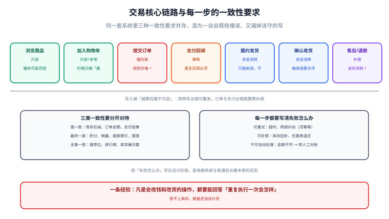

# 电商系统全景与核心链路

电商系统的功能清单可以写满一整页，但**真正的骨架只有一条链路**：商品 → 购物车 → 订单 → 支付 → 履约 → 售后。本页把这条链路拉直，标出每一步的一致性要求、失败表现与兜底手段，作为后面各页的总览与索引。



## 一句话定位

**电商系统的设计难点，是把「读多写少」的浏览场景与「一步都不能错」的交易场景，放进同一套系统里而互不拖累。** 浏览要的是快与便宜（缓存、静态化、最终一致），交易要的是准与可追溯（快照、幂等、对账）。把两者混在一起做，得到的通常是又慢又不可靠。

## 核心链路的七个环节

| 环节 | 读写性质 | 一致性要求 | 失败时的表现 |
| --- | --- | --- | --- |
| ① 浏览商品 | 读多写无 | 允许短暂不一致（缓存几秒） | 价格显示滞后 → 下单时以快照纠正 |
| ② 加入购物车 | 读 + 本地写 | 弱一致（购物车只是意向） | 购物车丢一件 → 用户重加即可 |
| ③ 提交订单 | 强约束写 | **强一致**：价格校验 + 库存预占 + 下单落库 | 价格已变 / 库存不足 → 明确报错并给出原因 |
| ④ 支付 | 外部交互 | **强一致 + 幂等** | 回调重复 / 回调丢失 → 幂等 + 主动查单 |
| ⑤ 履约发货 | 状态推进 | 状态机约束 | 状态跳级 / 重复发货 → 状态机 + 出库单唯一 |
| ⑥ 确认收货 | 状态推进 | 状态机约束 | 自动确认超时 → 定时任务兜底 |
| ⑦ 售后与退款 | 补偿写 | **强一致 + 幂等**：按快照分摊退还 + 库存回补 | 退多了 / 库存少回补 → 按行分摊 + 对账 |

::: tip 记住这条分界线
**环节 ①② 出错可以重来，环节 ③ 往后出错就要靠补偿。** 所以设计的力气应该集中在 ③ 之后——前面越简单越好，后面越显式越好。
:::

## 三类一致性，必须分开对待

新手最容易犯的错，是把「所有数据都要一致」当成目标，结果既拖慢了读，又漏掉了真正该守的写。按下面三类分开处理：

| 类别 | 范围 | 手段 | 允许的偏差 |
| --- | --- | --- | --- |
| **强一致** | 库存扣减、订单金额、支付结果、优惠券核销 | 单库事务 + 条件更新 + 唯一约束 | 0（不允许偏差） |
| **最终一致** | 积分、销量、搜索索引、报表、推荐位 | 消息队列 + 定时补偿 + 对账 | 秒级到分钟级 |
| **无需一致** | 库存展示数、排行榜、评价数 | 缓存 + 定期刷新 | 分钟级，错了也无害 |

::: warning 库存展示数与库存真值是两回事
商品详情页写「仅剩 3 件」，这个数字**允许不准、允许缓存**——它只是引导决策的参考。真正决定能不能下单的是提交订单那一刻的条件更新。**不要为了「展示更准」而让详情页去查一次真实库存**，那会把最热的页面压在最脆弱的资源上。
:::

## 分层架构与依赖方向

电商后端常见的分层，与通用后端没有本质区别，但每层的**纪律**更严：

```text
┌─────────────────────────────────────────────┐
│ 接入层  Controller / 网关                     │  参数校验、鉴权、限流、幂等键提取
├─────────────────────────────────────────────┤
│ 应用层  Application Service                   │  编排用例，不写业务规则；事务边界在这一层
├─────────────────────────────────────────────┤
│ 领域层  Domain（商品 / 订单 / 库存 / 支付）    │  业务规则与状态机约束，纯逻辑，不碰数据库
├─────────────────────────────────────────────┤
│ 基础设施层  Repository / MQ / Cache / 外部渠道 │  技术实现，可替换
└─────────────────────────────────────────────┘
```

四条约定：

1. **事务边界放在应用层**，领域层不开启事务——这样领域逻辑可以被单元测试直接调用。
2. **领域层不直接依赖 Spring / MyBatis**，接口定义在领域层、实现在基础设施层（依赖倒置）。
3. **跨聚合的修改不允许在一个事务里随意扩散**：订单与库存是两个聚合，优先靠「预占 → 确认」两步而不是一个大事务。
4. **对外部渠道的调用永远不在事务里**：调用支付渠道、发短信、推消息都必须放在事务提交之后。

## 核心表清单

电商的表看着多，真正决定正确性的核心表只有五张。先看它们的关系，后面各页再展开。

| 表 | 作用 | 关键字段 | 唯一约束 |
| --- | --- | --- | --- |
| `t_order` | 订单主表 | `order_no`、`user_id`、`status`、`pay_amount`、`create_time` | `order_no` |
| `t_order_item` | 订单行（商品快照） | `order_no`、`sku_id`、`price_snapshot`、`qty`、`discount_share` | `(order_no, sku_id)` |
| `t_sku` | SKU 与库存真值 | `sku_id`、`price`、`stock`、`locked_stock`、`version` | `sku_id` |
| `t_stock_log` | 库存流水（可追溯） | `sku_id`、`change_type`、`qty`、`biz_no` | `(biz_no, change_type)` |
| `t_payment` | 支付单 | `pay_no`、`order_no`、`channel_trade_no`、`status`、`amount` | `pay_no`、`channel_trade_no` |

```sql [schema.sql]
-- 库存：可售与预占分成两列，是所有防超卖设计的基础
CREATE TABLE t_sku (
  sku_id       BIGINT       NOT NULL COMMENT 'SKU 主键（雪花 ID）',
  spu_id       BIGINT       NOT NULL COMMENT '所属 SPU',
  price        DECIMAL(10,2) NOT NULL COMMENT '当前售价（元）',
  stock        INT          NOT NULL DEFAULT 0 COMMENT '可售库存',
  locked_stock INT          NOT NULL DEFAULT 0 COMMENT '预占（已下单未支付）',
  version      INT          NOT NULL DEFAULT 0 COMMENT '乐观锁版本',
  PRIMARY KEY (sku_id),
  CONSTRAINT ck_stock_non_negative CHECK (stock >= 0),
  CONSTRAINT ck_locked_non_negative CHECK (locked_stock >= 0)
) ENGINE = InnoDB DEFAULT CHARSET = utf8mb4
  COMMENT = 'SKU 与库存真值';

-- 库存流水：任何一次库存变动都要留痕，对账靠它
CREATE TABLE t_stock_log (
  id         BIGINT      NOT NULL AUTO_INCREMENT,
  sku_id     BIGINT      NOT NULL,
  biz_no     VARCHAR(64) NOT NULL COMMENT '业务单号（订单号 / 退款单号）',
  biz_type   VARCHAR(16) NOT NULL COMMENT 'ORDER_LOCK / ORDER_CONFIRM / RELEASE / REFUND',
  qty        INT         NOT NULL COMMENT '变动数量，正数为增',
  create_time DATETIME   NOT NULL DEFAULT CURRENT_TIMESTAMP,
  PRIMARY KEY (id),
  UNIQUE KEY uk_biz (biz_no, biz_type)   -- 幂等的物理保证：同一业务单同一动作只能落一次
) ENGINE = InnoDB DEFAULT CHARSET = utf8mb4
  COMMENT = '库存变动流水';
```

::: danger 三个必须写进建表语句的约束
1. **`uk_biz (biz_no, biz_type)` 不能省**：它是幂等的最后一道防线。应用层的判断可能因并发失效，唯一约束不会。少了它，「同一订单释放两次库存」迟早会发生。
2. **`CHECK (stock >= 0)` 不能省**：把「库存不能为负」变成数据库能拒绝的事实，而不是靠每个开发者记得判断。
3. **金额必须用 `DECIMAL`，不能用 `DOUBLE`**：浮点累加会出现 `0.1 + 0.2 = 0.30000000000000004`，退款金额对不上时排查成本极高。
:::

## 统一响应与幂等键

交易类接口的请求体之外，还有两样东西必须统一：

```json [请求头约定]
{
  "X-Idempotency-Key": "客户端生成的唯一键，同一业务重试必须复用同一个值",
  "X-Trace-Id": "链路追踪 ID，与后端日志的 MDC 对齐",
  "Content-Type": "application/json"
}
```

```json [库存不足的统一响应]
{
  "code": 40901,
  "message": "库存不足：SKU 1001 当前可售 0，请求 1",
  "data": null,
  "traceId": "b7f3c2a1e5d84f60"
}
```

- **错误码分段**：`400xx` 参数、`401xx` 未认证、`403xx` 越权、`409xx` 业务冲突（含库存不足、状态不允许）、`500xx` 服务端异常、`503xx` 依赖不可用。第四位区分具体业务。
- **报错要给到可行动的信息**：库存不足要说清「哪个 SKU、要多少、还有多少」，而不是一句「操作失败」。这在秒杀场景下尤其重要——前端要据此决定是置灰还是提示。

## 实战：一个最小可运行的下单链路

不用完整项目，最少三个接口就能把链路跑通并验证一致性。以下用 `curl` 串起「下单 → 支付回调 → 查单」，每一步都给出预期输出。

```shell
# 0) 准备：给 SKU 1001 设置 10 件可售库存
mysql -h127.0.0.1 -uroot -p shop -e \
  "INSERT INTO t_sku(sku_id, spu_id, price, stock) VALUES (1001, 2001, 99.00, 10)
   ON DUPLICATE KEY UPDATE stock = 10, locked_stock = 0;"

# 1) 下单：同一幂等键重复提交两次，必须只生成一个订单
KEY=$(uuidgen)
for i in 1 2; do
  curl -s -X POST http://localhost:8080/api/orders \
    -H 'Content-Type: application/json' \
    -H "X-Idempotency-Key: $KEY" \
    -d '{"skuId":1001,"qty":2,"addressId":9001}' | tee /tmp/order_$i.json
  echo
done
# 预期：两次返回的 orderNo 完全相同，且都带同一个 traceId 前缀的日志
# 预期：t_sku 的 stock 由 10 变 8，locked_stock 由 0 变 2

# 2) 拒绝超量下单：要 9 件但只剩 8 件
curl -s -X POST http://localhost:8080/api/orders \
  -H 'Content-Type: application/json' -H "X-Idempotency-Key: $(uuidgen)" \
  -d '{"skuId":1001,"qty":9,"addressId":9001}'
# 预期：HTTP 409，code 40901，message 含「当前可售 8，请求 9」

# 3) 支付回调：同一笔回调重复推两次，订单只能变成已支付一次
ORDER_NO=$(grep -o '"orderNo":"[^"]*"' /tmp/order_1.json | cut -d'"' -f4)
for i in 1 2; do
  curl -s -X POST http://localhost:8080/api/pay/callback \
    -H 'Content-Type: application/json' \
    -d "{\"orderNo\":\"$ORDER_NO\",\"channelTradeNo\":\"CH20260919001\",\"amount\":\"198.00\",\"status\":\"SUCCESS\"}"
  echo
done
# 预期：两次都返回成功（幂等），t_payment 只有一行，订单状态只变更一次

# 4) 查库存流水：每一步都必须有且仅有一条记录
mysql -h127.0.0.1 -uroot -p shop -e \
  "SELECT biz_no, biz_type, qty FROM t_stock_log WHERE sku_id = 1001 ORDER BY id;"
# 预期：ORDER_LOCK 一条（-2）、ORDER_CONFIRM 一条（不动可售）；重复执行不会多出记录
```

验证通过的标准不是「接口返回 200」，而是**第 4 步的流水条数与预期完全一致**。任何一条多出来或少掉，都说明幂等或事务边界有问题。

## 易错点与最佳实践

::: danger 六个反复出现的坑
1. **把「展示库存」当成「可售库存」**。详情页显示的库存是缓存值，直接拿它做扣减判断必然超卖。扣减判断只能基于数据库的条件更新结果。
2. **下单时重新读当前价格**，而不是用购物车里的价格。用户看到 99 元、下单变 109 元，投诉由此而来。正确做法是**下单时校验价格是否变化，变了就明确提示**，而不是静默按新价成交。
3. **把支付、发短信、推消息写在事务里**。外部调用慢且会失败，一旦它在事务内超时，数据库连接被长时间占住，故障会从一个接口扩散到整站。
4. **订单与库存放在一个大事务里**，跨服务的场景下不可行，单库场景下也会让行锁持有时间过长，秒杀时直接锁死。
5. **没有 `t_stock_log` 这类流水表**。出问题只能对着 `stock` 的当前值猜，永远查不清是哪一步错了。
6. **对外接口直接暴露数据库主键 `id`**（自增）。既泄露业务量（可被竞争对手估算日订单数），也让数据迁移与分库分表时无法平滑切换。对外一律用 `order_no` / `sku_id` 这类业务编号，且用**字符串**传（见下方说明）。
:::

::: tip 关于长整型 ID 的传输
雪花 ID 是 19 位长整型，超过 JavaScript `Number.MAX_SAFE_INTEGER`（2^53-1，16 位）。**JSON 里必须用字符串传**，否则前端解析时会丢精度，出现「同一个订单在前端是 1234567890123456800、在后端是 1234567890123456789」的诡异现象。
:::

## 验证方式

1. 按上面「实战」一节从第 0 步跑到第 4 步，确认**幂等键重复提交只产生一个订单**、**重复回调只改一次状态**、**库存流水条数与预期一致**。
2. 人为制造一次失败：在下单接口里注入异常使其在扣库存后抛错，确认事务回滚后 `stock` 与 `locked_stock` 都回到原值（不留半成品）。
3. 检查所有交易接口的响应体：**不含堆栈、不含类名、不含 SQL 片段、不含原始请求报文**。
4. 断开 MySQL 后调用下单接口，确认返回 `503xx` 而不是 `500xx`——**依赖不可用与代码 bug 必须能被区分开**。

| 检查项 | 期望 | 实测 | 结论 |
| --- | --- | --- | --- |
| 重复幂等键下单 | 只生成一个订单 | 待填写 | ⏳ |
| 超量下单 | 409 + 40901，含可行动信息 | 待填写 | ⏳ |
| 重复支付回调 | 状态只变更一次 | 待填写 | ⏳ |
| 库存流水条数 | 与预期完全一致 | 待填写 | ⏳ |
| 扣库存后抛异常 | 事务完整回滚 | 待填写 | ⏳ |
| 依赖不可用 | 503xx 而非 500xx | 待填写 | ⏳ |

## 相关页面

- 下一步：[商品与领域建模](../DomainModeling/index.md)——把「商品」拆成 SPU / SKU / 类目 / 属性
- 交易主线：[购物车与价格计算](../Cart/index.md) ｜ [订单状态机](../OrderStateMachine/index.md)
- 底线保障：[库存模型与超卖防护](../Inventory/index.md) ｜ [支付、幂等与对账](../Payment/index.md)

## 参考资料

- [Martin Fowler · Transactional Outbox](https://martinfowler.com/articles/patterns-of-distributed-systems/transactional-outbox.html)
- [MySQL 8.4 · CHECK 约束](https://dev.mysql.com/doc/refman/8.4/en/create-table-check-constraints.html)
- [Stripe API · Idempotent requests](https://docs.stripe.com/api/idempotent_requests)：幂等键在支付场景的工业级实践
- [Alibaba Java 开发手册 · 并发与数据库规约](https://github.com/alibaba/p3c)
