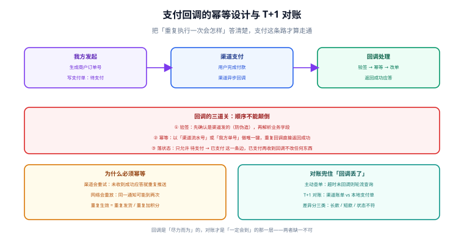

# 支付、幂等与对账

支付是电商系统里唯一「钱真的动了」的环节，也是唯一大量依赖外部系统的环节。它的特殊性在于：**你必须假设对方的通知会丢失、会重复、会乱序，而且无法假设对方会配合你。** 本页把支付拆成「发起 → 回调 → 查单 → 对账」四步，每一步都给出可落地的幂等与兜底设计。



## 一句话定位

**回调是「尽力而为」的通知，对账才是「一定会到」的那一层。** 只写回调不做对账的系统，迟早会有一批订单永远停在「待支付」——而这类问题通常要等到用户投诉才发现。

## 支付单模型

不要把支付信息塞进订单表。**一个订单可能有多次支付尝试**（失败重试、换渠道），所以支付单是独立实体。

```sql [payment-schema.sql]
CREATE TABLE t_payment (
  pay_no            VARCHAR(32)   NOT NULL COMMENT '我方支付单号，对外使用',
  order_no          VARCHAR(32)   NOT NULL COMMENT '关联订单',
  channel           VARCHAR(16)   NOT NULL COMMENT 'ALIPAY / WECHAT / BANK',
  channel_trade_no  VARCHAR(64)   NULL COMMENT '渠道交易号，回调时回填',
  amount            DECIMAL(10,2) NOT NULL COMMENT '支付金额（必须与订单应付一致）',
  status            VARCHAR(16)   NOT NULL COMMENT 'INIT / PAYING / SUCCESS / FAILED / CLOSED',
  notify_payload    JSON          NULL COMMENT '最近一次回调原文，便于排障（需脱敏）',
  pay_time          DATETIME      NULL COMMENT '渠道返回的支付成功时间',
  create_time       DATETIME      NOT NULL DEFAULT CURRENT_TIMESTAMP,
  update_time       DATETIME      NOT NULL DEFAULT CURRENT_TIMESTAMP ON UPDATE CURRENT_TIMESTAMP,
  PRIMARY KEY (pay_no),
  UNIQUE KEY uk_channel_trade (channel, channel_trade_no),  -- 防同一渠道交易号落到两个支付单
  KEY idx_order (order_no),
  KEY idx_status_create (status, create_time)               -- 支撑「扫描超时未回调」
) ENGINE = InnoDB DEFAULT CHARSET = utf8mb4 COMMENT = '支付单';

-- 回调去重表：渠道会重试，用事件 ID 做水平去重
CREATE TABLE t_pay_notify_log (
  id           BIGINT      NOT NULL AUTO_INCREMENT,
  channel      VARCHAR(16) NOT NULL,
  event_id     VARCHAR(64) NOT NULL COMMENT '渠道通知的唯一 ID（无则由 渠道交易号+状态 拼）',
  pay_no       VARCHAR(32) NOT NULL,
  raw_status   VARCHAR(16) NOT NULL,
  result       VARCHAR(16) NOT NULL COMMENT 'PROCESSED / DUPLICATE / REJECTED',
  create_time  DATETIME    NOT NULL DEFAULT CURRENT_TIMESTAMP,
  PRIMARY KEY (id),
  UNIQUE KEY uk_event (channel, event_id)   -- 幂等的物理保证
) ENGINE = InnoDB DEFAULT CHARSET = utf8mb4 COMMENT = '支付回调去重与审计';
```

::: warning `uk_channel_trade` 为什么重要
同一个渠道交易号如果落到两个支付单上，就意味着**一笔钱被记成了两笔收入**。这个唯一约束是防「重复建支付单」的物理保证——应用层的判断在并发下不可靠。
:::

## 回调处理的三道关：顺序不能颠倒

```text
① 验签  → 先确认「这条通知真的是渠道发的」
            未验签就解析业务字段，等于把改单权限开放给任何能往这个 URL 发请求的人
② 幂等  → 再确认「这条通知是否已处理过」
            渠道会重试（未收到成功应答就重推），网络会重放
③ 落状态 → 最后才改单
            只允许 待支付 → 已支付 这一条边；已支付再收到任何通知都不改数据
```

```java [PayNotifyController.java]
@PostMapping("/api/pay/notify/{channel}")
public String notify(@PathVariable String channel,
                     @RequestBody String rawBody,
                     HttpServletRequest request) {
    // ① 验签：失败直接拒绝，不回显任何内部信息
    if (!signVerifier.verify(channel, rawBody, request.getHeader("X-Signature"))) {
        log.warn("支付回调验签失败，channel={}", channel);
        return "FAIL";           // 渠道会因此重试，这是期望行为
    }

    PayNotifyDTO dto = parse(rawBody);
    try {
        payService.handleNotify(channel, dto, rawBody);
    } catch (DuplicateNotifyException e) {
        // ② 已处理过：必须返回成功，否则渠道会一直重推
        log.info("重复回调，直接成功应答。payNo={}", dto.getPayNo());
        return "SUCCESS";
    } catch (BizException e) {
        // 业务明确失败（如金额不符）：返回失败让渠道留下记录，同时告警人工介入
        log.error("回调业务失败，需人工介入。payNo={}, reason={}", dto.getPayNo(), e.getMessage());
        return "FAIL";
    }
    return "SUCCESS";
}
```

```java [PayService.java]
@Transactional(rollbackFor = Exception.class)
public void handleNotify(String channel, PayNotifyDTO dto, String rawBody) {
    // ② 幂等：唯一约束是最终保证；这里先做一次快速判断，减少无谓的异常
    if (notifyLogMapper.exists(channel, dto.getEventId())) {
        throw new DuplicateNotifyException();
    }

    PayPayment pay = paymentMapper.selectForUpdate(dto.getPayNo());
    if (pay == null) {
        throw new BizException(ErrorCode.PAY_NOT_FOUND);
    }
    // 金额必须一致：这是防「改价攻击」的最后一道关
    if (pay.getAmount().compareTo(dto.getAmount()) != 0) {
        throw new BizException(ErrorCode.PAY_AMOUNT_MISMATCH,
                "回调金额与支付单不一致，需人工核对。payNo=" + pay.getPayNo());
    }

    // ③ 落状态：只认「待支付 → 已支付」这一条边
    int affected = paymentMapper.markSuccess(pay.getPayNo(), dto.getChannelTradeNo(),
                                             dto.getPayTime(), rawBody);
    if (affected == 0) {
        // 已经成功过（并发或重放）：记去重日志后按重复处理
        notifyLogMapper.insert(PayNotifyLog.duplicate(channel, dto));
        throw new DuplicateNotifyException();
    }
    notifyLogMapper.insert(PayNotifyLog.processed(channel, dto));

    // 订单状态推进走统一入口（内部有状态机校验 + 审计）
    orderStatusService.transit(pay.getOrderNo(), Event.PAY_SUCCESS,
                               "channel:" + channel, "payNo=" + pay.getPayNo());
}
```

```xml [PaymentMapper.xml]
<update id="markSuccess">
  UPDATE t_payment
     SET status = 'SUCCESS',
         channel_trade_no = #{channelTradeNo},
         pay_time = #{payTime},
         notify_payload = #{payload}
   WHERE pay_no = #{payNo}
     AND status IN ('INIT', 'PAYING')     <!-- 已 SUCCESS 的不允许再改 -->
</update>
```

::: danger 五个必须做对的地方
1. **未验签就解析业务字段**。等于把改单接口暴露给公网。
2. **回调里判断订单是否已支付来决定是否处理**，而不是判断**支付单**状态。订单可能因为其他原因被改，支付单状态才是这次通知的直接目标。
3. **不校验金额**。渠道回调里的金额必须与我方支付单金额完全一致，否则就是被篡改或串单。
4. **重复回调返回失败**。这会让渠道持续重推，形成通知风暴。**已处理过的回调必须返回成功。**
5. **回调处理耗时长**（比如在里面发短信、调其他服务）。渠道有超时限制，处理慢会导致它判失败并重试。**回调里只做「验签 + 幂等 + 改状态」，其余副作用发消息异步做。**
:::

## 主动查单：兜住「回调丢了」

```java
/** 定时任务：扫描长时间未收到成功回调的支付单，主动向渠道查询。 */
@Scheduled(fixedDelay = 60_000)
public void reconcilePendingPayments() {
    List<PayPayment> pending = paymentMapper.selectPending(
            List.of("INIT", "PAYING"),
            LocalDateTime.now().minusMinutes(5),   // 创建超过 5 分钟仍未成功
            200);                                  // 分批，避免一次拉爆内存
    for (PayPayment pay : pending) {
        try {
            ChannelResult r = channelClient.query(pay.getChannel(), pay.getPayNo());
            if (r.isSuccess()) {
                // 复用与回调完全相同的处理路径，保证两条路的结果一致
                payService.handleNotify(pay.getChannel(), r.toNotifyDTO(), r.getRaw());
            } else if (r.isClosed()) {
                paymentMapper.close(pay.getPayNo());
            }
        } catch (Exception e) {
            // 单个支付单查询失败不影响整批
            log.warn("查单失败，payNo={}", pay.getPayNo(), e);
        }
    }
}
```

::: tip 查单与回调必须走同一条处理逻辑
如果查单单独写一套「直接改状态」的代码，两份逻辑迟早会漂移：回调改了订单、查单忘了改；或者查单回填了渠道交易号而回调没有。**正确做法是让查单构造出与回调同样结构的通知对象，复用同一个处理方法。**
:::

## T+1 对账

无论回调与查单做得多好，都必须有对账——它是**唯一能发现「双方记录不一致」的手段**。

| 步骤 | 内容 | 产出 |
| --- | --- | --- |
| ① 拉账单 | 从渠道下载前一日的交易账单文件 | 渠道流水清单 |
| ② 本地汇总 | 查本方 `t_payment` 前一日的成功记录 | 本地流水清单 |
| ③ 双向比对 | 以「渠道交易号」为键，做双向差集 | 三类差异 |
| ④ 分类处置 | 按差异类型走自动修正或转人工 | 处置记录 |
| ⑤ 归档 | 保存账单原文与比对结果 | 审计依据 |

```sql [reconcile.sql]
-- 差异一：渠道有、本地无（用户付了钱，但我们不知道）
-- 处理：最高优先级，立即补单或原路退回，并告警
SELECT c.channel_trade_no, c.amount, c.pay_time
FROM tmp_channel_bill c
LEFT JOIN t_payment p
       ON p.channel = c.channel AND p.channel_trade_no = c.channel_trade_no
WHERE p.pay_no IS NULL;

-- 差异二：本地有、渠道无（我们记了成功，渠道说没有）
-- 处理：确认渠道是否漏发；确认后回滚本地状态并告警
SELECT p.pay_no, p.channel_trade_no, p.amount, p.pay_time
FROM t_payment p
LEFT JOIN tmp_channel_bill c
       ON c.channel = p.channel AND c.channel_trade_no = p.channel_trade_no
WHERE p.status = 'SUCCESS' AND c.channel_trade_no IS NULL;

-- 差异三：两侧都有但金额不符（最严重，通常是串单或篡改）
SELECT p.pay_no, p.amount AS local_amount, c.amount AS channel_amount,
       p.amount - c.amount AS diff
FROM t_payment p
JOIN tmp_channel_bill c
  ON c.channel = p.channel AND c.channel_trade_no = p.channel_trade_no
WHERE p.amount <> c.amount;

-- 差异四：两侧都有但状态不符（渠道成功、本地仍待支付）
SELECT p.pay_no, p.status, c.status AS channel_status
FROM t_payment p
JOIN tmp_channel_bill c
  ON c.channel = p.channel AND c.channel_trade_no = p.channel_trade_no
WHERE p.status <> 'SUCCESS' AND c.status = 'SUCCESS';
```

| 差异类型 | 危害 | 处置 |
| --- | --- | --- |
| 渠道有、本地无（长款） | 用户付了钱没拿到货 | **自动补单或退款 + 立即告警**，人工必须复核 |
| 本地有、渠道无（短款） | 记录虚假收入 | 回滚本地状态 + 告警，排查是否渠道漏发 |
| 金额不符 | 可能是篡改或串单 | **绝不自动处理**，转人工 |
| 状态不符（本地未成功） | 用户已付但订单未推进 | 复用回调逻辑补处理（幂等，安全） |

::: danger 对账的两条铁律
1. **金额不符绝不自动修正。** 自动修正会把「可能存在篡改」的信号抹掉，让问题永远查不出来。金额类差异一律转人工。
2. **对账任务本身要幂等。** 同一天的账单可能被拉两次（重跑、补数），重复执行不能造成重复补单或重复退款。
:::

## 退款

退款是「逆向的支付」，同样需要独立单据与幂等。

```text
退款单模型（t_refund）：
  refund_no（我方退款单号，幂等键）
  pay_no / order_no
  channel_refund_no（渠道退款单号）
  amount            ← 必须 ≤ 可退金额（支付金额 − 已退金额）
  status            ← INIT / REFUNDING / SUCCESS / FAILED
  reason            ← 必填，审计用

三条纪律：
① 可退金额必须服务端算，绝不接受客户端传入的金额
② 部分退款要累计校验：SUM(已成功退款) ≤ 支付金额
③ 退款接口必须幂等：同一 refund_no 重复提交只能退一次
```

```sql [refund-guard.sql]
-- 可退金额校验（放在退款单创建的同事务里，用行锁串行化同一支付单的退款）
SELECT p.amount - IFNULL(SUM(r.amount), 0) AS refundable
FROM t_payment p
LEFT JOIN t_refund r
       ON r.pay_no = p.pay_no AND r.status = 'SUCCESS'
WHERE p.pay_no = #{payNo}
GROUP BY p.pay_no;
-- 若 refundable < 本次退款额，拒绝并返回可退金额
```

## 易错点与最佳实践

::: danger 八个反复出现的问题
1. **回调不做幂等**。渠道重试是常态，不幂等就是重复发货、重复加积分。
2. **重复回调返回失败**。渠道会判失败并持续重推，形成通知风暴。
3. **回调里做重活**。渠道有超时，慢处理导致重试，进一步放大负载。
4. **不校验回调金额**。金额不符意味着串单或篡改，必须拒绝并告警。
5. **只做回调不做查单与对账**。回调丢失时订单永久停在待支付，只能等用户投诉。
6. **对账金额差异自动修正**。抹掉篡改信号，后患无穷。
7. **可退金额由客户端传入**。直接导致超额退款，这是资损级漏洞。
8. **回调原文完整落库未脱敏**。回调报文可能含用户标识、卡号后四位等信息，落库前必须脱敏并遵守数据保留期限。
:::

::: tip 一条工程习惯
**把「一次支付」的所有相关记录串起来**：`pay_no → order_no → channel_trade_no → refund_no`。客服排查时只给其中任意一个，都能查到全链路。这比任何监控大盘都实用。
:::

## 验证方式

1. 用相同的回调报文连续 POST 两次，确认**两次都返回成功**、`t_payment` 只有一条、订单状态只变更一次、`t_pay_notify_log` 有一条 `PROCESSED` 与一条 `DUPLICATE`。
2. 把回调金额改为比支付单多 1 元，确认被拒绝、返回 `FAIL`、产生告警日志，且**订单状态不变**。
3. 撤销回调（人为不推），等待查单任务，确认支付单被主动查单补成 `SUCCESS`。
4. 构造一日账单，注入四类差异各一条，确认对账报告能全部识别，且**金额差异未自动修正**。
5. 对同一 `refund_no` 重复提交退款两次，确认只退一次；提交超过可退金额的退款，确认被拒绝并返回可退金额。

| 检查项 | 期望 | 实测 | 结论 |
| --- | --- | --- | --- |
| 重复回调 | 两次都成功、只改一次 | 待填写 | ⏳ |
| 金额不符 | 拒绝 + 告警、状态不变 | 待填写 | ⏳ |
| 回调丢失 | 查单能补 | 待填写 | ⏳ |
| 对账四类差异 | 全部识别 | 待填写 | ⏳ |
| 金额差异自动修正 | **不发生** | 待填写 | ⏳ |
| 重复退款 | 只退一次 | 待填写 | ⏳ |
| 超额退款 | 被拒绝 | 待填写 | ⏳ |

## 相关页面

- 上一页：[库存模型与超卖防护](../Inventory/index.md)
- 下一页：[秒杀与流量治理](../FlashSale/index.md)
- 状态推进：[订单状态机](../OrderStateMachine/index.md)
- 协议层面：[分布式事务 · 一致性](../../Microservices/DistributedTransaction/Consistency/index.md)

## 参考资料

- [Stripe · Idempotent requests](https://docs.stripe.com/api/idempotent_requests)
- [Stripe · Reconciliation（对账）](https://docs.stripe.com/reports/reconciliation)
- [支付宝开放平台 · 异步通知与验签](https://opendocs.alipay.com/open/270/105902)
- [微信支付 · 支付结果通知](https://pay.weixin.qq.com/doc/v3/merchant/4012791856)
- [Martin Fowler · Transactional Outbox](https://martinfowler.com/articles/patterns-of-distributed-systems/transactional-outbox.html)
