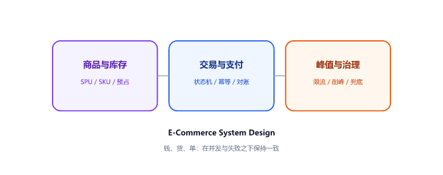
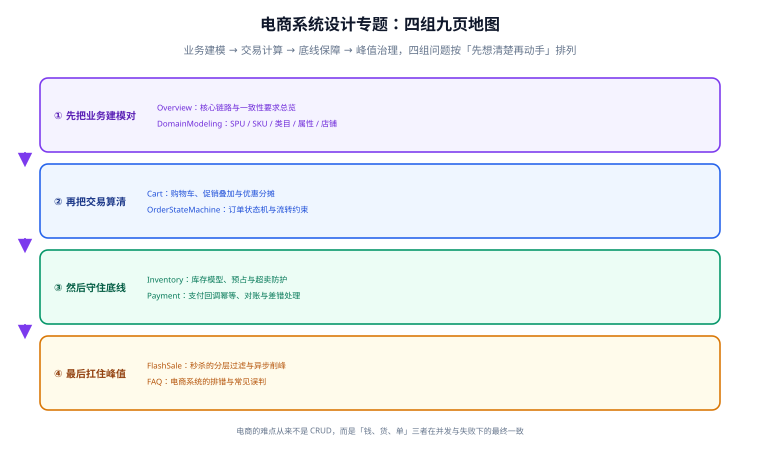

# 电商系统设计

电商系统（E-Commerce System）是「把商品卖出去」这件事在软件里的完整闭环：用户看货、加购、下单、付款，系统扣库存、发货、收款、对账，出了问题还得能退能补。它看起来只是一堆 CRUD，真正的难点在于**钱、货、单三者在并发与失败之下仍要保持一致**。本专题按「业务建模 → 交易计算 → 底线保障 → 峰值治理」四组问题展开，每页只解决一类问题。

## 一句话理解

普通后台的报表算错，改过来就行；电商系统的订单算错，货已经发出去了。**所以电商设计的重心不在功能有多少，而在「每一步失败了怎么办」写清楚了没有。**

## 为什么单独成专题

学过数据库、Redis、消息队列之后，很多人依然写不好电商：因为电商的难度来自**业务语义与并发语义的叠加**，而这两者在通用技术文档里是分开讲的。本专题把它们放回同一个场景里对照。

| 通用技术里学到的 | 在电商里长什么样 |
| --- | --- |
| 数据库事务 | 下单要同时改订单、库存、优惠券三张表，超时未付还要回滚 |
| 缓存与一致性 | 库存数字展示用缓存，但扣减必须以数据库为准 |
| 消息队列 | 秒杀用队列削峰，代价是「下单结果变异步」 |
| 幂等 | 支付回调会重试，重复生效等于重复发货 |
| 状态机 | 订单状态只能前进不能跳级，谁改了都要留痕 |
| 对账 | 回调是「尽力而为」，对账才是「一定会到」的那层 |

::: tip 一个判断标准
**凡是会改钱和改货的操作，都要能回答「重复执行一次会怎样」。** 答不上来的地方，就是还没设计完的地方。
:::

## 八页导航

| 组 | 页面 | 解决的问题 |
| --- | --- | --- |
| ① 建模 | [电商系统全景与核心链路](Overview/index.md) | 全链路有哪些步骤、每步要哪种一致性 |
| ① 建模 | [商品与领域建模](DomainModeling/index.md) | SPU / SKU / 类目 / 属性怎么分才不打架 |
| ② 交易 | [购物车与价格计算](Cart/index.md) | 促销叠加的先后顺序与优惠分摊 |
| ② 交易 | [订单状态机](OrderStateMachine/index.md) | 状态怎么流转、谁能改、怎么留痕 |
| ③ 底线 | [库存模型与超卖防护](Inventory/index.md) | 预占 / 实扣 / 释放，以及四层防超卖 |
| ③ 底线 | [支付、幂等与对账](Payment/index.md) | 回调幂等、主动查单与 T+1 对账 |
| ④ 峰值 | [秒杀与流量治理](FlashSale/index.md) | 分层过滤与异步削峰 |
| ④ 峰值 | [常见问题与排错](FAQ/index.md) | 钱 / 货 / 单三类故障的排查入口 |

## 怎么读

- **要做一个完整的交易模块**：按 ①→②→③ 顺序读，前一页定下的抽象是后一页的前提（先有 SKU 才有库存，先有价格快照才有退款分摊）。
- **线上正在出问题**：直接跳到 [常见问题与排错](FAQ/index.md)，按「钱查快照、货查预占、单查幂等键」定位，再回到对应页。
- **只想了解电商大概**：读 [电商系统全景与核心链路](Overview/index.md) 一页即可，它把其余七页的结论都压缩成了结论句。

## 三条底线

无论项目大小，这三条不做到，功能再多也是空中楼阁：

1. **快照**。下单那一刻的价格、优惠、收货信息必须存成快照，之后商品改价、活动结束都不能影响历史订单。退款按快照算，不按当前价算。
2. **幂等**。所有会改钱、改货的入口（下单、支付回调、退款、库存释放）都必须能安全地重复执行一次。
3. **对账**。凡是「靠对方通知我」才能推进的流程（支付、物流），都必须有一条主动核对的兜底路径。

## 与相邻专题的分工

| 相邻专题 | 谁负责什么 |
| --- | --- |
| [数据建模](../../DB/DataModeling/index.md) | 该专题讲**建模方法论**（范式、ER、反范式）；本专题讲**具体到电商的模型**（SPU/SKU、订单行、库存流水） |
| [Redis 分布式锁](../../DB/NoRelational/Redis/Advanced/DistributedLock/index.md) | 该专题讲分布式锁与缓存防护的**通用机制**；本专题讲它们在库存扣减里的**具体用法与边界** |
| [分布式事务一致性](../../Backend/Microservices/DistributedTransaction/Consistency/index.md) | 该专题讲 TCC / 消息最终一致的**协议**；本专题讲电商场景下**哪些环节真需要分布式事务、哪些用对账就够** |
| [消息队列](../MessageQueue/Overview/index.md) | 提供削峰与解耦的**能力**；本专题讲秒杀里**该把什么放进队列、放进去之后体验怎么兜** |
| [完整项目交付](../../Others/ProjectDelivery/index.md) | 该专题讲**通用的交付流程与验收判据**；本专题是它在**电商领域**的落地补充 |
| [后端通用模板](../../../project/Base/BackendTemplate/index.md) | 提供可直接复用的工程基座（认证、统一响应、容器化、CI）；本专题的接口与表结构可挂在其上 |

## 参考资料

- [阿里巴巴 Java 开发手册](https://github.com/alibaba/p3c)：数据库与并发部分的强制规约，电商系统的通用底线
- [MySQL 8.4 官方文档 · InnoDB 锁与事务](https://dev.mysql.com/doc/refman/8.4/en/innodb-locking.html)：条件更新与行锁的行为依据
- [Redis 官方文档 · Lua 脚本](https://redis.io/docs/latest/develop/programmability/eval-intro/)：库存预扣的原子性来源
- [Martin Fowler · Transactional Outbox](https://martinfowler.com/articles/patterns-of-distributed-systems/transactional-outbox.html)：订单与消息一致性落地的经典模式
