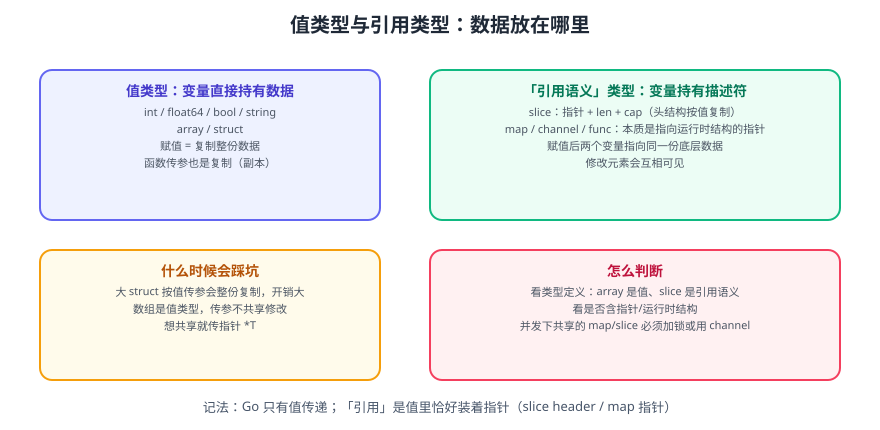

# Go 基础语法

本页覆盖 Go 的语言地基：**变量与常量、基本类型、运算符、流程控制、结构体**。学完这一页，你就能读懂绝大多数 Go 业务代码。

一句话理解：Go 的语法有强烈的「**一种写法**」倾向——没有三元运算符、没有 `while`、没有隐式类型转换、`if` 必须带花括号，目的是让所有人写出来的代码长得一样。

## 1. 程序骨架

```go [main.go]
package main // 可执行程序的包名固定为 main

import ( // 导入声明，未使用的导入会导致编译失败
    "fmt"
    "strings"
)

func main() { // 入口函数，无参数、无返回值
    fmt.Println(strings.ToUpper("hello go"))
}
```

三个强制规则：

1. **可执行程序必须在 `package main` 中定义 `func main()`**。
2. **导入的包必须被使用**，否则编译报错 `imported and not used`。
3. **声明的局部变量必须被使用**，否则编译报错 `declared and not used`。

::: tip 提示
这两个「未使用」错误看起来烦人，实际是 Go 保持代码整洁的核心手段——它让死代码无法偷偷留在仓库里。
:::

## 2. 变量与常量

### 2.1 变量声明

```go
var a int = 10      // 完整写法
var b = 20          // 类型由编译器推断
c := 30             // 短变量声明（仅函数内可用）

var (               // 批量声明
    name string = "gopher"
    age  int    = 15
)

var x, y int = 1, 2 // 同类型多变量
var p, q = "a", 1.5 // 类型可不同（各自推断）
```

| 写法 | 作用域 | 说明 |
| --- | --- | --- |
| `var name T = v` | 包级 / 函数级 | 显式类型，最清晰 |
| `var name = v` | 包级 / 函数级 | 类型推断 |
| `name := v` | 仅函数级 | 最常用，但**不能用于包级变量** |
| `var name T` | 包级 / 函数级 | 声明零值 |

### 2.2 零值

Go 没有「未初始化」状态，每个变量声明后都有确定的零值：

| 类型 | 零值 |
| --- | --- |
| 数值类型（int、float64 等） | `0` |
| 布尔 | `false` |
| 字符串 | `""`（空串） |
| 指针、接口、切片、映射、通道、函数 | `nil` |
| 结构体 | 每个字段各自为零值 |
| 数组 | 每个元素为零值 |

```go
var s []int
fmt.Println(s == nil)      // true
fmt.Println(len(s))        // 0 —— len(nil slice) 合法
var m map[string]int
fmt.Println(m == nil)      // true
// m["k"] = 1               // panic: assignment to entry in nil map
```

### 2.3 常量

```go
const Pi = 3.14159
const (
    StatusOK    = 200
    StatusNotFound = 404
)

// iota：常量计数器，每行递增 1，常用于枚举
type Weekday int

const (
    Sunday Weekday = iota // 0
    Monday                // 1
    Tuesday               // 2
)
```

::: danger 注意
1. **常量只能用编译期可求值的表达式**，不能用函数返回值（`math.Sqrt(2)` 是变量不是常量）。
2. **`iota` 在 `const` 块内按行计数**，遇到新的 `const` 块重置为 0；跳过某行用 `_` 占位。
3. **不要用 `iota` 表示跨系统协议的状态码**，一旦中间插入一行就会改变所有后续值，破坏兼容性。
:::

## 3. 基本类型



| 类别 | 类型 | 说明 |
| --- | --- | --- |
| 整数 | `int8/16/32/64`、`int`、`uint8/16/32/64`、`uint`、`uintptr` | `int` 宽度随平台（64 位平台为 64 位） |
| 字节/字符 | `byte`（= `uint8`）、`rune`（= `int32`） | `byte` 存字节，`rune` 存 Unicode 码点 |
| 浮点 | `float32`、`float64` | 无 `float` 类型，默认推断为 `float64` |
| 复数 | `complex64`、`complex128` | 科学计算场景 |
| 布尔 | `bool` | 只能是 `true` / `false`，不接受 0/1 |
| 字符串 | `string` | **不可变**的 UTF-8 字节序列 |
| 派生 | 数组、切片、映射、结构体、指针、函数、接口、通道 | 见后续章节 |

### 3.1 字符串与字符

```go
s := "Go 语言"
fmt.Println(len(s))        // 9 —— 字节数，不是字符数
fmt.Println(len([]rune(s))) // 5 —— 字符数（Unicode 码点）

fmt.Println(s[0])          // 71（'G' 的字节值）
for i, r := range s {      // range 按字符（rune）遍历
    fmt.Printf("%d:%c ", i, r)
}
```

::: danger 注意
1. **`len(s)` 返回字节数**，含中文的字符串不能用来算字符数，要用 `utf8.RuneCountInString(s)` 或 `len([]rune(s))`。
2. **`s[i]` 返回 `byte`**，不是字符。要取第 i 个字符请转成 `[]rune`。
3. **字符串不可变**，`s[0] = 'X'` 无法编译；需要修改时转成 `[]byte` 或用 `strings.Builder` 拼接。
:::

### 3.2 类型转换

Go **没有隐式类型转换**，不同类型的数值之间必须显式转换：

```go
var i int = 42
var f float64 = float64(i) // 必须显式写
var u uint = uint(f)

// 注意：转换可能丢精度或溢出
var big int32 = 300
var small int8 = int8(big) // 编译通过，但值为 44（截断）
```

::: warning 说明
字符串与数值之间**没有直接转换**，必须走标准库：

```go
n, err := strconv.Atoi("42")     // string → int
s := strconv.Itoa(42)            // int → string
f, err := strconv.ParseFloat("3.14", 64)
```
:::

## 4. 运算符

| 类别 | 运算符 | 说明 |
| --- | --- | --- |
| 算术 | `+ - * / %` | 整数除法截断；`%` 只用于整数 |
| 比较 | `== != < <= > >=` | 结果为 `bool` |
| 逻辑 | `&& \|\| !` | 短路求值 |
| 位运算 | `& \| ^ &^ << >>` | `&^` 为按位清除 |
| 赋值 | `= += -= *= /= %= &= \|= ^= <<= >>=` | 复合赋值 |
| 自增 | `++` `--` | **只能是语句**，不能当表达式用 |
| 取址/解引用 | `&` `*` | 取地址、访问指针指向的值 |

::: danger 注意
1. **`++` / `--` 是语句不是表达式**，`a := i++` 无法编译。
2. **没有三元运算符** `?:`，用 `if/else` 或先赋值再判断。
3. **整数除法会截断**：`7 / 2 == 3`，要得到 3.5 必须先转 `float64`。
4. **浮点比较不要用 `==`**，用误差范围判断：`math.Abs(a-b) < 1e-9`。
:::

## 5. 流程控制

### 5.1 if

```go
if score := 85; score >= 90 { // 允许带初始化语句，作用域限于 if
    fmt.Println("优秀")
} else if score >= 60 {
    fmt.Println("及格")
} else {
    fmt.Println("不及格")
}
// 这里访问 score 会编译错误
```

### 5.2 for

Go 只有 `for` 一种循环，但能表达所有形态：

```go
// 1. 经典三段式
for i := 0; i < 3; i++ {
    fmt.Println(i)
}

// 2. 当 while 用
n := 0
for n < 3 {
    n++
}

// 3. 无限循环
for {
    break // 需要自己退出
}

// 4. range 遍历
nums := []int{10, 20, 30}
for i, v := range nums {
    fmt.Printf("index=%d value=%d\n", i, v)
}
for _, v := range nums { // 忽略索引
    fmt.Println(v)
}
for i := range nums { // 只要索引
    fmt.Println(i)
}

// 5. 遍历字符串（按 rune）
for i, r := range "Go 语言" {
    fmt.Printf("%d:%c\n", i, r)
}

// 6. 遍历映射（顺序随机！）
m := map[string]int{"a": 1, "b": 2}
for k, v := range m {
    fmt.Println(k, v)
}
```

::: danger 注意
1. **`range` 映射的顺序是随机的**，每次运行都可能不同。需要有序输出必须先把 key 取出排序。
2. **`range` 循环变量在 Go 1.22 起每轮新建**，所以闭包捕获是安全的；1.22 之前所有轮次共享同一个变量，会踩经典的「全部输出最后一个值」的坑。

```go
// Go 1.22+ 行为正确；1.21 及以前会全部打印 3
for i := 0; i < 3; i++ {
    go func() { fmt.Println(i) }()
}
```
:::

### 5.3 switch

```go
// 1. 普通 switch（默认不穿透，无需 break）
switch day := "Mon"; day {
case "Sat", "Sun":
    fmt.Println("周末")
case "Mon":
    fmt.Println("周一")
default:
    fmt.Println("工作日")
}

// 2. 无表达式的 switch（当 if-else 链用）
score := 85
switch {
case score >= 90:
    fmt.Println("优秀")
case score >= 60:
    fmt.Println("及格")
default:
    fmt.Println("不及格")
}

// 3. type switch（判断接口的动态类型）
var v any = "hello"
switch x := v.(type) {
case string:
    fmt.Println("string:", x)
case int:
    fmt.Println("int:", x)
default:
    fmt.Printf("other: %T\n", x)
}

// 4. fallthrough 显式穿透到下一个 case
switch 1 {
case 1:
    fmt.Println("one")
    fallthrough
case 2:
    fmt.Println("two") // 会被执行
}
```

### 5.4 goto 与标签

```go
// 用于跳出多层循环（谨慎使用，优先重构）
outer:
for i := 0; i < 3; i++ {
    for j := 0; j < 3; j++ {
        if i*j == 4 {
            break outer
        }
    }
}
```

::: warning 说明
`goto` 只能跳转到同函数内的标签，且不允许跳过变量声明。生产代码里应优先用函数提取或 `break label` 代替 `goto`。
:::

## 6. 结构体

### 6.1 定义与初始化

```go
type User struct {
    ID    int64
    Name  string
    Email string
    Tags  []string
}

// 1. 字段名初始化（推荐，字段增减不影响）
u1 := User{ID: 1, Name: "Alice", Email: "a@example.com"}

// 2. 按顺序初始化（字段顺序变化会静默出错，不推荐）
u2 := User{1, "Bob", "b@example.com", nil}

// 3. 零值 + 后续赋值
var u3 User
u3.Name = "Carol"

// 4. 取指针
u4 := &User{ID: 4, Name: "Dave"}
fmt.Println(u4.Name) // 自动解引用，等价于 (*u4).Name
```

::: danger 注意
**不要对来自其他包的公开结构体使用「按顺序初始化」**。对方新增字段后，编译虽然可能通过，但值会错位到错误的字段上——这是极难排查的线上事故。
:::

### 6.2 结构体标签

标签（tag）是给反射用的元信息，最常见的用途是 JSON 与数据库映射：

```go
type Article struct {
    ID        int64  `json:"id" db:"id"`
    Title     string `json:"title" db:"title"`
    Content   string `json:"content,omitempty" db:"content"`
    CreatedAt string `json:"created_at" db:"created_at"`
}
```

常用选项：`json:"name"` 改键名、`json:",omitempty"` 零值时省略、`json:"-"` 完全忽略。

### 6.3 嵌入与组合

Go 用**组合**代替继承：

```go
type Base struct {
    ID int64
}

func (b Base) Describe() string {
    return fmt.Sprintf("id=%d", b.ID)
}

type Article struct {
    Base           // 嵌入（匿名字段），Article 自动获得 Describe 与 ID
    Title string
}

a := Article{Base: Base{ID: 7}, Title: "Go 入门"}
fmt.Println(a.ID)        // 7 —— 提升字段
fmt.Println(a.Describe()) // id=7 —— 提升方法
```

## 7. 指针

```go
x := 10
p := &x        // p 是 *int
*p = 20        // 通过指针修改 x
fmt.Println(x) // 20

func inc(v int)  { v++ }   // 传值：外部不变
func incPtr(v *int) { *v++ } // 传指针：外部改变
```

::: tip 什么时候用指针
1. **需要在函数内修改调用方数据**——传指针。
2. **结构体较大（如超过几百字节）**——传指针避免整份复制。
3. **需要表达「可为 nil」**——指针的零值是 `nil`。
4. 其余情况优先传值。Go 的值语义让代码更容易推理，不要为了「省内存」盲目加指针。
:::

## 8. 完整示例

```go [main.go]
package main

import (
    "errors"
    "fmt"
    "sort"
    "strings"
)

type Student struct {
    Name  string
    Score int
}

// Grade 返回等级；分数非法时返回错误。
func (s Student) Grade() (string, error) {
    if s.Score < 0 || s.Score > 100 {
        return "", fmt.Errorf("invalid score %d for %s", s.Score, s.Name)
    }
    switch {
    case s.Score >= 90:
        return "优秀", nil
    case s.Score >= 60:
        return "及格", nil
    default:
        return "不及格", nil
    }
}

func main() {
    students := []Student{
        {"Alice", 92}, {"Bob", 58}, {"Carol", 77}, {"Dave", 105},
    }

    passed := make([]string, 0, len(students))
    var errs []error

    for _, s := range students {
        grade, err := s.Grade()
        if err != nil {
            errs = append(errs, err)
            continue
        }
        if grade != "不及格" {
            passed = append(passed, s.Name)
        }
    }

    sort.Strings(passed)
    fmt.Println("及格名单:", strings.Join(passed, ", "))
    fmt.Println("错误数量:", len(errs), errors.Join(errs...))
}
```

```shell
go run .
# 及格名单: Alice, Carol
# 错误数量: 1 invalid score 105 for Dave
```

**验证方式**：输出名单按字典序排列；错误行包含出错的学生名与分数；把 `Dave` 的分数改为 `80` 后重跑，「错误数量」应变为 0 且名单多出 `Dave`。

## 9. 参考资料

- [Go 语言规范](https://go.dev/ref/spec)
- [Effective Go](https://go.dev/doc/effective_go)
- [A Tour of Go：基础](https://go.dev/tour/basics)
- [Go 1.22 循环变量变更说明](https://go.dev/blog/loopvar-preview)
