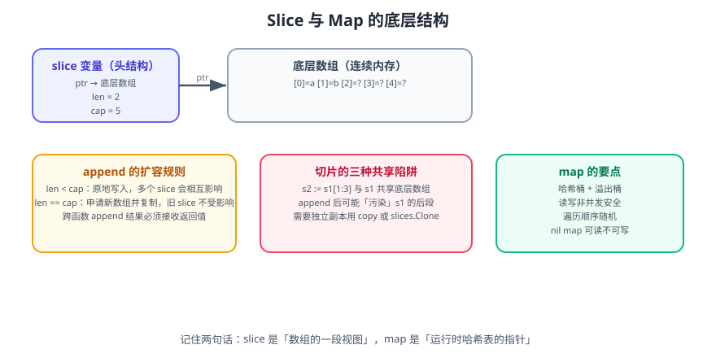

# Go 集合：数组、切片与映射

Go 内置三种集合类型：**数组（array）**、**切片（slice）**、**映射（map）**。日常开发中数组很少直接用，切片与映射几乎无处不在。

一句话理解：**数组是固定长度的值，切片是数组上的一层「视图」（指针 + 长度 + 容量），映射是运行时哈希表**。理解这句话，90% 的切片坑都能避开。

## 1. 数组

数组长度是**类型的一部分**，`[3]int` 与 `[4]int` 是不同类型。

```go
var a [3]int              // [0 0 0]
b := [3]int{1, 2, 3}      // [1 2 3]
c := [...]int{1, 2, 3, 4} // 长度由元素个数推断，c 的类型是 [4]int
d := [5]int{1: 10, 3: 30} // 指定下标初始化：[0 10 0 30 0]

// 多维数组
var grid [2][3]int
grid[1][2] = 9
```

::: danger 注意
**数组是值类型**——赋值和传参会复制整个数组。

```go
a := [3]int{1, 2, 3}
b := a          // 复制
b[0] = 100
fmt.Println(a)  // [1 2 3] —— a 不受影响
```

需要共享或长度可变时，用切片或数组指针 `*[3]int`。
:::

## 2. 切片



### 2.1 创建与初始化

```go
var s1 []int                    // nil 切片，len=0，cap=0
s2 := []int{1, 2, 3}            // 字面量，len=cap=3
s3 := make([]int, 3)            // len=3，cap=3，元素为 0
s4 := make([]int, 0, 8)         // len=0，cap=8（推荐：预分配容量）
s5 := make([]string, 2, 4)      // len=2，cap=4
```

**nil 切片可以直接使用**：

```go
var s []int
fmt.Println(len(s))   // 0
s = append(s, 1)      // 合法
fmt.Println(s)        // [1]
```

::: tip 最佳实践：优先预分配容量
```go
// 已知长度时：一次分配，避免多次扩容与复制
ids := make([]int64, 0, len(users))
for _, u := range users {
    ids = append(ids, u.ID)
}
```
:::

### 2.2 append 与扩容

```go
s := make([]int, 0, 2)
fmt.Println(len(s), cap(s)) // 0 2
s = append(s, 1)            // len=1 cap=2
s = append(s, 2)            // len=2 cap=2
s = append(s, 3)            // 超容量 → 分配新数组，cap 翻倍
fmt.Println(len(s), cap(s)) // 3 4
```

扩容规则（实现细节，随版本调整）：

| 当前容量 | 大致策略 |
| --- | --- |
| 小于 256 | 直接翻倍 |
| 大于等于 256 | 按约 1.25 倍增长，并做内存对齐 |

::: danger 注意
**`append` 可能原地写入，也可能分配新数组——两种情况下语义不同。**

```go
s1 := make([]int, 3, 5)
s1[0], s1[1], s1[2] = 1, 2, 3

s2 := append(s1, 4) // 容量够 → 直接写 s1 的底层数组第 4 个位置
s3 := append(s2, 5) // 容量不够 → 分配新数组

fmt.Println(s1) // [1 2 3] —— 看起来没变
fmt.Println(s2) // [1 2 3 4]
```

下面这个更隐蔽：

```go
s1 := []int{1, 2, 3, 4}
s2 := s1[:2]              // len=2 cap=4，与 s1 共享底层数组
s2 = append(s2, 99)       // 容量够，就地写入
fmt.Println(s1)           // [1 2 99 4] —— s1 被「污染」了！
```

**永远接收 `append` 的返回值**，且不要依赖「原切片是否变化」——这是未定义在语义层面的实现细节。
:::

### 2.3 子切片与 copy

```go
s := []int{0, 1, 2, 3, 4, 5}

a := s[1:4]  // [1 2 3]，len=3，cap=5
b := s[:3]   // [0 1 2]
c := s[3:]   // [3 4 5]
d := s[:]    // 全部，与 s 共享

// 三索引切片：限制容量，防止 append 污染原切片
e := s[1:4:4] // len=3，cap=3（第三个参数是「最大下标+1」）
```

```go
// 需要独立副本时用 copy 或 slices.Clone
src := []int{1, 2, 3}
dst := make([]int, len(src))
n := copy(dst, src) // 返回复制的元素个数
fmt.Println(dst, n) // [1 2 3] 3

// Go 1.21+ 标准库
import "slices"
clone := slices.Clone(src)
```

### 2.4 常用操作

| 操作 | 写法 |
| --- | --- |
| 追加 | `s = append(s, x)` |
| 追加多个 | `s = append(s, xs...)` |
| 删除下标 i | `s = append(s[:i], s[i+1:]...)` |
| 删除并保持顺序且置零尾部 | 见下方代码 |
| 插入 | `s = append(s[:i], append([]T{x}, s[i:]...)...)` |
| 查找 | 循环，或 `slices.Index(s, x)`（1.21+） |
| 排序 | `slices.Sort(s)`（1.21+） |
| 反转 | `slices.Reverse(s)` |
| 包含 | `slices.Contains(s, x)` |
| 比较相等 | `slices.Equal(a, b)` |
| 最值 | `slices.Max(s)` / `slices.Min(s)` |

```go
// 从切片中删除下标 i（保持顺序，且避免内存泄漏）
func removeAt[T any](s []T, i int) []T {
    var zero T
    copy(s[i:], s[i+1:])
    s[len(s)-1] = zero // 清除引用，帮助 GC
    return s[:len(s)-1]
}

// 过滤（原地，不分配新底层数组）
func filterInPlace[T any](s []T, keep func(T) bool) []T {
    n := 0
    for _, v := range s {
        if keep(v) {
            s[n] = v
            n++
        }
    }
    return s[:n]
}
```

::: danger 注意
**切片本身不是并发安全的。** 多个 goroutine 同时 `append` 同一个切片会导致数据竞争甚至崩溃。并发场景要么在临界区加锁，要么每个 goroutine 写自己的切片再合并。

```go
// 危险：并发 append 同一个切片
// 正确：分片处理或加锁
var mu sync.Mutex
var out []int
var wg sync.WaitGroup
for i := 0; i < 10; i++ {
    wg.Add(1)
    go func(v int) {
        defer wg.Done()
        mu.Lock()
        out = append(out, v)
        mu.Unlock()
    }(i)
}
wg.Wait()
```
:::

## 3. 映射（map）

### 3.1 创建与基本操作

```go
// 创建
m1 := map[string]int{"a": 1, "b": 2}
m2 := make(map[string]int)       // 推荐：可预分配容量 make(map[string]int, 64)
var m3 map[string]int            // nil map：可读不可写

// 增删改查
m2["x"] = 10                     // 插入或更新
v := m2["x"]                     // 取值，不存在返回零值
v, ok := m2["x"]                 // comma-ok 惯用法
delete(m2, "x")                  // 删除（删除不存在的 key 不报错）
fmt.Println(len(m2))             // 元素个数
```

```go
// 遍历（顺序随机）
for k, v := range m1 {
    fmt.Println(k, v)
}

// 需要有序输出：先取 key 再排序
keys := make([]string, 0, len(m1))
for k := range m1 {
    keys = append(keys, k)
}
slices.Sort(keys)
for _, k := range keys {
    fmt.Println(k, m1[k])
}
```

::: danger 注意
1. **`nil` map 读取不 panic 但写入会 panic**：`var m map[string]int; m["a"] = 1` → `panic: assignment to entry in nil map`。必须 `make` 初始化。
2. **`map` 不是并发安全的**。并发写会触发运行时致命错误 `fatal error: concurrent map writes`，这个错误**无法被 recover 捕获**，程序直接退出。并发场景用 `sync.RWMutex` 或 `sync.Map`。
3. **`range` 顺序随机**，不要假设稳定性。
4. **不要用浮点数或含切片/映射的结构体作 key**（结构体可作 key 但必须所有字段都可比较）。
:::

### 3.2 用 map 实现集合

```go
type Set[T comparable] map[T]struct{}

func (s Set[T]) Add(v T)       { s[v] = struct{}{} }
func (s Set[T]) Has(v T) bool  { _, ok := s[v]; return ok }
func (s Set[T]) Remove(v T)    { delete(s, v) }
func (s Set[T]) Len() int      { return len(s) }

seen := make(Set[string])
for _, w := range words {
    seen.Add(w)
}
fmt.Println(seen.Len(), seen.Has("go"))
```

用 `struct{}{}` 而不是 `bool` 作值，因为空结构体**不占内存**。

### 3.3 并发安全的取舍

| 方案 | 适用场景 | 代价 |
| --- | --- | --- |
| `sync.RWMutex` + 普通 map | 读多写少、需要复杂操作 | 手动加锁，易漏 |
| `sync.Map` | key 稳定、读写分离、一次性写入 | 类型为 `any`，无泛型，内存开销大 |
| 分片锁（sharded map） | 超高并发读写 | 实现复杂 |
| 每 goroutine 私有 map + 合并 | 批量聚合 | 需要归并逻辑 |

```go
// 泛型并发 map（读写都需要加锁，简单可靠）
type SafeMap[K comparable, V any] struct {
    mu sync.RWMutex
    m  map[K]V
}

func NewSafeMap[K comparable, V any]() *SafeMap[K, V] {
    return &SafeMap[K, V]{m: make(map[K]V)}
}

func (s *SafeMap[K, V]) Set(k K, v V) {
    s.mu.Lock()
    defer s.mu.Unlock()
    s.m[k] = v
}

func (s *SafeMap[K, V]) Get(k K) (V, bool) {
    s.mu.RLock()
    defer s.mu.RUnlock()
    v, ok := s.m[k]
    return v, ok
}
```

## 4. 性能要点

| 关注点 | 建议 |
| --- | --- |
| 切片扩容 | 已知大小时用 `make([]T, 0, n)` 预分配 |
| 频繁拼接字符串 | 用 `strings.Builder`，不要 `+` |
| 小切片去重 | 元素少（< 16）时循环比较比建 map 更快 |
| map 预分配 | `make(map[K]V, n)` 减少 rehash |
| 大 map 长时间存活 | 定期重建以避免内存只增不减（Go 的 map 不会自动收缩） |
| 频繁 `append` 大元素 | 存指针 `[]*T` 而不是 `[]T` |

```go
// 内存泄漏排查：map 删除 key 后内存不会归还给系统
// 如果 map 曾经膨胀到很大后又大量删除，可重建
func shrink[K comparable, V any](m map[K]V) map[K]V {
    if len(m)*4 < cap(m) { // 经验阈值
        nm := make(map[K]V, len(m))
        for k, v := range m {
            nm[k] = v
        }
        return nm
    }
    return m
}
```

## 5. 完整示例：词频统计与 Top-N

```go [wordcount.go]
package main

import (
    "fmt"
    "slices"
    "sort"
    "strings"
)

func wordCount(text string) map[string]int {
    counts := make(map[string]int)
    for _, w := range strings.FieldsFunc(strings.ToLower(text), func(r rune) bool {
        return !(r >= 'a' && r <= 'z') && !(r >= '0' && r <= '9') && r != '\''
    }) {
        if w != "" {
            counts[w]++
        }
    }
    return counts
}

type kv struct {
    Word  string
    Count int
}

// topN 返回出现次数最多的前 n 个词。
func topN(counts map[string]int, n int) []kv {
    ranked := make([]kv, 0, len(counts))
    for w, c := range counts {
        ranked = append(ranked, kv{w, c})
    }
    slices.SortFunc(ranked, func(a, b kv) int {
        if a.Count != b.Count {
            return b.Count - a.Count // 次数降序
        }
        return strings.Compare(a.Word, b.Word) // 次数相同时字母升序
    })
    return ranked[:min(n, len(ranked))]
}

func main() {
    text := `Go is expressive, concise, clean, and efficient.
Go is a fast, statically typed, compiled language.
Go is especially well suited for building scalable systems.`

    counts := wordCount(text)
    fmt.Println("不同单词数:", len(counts))
    for i, item := range topN(counts, 5) {
        fmt.Printf("%d. %-8s %d\n", i+1, item.Word, item.Count)
    }
}
```

```shell
go run wordcount.go
# 不同单词数: 22
# 1. is       4
# 2. go       3
# 3. and      2
# 4. a        1
# 5. building 1
```

**验证方式**：`slices.SortFunc` 排序结果稳定（次数相同时按字母序），所以输出可重复。多次运行结果完全一致——这与「直接 `range` map」的随机顺序形成对比，正是本节要强调的重点。

## 6. 参考资料

- [Go 语言规范：切片类型](https://go.dev/ref/spec#Slice_types)
- [Go 语言规范：映射类型](https://go.dev/ref/spec#Map_types)
- [Go 博客：切片用法与内部结构](https://go.dev/blog/slices-intro)
- [pkg.go.dev：slices 包](https://pkg.go.dev/slices)
- [pkg.go.dev：maps 包](https://pkg.go.dev/maps)
