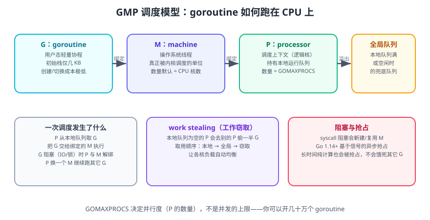
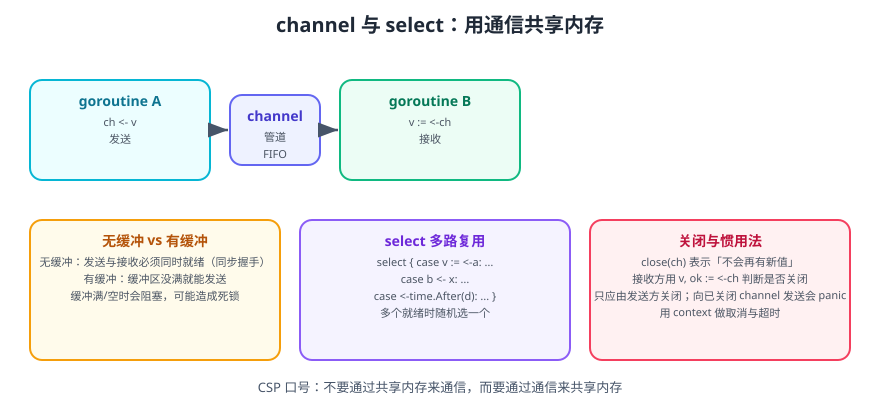

# Go 并发模型

Go 的并发是它最被称道的部分。核心只有两个原语：**goroutine**（轻量协程）与 **channel**（通信管道），其余（`select`、`sync`、`context`）都是围绕它们的补充。

一句话理解：**Go 把并发做成了语言特性**——`go f()` 就开一个协程，`ch <- v` 就传数据，不需要线程池、不需要回调、不需要手动管理生命周期（大部分情况下）。

::: tip 核心哲学
> Do not communicate by sharing memory; instead, share memory by communicating.
> 不要通过共享内存来通信，而要通过通信来共享内存。
>
> —— Rob Pike

这句话不是教条。**能用 channel 表达就用 channel；channel 不合适时（如计数器、缓存）就用锁**。Go 的 `sync` 包同样是官方推荐的一部分。
:::

## 1. goroutine

### 1.1 启动

```go
go func() {
    fmt.Println("hello from goroutine")
}()
```

`go` 关键字后面跟一个函数调用，该调用会在**新的 goroutine 中异步执行**。

```go
// 经典错误：主协程不等待
func main() {
    go fmt.Println("可能看不到这行")
    // main 退出 → 所有 goroutine 被强制结束
}
```

::: danger 注意
**`main` 函数返回时，整个程序立即退出，不会等待其他 goroutine。** 必须用 `sync.WaitGroup`、channel 或 `context` 做同步。

```go
var wg sync.WaitGroup
for i := 0; i < 3; i++ {
    wg.Add(1)
    go func(n int) {          // 把 i 作为参数传入，避免共享循环变量
        defer wg.Done()
        fmt.Println("worker", n)
    }(i)
}
wg.Wait() // 等待全部完成
```
:::

### 1.2 开销

| 对比项 | goroutine | 操作系统线程 |
| --- | --- | --- |
| 初始栈大小 | 约 2~8 KB（可动态增长） | 约 1 MB（固定） |
| 创建耗时 | 纳秒~微秒级 | 微秒~毫秒级 |
| 切换成本 | 用户态切换，无系统调用 | 内核态切换 |
| 数量级 | 十万~百万 | 数千（受内存限制） |

```go
// 100 万个 goroutine 在现代 Go 里是可行的（约几 GB 内存）
for i := 0; i < 1_000_000; i++ {
    go func() { time.Sleep(time.Second) }()
}
```

### 1.3 调度器：GMP 模型



- **G（goroutine）**：要执行的任务，包含栈与状态。
- **M（machine）**：操作系统线程，真正被内核调度。
- **P（processor）**：调度上下文（逻辑处理器），持有本地运行队列。`GOMAXPROCS` 决定 P 的数量，也就是**真正的并行度**。

调度要点：

1. P 优先从自己的本地队列取 G 执行，减少锁竞争。
2. 本地队列为空的 P 会**工作窃取**（work stealing），从其他 P 的队列尾部偷一半 G。
3. G 发生阻塞系统调用时，P 会与 M 解绑，交给其他 M 继续跑队列里的 G——这是 Go 在大量 IO 场景下保持高吞吐的关键。
4. Go 1.14 起支持**基于信号的异步抢占**，长时间纯计算的 goroutine 也会被抢占，不会饿死其他 G。

```shell
# 查看/设置逻辑处理器数量
go run main.go        # 默认 = CPU 核数
GOMAXPROCS=4 go run main.go
```

```go
fmt.Println(runtime.GOMAXPROCS(0)) // 查询当前值（传 0 表示只查询不修改）
fmt.Println(runtime.NumGoroutine()) // 当前 goroutine 数量（常用于排查泄漏）
```

::: info 信息
**`GOMAXPROCS` 限制的是并行度，不是并发数。** 你可以创建几十万个 goroutine，它们会被调度到少数几个 P 上排队执行。Go 1.25 起会感知容器 CPU 限额，容器里不必再手动设置 `GOMAXPROCS`。
:::

## 2. channel



### 2.1 无缓冲与有缓冲

```go
unbuffered := make(chan int)     // 无缓冲
buffered := make(chan int, 3)    // 缓冲容量 3

// 无缓冲：发送与接收必须「同时就绪」——同步握手
// 有缓冲：缓冲未满即可发送，缓冲非空即可接收

buffered <- 1 // 不阻塞（缓冲有空间）
buffered <- 2
buffered <- 3
// buffered <- 4  // 阻塞：缓冲已满

fmt.Println(<-buffered) // 1
```

| 类型 | 发送阻塞条件 | 接收阻塞条件 | 典型用途 |
| --- | --- | --- | --- |
| 无缓冲 | 无接收方就绪 | 无发送方就绪 | 严格同步、交接控制权 |
| 有缓冲 | 缓冲已满 | 缓冲为空 | 解耦生产者与消费者、限流 |

### 2.2 关闭与遍历

```go
ch := make(chan int, 3)
go func() {
    defer close(ch) // 只应由发送方关闭
    for i := 1; i <= 3; i++ {
        ch <- i
    }
}()

for v := range ch { // 通道关闭后循环自动结束
    fmt.Println(v)
}

// 判断是否已关闭
v, ok := <-ch
// ok == false 表示通道已关闭且无剩余数据
```

::: danger 注意
1. **向已关闭的 channel 发送** → `panic: send on closed channel`。
2. **重复关闭** → `panic: close of closed channel`。
3. **只应由发送方关闭**。接收方关闭会让发送方 panic。
4. **从已关闭的 channel 接收**不会 panic，会立即返回零值；这也是「用 `ok` 判断」的原因。
5. **关闭 channel 不是必需的**：如果接收方已经通过其他方式确定不再接收，就不必关闭。只有当接收方需要知道「数据发完了」时才关闭。
:::

### 2.3 常见惯用法

```go
// 1. 生成器：返回只读通道
func gen(nums ...int) <-chan int {
    out := make(chan int)
    go func() {
        defer close(out)
        for _, n := range nums {
            out <- n
        }
    }()
    return out
}

// 2. 扇出（fan-out）：多个 goroutine 消费同一个通道
func worker(id int, jobs <-chan int, results chan<- int) {
    for j := range jobs {
        results <- j * j
    }
}

// 3. 扇入（fan-in）：合并多个通道
func merge(chs ...<-chan int) <-chan int {
    out := make(chan int)
    var wg sync.WaitGroup
    for _, ch := range chs {
        wg.Add(1)
        go func(c <-chan int) {
            defer wg.Done()
            for v := range c {
                out <- v
            }
        }(ch)
    }
    go func() {
        wg.Wait()
        close(out)
    }()
    return out
}

// 4. 单向通道类型：用类型表达意图
//    <-chan T 只读, chan<- T 只写, chan T 双向
```

## 3. select

`select` 在多个 channel 操作中等待，**任意一个就绪就执行对应分支**；多个同时就绪时**随机**选一个。

```go
select {
case v := <-ch1:
    fmt.Println("from ch1:", v)
case ch2 <- 42:
    fmt.Println("sent to ch2")
case <-time.After(2 * time.Second):
    fmt.Println("timeout")
default:
    fmt.Println("no channel ready") // 非阻塞：都不就绪时执行
}
```

```go
// 带退出信号的循环消费者（推荐模式）
func consume(ch <-chan int, stop <-chan struct{}) {
    for {
        select {
        case v, ok := <-ch:
            if !ok {
                return // 通道已关闭
            }
            process(v)
        case <-stop:
            return // 收到停止信号
        }
    }
}
```

::: tip 实用技巧：非阻塞尝试
```go
// 有值就取，没有就立刻走
select {
case v := <-ch:
    handle(v)
default:
    // 通道为空时的处理
}
```
:::

::: danger 注意
1. **空的 `select {}` 会永久阻塞**，会让整个 goroutine 卡死（Go 运行时会报 `all goroutines are asleep - deadlock!`，但如果还有别的 goroutine 在跑，就只是静默卡住）。
2. **`select` 分支的随机性不是缺陷**，它避免了「总是优先处理某个通道」导致的饥饿。
3. **`time.After` 在循环中会累积定时器**，热循环里应改用 `time.NewTimer` + `Reset`。
:::

## 4. context：取消、超时与传值

`context.Context` 是 Go 里跨 API 边界传递**取消信号、超时与请求级数据**的标准方式。

```go
// 1. 带超时的请求
func fetch(ctx context.Context, url string) ([]byte, error) {
    req, err := http.NewRequestWithContext(ctx, http.MethodGet, url, nil)
    if err != nil {
        return nil, err
    }
    resp, err := http.DefaultClient.Do(req)
    if err != nil {
        return nil, err
    }
    defer resp.Body.Close()
    return io.ReadAll(resp.Body)
}

func main() {
    ctx, cancel := context.WithTimeout(context.Background(), 3*time.Second)
    defer cancel() // 必须调用，否则泄漏

    body, err := fetch(ctx, "https://go.dev/")
    if errors.Is(err, context.DeadlineExceeded) {
        fmt.Println("请求超时")
    }
    _ = body
}
```

```go
// 2. 手动取消：把取消函数传给需要停止的地方
ctx, cancel := context.WithCancel(context.Background())
go func() {
    <-ctx.Done()
    fmt.Println("收到取消信号:", ctx.Err())
}()
cancel()
```

| 构造函数 | 用途 |
| --- | --- |
| `context.Background()` | 根上下文，用于 main、初始化、测试 |
| `context.TODO()` | 占位，将来要替换为具体上下文时用 |
| `context.WithCancel(parent)` | 手动取消 |
| `context.WithTimeout(parent, d)` | 超时自动取消 |
| `context.WithDeadline(parent, t)` | 指定截止时间 |
| `context.WithValue(parent, k, v)` | 传请求级数据（如 traceID） |

::: danger 注意
1. **`cancel` 必须调用**（哪怕用 `defer`），否则会泄漏定时器与 goroutine。
2. **`ctx` 必须作为函数的第一个参数**，命名 `ctx`，不要放进结构体里存起来。
3. **`WithValue` 只放请求级元数据**（traceID、用户身份），不要传业务参数或可选配置——那会让依赖关系隐形。
4. **key 不要用内置类型**，会与其他包冲突。用自定义类型：

```go
type ctxKey struct{}

func WithTraceID(ctx context.Context, id string) context.Context {
    return context.WithValue(ctx, ctxKey{}, id)
}

func TraceID(ctx context.Context) string {
    id, _ := ctx.Value(ctxKey{}).(string)
    return id
}
```
:::

## 5. 同步原语

### 5.1 sync.WaitGroup

```go
var wg sync.WaitGroup
for i := 0; i < 5; i++ {
    wg.Add(1) // 必须在启动 goroutine 之前调用
    go func(n int) {
        defer wg.Done()
        work(n)
    }(i)
}
wg.Wait()
```

### 5.2 sync.Mutex / RWMutex

```go
type Counter struct {
    mu sync.RWMutex
    n  int
}

func (c *Counter) Inc() {
    c.mu.Lock()
    defer c.mu.Unlock()
    c.n++
}

func (c *Counter) Value() int {
    c.mu.RLock() // 读锁：允许多个读者并发
    defer c.mu.RUnlock()
    return c.n
}
```

### 5.3 sync.Once

```go
var (
    once     sync.Once
    instance *Config
)

func GetConfig() *Config {
    once.Do(func() {
        instance = loadConfig() // 只会执行一次，且并发安全
    })
    return instance
}
```

### 5.4 sync.Map

```go
var m sync.Map
m.Store("k", 1)
v, ok := m.Load("k")
m.LoadOrStore("k", 2) // 存在则不覆盖
m.Range(func(k, v any) bool {
    fmt.Println(k, v)
    return true
})
```

::: warning 说明
`sync.Map` 适合两种场景：**key 集合基本固定、只增不减**，或**多个 goroutine 读写完全不相交的 key**。多数情况下 `sync.RWMutex` + 普通 map（或有类型参数的泛型包装）性能更好、可读性更高。
:::

### 5.5 原子操作

```go
var ops atomic.Int64

ops.Add(1)
ops.Load()
ops.CompareAndSwap(1, 2)

// 旧式写法（仍可用）
var n int64
atomic.AddInt64(&n, 1)
```

## 6. 并发模式

### 6.1 工作池（Worker Pool）

```go
func workerPool(jobs []int, workers int) []int {
    jobCh := make(chan int)
    resCh := make(chan int)

    var wg sync.WaitGroup
    for i := 0; i < workers; i++ {
        wg.Add(1)
        go func() {
            defer wg.Done()
            for j := range jobCh {
                resCh <- j * j
            }
        }()
    }

    go func() {
        defer close(jobCh)
        for _, j := range jobs {
            jobCh <- j
        }
    }()

    go func() {
        wg.Wait()
        close(resCh)
    }()

    var out []int
    for r := range resCh {
        out = append(out, r)
    }
    return out
}
```

### 6.2 错误组（errgroup）

`golang.org/x/sync/errgroup` 把「并发 + 错误收集 + 取消传播」合成一个抽象：

```shell
go get golang.org/x/sync/errgroup
```

```go
func fetchAll(ctx context.Context, urls []string) ([]string, error) {
    g, ctx := errgroup.WithContext(ctx)
    results := make([]string, len(urls))

    for i, u := range urls {
        i, u := i, u // 1.22 起可省略
        g.Go(func() error {
            body, err := fetch(ctx, u)
            if err != nil {
                return fmt.Errorf("fetch %s: %w", u, err)
            }
            results[i] = string(body)
            return nil
        })
    }

    if err := g.Wait(); err != nil { // 任一失败即返回，并取消其余任务
        return nil, err
    }
    return results, nil
}
```

### 6.3 限流（信号量）

```go
// 用带缓冲 channel 做并发上限
sem := make(chan struct{}, 10) // 最多 10 个并发
var wg sync.WaitGroup

for _, task := range tasks {
    wg.Add(1)
    sem <- struct{}{} // 获取令牌，满了就阻塞
    go func(t Task) {
        defer wg.Done()
        defer func() { <-sem }() // 释放令牌
        run(t)
    }(task)
}
wg.Wait()
```

## 7. 竞态检测

Go 内置的竞态检测器是并发调试的必备工具：

```shell
go test -race ./...          # 测试时检测
go run -race main.go         # 运行时检测
go build -race -o app .      # 构建带检测的二进制
```

输出的报告会指出**两个冲突的访问位置**与各自的 goroutine 创建栈：

```text
==================
WARNING: DATA RACE
Write at 0x00c000014128 by goroutine 7:
  main.increment()
      /app/main.go:12 +0x30
Previous read at 0x00c000014128 by goroutine 6:
  main.main()
      /app/main.go:20 +0x50
==================
```

::: danger 注意
1. **`-race` 只能发现「实际发生过」的竞态**，不能证明程序无竞态。要覆盖所有并发路径需要充分的测试。
2. **带 `-race` 的二进制性能下降约 5~20 倍，内存占用增加**，不要把 `-race` 构建用于生产。
3. **CI 里必须跑 `go test -race ./...`**，这是投入产出比最高的一道防线。
:::

## 8. 完整示例：带超时与取消的并发抓取

```go [fetchall.go]
package main

import (
    "context"
    "fmt"
    "sort"
    "sync"
    "time"
)

type item struct {
    name  string
    delay time.Duration
    fail  bool
}

// fetchAll 并发抓取所有 item，带超时与并发上限；
// 任一失败会取消其余任务，但已收集到的结果仍会返回。
func fetchAll(ctx context.Context, items []item, concurrency int) (map[string]string, error) {
    ctx, cancel := context.WithCancel(ctx)
    defer cancel()

    sem := make(chan struct{}, concurrency)
    var mu sync.Mutex
    out := make(map[string]string, len(items))

    var wg sync.WaitGroup
    var firstErr error

    for _, it := range items {
        wg.Add(1)
        sem <- struct{}{}
        go func(it item) {
            defer wg.Done()
            defer func() { <-sem }()

            select {
            case <-time.After(it.delay):
            case <-ctx.Done():
                return
            }

            if it.fail {
                mu.Lock()
                if firstErr == nil {
                    firstErr = fmt.Errorf("fetch %s failed", it.name)
                    cancel() // 通知其余任务尽快退出
                }
                mu.Unlock()
                return
            }

            mu.Lock()
            out[it.name] = "ok:" + it.name
            mu.Unlock()
        }(it)
    }
    wg.Wait()

    return out, firstErr
}

func main() {
    ctx, cancel := context.WithTimeout(context.Background(), 2*time.Second)
    defer cancel()

    items := []item{
        {"a", 300 * time.Millisecond, false},
        {"b", 500 * time.Millisecond, false},
        {"c", 100 * time.Millisecond, true}, // 会失败并触发取消
        {"d", 900 * time.Millisecond, false},
        {"e", 3 * time.Second, false}, // 会被超时或取消打断
    }

    got, err := fetchAll(ctx, items, 3)

    keys := make([]string, 0, len(got))
    for k := range got {
        keys = append(keys, k)
    }
    sort.Strings(keys)

    fmt.Println("成功:", keys)
    fmt.Println("错误:", err)
    fmt.Println("上下文状态:", ctx.Err())
}
```

```shell
go run -race fetchall.go
# 成功: [a b]
# 错误: fetch c failed
# 上下文状态: context canceled
```

**验证方式**：`-race` 模式下无数据竞争报告；输出显示 `c` 失败后 `d`、`e` 被取消（未出现在成功列表）；`e` 即使不失败也会因 3 秒延迟超过 2 秒超时而被中断。把 `concurrency` 改为 1，可以看到任务串行执行时超时更早触发。

## 9. 参考资料

- [Go 官方博客：Share Memory By Communicating](https://go.dev/blog/codelab-share)
- [Go 官方博客：Go Concurrency Patterns](https://go.dev/blog/concurrency-patterns)
- [Go 并发模式：Pipeline（官方博客）](https://go.dev/blog/pipelines)
- [Go 语言规范：Channel 类型](https://go.dev/ref/spec#Channel_types)
- [pkg.go.dev：context](https://pkg.go.dev/context)
- [pkg.go.dev：sync](https://pkg.go.dev/sync)
- [pkg.go.dev：golang.org/x/sync/errgroup](https://pkg.go.dev/golang.org/x/sync/errgroup)
- [The Go Memory Model](https://go.dev/ref/mem)
