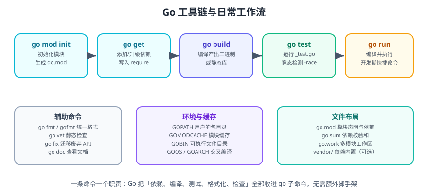

# Go 环境搭建

本页讲清三件事：**怎么装 Go**、**装完要配什么**、**第一个项目怎么跑起来并验证**。全程只需要 10 分钟。

一句话理解：Go 的环境变量复杂度远低于 Java/Python——只需要知道 `GOROOT`（安装目录）、`GOPATH`（工作区/缓存）、`GOMODCACHE`（依赖缓存），其余交给工具链自己管理。

## 1. 安装 Go

### 1.1 版本选择

Go 每半年发布一个大版本，同时维护最近两个大版本的补丁。**生产环境建议使用当前稳定线的最新补丁版**（如 go1.26.6），新项目可以跟上最新版以获得 Green Tea GC 等运行时改进。

::: tip 提示
不要安装「最新测试版」到生产环境。Go 的 beta/rc 版本（如 `go1.27rc1`）仅用于提前验证兼容性。
:::

### 1.2 Windows 安装

1. 打开 [Go 官方下载页](https://go.dev/dl/)，下载对应架构的 `go1.26.6.windows-amd64.msi`。
2. 双击安装，默认路径 `C:\Program Files\Go\`。
3. 安装程序会自动把 `C:\Program Files\Go\bin` 加入系统 `PATH`。

```shell
# 打开 PowerShell 验证
go version
# 期望输出：go version go1.26.6 windows/amd64
```

### 1.3 macOS 安装

```shell
# 方式一：安装包（推荐）
# 下载 go1.26.6.darwin-arm64.pkg（Apple 芯片）或 darwin-amd64.pkg（Intel），双击安装

# 方式二：Homebrew
brew install go

go version
# 期望输出：go version go1.26.6 darwin/arm64
```

判断芯片类型：点击左上角苹果图标 → 「关于本机」，处理器标注 `Apple M` 系列即为 ARM 架构。

### 1.4 Linux 安装

```shell
# 下载并解压到 /usr/local
wget https://go.dev/dl/go1.26.6.linux-amd64.tar.gz
sudo rm -rf /usr/local/go
sudo tar -C /usr/local -xzf go1.26.6.linux-amd64.tar.gz

# 配置 PATH（写入 ~/.bashrc 或 ~/.zshrc）
echo 'export PATH=$PATH:/usr/local/go/bin' >> ~/.bashrc
source ~/.bashrc

go version
# 期望输出：go version go1.26.6 linux/amd64
```

::: danger 注意
1. **不要用 `apt install golang` 装系统仓库版本**，通常落后好几个大版本，缺少新语法与安全修复。
2. 如果曾用包管理器装过 Go，先卸载并用 `which go` 确认没有残留的旧二进制。
3. 升级时**必须删除旧目录再解压**（`sudo rm -rf /usr/local/go`），直接在旧目录上解压会残留已删除的文件。
:::

## 2. 环境变量



```shell
go env
```

常用变量说明：

| 变量 | 含义 | 是否需要手动设置 |
| --- | --- | --- |
| `GOROOT` | Go 安装目录 | 否，安装包自动配置 |
| `GOPATH` | 工作区目录（默认 `~/go`） | 否，仅在需要自定义时设置 |
| `GOMODCACHE` | 模块下载缓存（默认 `$GOPATH/pkg/mod`） | 否 |
| `GOBIN` | `go install` 安装的可执行文件目录 | 建议加入 `PATH` |
| `GOPROXY` | 模块代理地址 | 国内建议设置 |
| `GOPRIVATE` | 不走代理/校验的私有仓库模式 | 私有仓库必设 |
| `GOOS` / `GOARCH` | 目标平台与架构（交叉编译） | 按需设置 |
| `GOMAXPROCS` | 可并行执行的 P 数量 | 否，默认等于 CPU 核数 |

### 2.1 国内网络加速

```shell
# 设置模块代理（七牛云镜像）
go env -w GOPROXY=https://goproxy.cn,direct

# 私有仓库不走代理
go env -w GOPRIVATE=git.example.com,*.corp.example.com

# 查看当前配置
go env GOPROXY GOPRIVATE
```

::: info 信息
`go env -w` 会把配置写入 `$GOENV` 指向的文件（通常是 `~/.config/go/env`），优先级高于 shell 环境变量里未被 `-w` 覆盖的项。查看配置文件位置用 `go env GOENV`。
:::

### 2.2 关于 GOPATH 的历史

Go 1.11 引入模块（modules）后，`GOPATH` 不再要求源码放在 `$GOPATH/src` 下。**新项目一律使用模块模式**，`GOPATH` 现在只承担两个职责：存放 `go install` 的产物、作为模块缓存的父目录。

::: warning 说明
如果你看到教程要求把代码放到 `$GOPATH/src/github.com/xxx`，那是 Go 1.11 之前的写法（GOPATH 模式），**仅存量项目需要**，新项目不要这样组织代码。
:::

## 3. 选择编辑器

| 工具 | 定位 | 关键插件 |
| --- | --- | --- |
| VS Code | 轻量首选 | Go 扩展（官方维护，内置 gopls、调试、测试） |
| GoLand | 重型 IDE | 开箱即用，含 profiler 可视化、逃逸分析 |
| Neovim / Vim | 终端党 | gopls + nvim-lspconfig |
| Zed / Helix | 新兴编辑器 | 内置 LSP 支持 |

VS Code 安装官方 Go 扩展后，首次打开 `.go` 文件会提示安装工具集（`gopls`、`dlv`、`staticcheck` 等），选择「Install All」即可。

```shell
# 也可以手动装常用工具
go install golang.org/x/tools/gopls@latest        # 语言服务器
go install github.com/go-delve/delve/cmd/dlv@latest  # 调试器
```

## 4. 第一个项目

```shell
# 1. 创建目录并初始化模块
mkdir hello-go && cd hello-go
go mod init example.com/hello

# 2. 查看生成的 go.mod
cat go.mod
```

```text [go.mod]
module example.com/hello

go 1.26
```

创建 `main.go`：

```go [main.go]
package main

import (
    "fmt"
    "os"
    "strings"
)

// greet 返回一句问候语；name 为空时使用默认值。
func greet(name string) string {
    name = strings.TrimSpace(name)
    if name == "" {
        name = "World"
    }
    return fmt.Sprintf("Hello, %s!", name)
}

func main() {
    name := ""
    if len(os.Args) > 1 {
        name = os.Args[1]
    }
    fmt.Println(greet(name))
}
```

```shell
# 3. 直接运行
go run . Gopher
# 输出：Hello, Gopher!

# 4. 编译为二进制
go build -o hello .
./hello Go
# 输出：Hello, Go!
```

**验证方式**：当前目录出现 `hello`（Windows 为 `hello.exe`）可执行文件；`./hello` 不传参数输出 `Hello, World!`；`go build` 无任何报错。

## 5. 项目结构约定

Go 对目录结构的要求很宽松，但有社区共识：

```text
hello-go/
├── go.mod              # 模块声明与依赖
├── go.sum              # 依赖校验和（自动生成，需提交）
├── main.go             # package main 的入口
├── internal/           # 仅本模块可见的包（外部无法 import）
│   └── service/
│       └── greet.go
├── pkg/                # 允许外部导入的公共包（可选）
└── cmd/                # 多个可执行程序时的入口目录
    └── server/
        └── main.go
```

规则要点：

- `internal/` 是**编译器强制**的可见性边界，同模块外的代码无法导入其下的包。
- 一个模块可以有多个 `package main`，分别放在 `cmd/xxx/` 下，用 `go build ./cmd/server` 分别构建。
- 测试文件与源码同目录，命名为 `xxx_test.go`，包名通常用 `xxx_test`（外部测试包）。

## 6. 常用环境自检命令

```shell
go version            # 版本
go env                # 全部环境变量
go env -w KEY=VALUE   # 持久化写入配置
go env -u KEY         # 取消某项写入
go list -m all        # 列出当前模块的依赖树
go doctor             # 检查工具链与模块缓存问题（1.24+）
```

::: tip 三个自检习惯
1. **换机器先跑 `go version` 和 `go env GOPROXY`**，确认版本与代理都对。
2. **依赖拉不下来先看 `go env GOPROXY`**，再看 `GOPRIVATE` 是否把公司仓库排除了。
3. **构建变慢先清缓存**：`go clean -cache`（编译缓存）、`go clean -modcache`（依赖缓存）。
:::

## 7. 交叉编译

Go 交叉编译不需要额外工具链，只要设置 `GOOS` 与 `GOARCH`：

```shell
# 编译 Linux x86-64 版本（在 macOS/Windows 上也能执行）
GOOS=linux GOARCH=amd64 go build -o hello-linux .

# 常用目标
# GOOS=linux   GOARCH=arm64    # 服务器 / 树莓派 64 位
# GOOS=darwin  GOARCH=arm64    # Apple 芯片 Mac
# GOOS=windows GOARCH=amd64    # Windows 64 位

# 关闭 CGO 以获得完全静态链接的二进制（推荐用于容器）
CGO_ENABLED=0 GOOS=linux GOARCH=amd64 go build -ldflags="-s -w" -o hello-linux .
```

`-ldflags="-s -w"` 会去掉符号表与调试信息，产物体积可缩小 20%~30%，代价是无法用 `dlv` 直接调试该二进制。

## 8. 常见问题

::: details 提示 command not found: go（安装后仍找不到）
1. 确认 `go` 二进制存在：Windows 看 `C:\Program Files\Go\bin\go.exe`，Linux/macOS 看 `/usr/local/go/bin/go`。
2. 检查 `PATH` 是否包含该目录：`echo $PATH`（Linux/macOS）或 `$env:Path`（PowerShell）。
3. 重开一个终端——`PATH` 修改不会作用于已打开的会话。
:::

::: details 提示 代理设置不生效
`go env -w` 写入的值优先于 shell 里 `export` 的环境变量。用 `go env GOPROXY` 看生效值，用 `go env GOENV` 找到配置文件并检查。若配置了 `GOPRIVATE` 且命中该仓库，则不会走代理，这是预期行为。
:::

::: details 提示 模块路径大小写与 `!` 转义
模块缓存目录中，大写字母会被编码为 `!小写`形式（如 `github.com/BurntSushi/toml` 缓存为 `github.com/!burnt!sushi/toml`）。这是为了避免大小写不敏感文件系统（Windows/macOS）冲突，属正常现象。
:::

## 相关文档

- [IDE 配置](../../../Tools/IDE/index.md)：GoLand 与 VS Code 的 Go 扩展怎么配，含插件性能控制、远程开发与配置同步。
- [IDE 配置 · VS Code 深入](../../../Tools/IDE/VSCode/index.md)：`settings.json` 层级与 Go 调试配置（`launch.json`）写法。
- [IDE 配置 · 配置同步与团队统一](../../../Tools/IDE/ConfigSync/index.md)：`.editorconfig` 统一缩进（Go 用 `tab`，注意与团队其他语言的差异）。

## 参考资料

- [Go 官方下载页](https://go.dev/dl/)
- [Go 官方安装指引](https://go.dev/doc/install)
- [go env 与模块环境变量](https://go.dev/ref/mod#environment-variables)
- [Go Modules 参考](https://go.dev/ref/mod)
- [VS Code Go 扩展](https://marketplace.visualstudio.com/items?itemName=golang.go)
