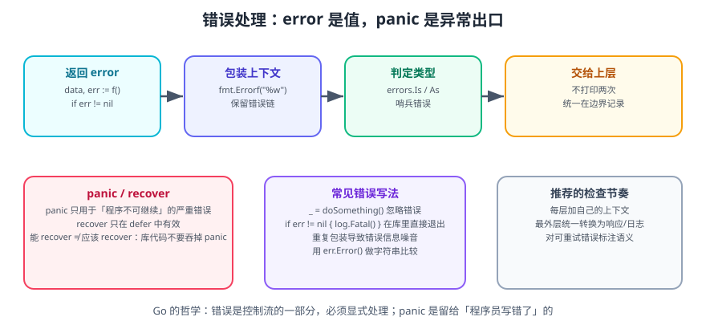

# Go 错误处理与 panic

Go 的错误处理哲学用一句话概括：**错误是值，必须显式处理**。没有异常、没有 `try/catch`，函数把可能的失败作为返回值交出来，由调用方决定怎么处理。

一句话理解：**`error` 是普通接口类型，`panic` 是「程序已经无法继续」的紧急出口**。能返回错误就不要 panic。

## 1. error 接口

```go
type error interface {
    Error() string
}
```

标准库提供了构造错误的函数：

```go
import "errors"

err1 := errors.New("something failed")                 // 静态错误
err2 := fmt.Errorf("open %s: %w", path, err1)          // 带上下文，%w 包装
```

::: tip 命名约定
**错误变量名以 `Err` 开头，错误类型名以 `Error` 结尾。**

```go
var ErrNotFound = errors.New("not found")           // 哨兵错误

type ValidationError struct{ Field string }          // 错误类型
func (e *ValidationError) Error() string {
    return "invalid field: " + e.Field
}
```
:::

## 2. 显式处理

### 2.1 基本模式

```go
f, err := os.Open("data.txt")
if err != nil {
    return fmt.Errorf("open data.txt: %w", err)
}
defer f.Close()
```

**三条铁律**：

1. **不要忽略错误**。确实需要忽略时，必须显式写出来并说明原因：
   ```go
   _ = f.Close() // 只读文件，关闭失败不影响结果
   ```
2. **不要打印后继续**。`log.Println(err)` 之后还继续执行，会让错误在被发现前已经造成了副作用。
3. **要包装上下文**。`return err` 会让调用栈上层完全不知道是谁失败了。

### 2.2 一次性错误检查

```go
// 适合「操作 + 检查 + 立即返回」的场景
if _, err := io.Copy(dst, src); err != nil {
    return err
}
```

### 2.3 错误即控制流

```go
// 用哨兵错误表示「预期内的非致命情况」
var ErrNotFound = errors.New("not found")

func findUser(id int64) (*User, error) {
    u, err := repo.Get(id)
    if errors.Is(err, sql.ErrNoRows) {
        return nil, ErrNotFound   // 转换为领域错误
    }
    if err != nil {
        return nil, fmt.Errorf("repo.Get(%d): %w", id, err)
    }
    return u, nil
}

// 调用方区分「找不到」与「真出错」
u, err := findUser(42)
switch {
case err == nil:
    use(u)
case errors.Is(err, ErrNotFound):
    createNewUser()   // 预期分支，不是异常
default:
    return fmt.Errorf("findUser: %w", err)
}
```

## 3. 错误包装与判定



### 3.1 包装：`%w`

```go
// %w 会保留原始错误，支持 errors.Is / errors.As 追溯
err := fmt.Errorf("load config %q: %w", path, ioErr)

// %v 只是把错误文本拼进去，错误链断裂
err := fmt.Errorf("load config %q: %v", path, ioErr) // 不推荐
```

一个错误链可能有多层：

```text
handler: create order: validate: amount must be positive
└── handler 层包装
    └── service 层包装
        └── 原始错误（validate 产生）
```

### 3.2 errors.Is：判定错误链中的某个值

```go
if errors.Is(err, os.ErrNotExist) {
    fmt.Println("文件不存在")
}

if errors.Is(err, context.DeadlineExceeded) {
    fmt.Println("超时")
}
```

不要用 `==` 比较包装后的错误：

```go
// 错误做法：包装后不再相等
if err == os.ErrNotExist { /* 不会命中 */ }

// 正确做法
if errors.Is(err, os.ErrNotExist) { /* 命中 */ }
```

也不要比较错误字符串：

```go
// 极脆弱的做法，升级依赖后可能改文案
if err.Error() == "file not found" { /* 不推荐 */ }
```

### 3.3 errors.As：提取特定类型的错误

```go
var pathErr *os.PathError
if errors.As(err, &pathErr) {
    fmt.Println("路径:", pathErr.Path)
    fmt.Println("操作:", pathErr.Op)
}

// 自定义错误类型的字段访问
type ValidationError struct {
    Field string
    Msg   string
}

func (e *ValidationError) Error() string {
    return fmt.Sprintf("invalid %s: %s", e.Field, e.Msg)
}

var ve *ValidationError
if errors.As(err, &ve) {
    fmt.Printf("字段 %s 校验失败：%s\n", ve.Field, ve.Msg)
}
```

::: danger 注意
`errors.As` 的第二个参数**必须是指向「错误类型（接口的指针）」的指针**：

```go
var ve *ValidationError
errors.As(err, &ve)   // 正确

errors.As(err, ve)    // panic: target must be a non-nil pointer
errors.As(err, &ve.Field) // 编译错误
```
`errors.Is` 用于比较**值**，`errors.As` 用于提取**类型**——两者用途不同，不要混用。
:::

### 3.4 组合多个错误

```go
// Go 1.20+
err := errors.Join(err1, err2, err3)
fmt.Println(err) // 换行分隔的多个错误

// errors.Is 会对每一个子错误递归判断
if errors.Is(err, ErrA) { /* 命中 */ }

// 1.20 之前：自己实现多错误类型
type multiError []error
func (m multiError) Error() string {
    msgs := make([]string, len(m))
    for i, e := range m {
        msgs[i] = e.Error()
    }
    return strings.Join(msgs, "; ")
}
```

### 3.5 实现自定义错误类型

```go
// 1. 简单包装（保留错误链）
type wrapError struct {
    msg string
    err error
}

func (e *wrapError) Error() string { return e.msg }
func (e *wrapError) Unwrap() error { return e.err } // 关键：让 errors.Is/As 能穿透

// 2. 带结构化信息的错误
type HTTPError struct {
    Status int
    Code   string
    Msg    string
}

func (e *HTTPError) Error() string {
    return fmt.Sprintf("http %d %s: %s", e.Status, e.Code, e.Msg)
}

// 实现 Is 以支持自定义比较语义
func (e *HTTPError) Is(target error) bool {
    t, ok := target.(*HTTPError)
    return ok && t.Status == e.Status
}
```

::: tip 关键点：实现 `Unwrap() error` 后，`errors.Is` / `errors.As` 才能穿过你的错误类型继续向下查找。
:::

## 4. panic 与 recover

### 4.1 什么时候用 panic

`panic` 只用于**程序无法继续、且属于编程错误**的情况：

- 数组/切片越界、空指针解引用（由运行时自动触发）。
- 初始化阶段的致命配置错误（如必需的密钥未设置）。
- 违反不可恢复的内部不变量。

```go
func MustLoadConfig(path string) *Config {
    cfg, err := LoadConfig(path)
    if err != nil {
        panic(fmt.Errorf("load config: %w", err)) // 启动期失败，直接崩
    }
    return cfg
}
```

**不要**用 panic 处理下面这些情况：

| 场景 | 正确做法 |
| --- | --- |
| 用户输入非法 | 返回 `ValidationError` |
| 文件不存在 | 返回包装后的 `os.ErrNotExist` |
| 网络超时 | 返回 `context.DeadlineExceeded` |
| 下游服务返回 500 | 返回带状态码的错误 |
| 依赖未就绪 | 返回错误让上层重试 |

### 4.2 recover 的正确边界

`recover` 只在 `defer` 中有效，并且只能捕获**同一个 goroutine** 的 panic。

```go
// HTTP 中间件：最后一个兜底，防止单个请求 panic 拖垮进程
func Recover(next http.Handler) http.Handler {
    return http.HandlerFunc(func(w http.ResponseWriter, r *http.Request) {
        defer func() {
            if rec := recover(); rec != nil {
                log.Printf("panic recovered: %v\n%s", rec, debug.Stack())
                http.Error(w, "internal server error", http.StatusInternalServerError)
            }
        }()
        next.ServeHTTP(w, r)
    })
}
```

::: danger 注意
1. **`recover` 捕获后不要把 panic 吞掉**：至少记录完整堆栈（`debug.Stack()`），否则线上问题会彻底消失。
2. **goroutine 里的 panic 无法被外部 recover**，必须在该 goroutine 内部自己兜底：

```go
go func() {
    defer func() {
        if rec := recover(); rec != nil {
            log.Printf("worker panic: %v", rec)
        }
    }()
    work()
}()
```
3. **库代码不要 recover**。库不应该决定「这个错误是否致命」——那是调用方的决策。库只需要返回 error。
4. **`recover` 不能捕获 `fatal error`**（如并发写 map、栈溢出），那类错误会直接终止进程。
:::

### 4.3 在 defer 中调整返回值

```go
func safeDivide(a, b int) (result int, err error) {
    defer func() {
        if rec := recover(); rec != nil {
            err = fmt.Errorf("divide panic: %v", rec)
        }
    }()
    return a / b, nil // b == 0 时 panic，被上面的 defer 转成 error
}
```

::: warning 说明
这种「用 recover 把 panic 转成 error」的写法**只适合包装无法改造的第三方库**。自己的代码应该一开始就返回 error，而不是先 panic 再 recover。
:::

## 5. 错误处理的工程实践

### 5.1 分层职责

| 层 | 职责 |
| --- | --- |
| repository | 把驱动错误（如 `sql.ErrNoRows`）转成领域错误，包装上下文 |
| service | 业务规则校验，返回领域错误，不关心 HTTP 状态码 |
| handler | 把领域错误映射为 HTTP 状态码与响应体，统一记录日志 |

### 5.2 统一错误映射

```go
type APIError struct {
    Status  int    `json:"-"`
    Code    string `json:"code"`
    Message string `json:"message"`
}

func toAPIError(err error) APIError {
    var ve *ValidationError
    switch {
    case err == nil:
        return APIError{}
    case errors.Is(err, ErrNotFound):
        return APIError{Status: http.StatusNotFound, Code: "not_found", Message: "资源不存在"}
    case errors.As(err, &ve):
        return APIError{Status: http.StatusBadRequest, Code: "invalid_argument", Message: ve.Error()}
    case errors.Is(err, context.DeadlineExceeded):
        return APIError{Status: http.StatusGatewayTimeout, Code: "timeout", Message: "上游超时"}
    default:
        return APIError{Status: http.StatusInternalServerError, Code: "internal", Message: "服务内部错误"}
    }
}

func writeError(w http.ResponseWriter, err error) {
    if err == nil {
        return
    }
    apiErr := toAPIError(err)
    if apiErr.Status >= 500 {
        log.Printf("server error: %v\n%s", err, debug.Stack()) // 只对 5xx 记堆栈
    }
    w.Header().Set("Content-Type", "application/json")
    w.WriteHeader(apiErr.Status)
    _ = json.NewEncoder(w).Encode(apiErr)
}
```

### 5.3 只记录一次

```go
// 错误做法：每层都 log，日志里同一错误出现 3 次
func service() error {
    err := repo()
    if err != nil {
        log.Println(err) // 不要在这里打
        return err
    }
    return nil
}

// 正确做法：只在「决定如何处理」的那一层记录
func handler(w http.ResponseWriter, r *http.Request) {
    if err := service(); err != nil {
        log.Printf("handle request: %v", err) // 唯一记录点
        writeError(w, err)
    }
}
```

## 6. 完整示例：可判定的领域错误

```go [orders.go]
package main

import (
    "errors"
    "fmt"
    "strings"
)

// ---- 哨兵错误 ----
var (
    ErrNotFound     = errors.New("not found")
    ErrOutOfStock   = errors.New("out of stock")
    ErrInvalidInput = errors.New("invalid input")
)

// ---- 结构化错误类型 ----
type FieldError struct {
    Field  string
    Reason string
}

func (e *FieldError) Error() string {
    return fmt.Sprintf("field %q: %s", e.Field, e.Reason)
}

func (e *FieldError) Is(target error) bool {
    return target == ErrInvalidInput // 让 errors.Is(err, ErrInvalidInput) 命中
}

// ---- 错误包装 ----
type wrapped struct {
    msg string
    err error
}

func (w *wrapped) Error() string { return w.msg }
func (w *wrapped) Unwrap() error { return w.err }

func wrapf(err error, format string, args ...any) error {
    return &wrapped{msg: fmt.Sprintf(format, args...), err: err}
}

// ---- 业务逻辑 ----
type Order struct {
    SKU string
    Qty int
}

var stock = map[string]int{"apple": 3}

func PlaceOrder(o Order) error {
    if strings.TrimSpace(o.SKU) == "" {
        return wrapf(&FieldError{"sku", "must not be empty"}, "place order")
    }
    if o.Qty <= 0 {
        return wrapf(&FieldError{"qty", "must be positive"}, "place order")
    }
    left, ok := stock[o.SKU]
    if !ok {
        return wrapf(ErrNotFound, "place order sku=%s", o.SKU)
    }
    if left < o.Qty {
        return wrapf(ErrOutOfStock, "place order sku=%s want=%d left=%d", o.SKU, o.Qty, left)
    }
    stock[o.SKU] = left - o.Qty
    return nil
}

func report(err error) {
    switch {
    case err == nil:
        fmt.Println("下单成功")
    case errors.Is(err, ErrInvalidInput):
        var fe *FieldError
        errors.As(err, &fe)
        fmt.Printf("参数错误：[%s] %s\n", fe.Field, fe.Reason)
    case errors.Is(err, ErrNotFound):
        fmt.Println("商品不存在")
    case errors.Is(err, ErrOutOfStock):
        fmt.Println("库存不足")
    default:
        fmt.Println("未知错误:", err)
    }
}

func main() {
    cases := []Order{
        {"apple", 2},
        {"apple", 5},
        {"banana", 1},
        {"", 1},
    }
    for _, c := range cases {
        err := PlaceOrder(c)
        fmt.Printf("order=%+v → ", c)
        report(err)
        if err != nil {
            fmt.Println("   完整错误链:", err)
        }
    }
}
```

```shell
go run orders.go
# order={SKU:apple Qty:2} → 下单成功
# order={SKU:apple Qty:5} → 库存不足
#    完整错误链: place order sku=apple want=5 left=1
# order={SKU:banana Qty:1} → 商品不存在
#    完整错误链: place order sku=banana: not found
# order={SKU: Qty:1} → 参数错误：[sku] must not be empty
#    完整错误链: place order: field "sku": must not be empty
```

**验证方式**：四类错误分别被 `errors.Is` / `errors.As` 精确识别，且完整错误链保留了上下文（哪一层、哪个 SKU、期望与实际值）。把 `FieldError.Is` 方法删掉后，第四行会退化为「未知错误」——这就是实现 `Is` 的价值。

## 7. 参考资料

- [Go 官方博客：Working with Errors in Go 1.13](https://go.dev/blog/go1.13-errors)
- [errors 包文档](https://pkg.go.dev/errors)
- [Effective Go：错误处理](https://go.dev/doc/effective_go#errors)
- [Go 语言规范：Panic 与 Recover](https://go.dev/ref/spec#Handling_panics)
- [Go Wiki：Error Handling and Go](https://go.dev/blog/error-handling-and-go)
