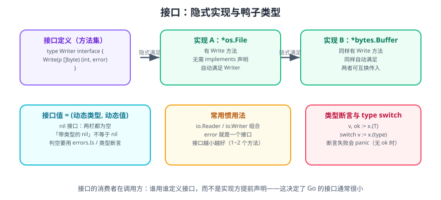

# Go 函数、方法与接口

函数是 Go 的第一公民，方法是挂在类型上的函数，接口则是对「方法集」的抽象。三者串起来，就是 Go 的抽象能力全部。

一句话理解：**Go 用「函数 + 方法 + 小接口」替代了继承与泛型模板**——组合优于继承，接口由使用方定义，隐式实现。

## 1. 函数

### 1.1 基本形态

```go
// 有参有返回
func add(a int, b int) int { return a + b }

// 相邻同类型参数可合并类型
func add2(a, b int) int { return a + b }

// 多返回值（Go 的招牌特性）
func divmod(a, b int) (int, int) {
    return a / b, a % b
}

// 命名返回值（defer 中可修改）
func safeDiv(a, b int) (q int, err error) {
    if b == 0 {
        err = errors.New("division by zero")
        return // 裸 return，返回当前 q 与 err
    }
    q = a / b
    return
}

// 可变参数
func sum(nums ...int) int {
    total := 0
    for _, n := range nums {
        total += n
    }
    return total
}
// 调用：sum(1, 2, 3) 或 sum(slice...)
```

::: danger 注意
**不要把命名返回值当成「自带文档」而滥用**。当函数体较长时，裸 `return` 会让读者难以判断到底返回了什么。函数超过 30 行时，建议改成显式 `return q, nil`。
:::

### 1.2 函数是一等公民

函数可以赋值给变量、作为参数、作为返回值：

```go
type Operator func(int, int) int

func apply(a, b int, op Operator) int { return op(a, b) }

func main() {
    add := func(a, b int) int { return a + b } // 匿名函数
    fmt.Println(apply(3, 4, add))               // 7
    fmt.Println(apply(3, 4, func(a, b int) int { return a * b })) // 12
}
```

### 1.3 闭包

闭包 = 函数 + 其捕获的外部变量：

```go
// 计数器工厂：每次调用返回一个独立的计数器
func counter() func() int {
    n := 0
    return func() int {
        n++
        return n
    }
}

c1 := counter()
c2 := counter()
fmt.Println(c1(), c1(), c2()) // 1 2 1 —— 各自持有独立的 n
```

::: tip 实践技巧：用闭包做「中间件」
```go
func withLogging(next http.HandlerFunc) http.HandlerFunc {
    return func(w http.ResponseWriter, r *http.Request) {
        start := time.Now()
        next(w, r)
        log.Printf("%s %s cost=%v", r.Method, r.URL.Path, time.Since(start))
    }
}
```
这是 Go HTTP 中间件最典型的写法，详见 [Go Web 开发](../WebDev/index.md)。
:::

### 1.4 defer

`defer` 把调用压入延迟栈，函数返回前**后进先出**执行：

```go
func readFile(path string) (string, error) {
    f, err := os.Open(path)
    if err != nil {
        return "", err
    }
    defer f.Close() // 无论后面怎么返回，都会关闭

    b, err := io.ReadAll(f)
    return string(b), err
}
```

三个必须记住的规则：

1. **参数在执行 `defer` 语句时就求值**，不是函数返回时才求值。
2. **多个 `defer` 按 LIFO 顺序执行**。
3. **`defer` 在循环里会堆积**，直到函数返回才执行，循环体内应立即处理或用独立函数包裹。

```go
// 陷阱 1：参数立即求值
x := 1
defer fmt.Println("defer x =", x) // 打印 1
x = 100

// 需要读取返回时的值 → 用闭包
defer func() { fmt.Println("closure x =", x) }() // 打印 100

// 陷阱 2：循环内堆积
for _, p := range paths {
    f, _ := os.Open(p)
    defer f.Close() // 所有文件句柄会一直开着到函数结束
}

// 正确做法：抽成函数，让 defer 在每轮结束时执行
for _, p := range paths {
    if err := process(p); err != nil {
        return err
    }
}
```

### 1.5 立即执行函数

```go
func() {
    // 常用于限定作用域，让临时变量尽早释放
}()
```

## 2. 方法

### 2.1 值接收者 vs 指针接收者

```go
type Counter struct{ n int }

// 值接收者：操作的是副本，无法修改原值
func (c Counter) Value() int { return c.n }

// 指针接收者：可以修改原值，也不会复制整个结构体
func (c *Counter) Inc() { c.n++ }

func main() {
    c := Counter{}
    c.Inc()       // 编译器自动转为 (&c).Inc()
    c.Inc()
    fmt.Println(c.Value()) // 2
}
```

| 场景 | 选择 |
| --- | --- |
| 需要修改接收者 | 指针接收者 |
| 结构体较大（超过几个字） | 指针接收者 |
| 结构体含 `sync.Mutex` 等不可复制字段 | 必须指针接收者 |
| 小而不变的值类型（如时间戳包装） | 值接收者 |
| 同类型的方法 | **保持一致**，不要混用 |

::: danger 注意
**同一个类型的方法集不要一半值接收者、一半指针接收者**。这会导致 `T` 与 `*T` 的接口满足情况不一致，出现「`T` 不满足接口但 `*T` 满足」的困惑。选定一种并贯穿。

另外：**值接收者方法无法修改原值**，这是新手最常见的「改了没生效」原因。
:::

### 2.2 方法集与接口满足

| 类型 | 方法集包含 |
| --- | --- |
| `T` | 所有**值接收者**方法 |
| `*T` | 所有**值接收者 + 指针接收者**方法 |

因此：如果一个接口包含指针接收者方法，那么只有 `*T` 满足它，`T` 不满足。

```go
type Incrementer interface{ Inc() }

var _ Incrementer = (*Counter)(nil) // 编译期断言：*Counter 满足
// var _ Incrementer = Counter{}     // 编译错误：Counter 不满足
```

## 3. 接口



### 3.1 定义与隐式实现

```go
type Shape interface {
    Area() float64
    Perimeter() float64
}

type Rect struct{ W, H float64 }

func (r Rect) Area() float64      { return r.W * r.H }
func (r Rect) Perimeter() float64 { return 2 * (r.W + r.H) }

type Circle struct{ R float64 }

func (c Circle) Area() float64      { return math.Pi * c.R * c.R }
func (c Circle) Perimeter() float64 { return 2 * math.Pi * c.R }

// Rect 与 Circle 都没有写「implements Shape」，但都满足 Shape
func totalArea(shapes ...Shape) float64 {
    var sum float64
    for _, s := range shapes {
        sum += s.Area()
    }
    return sum
}
```

### 3.2 接口值 =（动态类型，动态值）

```go
var s Shape = Rect{W: 3, H: 4}
fmt.Printf("%T %v\n", s, s) // main.Rect {3 4}
```

一个经典陷阱：

```go
type MyError struct{ Msg string }
func (e *MyError) Error() string { return e.Msg }

func bad() error {
    var e *MyError = nil
    return e // 返回了「带类型的 nil」
}

func main() {
    err := bad()
    fmt.Println(err == nil) // false！
}
```

原因：接口值由一个类型描述符和一个数据指针组成。`e` 的类型是 `*MyError`、值为 `nil`，装进 `error` 后类型栏非空，所以接口整体**不等于 nil**。

::: danger 注意
返回错误时**直接 `return nil`**，不要返回一个「类型已确定但值为 nil」的指针变量。

```go
func good() error {
    // 正确：直接返回 nil
    return nil
}
```
排查手法：`fmt.Printf("%#v\n", err)` 会打印出具体类型；或先断言 `if e, ok := err.(*MyError); ok && e == nil`。
:::

### 3.3 空接口与 any

`any` 是 `interface{}` 的别名（Go 1.18 起），可承载任意值：

```go
func describe(v any) string {
    switch x := v.(type) {
    case nil:
        return "nil"
    case int, int64:
        return "整数"
    case string:
        return "字符串:" + x
    case error:
        return "错误:" + x.Error()
    default:
        return fmt.Sprintf("其它类型 %T", x)
    }
}
```

::: warning 说明
`any` 会**丢失静态类型检查**，每次使用都要做断言。业务代码里优先定义具体的小接口，只在真正「任意类型」的场景（如 JSON 反序列化中间结果、日志字段）使用 `any`。
:::

### 3.4 接口断言与类型检查

```go
var v any = "hello"

// 1. 断言（带 ok，安全）
s, ok := v.(string)
if ok {
    fmt.Println(len(s))
} else {
    fmt.Println("not a string")
}

// 2. 断言（不带 ok，失败会 panic）
// s := v.(string)

// 3. 断言到接口（检测是否实现某能力）
type Stringer interface{ String() string }
if str, ok := v.(Stringer); ok {
    fmt.Println(str.String())
}

// 4. 用 errors.As 处理错误链
var pathErr *os.PathError
if errors.As(err, &pathErr) {
    fmt.Println("路径错误:", pathErr.Path)
}
```

### 3.5 小接口与 io 家族

Go 标准库的接口示范了「越小越好」：

```go
type Reader interface {
    Read(p []byte) (n int, err error)
}

type Writer interface {
    Write(p []byte) (n int, err error)
}

// 组合成更大的接口
type ReadWriter interface {
    Reader
    Writer
}
```

```go
// 任何实现了 Read 的东西都能被 io.Copy 使用：文件、网络连接、bytes.Buffer、压缩流……
n, err := io.Copy(dst, src)
```

::: tip 接口设计原则
1. **接口定义在消费方**，而不是实现方——「我需要什么能力，就定义什么接口」。
2. **方法数控制在 1~3 个**。超过 3 个就该考虑拆成多个小接口，用组合表达。
3. **优先使用标准库接口**（`io.Reader`、`io.Writer`、`fmt.Stringer`、`error`），生态互通性最好。
4. **命名常用 `-er` 后缀**：`Reader`、`Writer`、`Closer`、`Stringer`。
:::

## 4. 编译期接口断言

用空赋值把「实现关系」写进编译期，改动时立刻报错：

```go
var (
    _ io.Reader     = (*MySource)(nil)
    _ io.Writer     = (*MySink)(nil)
    _ fmt.Stringer  = MyType{}
)
```

## 5. 完整示例：可插拔的存储层

```go [store.go]
package main

import (
    "errors"
    "fmt"
    "sync"
)

// Store 是消费方定义的接口：只要能按 ID 存取即可。
type Store interface {
    Save(id string, value int) error
    Get(id string) (int, error)
}

var ErrNotFound = errors.New("not found")

// ---- 内存实现 ----
type MemStore struct {
    mu sync.RWMutex
    m  map[string]int
}

func NewMemStore() *MemStore { return &MemStore{m: make(map[string]int)} }

func (s *MemStore) Save(id string, value int) error {
    s.mu.Lock()
    defer s.mu.Unlock()
    s.m[id] = value
    return nil
}

func (s *MemStore) Get(id string) (int, error) {
    s.mu.RLock()
    defer s.mu.RUnlock()
    v, ok := s.m[id]
    if !ok {
        return 0, fmt.Errorf("mem get %q: %w", id, ErrNotFound)
    }
    return v, nil
}

// ---- 业务逻辑只依赖接口 ----
func accumulate(s Store, id string, delta int) (int, error) {
    cur, err := s.Get(id)
    if err != nil && !errors.Is(err, ErrNotFound) {
        return 0, err
    }
    cur += delta
    if err := s.Save(id, cur); err != nil {
        return 0, err
    }
    return cur, nil
}

// 编译期断言
var _ Store = (*MemStore)(nil)

func main() {
    s := NewMemStore()
    for _, d := range []int{5, 10, -3} {
        v, err := accumulate(s, "counter", d)
        if err != nil {
            fmt.Println("error:", err)
            continue
        }
        fmt.Println("counter =", v)
    }
}
```

```shell
go run store.go
# counter = 5
# counter = 15
# counter = 12
```

**验证方式**：三次输出依次为 5、15、12；把 `MemStore` 换成任意满足 `Store` 的实现，`accumulate` 无需修改——这就是「面向接口编程」在 Go 里的实际价值。

## 6. 参考资料

- [Go 语言规范：函数声明](https://go.dev/ref/spec#Function_declarations)
- [Go 语言规范：方法集](https://go.dev/ref/spec#Method_sets)
- [Effective Go：接口](https://go.dev/doc/effective_go#interfaces)
- [Go 博客：Go 的声明语法](https://go.dev/blog/declaration-syntax)
- [pkg.go.dev：io 包](https://pkg.go.dev/io)
