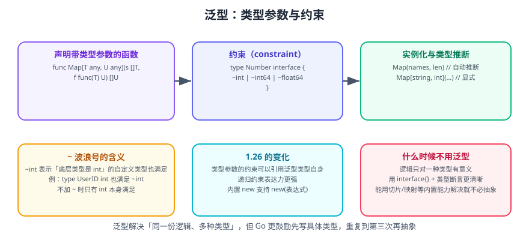

# Go 泛型

泛型（generics）自 **Go 1.18** 引入，让函数和类型可以带**类型参数**，从而在不牺牲类型安全的前提下复用逻辑。

一句话理解：**泛型解决「同一份逻辑、多种类型」的问题**。它替代的是「复制粘贴多份类型不同的函数」和「用 `any` + 类型断言牺牲类型安全」这两种旧做法。

::: warning 说明
Go 官方明确表示 **Go 不追求成为泛型编程语言**。社区共识是：先写具体类型；当同样的逻辑重复到第三次时，再考虑抽象成泛型。为「未来可能用到」而泛型化，只会降低可读性。
:::

## 1. 为什么需要泛型

在泛型之前，写一个「返回切片最大值」的函数只能有两种办法：

```go
// 办法一：为每个类型复制一遍
func MaxInts(s []int) int {
    m := s[0]
    for _, v := range s[1:] {
        if v > m {
            m = v
        }
    }
    return m
}
func MaxFloat64s(s []float64) float64 { /* 同样的逻辑 */ }

// 办法二：用 any 丢掉类型安全
func MaxAny(s []any) any {
    m := s[0].(int) // 类型断言，运行时可能 panic
    for _, v := range s[1:] {
        if v.(int) > m {
            m = v.(int)
        }
    }
    return m
}
```

泛型版本：

```go
func Max[T int | float64 | string](s []T) T {
    m := s[0]
    for _, v := range s[1:] {
        if v > m { // T 被约束为「可比较大小」，> 合法
            m = v
        }
    }
    return m
}

fmt.Println(Max([]int{3, 1, 4}), Max([]float64{2.5, 9.1}), Max([]string{"a", "z"}))
// 4 9.1 z
```

## 2. 类型参数与约束



```go
// 语法：函数名[类型参数列表](参数列表) 返回值
func Map[T any, U any](s []T, f func(T) U) []U {
    out := make([]U, 0, len(s))
    for _, v := range s {
        out = append(out, f(v))
    }
    return out
}

// 调用时可以省略类型参数（编译器推断）
lens := Map([]string{"go", "rust"}, len) // []int{2, 4}

// 也可以显式指定
strs := Map[int, string]([]int{1, 2}, strconv.Itoa)
```

### 2.1 内置约束

| 约束 | 含义 | 允许的操作 |
| --- | --- | --- |
| `any` | 任意类型（= `interface{}`） | 赋值、传参、类型断言 |
| `comparable` | 可比较类型 | `==`、`!=`、作为 map 的 key |
| `cmp.Ordered`（1.21+） | 有序类型 | `<`、`>`、`<=`、`>=` |
| 自定义 `interface{ ... }` | 类型集 / 方法集 | 视具体定义 |

```go
import "cmp"

func Contains[T comparable](s []T, target T) bool {
    for _, v := range s {
        if v == target { // comparable 保证 == 合法
            return true
        }
    }
    return false
}

func Clamp[T cmp.Ordered](v, lo, hi T) T {
    if v < lo {
        return lo
    }
    if v > hi {
        return hi
    }
    return v
}
```

### 2.2 自定义约束与波浪号 `~`

```go
// 类型集：联合（|）表示「其中之一」
type Integer interface {
    int | int8 | int16 | int32 | int64
}

// 波浪号 ~：表示「底层类型是 X」的所有类型都满足
type Number interface {
    ~int | ~int64 | ~float32 | ~float64
}

type UserID int // 底层类型是 int

func Sum[T Number](s []T) T {
    var total T
    for _, v := range s {
        total += v
    }
    return total
}

// UserID 满足 ~int，所以可以直接用
fmt.Println(Sum([]UserID{1, 2, 3})) // 6
```

::: danger 注意
**不加 `~` 时，自定义类型不满足约束。**

```go
type Integer interface{ int | int64 }

type Count int

func SumStrict[T Integer](s []T) T { /* ... */ }

// SumStrict([]Count{1, 2})  // 编译错误：Count does not satisfy Integer
// 因为 Count 的底层类型是 int，但 Count 本身不是 int
```

写「给业务用」的约束时**默认加 `~`**，否则调用方一定会踩这个坑。
:::

### 2.3 方法约束

约束里可以要求实现某些方法：

```go
type Stringer interface {
    fmt.Stringer // 等价于要求 String() string
}

type Named interface {
    GetName() string
}

func PrintNames[T Named](items []T) {
    for _, it := range items {
        fmt.Println(it.GetName())
    }
}
```

## 3. 泛型类型

```go
// 泛型结构体
type Stack[T any] struct {
    items []T
}

func (s *Stack[T]) Push(v T) { s.items = append(s.items, v) }

func (s *Stack[T]) Pop() (T, bool) {
    var zero T
    if len(s.items) == 0 {
        return zero, false
    }
    v := s.items[len(s.items)-1]
    s.items = s.items[:len(s.items)-1]
    return v, true
}

func (s *Stack[T]) Len() int { return len(s.items) }

// 使用
st := &Stack[string]{}
st.Push("a")
st.Push("b")
v, ok := st.Pop() // "b", true
```

::: danger 注意
**Go 不支持泛型方法**——方法可以属于泛型类型，但方法自身不能再声明新的类型参数。

```go
// 编译错误：methods cannot have type parameters
// func (s *Stack[T]) MapTo[U any](f func(T) U) []U { ... }

// 替代方案：写成独立函数
func MapStack[T, U any](s *Stack[T], f func(T) U) []U {
    out := make([]U, 0, s.Len())
    for _, v := range s.items {
        out = append(out, f(v))
    }
    return out
}
```
:::

## 4. Go 1.26 的变化

Go 1.26 放宽了泛型类型声明的一项限制：**类型参数的约束可以引用这个泛型类型自身**。这让递归数据结构（如类型安全的树、图、表达式 AST）可以更自然地表达。

```go
// 概念示意：约束中引用了泛型类型 T 自身（1.26 起允许此类递归约束）
type Node[T interface{ ~[]E }, E any] struct {
    Children T
    Value    E
}
```

同时，Go 1.26 让内置函数 `new` 支持直接传表达式：

```go
// 1.26 起
count := new(int64(300)) // 等价于先取变量再取地址

// 内部实现是「取临时变量的地址」，因此每次调用都是独立的对象
```

::: info 信息
递归约束是泛型表达力的一次提升，但**绝大多数业务代码用不到**。遇到「约束必须引用自身」时，先反问：是不是可以用接口 + 类型断言更简单地解决？具体语法细节以 [Go 泛型提案与语言规范](https://go.dev/ref/spec#Type_parameter_declarations) 为准。
:::

## 5. 典型应用场景

### 5.1 集合工具

```go
func Filter[T any](s []T, keep func(T) bool) []T {
    out := make([]T, 0, len(s))
    for _, v := range s {
        if keep(v) {
            out = append(out, v)
        }
    }
    return out
}

func Reduce[T, A any](s []T, init A, f func(A, T) A) A {
    acc := init
    for _, v := range s {
        acc = f(acc, v)
    }
    return acc
}

func GroupBy[T any, K comparable](s []T, key func(T) K) map[K][]T {
    out := make(map[K][]T)
    for _, v := range s {
        k := key(v)
        out[k] = append(out[k], v)
    }
    return out
}
```

```go
// 组合使用
type Order struct {
    ID     int64
    UserID int64
    Amount float64
}

byUser := GroupBy(orders, func(o Order) int64 { return o.UserID })
total := Reduce(orders, 0.0, func(acc float64, o Order) float64 { return acc + o.Amount })
big := Filter(orders, func(o Order) bool { return o.Amount > 100 })
```

### 5.2 结果类型（Result）

```go
type Result[T any] struct {
    value T
    err   error
}

func Ok[T any](v T) Result[T]        { return Result[T]{value: v} }
func Err[T any](err error) Result[T] { return Result[T]{err: err} }

func (r Result[T]) Unwrap() (T, error) { return r.value, r.err }
```

::: warning 说明
上面这种 `Result` 模式在 Go 社区**有争议**：它把错误处理藏进了链式调用，与 Go「显式检查 error」的哲学相悖。除非团队内部有明确约定，否则不建议引入。
:::

### 5.3 标准库的实际使用

标准库已经提供了大部分常用泛型工具，**优先用标准库**：

| 包 | 主要能力 |
| --- | --- |
| `slices`（1.21+） | Sort、SortFunc、Contains、Index、Clone、Delete、Reverse、Max、Min、Compact |
| `maps`（1.21+） | Keys、Values、Clone、Equal、DeleteFunc、Copy |
| `cmp`（1.21+） | Ordered 约束、Compare、Less、Or |

```go
import (
    "cmp"
    "maps"
    "slices"
)

nums := []int{3, 1, 4, 1, 5}
slices.Sort(nums)                    // [1 1 3 4 5]
slices.SortFunc(nums, func(a, b int) int { return cmp.Compare(b, a) }) // 降序
uniq := slices.Compact(slices.Clone(nums)) // 去重（需先排序）

m := map[string]int{"a": 1, "b": 2}
keys := slices.Sorted(maps.Keys(m)) // 有序 key 列表
```

## 6. 性能与取舍

| 关注点 | 说明 |
| --- | --- |
| 单态化 | Go 编译器为每个具体类型生成一份代码（stencil），二进制会略微变大 |
| 装箱 | 用 `any` 约束时值会被装箱，分配开销明显 |
| 内联 | 泛型函数的内联受更多限制，极热路径建议写具体类型 |
| 编译时间 | 大量泛型实例化会拉长编译时间，但通常可接受 |

::: tip 决策清单
用泛型：容器/算法工具、多类型同构逻辑、需要静态类型安全的复用。
不用泛型：只有一种实际类型、逻辑差异大于共性、性能极热且对分配敏感。
:::

## 7. 完整示例：泛型 LRU 缓存

```go [lru.go]
package main

import (
    "container/list"
    "fmt"
)

type entry[K comparable, V any] struct {
    key   K
    value V
}

type LRU[K comparable, V any] struct {
    cap   int
    order *list.List               // 最近使用在尾部
    items map[K]*list.Element      // key → 链表中节点
}

func NewLRU[K comparable, V any](capacity int) *LRU[K, V] {
    if capacity <= 0 {
        panic("capacity must be positive")
    }
    return &LRU[K, V]{
        cap:   capacity,
        order: list.New(),
        items: make(map[K]*list.Element, capacity),
    }
}

func (c *LRU[K, V]) Get(key K) (V, bool) {
    var zero V
    el, ok := c.items[key]
    if !ok {
        return zero, false
    }
    c.order.MoveToBack(el) // 命中即刷新使用顺序
    return el.Value.(entry[K, V]).value, true
}

func (c *LRU[K, V]) Put(key K, value V) {
    if el, ok := c.items[key]; ok {
        el.Value = entry[K, V]{key, value}
        c.order.MoveToBack(el)
        return
    }
    if c.order.Len() >= c.cap {
        oldest := c.order.Front()
        if oldest != nil {
            c.order.Remove(oldest)
            delete(c.items, oldest.Value.(entry[K, V]).key)
        }
    }
    el := c.order.PushBack(entry[K, V]{key, value})
    c.items[key] = el
}

func (c *LRU[K, V]) Len() int { return c.order.Len() }

func main() {
    cache := NewLRU[string, int](3)
    cache.Put("a", 1)
    cache.Put("b", 2)
    cache.Put("c", 3)

    if v, ok := cache.Get("a"); ok {
        fmt.Println("命中 a =", v)
    }

    cache.Put("d", 4) // 淘汰最久未使用的 b

    _, okB := cache.Get("b")
    _, okC := cache.Get("c")
    fmt.Println("b 还在?", okB, "| c 还在?", okC, "| 当前大小:", cache.Len())
}
```

```shell
go run lru.go
# 命中 a = 1
# b 还在? false | c 还在? true | 当前大小: 3
```

**验证方式**：输出显示 `a` 命中后被移到最近使用位置，因此淘汰的是 `b`；缓存大小始终不超过容量 3。把 `Get("a")` 换成 `Get("b")` 后，被淘汰的会变成 `a`。

## 8. 参考资料

- [Go 语言规范：类型参数](https://go.dev/ref/spec#Type_parameter_declarations)
- [Go 1.18 发布说明：泛型](https://go.dev/doc/go1.18#generics)
- [官方泛型教程](https://go.dev/doc/tutorial/generics)
- [When To Use Generics（官方博客）](https://go.dev/blog/when-generics)
- [pkg.go.dev：cmp 包](https://pkg.go.dev/cmp)
