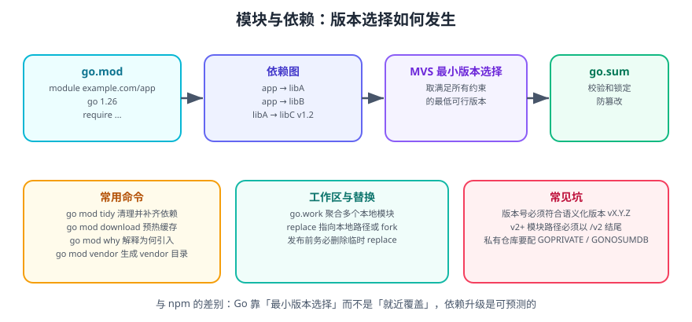

# Go 包与模块管理

Go 的依赖管理经历过三个阶段：`GOPATH` 模式（无版本管理）→ `vendor` + `dep`（社区方案）→ **Go Modules**（Go 1.11 引入，1.16 起默认开启）。现代 Go 项目一律使用 Modules。

一句话理解：**模块（module）= 一个 `go.mod` 文件所定义的版本单元；包（package）= 一个目录下的 Go 文件集合**。模块是依赖管理单位，包是代码组织单位。

## 1. 包（package）

### 1.1 定义与可见性

```go
// file: internal/mathutil/sum.go
package mathutil

// Sum 首字母大写 → 导出（其他包可访问）
func Sum(a, b int) int { return a + b }

// normalize 首字母小写 → 包内可见
func normalize(v int) int { return v }
```

::: tip 可见性规则
Go 用**首字母大小写**控制可见性，没有 `public` / `private` 关键字：
- 大写开头：导出（exported），跨包可见。
- 小写开头：包内可见。
:::

### 1.2 包名约定

| 规则 | 说明 | 正例 | 反例 |
| --- | --- | --- | --- |
| 全小写 | 不用下划线或驼峰 | `mathutil` | `mathUtil`、`math_util` |
| 简短 | 一到两个词 | `http`、`json` | `httputility` |
| 不用复数 | 集合概念不靠复数表达 | `user` | `users` |
| 避免与标准库同名 | 会造成导入歧义 | `mylog` | `log` |
| 不用无意义的 `util` | 说明具体职责 | `strconv` | `common`、`utils` |

::: warning 说明
`package main` 是唯一特殊的包名——它声明的是**可执行程序**而非可导入的库。同一个目录下所有 `.go` 文件必须属于同一个包。
:::

### 1.3 导入

```go
import (
    "fmt"                              // 标准库
    "net/http"

    "github.com/gin-gonic/gin"         // 第三方
    "github.com/yourorg/app/internal/repo" // 本模块内

    m "github.com/yourorg/mathutil"    // 别名导入
    _ "github.com/go-sql-driver/mysql" // 仅执行 init，用于注册驱动
    . "math"                           // 点导入（不推荐，会污染命名空间）
)
```

::: danger 注意
1. **导入必须被使用**，否则编译失败。仅需副作用（注册驱动、执行 `init`）时用 `_` 空导入。
2. **避免点导入**（`. "math"`），它会让读者无法判断 `Sqrt` 来自哪里。
3. **导入路径是「模块路径 + 相对目录」**，不是文件系统路径。`github.com/yourorg/app/internal/repo` 表示模块 `github.com/yourorg/app` 下的 `internal/repo` 目录。
:::

### 1.4 init 函数

```go
package db

import "database/sql"

var pool *sql.DB

func init() {
    // 包被导入时自动执行，无法手动调用、无法传参
    pool = mustOpen()
}
```

`init` 的执行顺序：被导入包的 `init` 先于导入者；同一文件内按声明顺序；同一包内多文件按文件名字典序。

::: danger 注意
**滥用 `init` 是 Go 代码的常见坏味道**：
- 执行次序难以推理，调试困难。
- 无法返回错误（只能 panic），启动期故障排查成本高。
- 无法在测试中重置状态。

优先使用显式的构造函数（如 `func NewClient(cfg Config) (*Client, error)`），只在**注册驱动**这类必须的副作用场景使用 `init`。
:::

## 2. 模块（module）



### 2.1 初始化

```shell
mkdir myapp && cd myapp
go mod init github.com/yourorg/myapp
```

```text [go.mod]
module github.com/yourorg/myapp

go 1.26
```

`module` 的值就是**模块路径**，它同时决定了两件事：
1. 其他项目如何 import 你的包（`github.com/yourorg/myapp/xxx`）。
2. 你发布到 VCS 时的仓库位置。

### 2.2 添加依赖

```shell
# 方式一：直接 go get（推荐，自动更新 go.mod）
go get github.com/gin-gonic/gin@latest
go get github.com/gin-gonic/gin@v1.11.0
go get github.com/gin-gonic/gin@v1.10.0  # 降级

# 方式二：先写 import 再整理
go mod tidy

# 常用组合
go get -u ./...        # 升级到最新的次要版本/补丁版本
go get -u=patch ./...  # 只升级补丁版本

# 查看可升级项
go list -u -m all
```

### 2.3 go.mod 结构

```text [go.mod]
module github.com/yourorg/myapp

go 1.26          // 语言版本（影响语法与标准库行为）

toolchain go1.26.6 // 建议使用的工具链版本（可省略）

require (
    github.com/gin-gonic/gin v1.11.0
    github.com/redis/go-redis/v9 v9.18.0
    golang.org/x/sync v0.19.0
)

require (          // 间接依赖（间接引入，不被直接 import）
    github.com/bytedance/sonic v1.14.0 // indirect
    golang.org/x/sys v0.41.0 // indirect
)

exclude github.com/bad/module v1.2.3   // 排除特定版本
replace github.com/foo/bar => ../bar   // 替换为本地路径
```

| 指令 | 作用 |
| --- | --- |
| `module` | 声明模块路径 |
| `go` | 声明语言版本（决定可用的语法特性） |
| `toolchain` | 声明期望的工具链版本 |
| `require` | 声明依赖及其版本 |
| `exclude` | 排除某个版本（很少用） |
| `replace` | 替换依赖来源（本地开发、打补丁） |
| `retract` | 声明自己发布的某个版本不应被使用 |

### 2.4 go.sum

`go.sum` 记录每个模块版本的**校验和**，用于防止依赖被篡改（供应链安全）。**必须提交到版本库**。

```shell
# 校验所有依赖的哈希
go mod verify

# 校验失败时重新下载
go clean -modcache && go mod download
```

::: danger 注意
1. **`go.sum` 不要手改，也不要加入 `.gitignore`**——它是可重现构建与供应链安全的基石。
2. **`go.sum` 里出现两个条目（`/go.mod` 与完整模块）是正常的**：前者校验依赖的 go.mod，后者校验源码包。
3. **CI 里不要用 `go mod tidy`**（它会修改文件），应使用 `go mod download` + `go mod verify`。
:::

## 3. 版本选择：最小版本选择（MVS）

这是 Go 与 npm 最大的差异。npm 采用「就近覆盖」（安装每个包各自需要的版本，可能同时存在多份），Go 采用 **Minimal Version Selection**：

**取所有约束中要求的「最低可行版本」中最大的那个。**

```text
你的模块 require libC v1.5.0
libA  require libC v1.2.0
libB  require libC v1.3.0
→ 最终选定 libC v1.5.0（满足所有约束的最低版本里最高的）
```

好处：

- **依赖升级是可预测的**：不会因为某个间接依赖悄悄升级而引入新行为。
- **构建可重现**：同样的 `go.mod` 一定得到同样的依赖树。
- **不会出现同一包的多份实例**：编译期只有一个版本，避免类型不兼容。

::: tip 与 npm 的对照
| 维度 | npm/pnpm | Go Modules |
| --- | --- | --- |
| 选择策略 | 就近覆盖，可多版本共存 | 最小版本选择，单版本 |
| 锁文件 | `package-lock.json` | `go.sum`（只存校验和，版本在 go.mod） |
| 依赖目录 | `node_modules`（项目内） | `GOMODCACHE`（全局共享，只读） |
| 升级方式 | `npm update` | `go get -u ./...` |
| 幽灵依赖 | 可能（未声明却可 import） | 不可能（必须显式 require） |
:::

## 4. 语义化导入版本（Semantic Import Versioning）

**v2 及以上的模块，路径必须以 `/vN` 结尾**：

```text
github.com/foo/bar      → v0.x.x / v1.x.x
github.com/foo/bar/v2   → v2.x.x
github.com/foo/bar/v3   → v3.x.x
```

```go
import "github.com/foo/bar/v2"
```

::: danger 注意
1. **忘记加 `/v2` 会编译失败**：`module declares its path as: github.com/foo/bar/v2, but was required as: github.com/foo/bar`。
2. **v0.x.x 与 v1.x.x 不需要 `/v1` 后缀**。
3. **不同大版本可以同时被依赖**（如同时用 `bar` 与 `bar/v2`），因为它们的导入路径不同——这是 Go 有意设计的兼容性策略。
4. **发布 v2 前先在 go.mod 中改 module 路径**，否则用户无法安装。
:::

## 5. 工作区（go.work）

多模块本地开发时，`go.work` 可以把多个模块聚合成一个工作区，避免到处写 `replace`：

```shell
go work init ./app ./lib ./shared
go work use ./newmodule
```

```text [go.work]
go 1.26

use (
    ./app
    ./lib
    ./shared
)
```

::: warning 说明
**`go.work` 只用于本地开发，不要提交到仓库**（或提交时明确约定用途）。工作区会让构建忽略被聚合模块的版本要求，直接使用本地代码，可能导致 CI 与本地行为不一致。CI 中可用 `GOWORK=off` 强制关闭。
:::

## 6. 私有仓库

```shell
# 1. 声明哪些路径不走代理与校验
go env -w GOPRIVATE=git.example.com,*.corp.example.com

# 2. 如果代理与校验服务的域名规则不同，可分别设置
go env -w GONOPROXY=git.example.com
go env -w GONOSUMDB=git.example.com

# 3. 让 git 用 SSH 而不是 HTTPS 拉取
git config --global url."git@git.example.com:".insteadOf "https://git.example.com/"
```

常用私有仓库配置示例（`~/.netrc` 或 CI 的凭证注入）：

```text [~/.netrc]
machine git.example.com
login your-user
password your-token
```

::: tip 排查顺序
依赖拉不下来时按这个顺序查：`go env GOPROXY` → `go env GOPRIVATE` → `git ls-remote` 能否直接访问 → 凭证是否过期。
:::

## 7. 依赖清理与审计

```shell
go mod tidy          # 补齐缺失、移除未用（提交前必跑）
go mod why golang.org/x/sys   # 解释某依赖为何被引入
go list -m all       # 列出完整依赖树
go list -u -m all    # 列出可升级项
go list -deps ./...  # 列出当前包的所有传递依赖
go mod graph         # 打印依赖图（可配合 grep 排查冲突）
go mod verify        # 校验依赖哈希
```

依赖漏洞扫描（官方 `govulncheck`）：

```shell
go install golang.org/x/vuln/cmd/govulncheck@latest
govulncheck ./...
```

它会结合调用图判断「你**实际调用**的代码是否存在已知漏洞」，比单纯的版本扫描精确得多。

## 8. 发布自己的模块

1. 仓库地址即模块路径（如 `github.com/yourorg/mylib`）。
2. `go.mod` 的 `module` 与仓库路径一致。
3. 打 Git tag，**tag 名就是版本号**：

```shell
git tag v1.0.0
git push origin v1.0.0
# 使用方即可安装：go get github.com/yourorg/mylib@v1.0.0
```

| Tag 形式 | 含义 |
| --- | --- |
| `v1.2.3` | 正式版本 |
| `v1.2.4-rc.1` | 预发布版本（不会自动被 `@latest` 选中） |
| `v1.3.0+incompatible` | 未遵循语义化导入版本（无 `/vN`）的 2.0+ |

::: danger 注意
1. **一旦发布 v1.0.0，就不能再修改该 tag 对应的代码**——`go.sum` 会校验哈希，改了就所有用户构建失败。要修 bug 就发 `v1.0.1`。
2. **模块缓存是全局只读的**，发布前请确认代码里没有硬编码本地路径。
3. **不要提交 `vendor/` 与 `go.mod` 冲突的依赖**，`go mod vendor` 后应一并提交 vendor 目录（如果用 vendor 模式）。
:::

## 9. 完整示例：从零搭建一个分模块项目

```shell
# 目录结构
mkdir -p myapp/cmd/server myapp/internal/greeter myapp/pkg/text
cd myapp
go mod init github.com/yourorg/myapp
```

```go [internal/greeter/greeter.go]
// Package greeter 提供问候语生成（internal：仅本模块可导入）。
package greeter

import (
    "errors"
    "strings"
)

// ErrEmptyName 表示名字为空。
var ErrEmptyName = errors.New("greeter: empty name")

// Greet 返回问候语；name 为空时返回错误。
func Greet(name string) (string, error) {
    name = strings.TrimSpace(name)
    if name == "" {
        return "", ErrEmptyName
    }
    return "Hello, " + name + "!", nil
}
```

```go [pkg/text/text.go]
// Package text 提供通用文本工具（pkg：允许外部导入）。
package text

// Title 把每个单词的首字母大写。
func Title(s string) string {
    b := []byte(s)
    upperNext := true
    for i := range b {
        switch {
        case b[i] == ' ' || b[i] == '\t' || b[i] == '\n':
            upperNext = true
        case upperNext && b[i] >= 'a' && b[i] <= 'z':
            b[i] -= 'a' - 'A'
            upperNext = false
        default:
            upperNext = false
        }
    }
    return string(b)
}
```

```go [internal/greeter/greeter_test.go]
package greeter_test

import (
    "errors"
    "testing"

    "github.com/yourorg/myapp/internal/greeter"
)

func TestGreet(t *testing.T) {
    got, err := greeter.Greet("  gopher  ")
    if err != nil {
        t.Fatalf("unexpected error: %v", err)
    }
    if got != "Hello, gopher!" {
        t.Fatalf("got %q", got)
    }

    if _, err := greeter.Greet("   "); !errors.Is(err, greeter.ErrEmptyName) {
        t.Fatalf("want ErrEmptyName, got %v", err)
    }
}
```

```go [cmd/server/main.go]
package main

import (
    "errors"
    "fmt"
    "os"

    "github.com/yourorg/myapp/internal/greeter"
    "github.com/yourorg/myapp/pkg/text"
)

func main() {
    name := "world"
    if len(os.Args) > 1 {
        name = os.Args[1]
    }

    msg, err := greeter.Greet(text.Title(name))
    if err != nil {
        if errors.Is(err, greeter.ErrEmptyName) {
            fmt.Println("请提供名字：go run ./cmd/server Alice")
            os.Exit(1)
        }
        fmt.Fprintln(os.Stderr, "error:", err)
        os.Exit(1)
    }
    fmt.Println(msg)
}
```

```shell
go mod tidy
go vet ./...
go test ./...
go run ./cmd/server alice
# 输出：Hello, Alice!
go build -o bin/server ./cmd/server
```

**验证方式**：`go test ./...` 全部通过；`go vet ./...` 无输出；`./bin/server` 不带参数输出提示并退出码 1。尝试在本模块之外创建一个新模块并 `import "github.com/yourorg/myapp/internal/greeter"`，会得到编译错误——这就是 `internal` 的强制边界。

## 10. 参考资料

- [Go Modules 官方参考](https://go.dev/ref/mod)
- [Go 官方教程：创建模块](https://go.dev/doc/tutorial/create-module)
- [Go 官方博客：Using Go Modules](https://go.dev/blog/using-go-modules)
- [Go 官方博客：Go Modules 中的最小版本选择](https://research.swtch.com/vgo-mvs)
- [govulncheck 漏洞扫描](https://pkg.go.dev/golang.org/x/vuln/cmd/govulncheck)
- [Go 语义化导入版本](https://go.dev/ref/mod#vcs-version)
