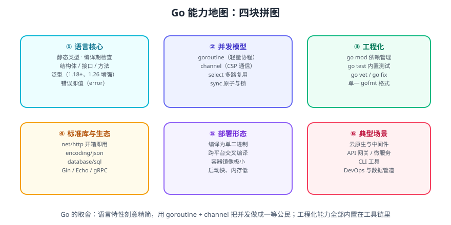

# Go 概述

Go（Golang）是 Google 在 2009 年正式开源的编程语言，由 Robert Griesemer、Rob Pike、Ken Thompson 设计。它是一门**静态类型、编译型、自带垃圾回收**的语言，官方定位是「an open-source programming language supported by Google」，主打**简单、高效、天生并发**。

一句话理解：**Go 用「少特性 + 强工具链」换来了「好维护 + 好部署」**——语法极简到一周就能读完，但编译、测试、依赖管理、格式化、性能分析全部内置，团队协作时几乎没有风格分歧。

## 1. 为什么会有 Go

2007 年前后 Google 面临的问题很具体：C++ 编译越来越慢、Java 的工程体系越来越重、多核 CPU 已经普及但主流语言的多线程编程模型依旧难用。

Go 的三个设计出发点：

1. **编译要快**：依赖分析做到包级别，编译结果可缓存，大项目也能秒级编译。
2. **并发要简单**：把 goroutine 和 channel 做进语言，而不是靠库和线程池。
3. **工程要统一**：一种格式化风格（gofmt）、一套依赖管理（go mod）、一套测试框架（go test），没有可选项。

::: tip 一句话理解
Go 不是在语言特性上「更强」，而是在**工程一致性**上「更省心」。它的取舍是主动放弃一部分表达力，换取可读性和可维护性。
:::

## 2. 语言特点



### 静态类型 + 类型推断

变量类型在编译期确定，但允许用 `:=` 让编译器推断：

```go [main.go]
package main

import "fmt"

func main() {
    name := "Gopher"   // 推断为 string
    age := 15          // 推断为 int
    ratio := 0.75      // 推断为 float64
    fmt.Printf("%s 已经 %d 岁，完成度 %.0f%%\n", name, age, ratio*100)
}
```

```shell
go run main.go
# 输出：Gopher 已经 15 岁，完成度 75%
```

### 编译为单二进制

Go 程序编译后是一个**不依赖运行时环境**的可执行文件（CGO 关闭时完全静态链接），部署时只需要复制一个文件，这也是容器镜像能做到几 MB 的原因。

### 天生并发

goroutine 的初始栈只有几 KB，创建成本极低；调度器在用户态完成切换，因此可以轻松并发几十万个任务。详见 [Go 并发模型](../Concurrency/index.md)。

### 隐式接口

类型只要**实现了接口要求的方法集**，就自动满足该接口，不需要 `implements` 声明。这让 Go 的接口通常只有 1~2 个方法，组合能力很强。详见 [Go 函数、方法与接口](../Functions/index.md)。

### 错误即值

Go 没有异常机制，错误通过 `error` 返回值显式传递，强制调用方处理。详见 [Go 错误处理与 panic](../ErrorHandling/index.md)。

## 3. 与其它语言的对照

| 维度 | Go | Java | Python | Node.js |
| --- | --- | --- | --- | --- |
| 类型系统 | 静态、结构化接口 | 静态、名义接口 | 动态 | 动态（TS 为静态） |
| 执行方式 | 编译为原生机器码 | 编译为字节码 + JVM | 解释执行 | JIT + 事件循环 |
| 并发模型 | goroutine + channel（多核并行） | 线程 + 线程池 | GIL 限制多核 | 单线程事件循环 |
| 启动速度 | 毫秒级 | 秒级（JVM 预热） | 毫秒级 | 百毫秒级 |
| 内存占用 | 低（几十 MB 起） | 高（几百 MB 起） | 中等 | 中等 |
| 依赖管理 | go mod（内置） | Maven / Gradle | pip / poetry | npm / pnpm |
| 典型场景 | 云原生、网关、CLI、中间件 | 企业级后端、大数据 | 数据科学、脚本、AI | 前端工具链、BFF |

::: warning 说明
上表是**量级对照**，不是绝对结论。具体表现取决于项目规模、JVM 参数、Node 版本等因素，落地选型应结合团队技术栈与运维能力。
:::

## 4. 适用场景

**非常适合**

- **云原生基础设施**：Docker、Kubernetes、etcd、Prometheus、Terraform、Consul 都是 Go 写的。
- **API 服务与网关**：单二进制、低内存、高并发，适合容器编排环境。
- **CLI 工具**：交叉编译出全平台单文件，无需用户装运行时。
- **网络中间件与代理**：goroutine 模型天然适合连接数巨大的 IO 密集场景。
- **DevOps 与数据管道**：编译快、部署简单，适合做胶水层与采集器。

**不太适合**

- **重计算与数值模拟**：缺少泛型数值优化与 SIMD 的成熟生态，此时 C++/Rust/Fortran 更合适。
- **强依赖动态特性的领域**：元编程、DSL 密集场景会让代码变得笨重。
- **GUI 桌面应用**：生态相对薄弱，需要借助 Web 技术栈。

## 5. 版本与演进

Go 的版本策略是**每半年一个大版本**（2 月、8 月），同时维护**最近两个大版本**的补丁与安全修复。

| 版本 | 发布时间 | 关键变化 |
| --- | --- | --- |
| Go 1.18 | 2022-03 | 引入**泛型**、工作区（go work）、模糊测试 |
| Go 1.20 | 2023-02 | 支持将切片/字符串安全地转为 `[]byte`、`errors.Join` |
| Go 1.21 | 2023-08 | 内置 `min`/`max`/`clear`、`log/slog`、PGO 正式可用 |
| Go 1.22 | 2024-02 | **循环变量每轮新建**（修掉经典闭包坑）、路由增强（`GET /x/{id}`） |
| Go 1.23 | 2024-08 | 迭代器函数（`range over func`）、`unique` 包 |
| Go 1.24 | 2025-02 | 泛型类型别名、`weak` 弱引用、工具链依赖管理 |
| Go 1.25 | 2025-08 | 容器感知的 GOMAXPROCS、`testing/synctest` 稳定 |
| **Go 1.26** | **2026-02** | **Green Tea GC 默认启用**、内置 `new` 支持表达式、泛型约束可引用自身、`go fix` 重构 |

::: info 信息
Go 1.26 的语言增强里，最常用的是内置函数 `new` 可以直接传表达式：

```go [main.go]
// 1.26 之前
x := int64(300)
ptr := &x

// 1.26 起
ptr := new(int64(300))
```

版本号与发布日期以 [Go 官方发布历史](https://go.dev/doc/devel/release) 为准。
:::

## 6. 一个最小可运行示例

保存为 `main.go`：

```go [main.go]
package main

import (
    "fmt"
    "net/http"
)

func main() {
    http.HandleFunc("/hello", func(w http.ResponseWriter, r *http.Request) {
        name := r.URL.Query().Get("name")
        if name == "" {
            name = "World"
        }
        fmt.Fprintf(w, "Hello, %s!\n", name)
    })

    fmt.Println("listening on http://localhost:8080")
    if err := http.ListenAndServe(":8080", nil); err != nil {
        fmt.Println("server stopped:", err)
    }
}
```

```shell
go run main.go
# 另开终端验证
curl "http://localhost:8080/hello?name=Go"
# 输出：Hello, Go!
```

**验证方式**：终端出现 `listening on http://localhost:8080`，`curl` 返回 `Hello, Go!`，`Ctrl+C` 结束进程。

## 7. 学习建议

1. **先读官方教程**：A Tour of Go 和 Effective Go 覆盖了 80% 的语义细节，中文版见 [Go 官方文档中文站](https://go.dev/doc/)。
2. **不要试图找「框架」**：Go 的标准库足够强，先掌握 `net/http`、`encoding/json`、`database/sql` 再考虑第三方框架。
3. **养成三个习惯**：写完跑 `gofmt`、提交前跑 `go vet`、有并发就跑 `go test -race`。
4. **读懂错误信息**：Go 的编译错误定位精确，不要急着 Google，先读完整段报错。

## 参考资料

- [Go 官方网站](https://go.dev/)
- [Go 官方文档](https://go.dev/doc/)
- [A Tour of Go（交互式教程）](https://go.dev/tour/)
- [Effective Go](https://go.dev/doc/effective_go)
- [Go 发布历史](https://go.dev/doc/devel/release)
- [Go 标准库索引](https://pkg.go.dev/std)
