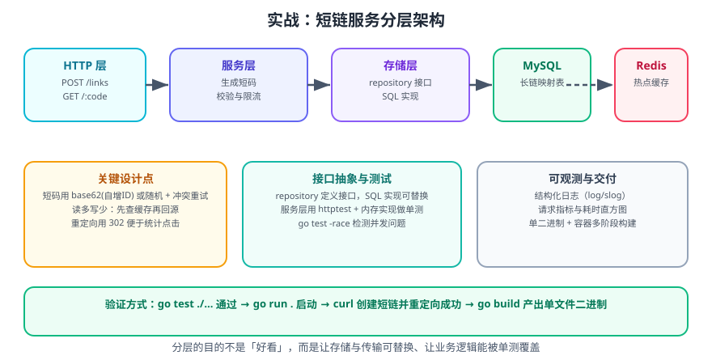

# 实战：短链服务

本节把前面所有知识串起来，从零实现一个**生产可用的短链服务**：把长网址压缩成短码，访问短码时 302 重定向到原地址。虽然业务简单，但它覆盖了 Go 工程实践的全部关键点：分层、接口抽象、并发安全、缓存、限流、优雅关闭与容器化交付。

一句话理解：**短链服务的核心是一张「短码 → 长链」的映射表**；工程难点在于读多写少、热点集中、以及短码不可预测。

## 1. 需求与设计

### 1.1 功能需求

| 编号 | 需求 | 说明 |
| --- | --- | --- |
| F1 | 创建短链 | `POST /api/links`，请求体含 `url`，返回短码与短链 |
| F2 | 跳转 | `GET /{code}` → 302 到原地址 |
| F3 | 查询信息 | `GET /api/links/{code}` 返回元数据（原始 URL、创建时间、点击数） |
| F4 | 自定短码 | 支持 `custom_code` 选填，冲突时返回 409 |
| F5 | 过期 | 支持 `ttl_seconds` 选填，过期后跳转返回 410 |

### 1.2 非功能需求

- **高并发读**：跳转是主要流量，必须走缓存。
- **短码不可枚举**：不能是连续 ID 的十进制形式，否则被人扫库。
- **可替换存储**：先用内存实现，后续无缝换成 MySQL/Redis。
- **可观测**：结构化日志 + 请求耗时。

### 1.3 架构分层



```text
http 层        handler：解析请求、映射状态码、写响应
   ↓
service 层     业务规则：短码生成、冲突重试、TTL 校验、缓存策略
   ↓
repo 层        接口定义 + 实现：内存 / SQL / Redis
```

**分层收益**：service 只依赖 repo 的接口，因此单测可以用内存实现，生产可以换 SQL —— 这是[Go 函数、方法与接口](../Functions/index.md)里「面向接口编程」的实际应用。

## 2. 短码生成方案

| 方案 | 优点 | 缺点 |
| --- | --- | --- |
| 自增 ID → Base62 | 无冲突、长度短、可预测长度 | 短码连续可被枚举 |
| 随机 6 位 Base62 | 不可枚举 | 需处理碰撞（概率约 1/568 亿） |
| 哈希（如 xxhash）截断 | 同 URL 得到同短码（幂等） | 需处理碰撞，且可能泄露「同 URL 被多次提交」 |
| 预生成短码池 | 无冲突、无枚举 | 需额外存储与调度 |

**本项目选择「随机 Base62 + 冲突重试」**：6 位 Base62 有 `62^6 ≈ 568 亿` 种组合，随机碰撞概率极低；同时短码不可枚举。

```go
const alphabet = "0123456789ABCDEFGHIJKLMNOPQRSTUVWXYZabcdefghijklmnopqrstuvwxyz"

// NewCode 生成 n 位随机 Base62 短码。
func NewCode(n int) (string, error) {
    if n <= 0 {
        return "", errors.New("code length must be positive")
    }
    b := make([]byte, n)
    for i := range b {
        idx, err := rand.Int(rand.Reader, big.NewInt(int64(len(alphabet))))
        if err != nil {
            return "", fmt.Errorf("random: %w", err)
        }
        b[i] = alphabet[idx.Int64()]
    }
    return string(b), nil
}
```

::: danger 注意
**必须用 `crypto/rand` 而不是 `math/rand`**。`math/rand` 的默认种子可被预测，攻击者能批量猜出未发行的短码。`math/rand` 仅适合非安全场景（如测试数据、抖动）。Go 1.20 起 `math/rand` 的全局种子会自动随机化，但它仍不是密码学安全的。
:::

## 3. 领域模型与存储接口

```go [internal/link/link.go]
// Package link 定义短链领域模型与存储接口。
package link

import (
    "errors"
    "time"
)

var (
    ErrNotFound  = errors.New("link: not found")
    ErrConflict  = errors.New("link: code already exists")
    ErrExpired   = errors.New("link: expired")
    ErrInvalid   = errors.New("link: invalid URL")
)

// Link 是一条短链记录。
type Link struct {
    Code      string    `json:"code"`
    URL       string    `json:"url"`
    CreatedAt time.Time `json:"created_at"`
    ExpiresAt time.Time `json:"expires_at,omitempty"`
    Hits      int64     `json:"hits"`
}

// Expired 判断是否已过期（零值 ExpiresAt 表示永久有效）。
func (l Link) Expired(now time.Time) bool {
    return !l.ExpiresAt.IsZero() && now.After(l.ExpiresAt)
}

// Store 是存储接口，由消费方（service）定义。
type Store interface {
    // Save 保存；短码已存在时返回 ErrConflict。
    Save(l Link) error
    // Get 查询；不存在返回 ErrNotFound。
    Get(code string) (Link, error)
    // IncrHits 原子地把点击数加一。
    IncrHits(code string) error
}
```

## 4. 内存实现（并发安全）

```go [internal/link/memstore.go]
package link

import (
    "fmt"
    "sync"
    "time"
)

// MemStore 是 Store 的内存实现，并发安全。
type MemStore struct {
    mu    sync.RWMutex
    items map[string]Link
    now   func() time.Time // 便于测试注入
}

func NewMemStore() *MemStore {
    return &MemStore{items: make(map[string]Link), now: time.Now}
}

var _ Store = (*MemStore)(nil) // 编译期断言

func (m *MemStore) Save(l Link) error {
    m.mu.Lock()
    defer m.mu.Unlock()
    if _, ok := m.items[l.Code]; ok {
        return fmt.Errorf("code=%s: %w", l.Code, ErrConflict)
    }
    m.items[l.Code] = l
    return nil
}

func (m *MemStore) Get(code string) (Link, error) {
    m.mu.RLock()
    defer m.mu.RUnlock()
    l, ok := m.items[code]
    if !ok {
        return Link{}, fmt.Errorf("code=%s: %w", code, ErrNotFound)
    }
    return l, nil
}

func (m *MemStore) IncrHits(code string) error {
    m.mu.Lock()
    defer m.mu.Unlock()
    l, ok := m.items[code]
    if !ok {
        return fmt.Errorf("code=%s: %w", code, ErrNotFound)
    }
    l.Hits++
    m.items[code] = l
    return nil
}

// Cleanup 清理过期记录，可由后台定时任务调用。
func (m *MemStore) Cleanup() int {
    m.mu.Lock()
    defer m.mu.Unlock()
    removed := 0
    for k, l := range m.items {
        if l.Expired(m.now()) {
            delete(m.items, k)
            removed++
        }
    }
    return removed
}
```

## 5. 服务层

```go [internal/link/service.go]
package link

import (
    "errors"
    "fmt"
    "net/url"
    "strings"
    "time"
)

// CodeGenerator 抽象短码生成，便于测试时注入确定性实现。
type CodeGenerator func(n int) (string, error)

type Service struct {
    store    Store
    gen      CodeGenerator
    codeLen  int
    maxRetry int
    now      func() time.Time
    baseURL  string
}

type Option func(*Service)

func WithCodeLen(n int) Option      { return func(s *Service) { s.codeLen = n } }
func WithBaseURL(u string) Option   { return func(s *Service) { s.baseURL = strings.TrimRight(u, "/") } }
func WithGenerator(g CodeGenerator) Option { return func(s *Service) { s.gen = g } }
func WithClock(f func() time.Time)  Option { return func(s *Service) { s.now = f } }

func NewService(store Store, opts ...Option) *Service {
    s := &Service{
        store:    store,
        gen:      NewCode,
        codeLen:  6,
        maxRetry: 5,
        now:      time.Now,
        baseURL:  "http://localhost:8080",
    }
    for _, o := range opts {
        o(s)
    }
    return s
}

// CreateInput 是创建短链的入参。
type CreateInput struct {
    URL       string
    Custom    string
    TTL       time.Duration
}

// ShortURL 返回完整短链。
func (s *Service) ShortURL(code string) string {
    return s.baseURL + "/" + code
}

// Create 创建短链；返回创建好的记录。
func (s *Service) Create(in CreateInput) (Link, error) {
    if err := validateURL(in.URL); err != nil {
        return Link{}, err
    }

    l := Link{
        Code:      in.Custom,
        URL:       in.URL,
        CreatedAt: s.now(),
    }
    if in.TTL > 0 {
        l.ExpiresAt = l.CreatedAt.Add(in.TTL)
    }

    if l.Code != "" {
        if err := validateCode(l.Code); err != nil {
            return Link{}, err
        }
        if err := s.store.Save(l); err != nil {
            return Link{}, err // 已存在 → ErrConflict
        }
        return l, nil
    }

    // 随机短码 + 冲突重试
    for i := 0; i < s.maxRetry; i++ {
        code, err := s.gen(s.codeLen)
        if err != nil {
            return Link{}, fmt.Errorf("generate code: %w", err)
        }
        l.Code = code
        err = s.store.Save(l)
        if err == nil {
            return l, nil
        }
        if !errors.Is(err, ErrConflict) {
            return Link{}, err
        }
        // 冲突则重试
    }
    return Link{}, fmt.Errorf("generate unique code after %d attempts: %w", s.maxRetry, ErrConflict)
}

// Resolve 解析短码；过期返回 ErrExpired。
func (s *Service) Resolve(code string) (Link, error) {
    l, err := s.store.Get(code)
    if err != nil {
        return Link{}, err
    }
    if l.Expired(s.now()) {
        return Link{}, fmt.Errorf("code=%s: %w", code, ErrExpired)
    }
    return l, nil
}

// Hit 记录一次点击（失败不影响跳转）。
func (s *Service) Hit(code string) {
    if err := s.store.IncrHits(code); err != nil {
        // 计数失败不应阻断跳转，仅记录
        _ = err
    }
}

func validateURL(raw string) error {
    if strings.TrimSpace(raw) == "" {
        return fmt.Errorf("url is empty: %w", ErrInvalid)
    }
    u, err := url.Parse(raw)
    if err != nil {
        return fmt.Errorf("parse url: %w", ErrInvalid)
    }
    if u.Scheme != "http" && u.Scheme != "https" {
        return fmt.Errorf("scheme %q not allowed: %w", u.Scheme, ErrInvalid)
    }
    if u.Host == "" {
        return fmt.Errorf("host is empty: %w", ErrInvalid)
    }
    return nil
}

var codeAlphabet = alphabet

func validateCode(code string) error {
    if len(code) < 3 || len(code) > 32 {
        return fmt.Errorf("code length must be 3..32: %w", ErrInvalid)
    }
    for _, r := range code {
        if !strings.ContainsRune(codeAlphabet, r) {
            return fmt.Errorf("code contains illegal char %q: %w", r, ErrInvalid)
        }
    }
    return nil
}
```

::: danger 注意
**创建短链时必须校验 Scheme**，只允许 `http` / `https`，否则会被用作**开放重定向漏洞**（Open Redirect）：别人可以创建 `javascript:` 或 `//evil.com` 的短链来钓鱼。生产环境还应加域名白名单或黑名单。
:::

## 6. HTTP 层

```go [internal/link/handler.go]
package link

import (
    "encoding/json"
    "errors"
    "io"
    "log/slog"
    "net/http"
    "time"
)

type Handler struct {
    svc *Service
}

func NewHandler(svc *Service) *Handler { return &Handler{svc: svc} }

func (h *Handler) Routes() http.Handler {
    mux := http.NewServeMux()
    mux.HandleFunc("POST /api/links", h.create)
    mux.HandleFunc("GET /api/links/{code}", h.info)
    mux.HandleFunc("GET /healthz", h.health)
    mux.HandleFunc("GET /{code}", h.redirect)
    return mux
}

type createReq struct {
    URL        string `json:"url"`
    CustomCode string `json:"custom_code,omitempty"`
    TTLSeconds int64  `json:"ttl_seconds,omitempty"`
}

type createResp struct {
    Code     string    `json:"code"`
    ShortURL string    `json:"short_url"`
    URL      string    `json:"url"`
    ExpiresAt time.Time `json:"expires_at,omitempty"`
}

func (h *Handler) create(w http.ResponseWriter, r *http.Request) {
    r.Body = http.MaxBytesReader(w, r.Body, 64<<10) // 64 KB

    var req createReq
    dec := json.NewDecoder(r.Body)
    dec.DisallowUnknownFields()
    if err := dec.Decode(&req); err != nil {
        writeErr(w, http.StatusBadRequest, "invalid json: "+err.Error())
        return
    }

    var ttl time.Duration
    if req.TTLSeconds > 0 {
        ttl = time.Duration(req.TTLSeconds) * time.Second
    }

    l, err := h.svc.Create(CreateInput{URL: req.URL, Custom: req.CustomCode, TTL: ttl})
    if err != nil {
        status := http.StatusInternalServerError
        switch {
        case errors.Is(err, ErrInvalid):
            status = http.StatusBadRequest
        case errors.Is(err, ErrConflict):
            status = http.StatusConflict
        }
        writeErr(w, status, err.Error())
        return
    }

    writeJSON(w, http.StatusCreated, createResp{
        Code:      l.Code,
        ShortURL:  h.svc.ShortURL(l.Code),
        URL:       l.URL,
        ExpiresAt: l.ExpiresAt,
    })
}

func (h *Handler) info(w http.ResponseWriter, r *http.Request) {
    l, err := h.svc.Resolve(r.PathValue("code"))
    if err != nil {
        writeErr(w, statusOf(err), err.Error())
        return
    }
    writeJSON(w, http.StatusOK, l)
}

func (h *Handler) redirect(w http.ResponseWriter, r *http.Request) {
    code := r.PathValue("code")
    l, err := h.svc.Resolve(code)
    if err != nil {
        writeErr(w, statusOf(err), err.Error())
        return
    }
    h.svc.Hit(code)
    http.Redirect(w, r, l.URL, http.StatusFound) // 302
}

func (h *Handler) health(w http.ResponseWriter, r *http.Request) {
    w.WriteHeader(http.StatusOK)
    _, _ = io.WriteString(w, "ok")
}

func statusOf(err error) int {
    switch {
    case errors.Is(err, ErrNotFound):
        return http.StatusNotFound
    case errors.Is(err, ErrExpired):
        return http.StatusGone
    case errors.Is(err, ErrInvalid):
        return http.StatusBadRequest
    default:
        return http.StatusInternalServerError
    }
}

func writeJSON(w http.ResponseWriter, status int, v any) {
    w.Header().Set("Content-Type", "application/json; charset=utf-8")
    w.WriteHeader(status)
    _ = json.NewEncoder(w).Encode(v)
}

func writeErr(w http.ResponseWriter, status int, msg string) {
    writeJSON(w, status, map[string]string{"error": msg})
}

// WithLogging 记录访问日志。
func WithLogging(next http.Handler) http.Handler {
    return http.HandlerFunc(func(w http.ResponseWriter, r *http.Request) {
        start := time.Now()
        next.ServeHTTP(w, r)
        slog.Info("http",
            "method", r.Method,
            "path", r.URL.Path,
            "cost_ms", time.Since(start).Milliseconds(),
            "remote", r.RemoteAddr,
        )
    })
}

// WithRecover 兜住 panic。
func WithRecover(next http.Handler) http.Handler {
    return http.HandlerFunc(func(w http.ResponseWriter, r *http.Request) {
        defer func() {
            if rec := recover(); rec != nil {
                slog.Error("panic", "err", rec, "path", r.URL.Path)
                writeErr(w, http.StatusInternalServerError, "internal error")
            }
        }()
        next.ServeHTTP(w, r)
    })
}

// WithRateLimit 限流的装配点：具体实现见下方说明。
// 这里只声明签名，真正实现使用 golang.org/x/time/rate。
func NewRouter(svc *Service) http.Handler {
    h := NewHandler(svc)
    return WithRecover(WithLogging(h.Routes()))
}
```

::: danger 注意
上面只给了限流的**装配位置**，没有内置实现。生产请直接用 `golang.org/x/time/rate`：

```go
import "golang.org/x/time/rate"

var limiter = rate.NewLimiter(rate.Limit(qps), qps*2) // qps 需按部署规模配置

func WithRateLimit(next http.Handler) http.Handler {
    return http.HandlerFunc(func(w http.ResponseWriter, r *http.Request) {
        if !limiter.Allow() {
            w.Header().Set("Retry-After", "1")
            http.Error(w, "too many requests", http.StatusTooManyRequests)
            return
        }
        next.ServeHTTP(w, r)
    })
}
```
不要自己用「计数器 + 时间窗」实现，那在并发下很容易写错。另外注意：`WithRecover` 必须放在最外层，`WithRateLimit` 放在它里面（限流本身不应吞掉 panic 日志）。
:::

## 7. 入口与优雅关闭

```go [cmd/server/main.go]
package main

import (
    "context"
    "errors"
    "log/slog"
    "net/http"
    "os"
    "os/signal"
    "syscall"
    "time"

    "github.com/yourorg/shortlink/internal/link"
)

func main() {
    slog.SetDefault(slog.New(slog.NewJSONHandler(os.Stdout, nil)))

    store := link.NewMemStore()
    svc := link.NewService(store,
        link.WithBaseURL(getenv("BASE_URL", "http://localhost:8080")),
        link.WithCodeLen(6),
    )
    h := link.NewHandler(svc)

    srv := &http.Server{
        Addr:              getenv("ADDR", ":8080"),
        Handler:           link.WithRecover(link.WithLogging(h.Routes())),
        ReadHeaderTimeout: 5 * time.Second,
        ReadTimeout:       15 * time.Second,
        WriteTimeout:      15 * time.Second,
        IdleTimeout:       60 * time.Second,
    }

    // 后台清理过期记录
    stopCleanup := make(chan struct{})
    go func() {
        t := time.NewTicker(10 * time.Minute)
        defer t.Stop()
        for {
            select {
            case <-t.C:
                if n := store.Cleanup(); n > 0 {
                    slog.Info("cleanup", "removed", n)
                }
            case <-stopCleanup:
                return
            }
        }
    }()

    go func() {
        slog.Info("listening", "addr", srv.Addr)
        if err := srv.ListenAndServe(); err != nil && !errors.Is(err, http.ErrServerClosed) {
            slog.Error("listen failed", "err", err)
            os.Exit(1)
        }
    }()

    quit := make(chan os.Signal, 1)
    signal.Notify(quit, syscall.SIGINT, syscall.SIGTERM)
    <-quit
    slog.Info("shutting down")

    ctx, cancel := context.WithTimeout(context.Background(), 10*time.Second)
    defer cancel()
    if err := srv.Shutdown(ctx); err != nil {
        slog.Error("graceful shutdown failed", "err", err)
    }
    close(stopCleanup)
    slog.Info("bye")
}

func getenv(k, def string) string {
    if v := os.Getenv(k); v != "" {
        return v
    }
    return def
}
```

## 8. 测试

```go [internal/link/service_test.go]
package link_test

import (
    "errors"
    "strings"
    "testing"
    "time"

    "github.com/yourorg/shortlink/internal/link"
)

// 确定性短码生成器：便于断言与制造冲突。
func seqGen(codes ...string) link.CodeGenerator {
    i := 0
    return func(n int) (string, error) {
        if i >= len(codes) {
            return "", errors.New("exhausted")
        }
        c := codes[i]
        i++
        return c, nil
    }
}

func TestCreateAndResolve(t *testing.T) {
    store := link.NewMemStore()
    svc := link.NewService(store, link.WithGenerator(seqGen("abc123")))

    l, err := svc.Create(link.CreateInput{URL: "https://go.dev/"})
    if err != nil {
        t.Fatalf("create: %v", err)
    }
    if l.Code != "abc123" {
        t.Fatalf("code = %q, want abc123", l.Code)
    }

    got, err := svc.Resolve("abc123")
    if err != nil {
        t.Fatalf("resolve: %v", err)
    }
    if got.URL != "https://go.dev/" {
        t.Fatalf("url = %q", got.URL)
    }
}

func TestCreateRetriesOnConflict(t *testing.T) {
    store := link.NewMemStore()
    svc := link.NewService(store, link.WithGenerator(seqGen("dupdup", "dupdup", "uniq01")))

    if _, err := svc.Create(link.CreateInput{URL: "https://a.example/"}); err != nil {
        t.Fatalf("first create: %v", err)
    }
    l, err := svc.Create(link.CreateInput{URL: "https://b.example/"})
    if err != nil {
        t.Fatalf("second create should retry: %v", err)
    }
    if l.Code != "uniq01" {
        t.Fatalf("code = %q, want uniq01", l.Code)
    }
}

func TestCustomCodeConflict(t *testing.T) {
    store := link.NewMemStore()
    svc := link.NewService(store)

    if _, err := svc.Create(link.CreateInput{URL: "https://a.example/", Custom: "mine01"}); err != nil {
        t.Fatalf("first: %v", err)
    }
    _, err := svc.Create(link.CreateInput{URL: "https://b.example/", Custom: "mine01"})
    if !errors.Is(err, link.ErrConflict) {
        t.Fatalf("want ErrConflict, got %v", err)
    }
}

func TestExpired(t *testing.T) {
    store := link.NewMemStore()
    now := time.Date(2026, 9, 13, 12, 0, 0, 0, time.UTC)
    svc := link.NewService(store,
        link.WithGenerator(seqGen("ttl001")),
        link.WithClock(func() time.Time { return now }),
    )

    if _, err := svc.Create(link.CreateInput{URL: "https://a.example/", TTL: time.Minute}); err != nil {
        t.Fatalf("create: %v", err)
    }

    // 时间前进 2 分钟
    later := now.Add(2 * time.Minute)
    svc2 := link.NewService(store,
        link.WithClock(func() time.Time { return later }),
    )
    if _, err := svc2.Resolve("ttl001"); !errors.Is(err, link.ErrExpired) {
        t.Fatalf("want ErrExpired, got %v", err)
    }
}

func TestRejectUnsafeScheme(t *testing.T) {
    store := link.NewMemStore()
    svc := link.NewService(store)

    for _, raw := range []string{"", "javascript:alert(1)", "ftp://x.example/", "//evil.com"} {
        if _, err := svc.Create(link.CreateInput{URL: raw}); !errors.Is(err, link.ErrInvalid) {
            t.Errorf("url %q: want ErrInvalid, got %v", raw, err)
        }
    }
}

func TestConcurrentCreate(t *testing.T) {
    store := link.NewMemStore()
    // 生成器保证唯一，避免随机性影响断言
    var seq int64
    gen := func(n int) (string, error) {
        seq++
        return "c" + strings.Repeat("0", 5) + string(rune('a'+seq%26)), nil
    }
    svc := link.NewService(store, link.WithGenerator(gen), link.WithCodeLen(7))

    const workers = 50
    errCh := make(chan error, workers)
    done := make(chan struct{})

    for i := 0; i < workers; i++ {
        go func(i int) {
            _, err := svc.Create(link.CreateInput{
                URL:    "https://a.example/" + string(rune('a'+i%26)),
                Custom: "u" + string(rune('a'+i%26)) + "0001",
            })
            errCh <- err
            done <- struct{}{}
        }(i)
    }
    for i := 0; i < workers; i++ {
        <-done
    }
    close(errCh)

    // 允许冲突（自定义码重复），但不允许 panic 或非预期错误
    for err := range errCh {
        if err != nil && !errors.Is(err, link.ErrConflict) {
            t.Fatalf("unexpected error: %v", err)
        }
    }
}
```

```shell
go test ./... -race -count=1
# ok      github.com/yourorg/shortlink/internal/link    0.02s
```

**验证方式**：`-race` 下全部通过，说明内存实现与 service 层无数据竞争；`TestCreateRetriesOnConflict` 证明冲突重试生效；`TestRejectUnsafeScheme` 证明开放重定向被挡住。

## 9. 手动验收

```shell
# 1. 启动
go run ./cmd/server

# 2. 创建短链
curl -s -X POST localhost:8080/api/links \
  -H 'Content-Type: application/json' \
  -d '{"url":"https://go.dev/doc/effective_go","ttl_seconds":3600}'
# {"code":"x7Kq2m","short_url":"http://localhost:8080/x7Kq2m","url":"https://go.dev/doc/effective_go","expires_at":"..."}

# 3. 跳转（-I 只看响应头）
curl -sI localhost:8080/x7Kq2m | head -n 3
# HTTP/1.1 302 Found
# Location: https://go.dev/doc/effective_go

# 4. 查询信息（点击后 hits 应为 1）
curl -s localhost:8080/api/links/x7Kq2m
# {"code":"x7Kq2m","url":"...","created_at":"...","expires_at":"...","hits":1}

# 5. 自定短码冲突
curl -s -X POST localhost:8080/api/links -H 'Content-Type: application/json' \
  -d '{"url":"https://a.example/","custom_code":"mine01"}'
curl -s -o /dev/null -w '%{http_code}\n' -X POST localhost:8080/api/links \
  -H 'Content-Type: application/json' -d '{"url":"https://b.example/","custom_code":"mine01"}'
# 409

# 6. 危险 Scheme 被拒
curl -s -o /dev/null -w '%{http_code}\n' -X POST localhost:8080/api/links \
  -H 'Content-Type: application/json' -d '{"url":"javascript:alert(1)"}'
# 400

# 7. 不存在的短码
curl -s -o /dev/null -w '%{http_code}\n' localhost:8080/nope00
# 404

# 8. 优雅关闭
# Ctrl+C 后观察日志应出现 "shutting down" 与 "bye"
```

## 10. 容器化交付

```dockerfile [Dockerfile]
# ---- 构建阶段 ----
FROM golang:1.26-alpine AS build
WORKDIR /src

# 先复制 go.mod/go.sum 以复用依赖缓存层
COPY go.mod go.sum ./
RUN go mod download

COPY . .
# CGO_ENABLED=0 产出静态二进制；-s -w 去掉符号与调试信息
RUN CGO_ENABLED=0 GOOS=linux go build -trimpath -ldflags="-s -w" \
    -o /out/shortlink ./cmd/server

# ---- 运行阶段 ----
FROM gcr.io/distroless/static-debian12:nonroot
COPY --from=build /out/shortlink /shortlink
EXPOSE 8080
USER nonroot:nonroot
ENTRYPOINT ["/shortlink"]
```

```shell
docker build -t shortlink:local .
docker run --rm -p 8080:8080 -e BASE_URL=http://localhost:8080 shortlink:local

# 查看镜像大小（通常 < 20 MB）
docker images shortlink:local
```

::: tip 三个交付要点
1. **多阶段构建**：构建镜像（几百 MB）不进最终产物。
2. **`CGO_ENABLED=0`**：产出静态链接二进制，可以跑在 `scratch` / `distroless` 这种「没有 shell、没有 libc」的最小镜像上，攻击面小。
3. **`-trimpath`**：去掉编译路径信息，避免泄露开发机目录结构。
:::

## 11. 后续演进方向

| 方向 | 做法 |
| --- | --- |
| 换成持久化存储 | 新增 `SQLStore` 实现 `link.Store`，service 与 handler 无需改动 |
| 加缓存 | 在 service 层包一层 `CachedStore`（装饰器模式），读走 Redis |
| 防刷 | 创建接口按 IP / 用户限流；跳转接口加本地缓存 |
| 统计 | 异步把点击事件写入消息队列，落库做分析 |
| 多实例 | 短码生成改为「预分配号段」或使用 Redis INCR 保证全局唯一 |
| 可观测 | 接 Prometheus 暴露 QPS、P99 延迟、缓存命中率 |

::: warning 说明
内存实现只适合单实例。一旦水平扩容为多个副本，`MemStore` 的「冲突检测」会失效（不同实例互相看不到），必须换成共享存储。这也解释了为什么 repo 层必须是**接口**——换存储不该动业务代码。
:::

## 12. 参考资料

- [net/http 包文档](https://pkg.go.dev/net/http)
- [crypto/rand 密码学安全随机数](https://pkg.go.dev/crypto/rand)
- [log/slog 结构化日志](https://pkg.go.dev/log/slog)
- [golang.org/x/time/rate](https://pkg.go.dev/golang.org/x/time/rate)
- [OWASP：Unvalidated Redirects and Forwards](https://cheatsheetseries.owasp.org/cheatsheets/Unvalidated_Redirects_and_Forwards_Cheat_Sheet.html)
- [Go 官方：Docker 多阶段构建最佳实践](https://docs.docker.com/build/building/multi-stage/)
