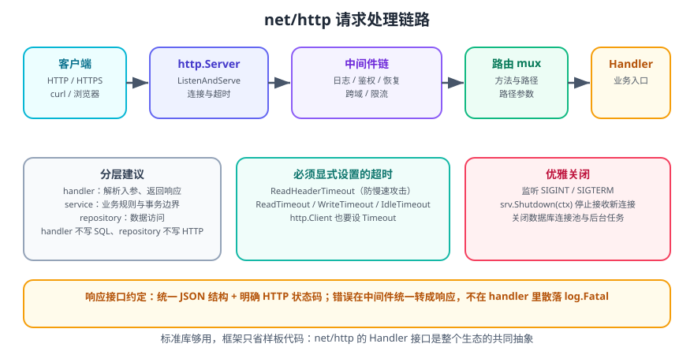

# Go Web 开发

Go 的 Web 能力主要来自标准库 `net/http`。它足够强：一个 `Handler` 接口 + 一个 `ServeMux` 就能搭建生产可用的 HTTP 服务；框架（Gin、Echo、Chi）本质上只是帮你少写样板代码。

一句话理解：**`http.Handler` 是整个 Go Web 生态的共同抽象**。任何中间件、任何框架的处理器，最终都实现成 `ServeHTTP(w, r)`。

## 1. 最小 HTTP 服务

```go [main.go]
package main

import (
    "fmt"
    "log"
    "net/http"
    "time"
)

func main() {
    mux := http.NewServeMux()
    mux.HandleFunc("GET /hello/{name}", func(w http.ResponseWriter, r *http.Request) {
        name := r.PathValue("name") // Go 1.22+ 路径参数
        fmt.Fprintf(w, "Hello, %s!\n", name)
    })

    srv := &http.Server{
        Addr:              ":8080",
        Handler:           mux,
        ReadHeaderTimeout: 5 * time.Second,
        ReadTimeout:       15 * time.Second,
        WriteTimeout:      15 * time.Second,
        IdleTimeout:       60 * time.Second,
    }

    log.Println("listening on http://localhost:8080")
    if err := srv.ListenAndServe(); err != nil && err != http.ErrServerClosed {
        log.Fatal(err)
    }
}
```

```shell
go run main.go
curl http://localhost:8080/hello/gopher
# Hello, gopher!
```

::: tip Go 1.22 起的路由增强
`http.ServeMux` 现在支持**方法限定**与**路径通配**，很多场景不必再引入第三方路由库：

| 模式 | 含义 |
| --- | --- |
| `GET /users` | 只匹配 GET 方法 |
| `GET /users/{id}` | 匹配一段路径，用 `r.PathValue("id")` 取 |
| `GET /files/{path...}` | 匹配剩余全部路径（`...` 通配） |
| `/users/` | 前缀匹配（结尾斜杠表示子树） |
| `GET /{$}` | 精确匹配根路径 `/` |

优先级规则：**越具体的模式越优先**。`GET /users/{id}` 优先于 `GET /users/{id...}`。
:::

## 2. Handler 与中间件



### 2.1 Handler 接口

```go
type Handler interface {
    ServeHTTP(ResponseWriter, *Request)
}
```

用函数适配器 `http.HandlerFunc` 可以把普通函数变成 Handler：

```go
var h http.Handler = http.HandlerFunc(func(w http.ResponseWriter, r *http.Request) {
    w.Write([]byte("ok"))
})
```

### 2.2 中间件

中间件就是「接收 Handler、返回 Handler」的函数：

```go
type Middleware func(http.Handler) http.Handler

// 1. 请求日志
func Logging(next http.Handler) http.Handler {
    return http.HandlerFunc(func(w http.ResponseWriter, r *http.Request) {
        start := time.Now()
        rec := &statusRecorder{ResponseWriter: w, status: http.StatusOK}
        next.ServeHTTP(rec, r)
        log.Printf("%s %s %d %v", r.Method, r.URL.Path, rec.status, time.Since(start))
    })
}

// 需要记录状态码时，包装 ResponseWriter
type statusRecorder struct {
    http.ResponseWriter
    status int
}

func (r *statusRecorder) WriteHeader(code int) {
    r.status = code
    r.ResponseWriter.WriteHeader(code)
}

// 2. panic 兜底
func Recoverer(next http.Handler) http.Handler {
    return http.HandlerFunc(func(w http.ResponseWriter, r *http.Request) {
        defer func() {
            if rec := recover(); rec != nil {
                log.Printf("panic: %v\n%s", rec, debug.Stack())
                http.Error(w, "internal server error", http.StatusInternalServerError)
            }
        }()
        next.ServeHTTP(w, r)
    })
}

// 3. 请求 ID
type ctxKey string

const traceIDKey ctxKey = "traceID"

func TraceID(next http.Handler) http.Handler {
    return http.HandlerFunc(func(w http.ResponseWriter, r *http.Request) {
        id := r.Header.Get("X-Request-ID")
        if id == "" {
            id = randomID()
        }
        w.Header().Set("X-Request-ID", id)
        ctx := context.WithValue(r.Context(), traceIDKey, id)
        next.ServeHTTP(w, r.WithContext(ctx))
    })
}

// 4. 组合中间件（链式声明，执行顺序从外到内）
func chain(h http.Handler, ms ...Middleware) http.Handler {
    for i := len(ms) - 1; i >= 0; i-- {
        h = ms[i](h)
    }
    return h
}

func main() {
    mux := http.NewServeMux()
    mux.HandleFunc("GET /healthz", func(w http.ResponseWriter, r *http.Request) {
        w.WriteHeader(http.StatusOK)
        w.Write([]byte("ok"))
    })

    handler := chain(mux, TraceID, Logging, Recoverer)
    log.Fatal(http.ListenAndServe(":8080", handler))
}
```

::: danger 注意
1. **中间件里忘记 `next.ServeHTTP` 就等于请求被吞掉**，客户端会一直等到超时。
2. **包装 `ResponseWriter` 时必须同时转发 `WriteHeader` 与 `Write`**，否则状态码或响应体会丢失。
3. **`Recoverer` 要放到最外层**（列表最前面），才能兜住后面所有中间件与处理器的 panic。
4. **不要在中间件里把 `r.Body` 读完后不还原**，后续处理器会读到空数据。需要读取时用 `io.NopCloser(bytes.NewReader(buf))` 塞回。
:::

## 3. 请求处理

### 3.1 读取参数

```go
// 路径参数（Go 1.22+）
id := r.PathValue("id")

// 查询参数
page := r.URL.Query().Get("page")
// 带默认值
limit := 20
if v := r.URL.Query().Get("limit"); v != "" {
    if n, err := strconv.Atoi(v); err == nil && n > 0 {
        limit = n
    }
}

// 请求头
token := r.Header.Get("Authorization")

// JSON 请求体（务必限制大小，防止内存耗尽）
r.Body = http.MaxBytesReader(w, r.Body, 1<<20) // 1 MB
var req CreateUserRequest
dec := json.NewDecoder(r.Body)
dec.DisallowUnknownFields() // 拒绝未知字段，防止拼写错误被静默忽略
if err := dec.Decode(&req); err != nil {
    http.Error(w, "invalid json: "+err.Error(), http.StatusBadRequest)
    return
}
```

### 3.2 返回响应

```go
// 1. 纯文本
w.Header().Set("Content-Type", "text/plain; charset=utf-8")
w.WriteHeader(http.StatusOK)
w.Write([]byte("ok"))

// 2. JSON（统一封装）
type Response struct {
    Code int    `json:"code"`
    Msg  string `json:"msg"`
    Data any    `json:"data,omitempty"`
}

func writeJSON(w http.ResponseWriter, status int, v any) {
    w.Header().Set("Content-Type", "application/json; charset=utf-8")
    w.WriteHeader(status)
    if err := json.NewEncoder(w).Encode(v); err != nil {
        log.Printf("encode response: %v", err) // 此时响应头已发出，只能记日志
    }
}

writeJSON(w, http.StatusOK, Response{Code: 0, Msg: "ok", Data: user})

// 3. 文件下载
http.ServeFile(w, r, "./files/report.pdf")

// 4. 静态资源目录
mux.Handle("GET /static/", http.StripPrefix("/static/", http.FileServer(http.Dir("./public"))))
```

::: danger 注意
1. **`WriteHeader` 只能调用一次**，第二次会被忽略并打印警告。先设置好所有响应头，再调用 `WriteHeader`。
2. **`w.Write` 会自动把状态码设为 200**，如果你之后再调 `WriteHeader(500)` 就无效了。
3. **返回前必须处理 `json.Encode` 的错误**，但此时响应头已发出，只能记日志——因此复杂结构建议先序列化到 `[]byte` 再写，出错还能改成 500。
:::

### 3.3 优雅关闭

```go
func main() {
    srv := &http.Server{Addr: ":8080", Handler: buildHandler()}

    // 后台启动
    go func() {
        if err := srv.ListenAndServe(); err != nil && err != http.ErrServerClosed {
            log.Fatalf("listen: %v", err)
        }
    }()
    log.Println("server started")

    // 等待信号
    quit := make(chan os.Signal, 1)
    signal.Notify(quit, syscall.SIGINT, syscall.SIGTERM)
    <-quit

    // 给在途请求 10 秒完成时间
    ctx, cancel := context.WithTimeout(context.Background(), 10*time.Second)
    defer cancel()

    if err := srv.Shutdown(ctx); err != nil {
        log.Printf("forced shutdown: %v", err)
    }
    // 关闭数据库连接池、消息队列生产者等
    log.Println("server exited")
}
```

`Shutdown` 会：停止接收新连接 → 等待在途请求完成 → 超时后强制关闭。这就是容器编排（K8s）滚动更新时**不丢请求**的关键。

## 4. 调用外部 HTTP 服务

```go
// 1. 自定义带超时的 Client（不要用 http.DefaultClient，它没有超时）
var httpClient = &http.Client{
    Timeout: 10 * time.Second,
    Transport: &http.Transport{
        MaxIdleConns:        100,
        MaxIdleConnsPerHost: 10,
        IdleConnTimeout:     90 * time.Second,
        DialContext: (&net.Dialer{
            Timeout:   5 * time.Second,
            KeepAlive: 30 * time.Second,
        }).DialContext,
    },
}

// 2. 带 context 的请求（支持取消与超时传播）
func getUser(ctx context.Context, id string) (*User, error) {
    req, err := http.NewRequestWithContext(ctx, http.MethodGet,
        "https://api.example.com/users/"+id, nil)
    if err != nil {
        return nil, fmt.Errorf("build request: %w", err)
    }
    req.Header.Set("Accept", "application/json")

    resp, err := httpClient.Do(req)
    if err != nil {
        return nil, fmt.Errorf("call user api: %w", err)
    }
    defer resp.Body.Close()

    if resp.StatusCode != http.StatusOK {
        body, _ := io.ReadAll(io.LimitReader(resp.Body, 512))
        return nil, fmt.Errorf("user api status=%d body=%s", resp.StatusCode, body)
    }

    var u User
    if err := json.NewDecoder(resp.Body).Decode(&u); err != nil {
        return nil, fmt.Errorf("decode user: %w", err)
    }
    return &u, nil
}
```

::: danger 注意
1. **`http.DefaultClient` 没有超时**，线上使用会导致 goroutine 与连接堆积。必须自建带 `Timeout` 的 Client 并复用（`Client` 是并发安全的）。
2. **必须 `defer resp.Body.Close()`**，否则连接无法复用，最终耗尽连接池。
3. **必须读取完 Body 或显式 `Close`**，部分读取后直接 Close 会导致连接被丢弃。
4. **`Transport` 也应复用**，每次请求新建 Transport 会不断创建连接。
:::

## 5. 选择框架

| 框架 | 特点 | 适用场景 |
| --- | --- | --- |
| **标准库 net/http** | 零依赖、1.22 后路由够用、生态互通性最好 | 中小服务、库、对依赖敏感的项目 |
| **Chi** | 与标准库完全兼容，只补路由与中间件 | 想保留标准库风格又要路由分组 |
| **Gin** | 性能好、生态大、上手快 | 业务 API、团队熟悉 Gin |
| **Echo** | 功能全（绑定、校验、模板一体） | 需要开箱即用的一体化框架 |
| **Fiber** | 基于 fasthttp，性能极高 | 极致吞吐、能接受非标准库语义 |
| **gRPC (grpc-go)** | 强类型、双向流、代码生成 | 服务间通信、内部 RPC |

```go
// Gin 版本（对照上面标准库写法）
r := gin.New()
r.Use(gin.Logger(), gin.Recovery())

r.GET("/hello/:name", func(c *gin.Context) {
    c.JSON(http.StatusOK, gin.H{"msg": "Hello, " + c.Param("name")})
})

r.Run(":8080")
```

::: tip 选型建议
**先用标准库写一遍**，确认痛点后再决定。多数「需要框架」的理由（路由参数、中间件、JSON 绑定）在 Go 1.22 之后标准库都能覆盖。引入框架的主要代价是：错误处理语义被包装、调试栈变深、升级受制于框架节奏。
:::

## 6. 生产必备清单

| 项目 | 做法 |
| --- | --- |
| 超时 | Server 四个超时全设；Client 设 `Timeout`；DB/Redis 设连接超时 |
| 优雅关闭 | 监听 SIGTERM，`srv.Shutdown(ctx)` |
| 健康检查 | `GET /healthz`（存活）、`GET /readyz`（就绪，含依赖探测） |
| 结构化日志 | `log/slog`，输出 JSON，带 traceID |
| 指标 | `expvar` 或 Prometheus client，暴露请求数/耗时/错误率 |
| 限流 | 令牌桶（`golang.org/x/time/rate`）按 IP 或用户 |
| 请求体限制 | `http.MaxBytesReader` |
| 跨域 | 显式配置允许来源，不要在生产用 `*` 配凭证 |
| 安全响应头 | `X-Content-Type-Options: nosniff`、`X-Frame-Options`、HSTS |
| 依赖漏洞 | CI 跑 `govulncheck ./...` |

```go
// slog 结构化日志示例
logger := slog.New(slog.NewJSONHandler(os.Stdout, &slog.HandlerOptions{
    Level: slog.LevelInfo,
}))
slog.SetDefault(logger)

slog.Info("request handled",
    "method", r.Method,
    "path", r.URL.Path,
    "status", status,
    "cost_ms", time.Since(start).Milliseconds(),
    "trace_id", traceID,
)
```

```go
// 限流中间件
var limiter = rate.NewLimiter(rate.Every(time.Second/10), 20) // 10 QPS，突发 20

func RateLimit(next http.Handler) http.Handler {
    return http.HandlerFunc(func(w http.ResponseWriter, r *http.Request) {
        if !limiter.Allow() {
            w.Header().Set("Retry-After", "1")
            http.Error(w, "too many requests", http.StatusTooManyRequests)
            return
        }
        next.ServeHTTP(w, r)
    })
}
```

## 7. 完整示例：带中间件与优雅关闭的 JSON API

```go [api.go]
package main

import (
    "context"
    "encoding/json"
    "errors"
    "fmt"
    "log"
    "log/slog"
    "net/http"
    "os"
    "os/signal"
    "strconv"
    "sync"
    "syscall"
    "time"
)

type User struct {
    ID   int64  `json:"id"`
    Name string `json:"name"`
}

type Store struct {
    mu    sync.RWMutex
    users map[int64]User
    next  int64
}

func NewStore() *Store {
    return &Store{users: make(map[int64]User), next: 1}
}

func (s *Store) Create(name string) User {
    s.mu.Lock()
    defer s.mu.Unlock()
    u := User{ID: s.next, Name: name}
    s.users[u.ID] = u
    s.next++
    return u
}

func (s *Store) Get(id int64) (User, bool) {
    s.mu.RLock()
    defer s.mu.RUnlock()
    u, ok := s.users[id]
    return u, ok
}

type api struct{ store *Store }

func (a *api) routes() http.Handler {
    mux := http.NewServeMux()
    mux.HandleFunc("POST /users", a.createUser)
    mux.HandleFunc("GET /users/{id}", a.getUser)
    mux.HandleFunc("GET /healthz", func(w http.ResponseWriter, r *http.Request) {
        w.WriteHeader(http.StatusOK)
        _, _ = w.Write([]byte("ok"))
    })
    return mux
}

func (a *api) createUser(w http.ResponseWriter, r *http.Request) {
    r.Body = http.MaxBytesReader(w, r.Body, 1<<20)
    var body struct {
        Name string `json:"name"`
    }
    if err := json.NewDecoder(r.Body).Decode(&body); err != nil {
        writeErr(w, http.StatusBadRequest, "invalid json")
        return
    }
    if body.Name == "" {
        writeErr(w, http.StatusBadRequest, "name is required")
        return
    }
    u := a.store.Create(body.Name)
    writeOK(w, http.StatusCreated, u)
}

func (a *api) getUser(w http.ResponseWriter, r *http.Request) {
    id, err := strconv.ParseInt(r.PathValue("id"), 10, 64)
    if err != nil {
        writeErr(w, http.StatusBadRequest, "invalid id")
        return
    }
    u, ok := a.store.Get(id)
    if !ok {
        writeErr(w, http.StatusNotFound, "user not found")
        return
    }
    writeOK(w, http.StatusOK, u)
}

func writeOK(w http.ResponseWriter, status int, data any) {
    w.Header().Set("Content-Type", "application/json; charset=utf-8")
    w.WriteHeader(status)
    _ = json.NewEncoder(w).Encode(map[string]any{"data": data})
}

func writeErr(w http.ResponseWriter, status int, msg string) {
    w.Header().Set("Content-Type", "application/json; charset=utf-8")
    w.WriteHeader(status)
    _ = json.NewEncoder(w).Encode(map[string]any{"error": msg})
}

func logging(next http.Handler) http.Handler {
    return http.HandlerFunc(func(w http.ResponseWriter, r *http.Request) {
        start := time.Now()
        next.ServeHTTP(w, r)
        slog.Info("request", "method", r.Method, "path", r.URL.Path,
            "cost_ms", time.Since(start).Milliseconds())
    })
}

func recovering(next http.Handler) http.Handler {
    return http.HandlerFunc(func(w http.ResponseWriter, r *http.Request) {
        defer func() {
            if rec := recover(); rec != nil {
                slog.Error("panic", "err", rec)
                writeErr(w, http.StatusInternalServerError, "internal error")
            }
        }()
        next.ServeHTTP(w, r)
    })
}

func main() {
    slog.SetDefault(slog.New(slog.NewJSONHandler(os.Stdout, nil)))

    a := &api{store: NewStore()}
    srv := &http.Server{
        Addr:              ":8080",
        Handler:           recovering(logging(a.routes())),
        ReadHeaderTimeout: 5 * time.Second,
        ReadTimeout:       15 * time.Second,
        WriteTimeout:      15 * time.Second,
        IdleTimeout:       60 * time.Second,
    }

    go func() {
        slog.Info("listening", "addr", srv.Addr)
        if err := srv.ListenAndServe(); err != nil && !errors.Is(err, http.ErrServerClosed) {
            log.Fatalf("listen: %v", err)
        }
    }()

    quit := make(chan os.Signal, 1)
    signal.Notify(quit, syscall.SIGINT, syscall.SIGTERM)
    <-quit

    ctx, cancel := context.WithTimeout(context.Background(), 10*time.Second)
    defer cancel()
    if err := srv.Shutdown(ctx); err != nil {
        slog.Error("shutdown", "err", err)
    }
    fmt.Println("bye")
}
```

```shell
go run api.go
# 另开终端
curl -s -X POST localhost:8080/users -d '{"name":"Alice"}'
# {"data":{"id":1,"name":"Alice"}}
curl -s localhost:8080/users/1
# {"data":{"id":1,"name":"Alice"}}
curl -s -o /dev/null -w "%{http_code}\n" localhost:8080/users/999
# 404
curl -s localhost:8080/healthz
# ok
```

**验证方式**：创建返回 201 且 id 递增；不存在的 id 返回 404 且响应体为 JSON 错误；`Ctrl+C` 后进程打印 `bye` 正常退出（在途请求不被中断）；日志输出为 JSON 行，含 `method`、`path`、`cost_ms`。

## 8. 参考资料

- [net/http 包文档](https://pkg.go.dev/net/http)
- [Go 1.22 路由增强说明](https://go.dev/blog/routing-enhancements)
- [log/slog 结构化日志](https://pkg.go.dev/log/slog)
- [golang.org/x/time/rate 限流](https://pkg.go.dev/golang.org/x/time/rate)
- [Gin 官方文档](https://gin-gonic.com/docs/)
- [Chi 路由库](https://github.com/go-chi/chi)
- [govulncheck](https://pkg.go.dev/golang.org/x/vuln/cmd/govulncheck)
