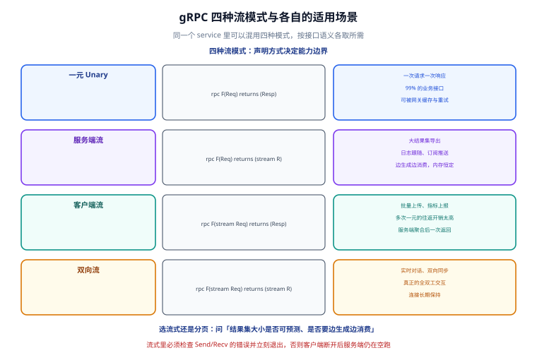

# gRPC 与 Protobuf 工程化

一句话定位：gRPC 是**把接口定义变成编译期约束**的一套工程方法。它的核心不是「性能好」，而是「改了 proto 就一定有人编译不过」——这条约束让跨团队的服务调用从「靠文档对字段」变成「靠编译器对字段」。



## 一、proto3 语法：只讲工程里真用得上的部分

### 文件骨架

```protobuf [api/order/v1/order.proto]
syntax = "proto3";                 // 必须第一行，proto3 是唯一推荐语法

package order.v1;                  // 语义版本化包名，隔离不同大版本的接口
option go_package = "example.com/shop/api/order/v1;orderv1";

import "google/protobuf/timestamp.proto";   // 用标准类型代替自己造时间戳
import "google/protobuf/empty.proto";

// 一个文件一个「领域」，不要把所有接口堆在一个 proto 里
service OrderService {
  rpc CreateOrder(CreateOrderRequest) returns (CreateOrderReply);
  rpc GetOrder(GetOrderRequest) returns (GetOrderReply);
  rpc ListOrders(ListOrdersRequest) returns (stream Order);   // 服务端流
}
```

### 标量类型对照

| proto3 类型 | Go 类型 | JSON 表现 | 备注 |
| --- | --- | --- | --- |
| `int32` / `int64` | `int32` / `int64` | **字符串** | `int64` 在 JSON 里是字符串，前端要转 |
| `uint32` / `uint64` | `uint32` / `uint64` | 字符串 | 同上 |
| `float` / `double` | `float32` / `float64` | number | 不适用于金额 |
| `string` | `string` | string | 二进制内容不要用 |
| `bool` | `bool` | bool | — |
| `bytes` | `[]byte` | base64 | base64 会膨胀 33% |
| `google.protobuf.Timestamp` | `*timestamppb.Timestamp` | RFC 3339 字符串 | 时间统一用它，别用 `int64` |
| `google.protobuf.Duration` | `*durationpb.Duration` | 字符串（如 `"1.5s"`） | 超时、间隔用它 |

::: danger 注意：金额绝对不要用 float / double
`0.1 + 0.2 != 0.3` 不是语言问题，是 IEEE 754 的事实。金额一律用**最小货币单位的整数**：`int64 amount_cents = 3; // 单位：分`，并在字段注释里写清单位。跨语言调用时 `float` 的精度表现还会随编解码器不同而变化，问题只在生产对账时才暴露。
:::

### 字段编号的三条铁律

字段编号（`= 1`）是**编码进二进制**的，改一次就等于改协议：

1. **编号 1~15 用一个字节编码，16 以上用两个字节**：把最常用的字段放在 1~15，能省 1 字节/字段/消息。
2. **上线后的编号永不复用、永不改语义**：删除字段时必须写 `reserved`。
3. **`reserved` 要写编号，也要写字段名**：编号防复用，名字防后人重命名后又被加回来。

```protobuf
message Order {
  reserved 4, 7;
  reserved "legacy_status", "old_user_id";

  int64  order_id     = 1;
  int64  user_id      = 2;
  int64  amount_cents = 3;   // 单位：分
  string currency     = 5;   // ISO 4217，如 "CNY"
  OrderStatus status  = 6;
}
```

### 枚举必须有 0 值

proto3 里枚举的默认值是 `0`，而且**不能是第一个以外的值**（第一个枚举必须编号为 0）。所以约定：`0` 一律表示「未指定」。

```protobuf
enum OrderStatus {
  ORDER_STATUS_UNSPECIFIED = 0;   // 必须有，且必须在第一位
  ORDER_STATUS_CREATED     = 1;
  ORDER_STATUS_PAID        = 2;
}
```

命名加前缀（`ORDER_STATUS_`）是为了避免**枚举值在同一 package 内冲突**——proto3 的枚举常量作用域是包级而非类型级，两个枚举都叫 `CREATED` 会直接编译失败。

### 可选、重复与 oneof

| 写法 | 语义 | Go 侧表现 | 什么时候用 |
| --- | --- | --- | --- |
| `string name = 1;` | 默认值不可区分（空串 == 未设置） | `string` | 不需要区分「没传」和「传空」 |
| `optional string name = 1;` | 显式存在性 | `*string` | 部分更新（PATCH）场景 |
| `repeated string tags = 1;` | 列表 | `[]string` | 允许空列表 |
| `map<string, string> labels = 1;` | 映射 | `map[string]string` | 标签、元数据；**键不能是 float/bytes** |
| `oneof body { ... }` | 互斥联合 | 接口 + 包装类型 | 事件/消息的多种变体 |

::: warning 说明：`optional` 是 proto3 后期才补回来的
proto3 最初去掉了 `optional`，导致「空串」和「未设置」无法区分，社区反对后才以「显式存在性」的形式加回来（需要 protoc ≥ 3.15）。**在部分更新接口里，`optional` 是必须的**：否则「把 name 改成空串」这个合法操作没法表达。
:::

## 二、代码生成：一条命令背后的两个插件

### 工具链

```shell
# 1. protoc 本体（或用 buf 替代，见下）
#    Windows 用 choco/scoop 装，macOS 用 brew install protobuf
protoc --version                  # 期望：libprotoc 3.x / 2x.x

# 2. 两个插件必须版本匹配，否则生成的代码类型对不上
go install google.golang.org/protobuf/cmd/protoc-gen-go@latest
go install google.golang.org/grpc/cmd/protoc-gen-go-grpc@latest

# 3. 确认它们能被 protoc 找到（$GOBIN 或 $GOPATH/bin 必须在 PATH 里）
which protoc-gen-go protoc-gen-go-grpc
```

### 生成命令

```makefile [Makefile]
PROTO_DIR := api
OUT_DIR   := api

.PHONY: proto
proto:
	protoc -I $(PROTO_DIR) \
	  --go_out=$(OUT_DIR) --go_opt=paths=source_relative \
	  --go-grpc_out=$(OUT_DIR) --go-grpc_opt=paths=source_relative \
	  $(shell find $(PROTO_DIR) -name '*.proto')
```

两个插件的分工要分清：

| 生成文件 | 由谁生成 | 里面有什么 |
| --- | --- | --- |
| `order.pb.go` | `protoc-gen-go` | message 结构体、`Reset/String/ProtoReflect`、字段 getter |
| `order_grpc.pb.go` | `protoc-gen-go-grpc` | `OrderServiceClient` / `OrderServiceServer` 接口、`RegisterOrderServiceServer` |

`--go-grpc_opt=require_unimplemented_servers=false` 这个选项常被抄进脚本，但**它是反模式**：不加时，proto 新增方法会让所有实现类编译失败（这正是我们想要的——强制每个实现都处理新方法）；加了以后新方法会静默走「未实现」分支，线上表现为 `Unimplemented` 错误。

### 用 buf 替代裸 protoc

```yaml [buf.yaml]
version: v2
modules:
  - path: api
lint:
  use:
    - STANDARD          # 官方推荐的命名与结构规范
breaking:
  use:
    - FILE              # 兼容性检查粒度
```

```yaml [buf.gen.yaml]
version: v2
plugins:
  - local: protoc-gen-go
    out: api
    opt: paths=source_relative
  - local: protoc-gen-go-grpc
    out: api
    opt: paths=source_relative
```

```shell
buf lint              # 命名规范检查
buf breaking --against '.git#branch=main'   # 契约破坏性变更检查
buf generate          # 等价于上面那条冗长的 protoc
```

::: tip 为什么值得引入 buf
`buf breaking` 是**唯一能在 CI 里自动拦住「改了字段编号」「删了字段没 reserved」这类事故**的工具。人在 review proto 时几乎看不出编号被人动过，但 `buf breaking` 一条命令就能判定。契约层的事故成本远高于工具引入成本，这一条就够回本。
:::

## 三、四种流模式

| 模式 | 声明 | 典型场景 | 为什么不用普通请求 |
| --- | --- | --- | --- |
| **一元（Unary）** | `rpc F(Req) returns (Resp)` | 99% 的业务接口 | — |
| **服务端流** | `rpc F(Req) returns (stream Resp)` | 大结果集导出、日志跟随、订阅推送 | 一次性返回会 OOM 或超时 |
| **客户端流** | `rpc F(stream Req) returns (Resp)` | 批量上传、指标上报、分片聚合 | 多次一元的网络往返开销太高 |
| **双向流** | `rpc F(stream Req) returns (stream Resp)` | 实时对话、双向同步、长连接游戏 | 需要真正的全双工交互 |

### 服务端流骨架

```go [internal/server/stream.go]
func (s *OrderServer) ListOrders(req *pb.ListOrdersRequest, stream pb.OrderService_ListOrdersServer) error {
    // 游标分批读，每批 200 条就发一次，内存占用与总量无关
    var cursor int64
    for {
        rows, next, err := s.repo.Page(stream.Context(), req.UserId, cursor, 200)
        if err != nil {
            return status.Errorf(codes.Internal, "分页查询失败: %v", err)
        }
        for _, r := range rows {
            if err := stream.Send(toProto(r)); err != nil {
                // Send 失败通常是客户端已断开，直接返回，不要继续读库
                return err
            }
        }
        if next == 0 {
            return nil
        }
        cursor = next
    }
}
```

::: danger 注意：流里必须检查 `Send` 的错误并立刻退出
`stream.Send` 返回 `nil` 只代表「写进了本地缓冲」。客户端断开时，错误会在**后续某次** Send 或 Recv 上暴露。如果忽略这个错误继续循环，服务端会**一直在读库、生成数据、丢弃数据**——CPU 打满而日志没有任何异常。
:::

### 流式还是分页？

判据就一条：**结果集大小是否可预测、是否需要边生成边消费**。

- 结果集可预测（有 `total`，通常 < 1 万条）→ **分页**。分页可以被网关缓存、可以重试、可以在浏览器上用 `curl` 调。
- 结果集不可预测（导出全量、实时事件）→ **服务端流**。

## 四、错误处理与状态码

gRPC 不用 HTTP 状态码，用自己的 `codes.Code`（共 17 个）。映射关系与「谁写错了」的判断：

| gRPC 状态码 | HTTP 类比 | 该由谁修 | 典型触发 |
| --- | --- | --- | --- |
| `OK` (0) | 200 | — | 正常 |
| `InvalidArgument` | 400 | **调用方** | 参数校验失败 |
| `Unauthenticated` | 401 | 调用方 | Token 缺失/过期 |
| `PermissionDenied` | 403 | 调用方/管理员 | 有身份但无权限 |
| `NotFound` | 404 | 调用方 | 资源不存在 |
| `AlreadyExists` | 409 | 调用方 | 唯一键冲突 |
| `FailedPrecondition` | 400 | 调用方 | 状态机不允许（如已支付的订单不能再支付） |
| `ResourceExhausted` | 429 | 双方 | 限流、配额耗尽 |
| `Aborted` | 409 | **调用方重试** | 并发冲突（乐观锁失败） |
| `Unavailable` | 503 | **服务端** | 实例不可达、正在重启 |
| `DeadlineExceeded` | 504 | 双方 | 超时 |
| `Internal` | 500 | **服务端** | 代码 bug |
| `Unimplemented` | 501 | 服务端 | 接口未实现 / 版本不匹配 |

::: tip 用这套码表做两件事
1. **决定要不要重试**：只有 `Unavailable`、`Aborted`、`ResourceExhausted`（配合退避）值得重试；`InvalidArgument` 重试一万次也还是失败。
2. **决定告警等级**：`Internal` 与 `Unavailable` 计入错误率告警；`InvalidArgument` 属于正常业务拒绝，**不能计入 SLO 错误率**——否则大促时用户输错手机号就能触发告警。
:::

### 返回错误的正确写法

```go
import "google.golang.org/grpc/status"
import "google.golang.org/grpc/codes"

func (s *OrderServer) GetOrder(ctx context.Context, req *pb.GetOrderRequest) (*pb.GetOrderReply, error) {
    if req.OrderId == 0 {
        return nil, status.Error(codes.InvalidArgument, "order_id 不能为空")
    }
    o, err := s.repo.Find(ctx, req.OrderId)
    if errors.Is(err, sql.ErrNoRows) {
        return nil, status.Errorf(codes.NotFound, "订单 %d 不存在", req.OrderId)
    }
    if err != nil {
        // 对内保留原始错误（日志里能看到详情），对外只给通用文案
        logx.Errorf("查询订单失败 order_id=%d err=%v", req.OrderId, err)
        return nil, status.Error(codes.Internal, "服务内部错误")
    }
    return toProto(o), nil
}
```

::: danger 注意：不要把数据库错误原文透传给调用方
`status.Errorf(codes.Internal, "%v", err)` 会把 `Error 1054: Unknown column 'user_id' in 'field list'` 这类信息发给上游，等于**把表结构泄漏给所有内部服务**，而且这些错误会直接进上游日志与告警，看起来像上游的问题。**内部错误一律换成通用文案，详情只进本地日志。**
:::

## 五、拦截器：横切逻辑的唯一入口

拦截器（interceptor）等价于 HTTP 中间件，分 unary 与 stream 两套，**服务端与客户端各有一套**。

```go [internal/interceptor/interceptor.go]
// 服务端一元拦截器：拼装日志字段 + 兜底 recover
func UnaryRecover(logger logx.Logger) grpc.UnaryServerInterceptor {
    return func(ctx context.Context, req any, info *grpc.UnaryServerInfo,
        handler grpc.UnaryHandler) (resp any, err error) {
        // 1. 先 recover，保证任何 panic 都不会把整个进程带走
        defer func() {
            if r := recover(); r != nil {
                logger.Errorf("panic in %s: %v\n%s", info.FullMethod, r, debug.Stack())
                err = status.Error(codes.Internal, "服务内部错误")
            }
        }()
        // 2. 记录耗时与结果码
        start := time.Now()
        resp, err = handler(ctx, req)
        logger.Infow("rpc", logx.Field("method", info.FullMethod),
            logx.Field("cost_ms", time.Since(start).Milliseconds()),
            logx.Field("code", status.Code(err).String()))
        return resp, err
    }
}
```

### 链式组合与顺序

```go
s := grpc.NewServer(
    grpc.ChainUnaryInterceptor(
        interceptor.UnaryRecover(logger),   // 最外层：兜底所有 panic
        interceptor.UnaryTrace(),           // 其次：先把 trace 打上，后面所有日志都带 trace_id
        interceptor.UnaryTimeout(),         // 再次：设置超时
        interceptor.UnaryAuth(),            // 最后：鉴权（失败要记进 trace）
    ),
    grpc.ChainStreamInterceptor(interceptor.StreamRecover(logger)),
)
```

::: danger 注意：拦截器顺序写反的两个后果
1. **`recover` 不在最外层**：内层拦截器里的 panic 会直接终止进程，`ChainUnaryInterceptor` 的 `recover` **只能兜住它之后注册的那些**。
2. **`trace` 不在最前**：鉴权失败时（最外层返回）日志里没有 `trace_id`，这类「最需要排查」的请求恰恰找不到链路。
:::

### 客户端拦截器：超时与重试的落点

```go
func UnaryTimeout(d time.Duration) grpc.UnaryClientInterceptor {
    return func(ctx context.Context, method string, req, reply any,
        cc *grpc.ClientConn, invoker grpc.UnaryInvoker, opts ...grpc.CallOption) error {
        // 若上游已设更短的 deadline，取更短的那个（绝不延长）
        if dl, ok := ctx.Deadline(); ok && time.Until(dl) < d {
            return invoker(ctx, method, req, reply, cc, opts...)
        }
        ctx, cancel := context.WithTimeout(ctx, d)
        defer cancel()
        return invoker(ctx, method, req, reply, cc, opts...)
    }
}
```

**「绝不延长上游 deadline」这一条必须写进代码**。否则上游设了 100 ms 超时、下游各自设 2 s，上游早就超时返回了，下游还在跑，形成**雪崩式的无效计算**。

## 六、常见问题与排错

::: tip 三个高频问题的定位命令
1. **「连接不上」** → `grpcurl -plaintext -v 127.0.0.1:8080 list`（`list` 依赖反射）。如果报 `server does not support the reflection API`，说明**服务是活的**，只是关了反射，不是网络问题。
2. **「请求很大/很小」** → gRPC 默认单条消息上限 **4 MB**（发送端 `MaxCallRecvMsgSize` / 接收端 `MaxSendMsgSize`）。超限报 `ResourceExhausted: grpc: received message larger than max`。修法优先是**改成分页或流式**，其次才是调大上限。
3. **「偶发 `Unavailable: connection error: desc = transport: Error while dialing`」** → 通常是服务端在滚动重启，或 keepalive 探活把空闲连接回收了。检查 `grpc.KeepaliveParams(keepalive.ServerParameters{...})` 与客户端的 `WithBlock` / 重试策略。
:::

::: danger 注意：四个必踩的坑
1. **proto 里用 `int64` 传 JSON 给前端**：`int64` 在 JSON 里是字符串，前端 `==` 比较或做算术前必须 `BigInt`/`Number()`，否则「订单号最后几位对不上」。跨端接口用 `string` 传 ID 更省事。
2. **proto 文件被复制而不是被引用**：两个仓库各存一份 `order.proto`，改了 A 没改 B，运行时字段静默丢失（proto3 对未知字段是**忽略**而不是报错）。正确做法是**单一来源**（独立 proto 仓库或 Go module 形式引用）。
3. **`proto3` 的未知字段会被保留**：从 v3.5 起未知字段不再被丢弃，而是原样保留。这既是好事（向前兼容）也是陷阱（**字段被删了但消息里还带着，抓包能看到**）。
4. **用 `map` 传需要顺序的列表**：`map` 的迭代顺序随机，且序列化后不保证稳定。需要顺序就用 `repeated` + 显式排序字段。
:::

## 七、验证方式

```shell
# 1. 生成代码，确认没有未提交的差异（契约与代码同步）
make proto && git status --porcelain api/ | grep . && echo "有未提交的生成物，请先提交" || echo "生成物已同步"

# 2. 检查契约兼容性（buf 项目才有）
buf breaking --against '.git#branch=main' && echo "契约兼容"

# 3. 冒烟：调用一次一元接口
grpcurl -plaintext -d '{"order_id":1}' 127.0.0.1:8080 order.v1.OrderService/GetOrder

# 4. 冒烟：服务端流（用 -d 触发一次列出）
grpcurl -plaintext -d '{"user_id":1}' 127.0.0.1:8080 order.v1.OrderService/ListOrders
# 期望：连续输出多条 JSON，直到返回 nil
```

## 参考资料

- [Protocol Buffers Language Guide (proto3)](https://protobuf.dev/programming-guides/proto3/)
- [Protobuf 字段编号与兼容性规则](https://protobuf.dev/programming-guides/proto3/#updating)
- [gRPC 官方：状态码与错误处理](https://grpc.io/docs/guides/status-codes/)
- [gRPC-Go：拦截器文档](https://pkg.go.dev/google.golang.org/grpc#UnaryServerInterceptor)
- [buf 官方文档：breaking change detection](https://buf.build/docs/breaking/overview)
- [gRPC 官方：性能最佳实践](https://grpc.io/docs/guides/performance-best-practices/)

## 相关页面

- [Go 微服务概述与选型](../Overview/index.md) —— 先定「该不该拆、用什么协议」
- [服务治理：注册发现到可观测](../Governance/index.md) —— 拦截器里接进去的治理能力在那一页展开
- [网络编程：自定义协议设计](../../NetworkProgramming/ProtocolDesign/index.md) —— 不用 gRPC 时自己设计二进制协议的取舍
- [网络编程：粘包拆包与编解码](../../NetworkProgramming/StickyHalf/index.md) —— 为什么 HTTP/2 分帧能绕开这个问题
