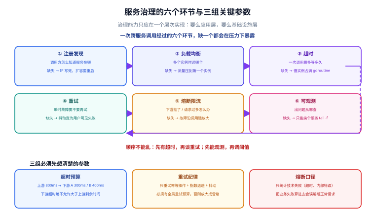

# 服务治理：注册发现到可观测

一句话定位：服务治理就是**给「一次跨进程调用」加上六个保护环节**——找到它、选一个实例、限制它能花多久、失败时要不要再试、它快挂了要不要先断开、出问题怎么定位。少了任何一个环节，分布式系统都会在压力下变成一片「偶发 5xx」。



## 一、六个环节，各自的失效后果

| 环节 | 解决什么 | 缺失后的表现 |
| --- | --- | --- |
| **注册发现** | 调用方怎么知道服务在哪 | IP 写死在配置里，扩容/迁移要改配置重启 |
| **负载均衡** | 多个实例时选哪个 | 全部流量压到第一个实例，其他实例闲着 |
| **超时** | 一次调用最多等多久 | 慢实例把调用方的 goroutine/连接全部占满 |
| **重试** | 瞬时故障要不要再试 | 网络抖动直接变成用户可见失败 |
| **熔断 / 限流** | 下游挂了怎么办 | 下游故障沿调用链放大成雪崩 |
| **可观测** | 出了问题从哪查 | 只能挨个服务 `tail -f`，跨服务对不上请求 |

## 二、注册发现：三种模式

| 模式 | 工作原理 | 代表 | 优点 | 代价 |
| --- | --- | --- | --- | --- |
| **客户端发现** | 调用方从注册中心拉实例列表，自己选 | etcd / Consul / Nacos + gRPC resolver | 少一跳、延迟最低、可自定义 LB | 每种语言都要实现一套客户端 |
| **服务端发现** | 调用方请求一个固定入口，由它转发 | K8s Service + kube-proxy、Nginx、网关 | 客户端极简，语言无关 | 多一跳；转发层要足够强 |
| **DNS 发现** | 用域名解析出多个 A 记录 | K8s Headless Service | 零依赖，任何客户端都能用 | 依赖 DNS 缓存 TTL；故障摘除慢 |

::: tip 选型结论（Go 生态）
- **跑在 K8s 里** → 优先用 **K8s Service + 客户端直连**：`grpc.Dial("order-svc:8080")`，让 kube-proxy 做发现，Go 侧只需要配 `round_robin` 或 `least_request`。
- **跑在虚机/裸机、或需要跨集群** → 用 **etcd / Nacos + 客户端 resolver**。etcd 与 Go 生态最贴（Kratos 默认支持），Nacos 与 Java 侧 Spring Cloud 打通更好。
- **需要按环境/机房分流** → 用注册中心给实例打 **metadata 标签**，客户端 resolver 里做过滤，比在业务代码里写 `if env == "gray"` 干净得多。
:::

### 健康检查：主动 vs 被动

| 方式 | 做法 | 优点 | 缺点 |
| --- | --- | --- | --- |
| **主动探测** | 注册中心定期 `GET /health` | 实现简单，与业务解耦 | 间隔期内仍会被打流量；探测本身有成本 |
| **被动摘除** | 调用方连续失败 N 次则临时摘掉该实例 | 实时反映真实可用性 | 每个客户端各自维护，状态不一致 |

生产上**两者都要**：主动探测负责「实例进程挂掉」，被动摘除负责「实例进程活着但处理不了请求」（比如连接池耗尽、依赖挂掉）。K8s 里的对应物是 `readinessProbe`（主动）+ `readinessGate` / 客户端健康检查（被动）。

### 优雅上下线

```go
// 启动：先起监听，再注册（顺序反了会有「注册了但还没准备好接流量」的空窗）
lis, err := net.Listen("tcp", ":8080")
if err != nil { logx.Fatal(err) }
go s.Serve(lis)
// 等 Serve 起来后再注册——这一步通常由框架的 Start() 内部完成
```

```go
// 退出：先摘除，留出让调用方刷新列表的时间，再停止服务
<-signalChan
logx.Info("收到退出信号，先从注册中心摘除")
s.Deregister()                      // 1. 摘除
time.Sleep(3 * time.Second)         // 2. 等调用方的实例列表刷新（> 注册中心推送延迟）
s.GracefulStop()                    // 3. 停止接新请求，等存量请求结束
```

::: danger 注意：退出的三步顺序不能省
最常见的事故是「收到 `SIGTERM` 直接 `os.Exit`」，表现为**每次发布都有一批 5xx**。三步缺一不可：
- 少了第 1 步（不摘除）→ 调用方还在往这个实例发新请求，必然失败；
- 少了第 2 步（不等待）→ 调用方本地缓存的实例列表还没更新；
- 少了第 3 步（`GracefulStop` 换成 `Stop`）→ 正在处理的请求被直接切断，长连接场景尤其明显。

另外 K8s 的 `preStop` hook 里加一句 `sleep 5` 是最省事的兜底，因为 `SIGTERM` 与端点摘除是**并发**进行的，不保证先摘后停。
:::

## 三、负载均衡：长连接下的陷阱

### 常用策略

| 策略 | 逻辑 | 适用 | 不适用 |
| --- | --- | --- | --- |
| 轮询（round_robin） | 依次分配 | 实例性能相近、请求耗时均匀 | 实例异构 |
| 随机（random） | 随机选 | 实例数量大时接近均匀 | 实例少时抖动明显 |
| 加权（weighted） | 按权重分配 | 灰度发布、实例规格不同 | 权重需人工维护 |
| 最少请求（least_request） | 选当前在途请求最少的 | 请求耗时差异大（最推荐） | 需维护在途计数 |
| P2C（Power of Two Choices） | 随机取两个，选在途少的 | 大规模集群，开销与效果兼顾 | — |
| 一致性哈希 | 同一个 key 固定落到同一实例 | 需要本地缓存命中率 | 实例变动会引起大面积重分布 |

::: tip 默认怎么选
**先 `least_request`，观察一段时间再决定要不要换**。它的效果在「请求耗时分布不均匀」的真实业务里明显优于轮询；代价只是每个客户端维护一个计数器。只有两种例外：需要缓存亲和性（用一致性哈希）、实例规格差异大（用加权）。
:::

### 陷阱：HTTP/2 长连接让 LB 失效

gRPC 默认一条连接常驻复用。此时如果 LB 是做在**连接层**（比如 L4 的 IPVS、Nginx 的 `stream` 模块），那么：

- 客户端只建了 **1 条** TCP 连接；
- LB 只能把这条连接固定转发到 **1 个** 后端实例；
- 结果：**100 个客户端只用到 100 个后端实例中的一小部分**，扩容完全无效。

三种解法：

| 解法 | 做法 | 代价 |
| --- | --- | --- |
| **客户端侧轮询** | Go 里用 `grpc.WithDefaultServiceConfig('{"loadBalancingConfig":[{"round_robin":{}}]}')` + **解析到多个地址**（Headless Service 或客户端 resolver） | 需要客户端能拿到全部实例地址 |
| **L7 代理** | 用 Envoy / Nginx（HTTP/2 感知）做 LB，它按**请求**而不是按连接转发 | 多一跳；需要维护代理层 |
| **强制短连接** | `keepalive` 设置较短的空闲时间，让连接定期重建 | 治标不治本，连接建立开销增加 |

::: danger 注意：`grpc.Dial` 的目标必须解析出多个地址
只写 `grpc.Dial("order-svc:8080")` 时，Go 的默认 resolver 走 DNS，而 **DNS 通常只返回一个 VIP**，`round_robin` 拿到一个地址自然就只能轮询一个。想真正做客户端 LB，目标要写成 `dns:///order-svc-headless.default.svc.cluster.local:8080`（Headless Service 返回多个 Pod IP），或直接用注册中心 resolver（etcd/Nacos）。**这条不做，配 `round_robin` 也是白配。**
:::

## 四、超时：超时预算要逐跳递减

超时不是「每层各设一个值」，而是**一个总预算从上游往下游逐跳扣减**。

```go
// 入口（HTTP 层）：为整个请求设总预算
ctx, cancel := context.WithTimeout(r.Context(), 800*time.Millisecond)
defer cancel()

// 调用下游 A：给它 300 ms（从剩余预算里切一块）
ctxA, cancelA := context.WithTimeout(ctx, 300*time.Millisecond)
defer cancelA()
resA, err := orderClient.Get(ctxA, req)

// 调用下游 B：给它 400 ms
ctxB, cancelB := context.WithTimeout(ctx, 400*time.Millisecond)
defer cancelB()
```

预算配置示例（入口 800 ms）：

| 层 | 超时 | 说明 |
| --- | --- | --- |
| 网关 → 服务 | 800 ms | 总预算 |
| 服务 → 下游 A（查用户） | 300 ms | 依赖项，通常有缓存，可以紧 |
| 服务 → 下游 B（扣库存） | 400 ms | 写操作，留余量 |
| 服务 → DB | 200 ms | 有索引的查询 |
| 服务 → Redis | 50 ms | 内存操作，超过就是有问题 |

::: danger 注意：下游超时绝不允许大于上游剩余时间
如果上游还剩 100 ms，下游却设了 1 s，那么上游超时返回后，下游还在跑 900 ms 的无效计算，还会继续占用连接、CPU 和 DB 连接。**这就是雪崩的起点**。正确做法是在客户端拦截器里统一处理：**取 `min(配置值, 上游剩余时间)`**，见 [gRPC 篇的客户端超时拦截器](../GRPC/index.md)。

另一个常见错误是**只给 HTTP 层设超时，gRPC 调用不带 ctx**。gRPC 里 `ctx` 就是超时载体，不传就等于永不超时。
:::

## 五、重试：三个必须同时满足的条件

重试是「用放大流量换成功率」，用错了会把小故障放大成雪崩。

### 条件一：只重试幂等操作

| 可重试 | 不可重试（或必须先做幂等） |
| --- | --- |
| `GetOrder`、`ListOrders` | `CreateOrder`（除非带幂等键） |
| `CheckStock` | `DeductStock`（必须带业务唯一键） |
| 状态码 `Unavailable` / `Aborted` | 状态码 `InvalidArgument` / `NotFound` |

### 条件二：指数退避 + 抖动

```go
// 不用第三方库的最小实现
func backoff(attempt int) time.Duration {
    base := 20 * time.Millisecond
    d := base << attempt                          // 20ms, 40ms, 80ms ...
    if d > 500*time.Millisecond { d = 500 * time.Millisecond }
    // 加抖动：避免所有客户端在同一时刻重试（惊群）
    return d + time.Duration(rand.Int63n(int64(d/2)))
}
```

### 条件三：全局重试预算

**单点重试上限不够，必须限制「整个请求链路的放大倍数」**。否则三层调用各重试 3 次，一次用户请求会变成 `3×3×3 = 27` 次后端调用。

| 控制手段 | 配置 | 效果 |
| --- | --- | --- |
| 单次调用重试次数 | `maxAttempts = 3` | 限制单跳放大 |
| 链路总重试次数 | `maxRetries = 4`（跨跳共享计数） | 限制整体放大 |
| 重试比例 | 重试流量 ≤ 总流量的 10%，超过就不再重试 | 故障期间保护后端 |

gRPC 内置的重试策略通过服务配置下发：

```json
{
  "methodConfig": [{
    "name": [{"service": "order.v1.OrderService", "method": "GetOrder"}],
    "retryPolicy": {
      "maxAttempts": 3,
      "initialBackoff": "0.02s",
      "maxBackoff": "0.5s",
      "backoffMultiplier": 2,
      "retryableStatusCodes": ["UNAVAILABLE", "ABORTED"]
    },
    "timeout": "0.3s"
  }]
}
```

::: danger 注意：重试必须是幂等的，且要有服务端配合
只靠客户端重试是危险的。正确组合是：**客户端重试 + 服务端幂等键**。
- 写接口带 `idempotency_key`（通常用业务单号），服务端在 Redis 里 `SETNX` 记录「这个键已处理」，重复请求直接返回上次结果。
- 没有幂等键的重试，在生产上表现为**用户被扣两次钱**——这是重试类事故里最常见的一种。
:::

## 六、熔断与限流：保护的是「调用方」和「被调用方」

两者方向不同：

| 能力 | 保护谁 | 触发条件 | 恢复方式 |
| --- | --- | --- | --- |
| **熔断（Circuit Breaking）** | **调用方**（不被慢下游拖死） | 连续失败/慢调用比例超阈值 | 半开状态放少量请求探测 |
| **限流（Rate Limiting）** | **被调用方**（不被过量请求压垮） | 请求速率超阈值 | 速率回落后自动恢复 |

### 熔断三态

```text
关闭（Closed）──失败率 > 50%（统计窗口 10s 内，且请求数 > 20）──▶ 打开（Open）
     ▲                                                                │
     │                                                         冷却 5~10s
     │                                                                ▼
     └────连续 5 个探测请求全部成功───────────────────────── 半开（Half-Open）
```

参数经验值（go-zero 的 `Breaker` 与 Sentinel 的默认值都在这个量级）：

| 参数 | 建议值 | 理由 |
| --- | --- | --- |
| 统计窗口 | 10 s | 太短抖动大，太长反应慢 |
| 最小请求数 | 20 | 请求太少时失败率没有统计意义 |
| 失败率阈值 | 50% | 低于这个值通常说明是正常业务失败 |
| 冷却时间 | 5~10 s | 给下游恢复的时间 |
| 半开探测数 | 5 | 太少容易误判，太多会二次冲击 |

::: warning 说明：注意区分「业务失败」与「技术失败」
熔断只应统计**技术失败**（超时、连接失败、`Internal`），**不能把 `InvalidArgument`、`NotFound` 这类业务失败算进失败率**。否则一个「订单不存在」比例较高的接口会被熔断，正常请求全部被拒。实现上就是在拦截器里按 `status.Code` 过滤后再喂给熔断器。
:::

### 限流算法对照

| 算法 | 突发流量 | 实现复杂度 | 适用 |
| --- | --- | --- | --- |
| 计数器（固定窗口） | 窗口边界可双倍放行 | 最低 | 粗粒度、无所谓突发的场景 |
| 滑动窗口 | 平滑，无边界问题 | 中（Redis ZSET 或分片计数） | 通用首选 |
| 令牌桶 | **允许突发**（有桶容量） | 中 | 面向用户的 API（允许短时突发） |
| 漏桶 | **严格匀速**，不允突发 | 中 | 保护脆弱下游（如第三方接口） |
| 自适应限流 | 随系统负载自动调整阈值 | 高 | 大流量核心服务（如 go-zero 的 `Load` 自适应降载） |

::: tip 限流一定要放在「最外层」
限流的位置决定它保护谁。放在**网关**保护整个集群；放在**服务入口拦截器**保护单个服务；放在**下游调用点**保护特定依赖。**三层往往都需要**，但阈值必须满足 `网关 > 服务入口 > 下游调用点`，否则会出现「内层先拒绝，外层还在拼命放行」的浪费。
:::

## 七、可观测：一条请求要能被串起来

三支柱的分工与各自的「最小可用配置」：

| 支柱 | 回答什么 | 关键字段 | Go 侧实现 |
| --- | --- | --- | --- |
| **Trace** | 这个请求经过了哪些服务、每段多久 | `trace_id`、`span_id`、`parent_span_id` | OpenTelemetry + gRPC 拦截器 |
| **Metrics** | 整体健康度与趋势 | `qps`、`latency_p99`、`error_ratio` | Prometheus `/metrics` |
| **Logs** | 这一条请求具体发生了什么 | `trace_id` + 结构化字段 | `logx` / `slog` + JSON |

### trace_id 怎么跨进程传递

gRPC 用 **metadata**（等价于 HTTP Header）传。关键是**服务端从 metadata 里取、客户端往 metadata 里塞**，这两个动作都在拦截器里做，业务代码不需要知道：

```go
// 客户端：把上游的 trace_id 塞进 metadata
func UnaryTraceInject() grpc.UnaryClientInterceptor {
    return func(ctx context.Context, method string, req, reply any,
        cc *grpc.ClientConn, invoker grpc.UnaryInvoker, opts ...grpc.CallOption) error {
        if tid := traceIDFromCtx(ctx); tid != "" {
            ctx = metadata.AppendToOutgoingContext(ctx, "x-trace-id", tid)
        }
        return invoker(ctx, method, req, reply, cc, opts...)
    }
}
```

::: danger 注意：`metadata` 的 key 会被强制转小写
gRPC 规范要求 metadata 的 key 是**小写 ASCII**。写 `X-Trace-Id` 后读取时用 `X-Trace-Id` 是取不到的，必须用 `x-trace-id`。建议只在**一处**定义常量，避免大小写不一致导致的「有时能取到有时取不到」。
:::

### Metrics 的命名与 RED 方法

Go 服务暴露的指标不需要很多，**RED 三件套**覆盖 90% 的告警需求：

```text
# TYPE rpc_server_requests_total counter        # Rate：请求总数
rpc_server_requests_total{service="order",method="/order.v1.OrderService/GetOrder",code="OK"} 12345

# TYPE rpc_server_request_duration_seconds histogram   # Duration：耗时分布
rpc_server_request_duration_seconds_bucket{...le="0.01"} 8000
rpc_server_request_duration_seconds_bucket{...le="0.1"}  12000

# TYPE rpc_server_errors_total counter          # Errors：按错误码分
rpc_server_errors_total{service="order",code="Internal"} 3
```

::: tip 基线设定的可验证做法
**告警阈值从真实压测基线来，不要拍脑袋**。做法：压测拿到拐点 TPS 与 p99，把告警线设在 `p99 × 1.5`、错误率设在 `0.5%`（因为 0.5% 通常还不是用户可感知的量级）。这条与项目侧的容量拐点方法论同源，见 [性能测试](../../../../project/Base/BackendTemplate/PerformanceTest/index.md)。
:::

## 八、常见问题与排错

| 现象 | 高概率原因 | 定位手段 |
| --- | --- | --- |
| 扩容后 QPS 不变 | L4 代理 + HTTP/2 长连接，流量全落到少数实例 | 看各实例连接数是否均匀：`ss -tn state established \| wc -l` |
| 偶发 5xx，重启后消失 | 滚动更新时未优雅退出 | 看发布时间点与错误时间点是否重合 |
| 耗时随并发上升而雪崩 | 某处没有超时，goroutine 堆积 | `curl :9999/debug/pprof/goroutine?debug=1` 看 goroutine 数 |
| 重试把下游打死 | 无退避/无预算 | 看下游 QPS 是否出现「故障时反而上升」 |
| 熔断后一直不恢复 | 半开探测也被计入失败率 | 检查熔断器的统计口径是否包含业务错误 |
| 日志里 trace_id 缺失 | trace 拦截器顺序靠后，鉴权失败早退 | 调整链路顺序（见 [gRPC 篇](../GRPC/index.md)） |

## 九、验证方式

```shell
# 1. 注册发现：确认实例列表能被拉到
curl -s http://127.0.0.1:2379/v3/kv/range -X POST \
  -d '{"key":"L29yZGVyLw==","range_end":"L29yZGVyMA=="}' | head -c 400
# 期望：返回 order/ 前缀下的实例 JSON

# 2. 负载均衡：请求 20 次，确认落到多个实例
for i in $(seq 1 20); do curl -s http://127.0.0.1:8888/whoami; done | sort | uniq -c
# 期望：每个实例计数接近 5（4 个实例、20 次请求）

# 3. 超时：下游 sleep 2s，确认 300ms 就返回
time curl -s http://127.0.0.1:8888/slow
# 期望：约 0.3s 返回，状态码 504 / DeadlineExceeded

# 4. 熔断：连续打 30 个失败请求，再打 1 个正常请求
# 期望：第 31 个请求被熔断器直接拒绝（错误码 Unavailable），不再等待超时

# 5. 指标：确认三支柱有数据
curl -s http://127.0.0.1:9999/metrics | grep -E '^rpc_server_(requests|errors|request_duration)' | head
```

## 参考资料

- [gRPC 官方：负载均衡与重试策略](https://grpc.io/docs/guides/retry/)
- [gRPC-Go：服务配置（Service Config）参考](https://github.com/grpc/grpc/blob/master/doc/service_config.md)
- [Envoy：熔断与限流配置](https://www.envoyproxy.io/docs/envoy/latest/intro/arch_overview/upstream/circuit_breaking)
- [OpenTelemetry：Go 语言 SDK](https://opentelemetry.io/docs/languages/go/)
- [Prometheus：Histogram 与 Summary 的选择](https://prometheus.io/docs/practices/histograms/)
- [go-zero：自适应降载（Load Shedding）](https://go-zero.dev/docs/tutorials/service/governance/load-shedding)
- [Kubernetes：Pod 生命周期与优雅终止](https://kubernetes.io/docs/concepts/workloads/pods/pod-lifecycle/#pod-termination)

## 相关页面

- [gRPC 与 Protobuf 工程化](../GRPC/index.md) —— 拦截器是治理能力的落点
- [实战：订单服务](../Practice/index.md) —— 把六个环节接进一个可跑的工程
- [微服务](../../Microservices/index.md) —— 注册发现与配置中心的通用原理
- [监控告警](../../../Ops/Monitoring/index.md) —— RED 指标如何变成告警规则
- [日志体系](../../../Ops/LogSystem/index.md) —— 结构化日志与 trace_id 关联的落地方案
