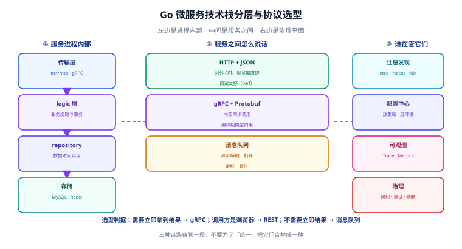
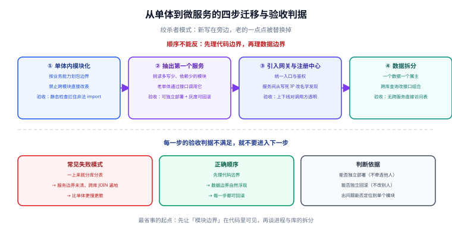

# Go 微服务概述与选型

一句话定位：这一页解决**三个决策**——该不该拆微服务、服务之间用什么协议、用不用框架。三个决策错了，后面写多少代码都是在给错误的方向还债。



上图是全篇的骨架：左边是「一个 Go 服务进程内部有什么」，中间是「服务之间怎么说话」，右边是「谁在管它们」。下面按这张图逐层展开。

## 一、先说结论：什么时候该拆，什么时候别拆

微服务不是「架构升级」，而是**用运维复杂度换组织复杂度**。它的前提条件比好处更容易被忽略。

### 值得拆的三条硬理由

| 理由 | 具体表现 | 不拆的代价 |
| --- | --- | --- |
| **变更冲突** | 一个仓库几十人同时改，一次发布要等所有人 | 发布排队、回滚影响面大、出错后互相甩锅 |
| **扩容粒度不匹配** | 只有下单接口扛不住，却只能整体加机器 | 成本按最高峰算，浪费 5~10 倍资源 |
| **故障域不可分** | 一个日志组件 OOM 就把整站拖垮 | 一个小模块能炸全站 |

### 不该拆的四条现实情况

1. **团队小于 8 人**：拆完以后「一个需求改三个仓库、发三次版」，沟通成本吃掉全部收益。
2. **没有自动化部署**：手工发布 5 个服务，出错概率是发 1 个的 5 倍。**没有 CI/CD 就没有微服务**。
3. **没有可观测能力**：出了问题只能靠 `tail -f`，一个请求跨 6 个服务，你连日志都对不齐。
4. **数据还没分清楚**：账务、库存、订单共享同一张表时，拆服务等于把「跨进程 JOIN」变成「跨网络查表」，比单体更慢更脆。

::: danger 注意：三种最常见的「假微服务」
1. **进程拆了、库没拆**：多个服务连同一个库、互相直接改对方的表。这不是微服务，是**分布式单体**——既拿不到独立部署的好处，又付了网络调用的成本。正确做法是先明确「一个数据只有一个属主」，其他服务只能通过接口改。
2. **只拆了 RPC 层**：把 `service.UserService` 从本地方法调用改成 HTTP 调用，接口签名一模一样。这只增加了一次网络开销，没有任何架构收益。**拆分的单位应该是「业务能力」，不是「类」**。
3. **共享一个 `common` 仓库**：所有服务都依赖同一个内部库，改一行所有人都得重新发版。**共享代码库是分布式的隐性耦合**，正确做法是共享**契约（proto）**，不共享实现。
:::

## 二、Go 在微服务里的真实优势与代价

选语言不看宣传，看这四个维度：

| 维度 | Go 的表现 | 对照（Java / Spring Cloud） |
| --- | --- | --- |
| **启动与内存** | 二进制 5~20 MB，启动 < 100 ms，常驻 20~50 MB | JVM 冷启动 1~10 s，常驻 200~800 MB |
| **部署密度** | 一台 8C16G 能跑几十个 Go 实例 | 同规格通常跑 5~10 个 JVM 实例 |
| **并发写法** | `go func()` + `context` 取消，代码短 | 线程池 + `CompletableFuture`，配置项多 |
| **生态成熟度** | gRPC / etcd / Prometheus 都是 Go 原生 | Spring Cloud 全家桶组件更全，文档更多 |
| **调试与排障** | 没有 JFR/Arthas 这类线上诊断利器，靠 pprof + 日志 | Arthas / JFR 线上诊断能力强 |

::: warning 说明：Go 的「代价」集中在哪里
Go 的短板不是性能，而是**运行时观测工具链**。JVM 有 JFR、Arthas、`jstack`，可以不改代码热追踪；Go 侧只有 `net/http/pprof` 与 `runtime/trace`，都需要**提前在代码里注册**。所以 Go 服务的可观测能力必须在**第一天就接进去**，事后补不上——这是本专题在实战篇反复强调「pprof 端点默认暴露在运维端口」的原因。
:::

## 三、通信协议选型：三种链路，各管一段

| 对比项 | HTTP + JSON | gRPC（HTTP/2 + Protobuf） | 消息队列 |
| --- | --- | --- | --- |
| **典型场景** | 对外 API、浏览器直连 | 服务内部同步调用 | 异步解耦、削峰、事件通知 |
| **类型安全** | 靠文档约定，运行时才发现字段不match | 代码生成，编译期就发现 | 靠 Schema Registry |
| **性能（同机）** | 基准 | 通常高 3~10 倍（二进制编码 + 多路复用） | 不受调用链限制 |
| **浏览器支持** | 原生 | 需 gRPC-Web 或网关转码 | 不涉及 |
| **调试体验** | `curl` 一把梭 | 需要 `grpcurl` + 反射，或服务端转码 | 需要 Kafka 客户端 / 控制台 |
| **流式能力** | SSE 勉强，双向流不行 | 双向流原生支持 | 天然流式 |
| **网关支持** | 所有网关 | 部分网关需转码插件 | 需要额外消费者 |

### 选型结论：内外有别

```text
对外（浏览器 / 第三方）  → REST + JSON，走网关统一鉴权、限流、审计
对内（服务 ↔ 服务）      → gRPC + Protobuf，走直连或服务网格
跨域（不需要立即结果）   → 消息队列，用事件补偿代替同步调用
```

::: tip 一句话判据
**问「这个调用需不需要立即拿到结果」**：需要 → gRPC；不需要 → 消息队列；调用方是浏览器 → REST。不要为了「统一」把三者强行合并成一种，三种链路解决的本来就是不同问题。
:::

### 一个常被忽略的点：为什么 gRPC 快

不是因为 Protobuf 编码小（那只是其中一环），而是因为 **HTTP/2 的多路复用 + 二进制分帧**。同一个 TCP 连接上可以并行跑成百上千个请求，没有 HTTP/1.1 的队头阻塞。这也解释了「为什么 gRPC 在长连接、高频小包场景收益最大，在低频大包场景收益不明显」。

## 四、框架选型：go-zero、Kratos 与「纯标准库」

| 维度 | go-zero | Kratos | 标准库 + 自建 |
| --- | --- | --- | --- |
| **定位** | 全栈框架，`goctl` 一键盘全套代码 | 治理框架，proto 驱动，分层清晰 | 只提供 `net/http` 与 `grpc` |
| **代码生成** | `goctl api` / `goctl rpc` 从 api/proto 生成 handler、logic、model | `kratos proto` 生成 service 骨架，依赖注入用 wire | 无 |
| **内置治理** | 熔断、限流、自适应降载、缓存、链路追踪默认开启 | 中间件体系，按需挂载（registry / tracing / metrics） | 全部自己接 |
| **配置与热更** | `conf.MustLoad` + `configcenter` 监听 | `config` 接口 + nacos/etcd/apollo 源 | 自己写 |
| **学习曲线** | 低（照模板填），但「黑盒多」 | 中（分层明确，但要理解 wire） | 高（但最可控） |
| **适合谁** | 团队要快、接受约定优于配置 | 团队要能拆开改每一层 | 服务极少、或对依赖极其敏感 |

### 什么时候不用框架

框架的价值是「把治理能力的默认值调对」；代价是**多一层抽象、多一份依赖、排障时多一层黑盒**。以下三种情况可以不用：

1. **只做一两个服务**：`net/http` + 一个小中间件链足够，`chi` 或 `gin` 就够用。
2. **团队已经有一套自研基础库**：再叠一层框架会出现「两套配置体系」。
3. **对依赖有强审计要求**：框架会带进几十个间接依赖。

::: danger 注意：不要混用两套治理体系
最常见的事故是「框架自带熔断 + 服务网格又做了熔断」，两层阈值互不知情，结果**抖动时双重熔断**，把健康实例也踢掉了。原则：**治理能力只在一个层次实现**——要么在应用层（框架 / 中间件），要么在基础设施层（服务网格）。同时开两层时，必须把其中一层的阈值调到几乎不会触发。
:::

## 五、从单体到微服务的迁移路径

拆微服务不是「推倒重来」，而是**绞杀者模式**：新的写在旁边，老的一点点被替换掉。



| 步骤 | 做什么 | 验收判据（不满足就不进下一步） |
| --- | --- | --- |
| **① 单体内模块化** | 按业务能力划分包边界，禁止跨模块直接改表 | 模块间只通过接口调用；静态检查能拦住跨模块的非法 import |
| **② 抽出第一个服务** | 挑**读多写少、依赖最少**的模块（通常是用户或配置） | 新服务可独立部署；老单体通过接口调用它；灰度可回滚 |
| **③ 引入网关与注册中心** | 统一入口、统一鉴权；服务间从「写死 IP」改成「名字发现」 | 服务实例上下线对调用方透明；网关能按路由做限流 |
| **④ 数据拆分** | 按「一个数据一个属主」拆库，跨库查询改为接口组合 | 无跨服务的直接表访问；跨库一致性有明确方案（事件或补偿） |

::: tip 顺序不能反
最常见失败案例是**先拆第④步**：一上来就分库分表，结果服务边界还没理清，跨库 JOIN 遍地都是。**先理代码边界，再理数据边界**；代码边界清楚以后，数据边界会自然浮现。
:::

## 六、最小可跑的服务群

一个能跑起来的 Go 微服务最小集合，就三样东西：

```text [目录结构]
greeter/
├─ api/                    # 对外 HTTP 层（网关转发进来）
│  └─ greeter.api          # 接口描述文件（goctl 用）或直接用 proto
├─ internal/
│  ├─ config/              # 配置结构体
│  ├─ logic/               # 业务逻辑（可被单测直接调用）
│  ├─ server/              # HTTP / gRPC 服务装配
│  └─ svc/                 # 依赖容器（ServiceContext）
├─ etc/
│  └─ greeter.yaml         # 配置：监听端口、注册中心、超时、日志
├─ go.mod
└─ main.go                 # 只做「读配置 → 装依赖 → 起服务 → 等信号」
```

启动时序固定为四步，顺序不能换：

```go [main.go]
func main() {
    // 1. 读配置（失败即退出，不要带默认值启动）
    var c config.Config
    conf.MustLoad("etc/greeter.yaml", &c)

    // 2. 建依赖（DB / Redis / RPC 客户端）——放在起监听之前
    svcCtx := svc.NewServiceContext(c)

    // 3. 起服务（gRPC 与 HTTP 各一个 goroutine）
    s := zrpc.MustNewServer(c.RpcServerConf, func(grpcServer *grpc.Server) {
        pb.RegisterGreeterServer(grpcServer, server.NewGreeterServer(svcCtx))
    })
    s.Start()

    // 4. 等信号，优雅退出（先停止接新请求，再等存量请求结束）
    signal.Notify(ch, syscall.SIGINT, syscall.SIGTERM)
    <-ch
    s.Stop()
}
```

**第 4 步的「等信号」不是可选项**。K8s 滚动更新时会先发 `SIGTERM`，此时：
1. 服务从注册中心摘除（否则调用方还在往这个实例发请求）；
2. 等待 `terminationGracePeriodSeconds`（默认 30 s）；
3. 再发 `SIGKILL`。

如果进程收到 `SIGTERM` 就直接退出，正在处理的请求会被切断，表现为**滚动更新期间零星 5xx**。

## 七、验证方式

服务起来以后，用两条命令确认它能被外部访问到：

```shell
# HTTP 侧
curl -s http://127.0.0.1:8888/greeter/sayHello -X POST \
  -H 'Content-Type: application/json' -d '{"name":"workbuddy"}'
# 期望：{"message":"Hello workbuddy"}

# gRPC 侧（需要服务端开启反射，或在本地有 .proto）
grpcurl -plaintext -d '{"name":"workbuddy"}' 127.0.0.1:8080 greeter.Greeter/SayHello
# 期望：{"message":"Hello workbuddy"}
```

::: warning 说明
`grpcurl` 依赖服务端注册**反射服务**（`reflection.Register(s)`）。生产环境通常**关闭反射**（会泄漏完整接口清单），此时本地调试要带 `-import-path` 与 `-proto` 参数从本地 proto 文件调用：

```shell
grpcurl -plaintext -import-path ./api -proto greeter.proto \
  -d '{"name":"workbuddy"}' 127.0.0.1:8080 greeter.Greeter/SayHello
```
:::

## 八、常见问题与最佳实践

::: tip 三条能省下大量返工的实践
1. **proto 文件与业务代码同仓、独立目录**：契约变更要能被 review，不要藏在生成产物里。
2. **配置分层但只有一份结构体**：`config.Config` 里嵌套 `RpcServerConf` / `RedisConf`，环境差异靠 `etc/*.yaml` 覆盖，不要在多处重复定义字段。
3. **所有对外调用都必须带 `context.WithTimeout`**：Go 没有默认超时，一个没设超时的调用可能把整个服务拖死。
:::

::: danger 注意：四个必踩的坑
1. **`context.Background()` 一路透传**：调用链上没有任何取消信号，上游断开了下游还在跑。正确写法是从 gRPC handler 拿到的 `ctx` 一路传下去，**永远不要在中间重新用 `context.Background()`**。
2. **goroutine 泄漏**：在循环里 `go func()` 但没有退出条件，压测几分钟后内存持续上涨。用 `goleak` 在测试里兜底：`defer goleak.VerifyNone(t)`。
3. **把 `error` 当字符串比较**：`if err.Error() == "not found"` 一旦改了文案就失效。用 `errors.Is` + 哨兵错误，或 gRPC 的 `status.Code(err)`。
4. **日志里打全量请求体**：既拖性能又可能落敏感数据。只打「关键字段 + 长度 + 耗时」。
:::

## 参考资料

- [gRPC 官方文档（Go 快速上手）](https://grpc.io/docs/languages/go/quickstart/)
- [Protocol Buffers Language Guide (proto3)](https://protobuf.dev/programming-guides/proto3/)
- [go-zero 官方文档](https://go-zero.dev/)
- [Kratos 官方文档](https://go-kratos.dev/)
- [Go 官方：Context 包说明](https://pkg.go.dev/context)

## 相关页面

- 下一篇：[gRPC 与 Protobuf 工程化](../GRPC/index.md) —— 把「协议」这一层写透
- [服务治理：注册发现到可观测](../Governance/index.md) —— 把「谁在管它们」这一层写透
- [实战：订单服务](../Practice/index.md) —— 把上面两层落成可运行工程
- [微服务](../../Microservices/index.md) —— 通用方法论（服务拆分、配置中心）
- [Go Web 开发](../../Go/WebDev/index.md) —— 只用标准库写服务的做法，作为对照
